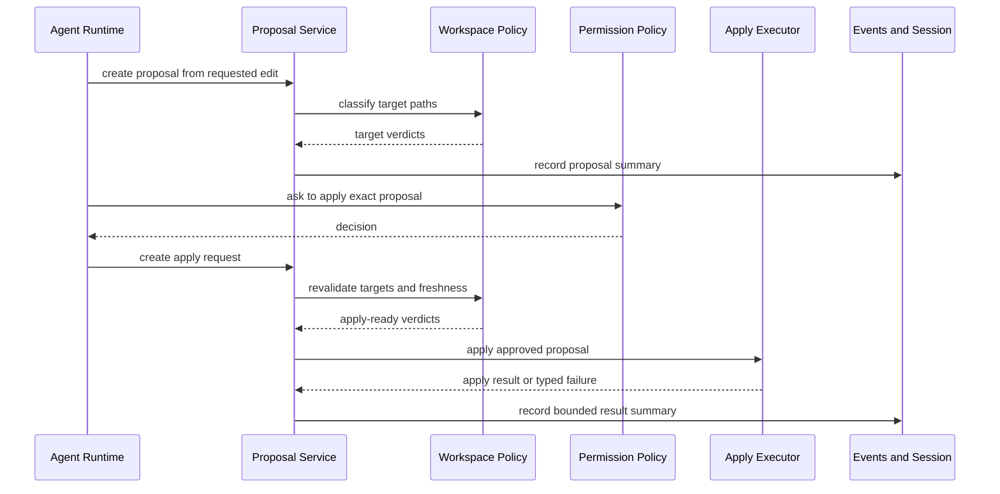
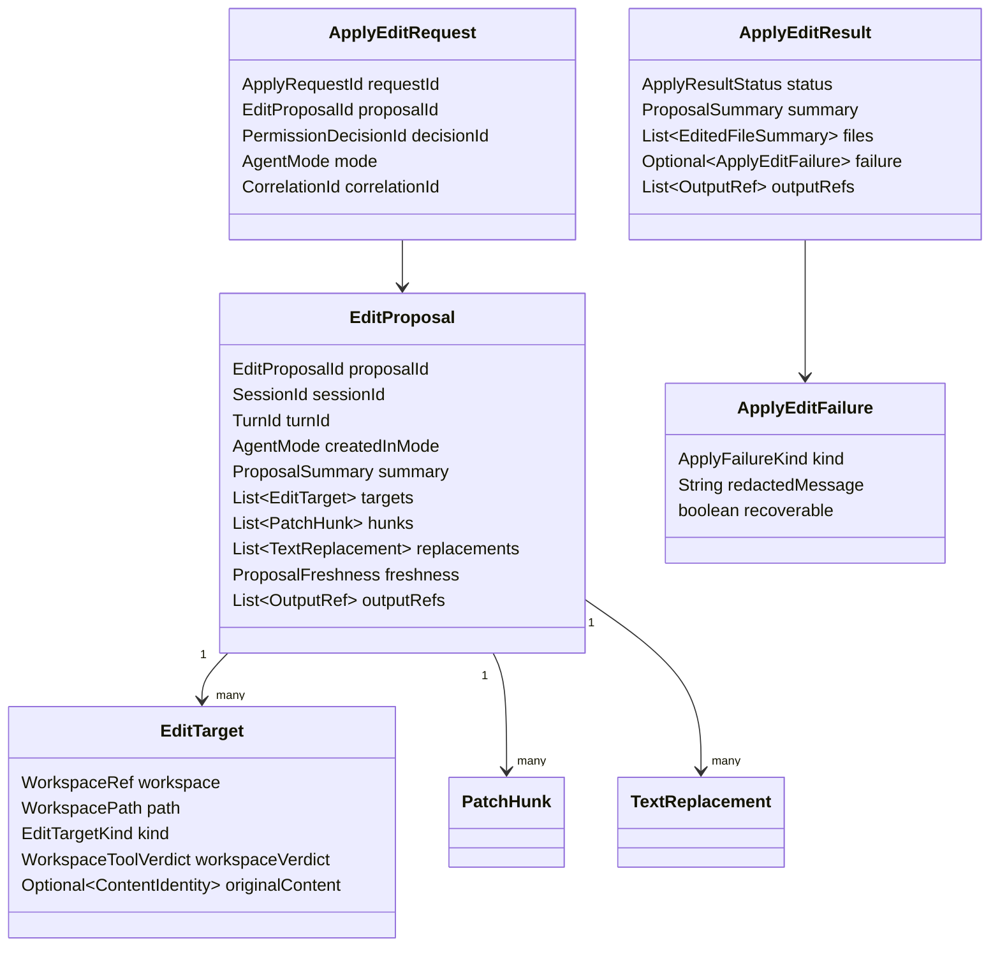

# Patch Edit Proposal Contracts

Blueprint for future Codegeist patch/edit proposals, exact apply requests,
workspace-gated mutation, typed apply results, and bounded review summaries.

## Scope

This document specifies planned contracts only. It does not describe implemented
Java source, Spring beans, package directories, tests, patch parsing, apply logic,
file writes, rollback, formatter integration, rich diff UI, Graphify, Repomix, or
runtime behavior.

Patch/edit work specializes the generic tool, permission, workspace, bounded
result, event, and session boundaries in
`docs/developer/specification/tool-permission-workspace-contracts.md`:

- A proposed edit is reviewable data before mutation.
- Applying a proposal is a Build-mode side effect and must pass mode,
  permission, workspace, and freshness gates.
- Results and session parts store summaries and `OutputRef` values, not full file
  contents or unbounded patch payloads.
- Direct writes remain a deferred trusted-built-in exception, not the default
  Codegeist editing path.

## Evidence

### OpenCode Feature Evidence

OpenCode is a behavior reference, not an implementation blueprint.

| Source | Relevant lesson for Codegeist |
| --- | --- |
| `docs/third-party/opencode/source/packages/opencode/src/tool/write.ts` | The write tool resolves the target path, checks external-directory posture, computes a diff from old and new content, asks `edit` permission with path and diff metadata, writes the file, formats it, publishes file events, and returns diagnostics. Codegeist should split this into proposal, approval, apply, events, and bounded result contracts. |
| `docs/third-party/opencode/source/packages/opencode/src/tool/apply_patch.ts` | The apply-patch tool parses hunks, validates target paths, derives per-file changes for add/update/delete/move, asks `edit` permission with per-file patch metadata, writes or removes files, publishes file watcher events, and returns a touched-file summary plus diagnostics. Codegeist should make the proposal and apply result explicit before mutation. |
| `docs/third-party/opencode/source/packages/opencode/src/tool/tool.ts` | Tool execution has ids, schema validation, session/message/call context, permission ask hooks, metadata updates, output truncation, and result metadata. Codegeist should represent patch/edit as a specialized tool request and result family. |
| `docs/third-party/opencode/source/packages/opencode/src/permission/index.ts` | Permission requests carry ids, session ids, permission names, patterns, metadata, `once`/`always`/`reject` replies, and edit tools are grouped under the `edit` permission. Codegeist should bind approval to the exact reviewed proposal scope. |
| `docs/third-party/opencode/source/packages/opencode/src/permission/evaluate.ts` | Permission rules resolve `allow`, `deny`, or `ask`, defaulting to ask. Codegeist should keep deterministic policy evaluation separate from client approval UI. |
| `docs/third-party/opencode/source/packages/opencode/src/tool/external-directory.ts` | External-directory access is checked as its own permission with target metadata. Codegeist should model deterministic workspace validation first, with any external approval layered above it. |
| `docs/third-party/opencode/source/packages/opencode/src/tool/truncate.ts` | Tool output is limited by line and byte caps and can be stored out-of-band. Codegeist should keep full diffs or generated content behind output references when summaries are too large. |
| `docs/third-party/opencode/source/packages/opencode/src/v2/session-event.ts` | Tool input, called, progress, success, and failure events are distinct session event families with call ids and provider metadata. Codegeist should emit patch proposal/apply lifecycle events as typed runtime events. |
| `docs/third-party/opencode/source/packages/opencode/src/v2/session-message.ts` | Assistant tool message parts carry tool state, structured output, content, and lifecycle times. Codegeist should store proposal/apply summaries as bounded message parts rather than raw patches. |

## Ownership Rules

- Runtime owns proposal ids, apply sequencing, mode checks, correlation ids,
  events, and session result summaries.
- Patch/edit tool descriptors classify proposal and apply capabilities, but they
  do not own permission or workspace policy.
- Permission policy owns approval requirements, exact proposal scope, decision
  scope, expiry, and audit metadata.
- Workspace policy owns target path classification, symlink, generated, ignored,
  secret-like, missing, and outside-root verdicts.
- The future apply executor owns only the concrete mutation after all gates pass.
- Clients may render proposals and collect approvals later, but they do not own
  proposal identity, freshness, permission policy, or workspace validation.

## Proposal Lifecycle



Proposal creation is review-oriented and may be allowed in Plan or Build mode.
Apply is mutation-oriented and is denied in Plan mode. Build mode still requires
permission approval, workspace validation, and freshness checks before mutation.

## Future Contract Model



The exact Java package structure, library choice, and persistence mechanism
belong to later implementation tasks.

## Proposal Fields

An `EditProposal` should carry enough information for review, permission, and
freshness without storing unbounded file data in session state:

| Field group | Purpose |
| --- | --- |
| Identity | `proposalId`, session id, turn id, originating mode, correlation id, and creation time. |
| Review summary | Human-readable intent, affected paths, addition/deletion counts, created/deleted markers, and redacted preview text. |
| Targets | Workspace-relative target paths, operation kind, original content identity, generated/ignored/secret-like posture, and workspace verdict. |
| Changes | Patch hunk summaries or text replacement summaries. Full patch content may be an `OutputRef` when too large. |
| Freshness | A later implementation-specific content hash, revision, timestamp, or equivalent check that proves the proposal still matches target input. |
| Policy hints | Permission capability, write scope, audit relevance, and result-summary limits inherited from the tool descriptor. |

## Target And Workspace Rules

Targets should be classified before review and revalidated before apply.

| Target case | Contract posture |
| --- | --- |
| Existing file update | Requires readable original identity and writable target verdict. |
| New file | Requires parent directory write verdict and creation metadata. |
| Delete file | Requires existing file identity and delete-intent summary. |
| Move or rename | Later behavior; may be represented as source delete plus target create until a dedicated contract exists. |
| Generated or ignored file | Deny by default or require an explicit protected-path posture from workspace policy. |
| Secret-like target | Deny by deterministic workspace policy before permission approval can matter. |
| Outside workspace or symlink escape | Deny by deterministic workspace policy unless a later explicit external-directory policy exists. |

Permission approval cannot override mode denial, workspace denial, secret-like
target denial, or descriptor capability limits.

## Apply Flow

The first apply flow should be explicit and auditable:

1. Construct `EditProposal` from requested file changes.
2. Classify all targets through workspace policy.
3. Produce a bounded review summary and `OutputRef` values for large diffs.
4. Deny apply immediately in Plan mode.
5. Ask permission for the exact proposal id, target paths, change summary, and
   operation scope.
6. Build `ApplyEditRequest` only from the approved proposal and decision id.
7. Revalidate workspace targets and freshness before mutation.
8. Apply the proposal or return a typed failure.
9. Record bounded result, output references, and runtime events.
10. Project a small session message part for user-visible history.

## Apply Result And Failure Taxonomy

| Result or failure | Meaning |
| --- | --- |
| `APPLIED` | All proposed changes were applied. |
| `PARTIALLY_APPLIED` | Some changes applied and at least one target failed; the result must list touched and untouched targets. |
| `MODE_DENIED` | The request tried to apply in a mode such as Plan that denies mutation. |
| `PERMISSION_DENIED` | Permission policy or the user denied the exact apply request. |
| `WORKSPACE_DENIED` | Workspace policy denied one or more targets. |
| `MISSING_TARGET` | A required existing file or parent path was missing at apply time. |
| `STALE_INPUT` | The target no longer matches the proposal's original content identity. |
| `CONFLICT` | The patch or replacement could not be applied cleanly. |
| `INVALID_PATCH` | The patch or replacement representation was malformed. |
| `OUTPUT_OVERFLOW` | Result details exceeded inline limits and require output references. |
| `UNEXPECTED_IO_FAILURE` | File-system behavior failed outside expected validation and conflict paths. |

Failures should be typed, redacted, and recoverability-aware. They should not
embed full file contents, secrets, stack traces, or unbounded patches.

## Event And Session Projection

Patch/edit events should be more specific than generic tool events while still
mapping onto the tool lifecycle from `T002_07`.

| Event family | Summary |
| --- | --- |
| `EDIT_PROPOSAL_CREATED` | Proposal id, target summaries, operation counts, and output refs. |
| `EDIT_PROPOSAL_REJECTED` | Mode, workspace, or validation reason before approval. |
| `EDIT_APPLY_PERMISSION_REQUESTED` | Exact proposal id, target summaries, and permission scope. |
| `EDIT_APPLY_STARTED` | Apply request id, proposal id, and target count. |
| `EDIT_APPLY_COMPLETED` | Result status, touched-file summaries, and output refs. |
| `EDIT_APPLY_FAILED` | Typed failure kind, recoverability, and redacted message. |

Session message parts should store proposal and apply summaries, approval
references, warnings, errors, and output references. They should not store full
file contents, full patches, provider payloads, stack traces, or secret values.

## Future File Map

These are illustrative implementation targets only and should not be created
until a later Java task requires them.

```text
app/codegeist/cli/src/main/java/ai/codegeist/edit/EditProposalId.java
app/codegeist/cli/src/main/java/ai/codegeist/edit/EditProposal.java
app/codegeist/cli/src/main/java/ai/codegeist/edit/EditTarget.java
app/codegeist/cli/src/main/java/ai/codegeist/edit/EditTargetKind.java
app/codegeist/cli/src/main/java/ai/codegeist/edit/PatchHunk.java
app/codegeist/cli/src/main/java/ai/codegeist/edit/TextReplacement.java
app/codegeist/cli/src/main/java/ai/codegeist/edit/ProposalFreshness.java
app/codegeist/cli/src/main/java/ai/codegeist/edit/ApplyEditRequest.java
app/codegeist/cli/src/main/java/ai/codegeist/edit/ApplyEditResult.java
app/codegeist/cli/src/main/java/ai/codegeist/edit/ApplyEditFailure.java
app/codegeist/cli/src/main/java/ai/codegeist/edit/ApplyFailureKind.java
app/codegeist/cli/src/main/java/ai/codegeist/edit/ProposalSummary.java
app/codegeist/cli/src/test/java/ai/codegeist/edit/EditProposalContractTests.java
app/codegeist/cli/src/test/java/ai/codegeist/edit/ApplyEditPolicyTests.java
app/codegeist/cli/src/test/java/ai/codegeist/edit/ApplyEditFailureShapeTests.java
```

## Illustrative Java Sketches

These snippets are examples only. They are not implemented source.

```java
record EditProposal(
    EditProposalId proposalId,
    SessionId sessionId,
    TurnId turnId,
    AgentMode createdInMode,
    ProposalSummary summary,
    List<EditTarget> targets,
    List<PatchHunk> hunks,
    List<TextReplacement> replacements,
    ProposalFreshness freshness,
    List<OutputRef> outputRefs
) {}

record EditTarget(
    WorkspaceRef workspace,
    WorkspacePath path,
    EditTargetKind kind,
    WorkspaceToolVerdict workspaceVerdict,
    Optional<ContentIdentity> originalContent
) {}
```

```java
record ApplyEditRequest(
    ApplyRequestId requestId,
    EditProposalId proposalId,
    PermissionDecisionId permissionDecisionId,
    AgentMode mode,
    CorrelationId correlationId
) {}

record ApplyEditResult(
    ApplyRequestId requestId,
    ApplyResultStatus status,
    ProposalSummary summary,
    List<EditedFileSummary> files,
    Optional<ApplyEditFailure> failure,
    List<OutputRef> outputRefs
) {}
```

```java
enum ApplyFailureKind {
    MODE_DENIED,
    PERMISSION_DENIED,
    WORKSPACE_DENIED,
    MISSING_TARGET,
    STALE_INPUT,
    CONFLICT,
    INVALID_PATCH,
    PARTIAL_APPLY,
    OUTPUT_OVERFLOW,
    UNEXPECTED_IO_FAILURE
}
```

## Future Test Handoff

No tests are created by this documentation task. Later implementation tasks
should prefer deterministic contract tests before any real file mutation.

| Test area | What to prove | Runtime side effects needed |
| --- | --- | --- |
| Proposal construction | Target paths, operation counts, summaries, freshness metadata, and output refs can be represented without applying changes. | No |
| Plan-mode apply denial | Plan mode may describe a proposal but cannot create a successful apply request. | No |
| Build-mode approval | Build mode apply requires permission for the exact proposal id and target scope. | No file mutation if tested at policy boundary |
| Workspace denial | Outside-root, symlink escape, generated, ignored, secret-like, or missing targets map to typed verdicts. | No |
| Stale input | Changed target identity prevents apply and returns `STALE_INPUT`. | Fake workspace or fixture only |
| Conflict shape | Patch mismatch returns `CONFLICT` or `INVALID_PATCH` without hiding target summaries. | Fake apply executor |
| Partial apply shape | A partial result lists touched and untouched targets with bounded summaries. | Fake apply executor |
| Bounded summaries | Large diffs or result details become `OutputRef` values. | No |
| Event/session projection | Proposal and apply lifecycle events project to bounded session message parts. | No |

## Later Implementation Rules

- Implement proposal contracts before concrete patch application.
- Keep apply denied in Plan mode even when permission policy could otherwise ask.
- Revalidate workspace targets and freshness immediately before mutation.
- Bind approval to the exact proposal id and target/change summary that the user
  reviewed.
- Keep full file contents, full patches, secrets, stack traces, and unbounded
  result payloads out of events, logs, task docs, and session message parts.
- Defer rollback, multi-file transactions, formatter integration, rich diff UI,
  and Java diff/patch library selection to later implementation tasks.
