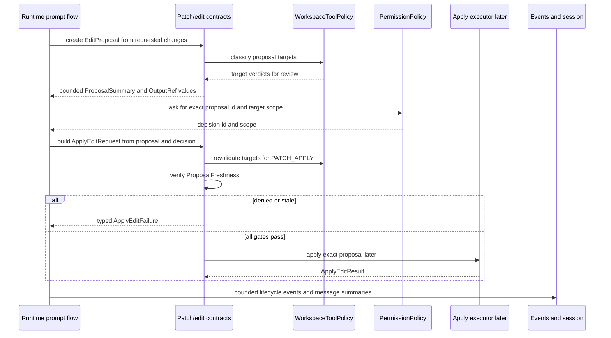

# Patch Edit Proposal Source Generation Contract

Source-generation handoff for the first planned Codegeist patch/edit proposal and
apply-result Java contracts. This document is planned guidance only: it does not
create Java source, tests, packages, patch parsers, apply executors, file reads,
file writes, Spring beans, runtime behavior, tool execution, permission behavior,
workspace behavior, storage, shell execution, or UI behavior.

## Purpose And Status

`patch-edit-proposal-contracts.md` defines the broad blueprint for future
Codegeist patch/edit proposals, exact apply requests, workspace-gated mutation,
typed apply results, and bounded review summaries. This handoff narrows that
blueprint into the first source-generation slice a later Java implementation task
can build with TDD.

The first source pass should create only the contract-level types needed to
represent reviewable edit proposals, target summaries, proposal freshness, exact
approval binding, apply requests, apply results, typed failures, bounded summaries,
and output references. It should stop before concrete patch parsing, file mutation,
formatter integration, rollback, rich diff UI, shell execution, storage, TUI,
server transport, Vaadin, PF4J, JBang, Graphify, Repomix, or an end-to-end agent
loop.

## Current Baseline

The implemented Java application is still intentionally small.

| Area | Current state |
| --- | --- |
| Module | One Maven module under `app/codegeist/cli` |
| Implemented package | `ai.codegeist.app` only |
| Entrypoint | `CodegeistApplication` starts Spring Boot |
| Runtime/session/event source | Planned in documentation; not Java source yet |
| Tool/permission/workspace source | Planned in documentation; not Java source yet |
| Patch/edit source | Not implemented |
| Tests | Spring Boot context-load test only |

All package names, Java types, records, enums, ports, services, and tests below
are planned source names. They are not current source files or implemented
behavior.

## First-Wave Boundary

The first patch/edit source slice should own contract-level types for:

- Reviewable edit proposal identity, originating session/turn/request metadata,
  target summaries, change summaries, freshness metadata, and output references.
- Edit targets specialized for patch/edit while reusing the planned generic
  workspace target and verdict boundary from
  `tool-permission-workspace-source-generation-contract.md`.
- Patch hunk and text replacement summaries that can describe intended changes
  without storing full file contents or unbounded patches in session state.
- Exact approval binding between a reviewed proposal, permission decision, apply
  request, workspace revalidation, and freshness check.
- Plan-mode apply denial and Build-mode permission/workspace/freshness gates.
- Apply result, edited-file summary, typed failure, recoverability, diagnostics,
  bounded summary, and output-reference shapes.
- Runtime/session/event integration contracts for proposal and apply lifecycle
  summaries without making patch/edit own event sequencing or persistence.

The first source pass should not implement an executor. A proposal can be
represented, denied, marked approval-required, or mapped to typed failure without
any workspace mutation existing yet.

## Planned Package Ownership

| Planned package | First-wave ownership | Must not own in the first source pass |
| --- | --- | --- |
| `ai.codegeist.patch` | Edit proposal ids, target summaries, patch hunk and text replacement summaries, proposal freshness, apply requests, apply results, apply failures, and proposal summaries. | Generic tool descriptors, generic permission policy, generic workspace path policy, file mutation, patch-library internals, formatter integration, rollback, storage, UI rendering. |
| `ai.codegeist.tool` | Later exposes patch/edit as classified built-in tool descriptors with `PATCH_EDIT` or mutating workspace capability. | Patch proposal structure, patch parsing, file mutation, approval UI. |
| `ai.codegeist.permission` | Later evaluates permission requests and decisions for exact proposal scope. | Proposal freshness, workspace revalidation, patch parsing, apply execution. |
| `ai.codegeist.workspace` | Later validates patch targets, output-reference targets, generated/ignored/secret-like posture, symlink escapes, and external-directory candidates. | Proposal ownership, permission approval, file mutation, content diffing. |
| `ai.codegeist.runtime` | Later coordinates mode checks, permission decisions, workspace revalidation, freshness checks, apply sequencing, lifecycle events, and session summaries. | Patch parser internals, direct file writes, UI diff rendering, persistence schema. |
| `ai.codegeist.session` and `ai.codegeist.event` | Later carry bounded proposal/apply summaries and lifecycle events created by runtime. | Patch policy, permission policy, workspace validation, output-reference storage implementation. |

`ai.codegeist.cli`, `ai.codegeist.tui`, `ai.codegeist.provider`,
`ai.codegeist.context`, `ai.codegeist.shell`, `ai.codegeist.storage`,
`ai.codegeist.server`, `ai.codegeist.ui.vaadin`, `ai.codegeist.extension`, Spring
Shell, Spring AI, Agent Utils, MCP, PF4J, JBang, Graphify, and Repomix remain
outside this first source slice.

## Planned Proposal Contracts

Patch/edit contracts should describe what is proposed before any mutation is
possible.

| Planned shape | Package | First role |
| --- | --- | --- |
| `EditProposalId` | `ai.codegeist.patch` | Stable id for review, permission, apply requests, events, and session summaries. |
| `EditProposal` | `ai.codegeist.patch` | Proposal id, session id, turn id, originating mode, correlation id, summary, targets, change summaries, freshness, and output refs. |
| `EditTarget` | `ai.codegeist.patch` | Patch/edit-specific target view over a workspace target, operation kind, original content identity, and workspace verdict. |
| `EditTargetKind` | `ai.codegeist.patch` | First values such as `UPDATE_EXISTING_FILE`, `CREATE_FILE`, `DELETE_FILE`, and reserved `RENAME_OR_MOVE`. |
| `PatchHunk` | `ai.codegeist.patch` | Bounded hunk summary with target, old/new range metadata, operation counts, and optional output ref for full detail. |
| `TextReplacement` | `ai.codegeist.patch` | Bounded replacement summary for simpler exact text changes, with target and freshness linkage. |
| `ProposalFreshness` | `ai.codegeist.patch` | Implementation-defined content identity, revision, timestamp, or equivalent check required before apply. |
| `ProposalSummary` | `ai.codegeist.patch` | Redacted human-readable intent, affected paths, counts, warnings, truncation status, and output refs. |

Proposal rules:

- Proposal creation may be review-oriented in Plan or Build mode, but creation does
  not imply permission to mutate files.
- Proposal targets must carry enough workspace verdict metadata for review, but
  final apply still revalidates targets immediately before mutation.
- Full file contents, full patches, provider payloads, stack traces, credentials,
  and secret values stay out of proposals, events, logs, and session message parts.
- Large patches or previews should use `OutputRef` values from the planned tool
  bounded-result contract rather than inline unbounded content.
- A proposal id is valid only for the exact reviewed target/change/freshness scope;
  later edits require a new proposal or an explicit rebase/refresh workflow.

## Planned Target Metadata

Patch/edit target metadata specializes generic workspace validation instead of
redefining it.

| Target case | First-wave contract posture |
| --- | --- |
| Existing file update | Requires original content identity, write-purpose workspace target, operation count summary, and freshness metadata. |
| New file | Requires parent target validation, create-file summary, content-size summary, and generated/ignored/secret-like posture. |
| Delete file | Requires existing content identity, delete-intent summary, and explicit high-risk target posture. |
| Rename or move | Reserved for later; first contracts may model as source delete plus target create when no dedicated move semantics exist. |
| Generated or ignored target | Deny by default or require a later explicit protected-path policy; approval alone must not bypass the verdict. |
| Secret-like target | Deterministically deny before permission approval can matter. |
| Outside workspace or symlink escape | Deterministically deny unless a later external-directory policy explicitly supports the target; approval still cannot bypass unsupported or secret-like paths. |

The generic workspace contract owns target normalization, symlink escape detection,
ignored/generated/secret-like verdicts, and external-directory posture. Patch/edit
owns how those verdicts appear in proposal and apply-result summaries.

## Exact Approval Binding

Applying edits is a side effect and must bind to the reviewed proposal exactly.



Approval-binding rules:

- Mode denial happens before permission. Plan mode cannot apply an edit.
- Build mode apply requires a permission decision scoped to the exact proposal id,
  target paths, operation kinds, and change summary the user reviewed.
- Permission approval cannot override mode denial, deterministic workspace denial,
  stale input, descriptor limits, result limits, disabled descriptors, or unsupported
  targets.
- Apply requests must carry both `EditProposalId` and `PermissionDecisionId` so
  events and summaries can explain why mutation was allowed or denied.
- Workspace targets and freshness must be rechecked immediately before mutation.

## Planned Apply Contracts

| Planned shape | Package | First role |
| --- | --- | --- |
| `ApplyEditRequest` | `ai.codegeist.patch` | Apply request id, proposal id, permission decision id, mode, correlation id, and requested-at metadata. |
| `ApplyEditResult` | `ai.codegeist.patch` | Request id, proposal id, status, summary, edited-file summaries, optional failure, output refs, elapsed duration, and audit flag. |
| `ApplyResultStatus` | `ai.codegeist.patch` | `APPLIED`, `PARTIALLY_APPLIED`, `DENIED`, `FAILED`, and `CANCELLED` or a similarly small first status set. |
| `EditedFileSummary` | `ai.codegeist.patch` | Target path, operation kind, touched flag, counts, freshness used, warning summary, and output refs. |
| `ApplyEditFailure` | `ai.codegeist.patch` | Typed failure kind, redacted message, recoverability, optional remediation, affected targets, and audit flag. |
| `ApplyFailureKind` | `ai.codegeist.patch` | Distinguishes mode denied, permission denied, workspace denied, missing target, stale input, conflict, invalid patch, partial apply, output overflow, cancellation, and unexpected I/O failure. |

Initial failure kinds should include at least:

| Failure kind | Meaning |
| --- | --- |
| `MODE_DENIED` | The request attempted mutation in a mode such as Plan. |
| `PERMISSION_DENIED` | Policy or a user/client decision denied the exact proposal. |
| `WORKSPACE_DENIED` | Workspace policy denied one or more required targets. |
| `MISSING_TARGET` | A required existing file or parent path was missing at apply time. |
| `STALE_INPUT` | Target content identity no longer matches proposal freshness. |
| `CONFLICT` | The patch or replacement could not be applied cleanly. |
| `INVALID_PATCH` | Patch or replacement representation was malformed. |
| `PARTIAL_APPLY` | At least one target changed and at least one target failed; summaries must identify both. |
| `OUTPUT_OVERFLOW` | Details exceeded inline result limits and require output references. |
| `CANCELLED` | Runtime or user cancellation stopped apply before completion. |
| `UNEXPECTED_IO_FAILURE` | File-system behavior failed outside expected validation and conflict paths. |

Failures must be typed, redacted, and recoverability-aware. They should not embed
full file contents, secrets, stack traces, unbounded patches, provider payloads, or
raw filesystem exceptions in session-ready records.

## Runtime, Session, And Event Integration

Runtime owns gate ordering, event sequencing, and session projection. Patch/edit
records provide proposal and apply facts only.

Initial event families for later runtime expansion should map to the finalized
runtime/session/event source contract without making patch/edit publish events
directly: `EDIT_PROPOSAL_CREATED`, `EDIT_PROPOSAL_REJECTED`,
`EDIT_APPLY_PERMISSION_REQUESTED`, `EDIT_APPLY_STARTED`, `EDIT_APPLY_COMPLETED`,
`EDIT_APPLY_FAILED`, and `EDIT_OUTPUT_TRUNCATED`.

Session message parts should store bounded `EDIT_PROPOSAL`, `APPROVAL_REFERENCE`,
`EDIT_RESULT`, `WARNING`, and `ERROR` summaries. They should not store full file
contents, full patches, provider payloads, patch-library objects, stack traces,
credentials, or secret values.

## Boundary Rules

- Do not create Java source, Java tests, package directories, Maven changes,
  Taskfile commands, Spring beans, CLI commands, TUI behavior, runtime services,
  provider calls, Spring AI tool callbacks, permission approval, workspace policy
  code, storage adapters, shell execution, patch parsing, apply execution, file
  reads, file writes, formatter integration, rollback, Graphify, Repomix, or
  native/build behavior in this documentation slice.
- Do not let patch/edit contracts own generic tool descriptors, generic permission
  decisions, generic workspace validation, provider invocation, runtime prompt
  execution, session lifecycle, event sequencing, CLI parsing, context loading,
  storage persistence, shell/process execution, TUI rendering, server routes,
  Vaadin, PF4J, or JBang behavior.
- Do not expose Spring Shell, Spring AI, Agent Utils, provider SDK, OpenCode, MCP,
  PF4J, JBang, shell, process, terminal, filesystem, patch-library, storage,
  Vaadin, or HTTP implementation types through Codegeist patch/edit contracts.
- Do not copy OpenCode's TypeScript, Bun, Effect, write/apply-patch tools,
  permission rules, external-directory prompts, truncation implementation, file
  watcher events, event bus, formatter, or storage shape. Use OpenCode only as a
  behavior reference.

## Future File Map

These are illustrative implementation targets only and should not be created until
a later Java task requires them.

```text
app/codegeist/cli/src/main/java/ai/codegeist/patch/EditProposalId.java
app/codegeist/cli/src/main/java/ai/codegeist/patch/EditProposal.java
app/codegeist/cli/src/main/java/ai/codegeist/patch/EditTarget.java
app/codegeist/cli/src/main/java/ai/codegeist/patch/EditTargetKind.java
app/codegeist/cli/src/main/java/ai/codegeist/patch/PatchHunk.java
app/codegeist/cli/src/main/java/ai/codegeist/patch/TextReplacement.java
app/codegeist/cli/src/main/java/ai/codegeist/patch/ProposalFreshness.java
app/codegeist/cli/src/main/java/ai/codegeist/patch/ProposalSummary.java
app/codegeist/cli/src/main/java/ai/codegeist/patch/ApplyEditRequest.java
app/codegeist/cli/src/main/java/ai/codegeist/patch/ApplyEditResult.java
app/codegeist/cli/src/main/java/ai/codegeist/patch/ApplyResultStatus.java
app/codegeist/cli/src/main/java/ai/codegeist/patch/EditedFileSummary.java
app/codegeist/cli/src/main/java/ai/codegeist/patch/ApplyEditFailure.java
app/codegeist/cli/src/main/java/ai/codegeist/patch/ApplyFailureKind.java
app/codegeist/cli/src/test/java/ai/codegeist/patch/EditProposalContractTests.java
app/codegeist/cli/src/test/java/ai/codegeist/patch/ApplyEditPolicyFlowTests.java
app/codegeist/cli/src/test/java/ai/codegeist/patch/ApplyEditFailureShapeTests.java
app/codegeist/cli/src/test/java/ai/codegeist/patch/PatchEditEventProjectionContractTests.java
```

## Illustrative Java Sketches

These snippets are examples only. They are not implemented source.

```java
record EditProposal(
    EditProposalId proposalId,
    SessionId sessionId,
    TurnId turnId,
    AgentMode createdInMode,
    CorrelationId correlationId,
    ProposalSummary summary,
    List<EditTarget> targets,
    List<PatchHunk> hunks,
    List<TextReplacement> replacements,
    ProposalFreshness freshness,
    List<OutputRef> outputRefs
) {}
```

```java
record EditTarget(
    WorkspaceRef workspace,
    WorkspaceToolTarget workspaceTarget,
    EditTargetKind kind,
    WorkspaceToolVerdict workspaceVerdict,
    Optional<ContentIdentity> originalContent
) {}
```

```java
record ApplyEditRequest(
    ApplyRequestId requestId,
    EditProposalId proposalId,
    PermissionDecisionId permissionDecisionId,
    AgentMode mode,
    CorrelationId correlationId,
    Instant requestedAt
) {}

record ApplyEditResult(
    ApplyRequestId requestId,
    EditProposalId proposalId,
    ApplyResultStatus status,
    ProposalSummary summary,
    List<EditedFileSummary> files,
    Optional<ApplyEditFailure> failure,
    List<OutputRef> outputRefs,
    Duration elapsed,
    boolean auditRelevant
) {}
```

```java
enum ApplyFailureKind {
    MODE_DENIED,
    PERMISSION_DENIED,
    WORKSPACE_DENIED,
    MISSING_TARGET,
    STALE_INPUT,
    CONFLICT,
    INVALID_PATCH,
    PARTIAL_APPLY,
    OUTPUT_OVERFLOW,
    CANCELLED,
    UNEXPECTED_IO_FAILURE
}
```

The exact Java constructor validation, sealed failure hierarchy, content identity
strategy, output-reference backing store, and patch library choice belong to the
later implementation task.

## TDD Handoff

No tests are created by this documentation task. Later implementation tasks should
prefer deterministic plain-JVM contract tests before filesystem-heavy apply tests,
Spring context tests, or real repository mutation.

| Test area | What to prove | Runtime side effects needed |
| --- | --- | --- |
| Proposal construction | Proposal id, session/turn metadata, targets, operation counts, freshness, bounded summaries, and output refs can be represented without applying changes. | No |
| Target classification handoff | Patch/edit targets reuse generic `WorkspaceToolTarget` and `WorkspaceToolVerdict` metadata without redefining workspace policy. | No |
| Plan-mode apply denial | Plan mode may describe a proposal but cannot produce a successful apply result. | No |
| Build-mode approval binding | Build-mode apply requires `PermissionDecisionId` for the exact proposal id and target/change scope. | No file mutation if tested at policy boundary |
| Approval not override | Permission approval cannot override mode denial, workspace denial, secret-like posture, stale input, disabled descriptor, or result limits. | No |
| Freshness and stale input | Changed target identity prevents apply and returns `STALE_INPUT`. | Fake workspace or temporary fixture only |
| Conflict and invalid patch shape | Patch mismatch returns `CONFLICT` or `INVALID_PATCH` with redacted, target-aware diagnostics. | Fake apply executor |
| Partial apply shape | A partial result lists touched and untouched targets with bounded summaries and a typed `PARTIAL_APPLY` failure. | Fake apply executor |
| Bounded summaries | Large diffs, generated content, or result details become `OutputRef` values rather than session-ready raw content. | No |
| Event/session projection | Proposal and apply lifecycle outcomes can be represented as bounded runtime events and session message parts without patch/edit publishing events directly. | No |
| Type isolation | Patch/edit contracts expose Codegeist types only, not Spring AI, provider SDK, OpenCode, patch-library, filesystem, or shell/process types. | No |

Targeted verification for the later Java implementation should start with
class-level or method-level Maven selectors for the new patch/edit contract tests,
then broaden to `task test` only after the narrow tests pass. Filesystem-heavy,
formatter, rollback, shell/process, live provider, native, and UI checks should
remain explicit and separate.

## Deferrals

- `T003_09` owns generic tool descriptors, permission policy, workspace target
  validation, bounded results, output references, and provider tool-call mediation.
- `T003_11` owns controlled shell request/result, destructive-command posture,
  process execution handoff, timeout, cancellation, env/stdin, and bounded
  stdout/stderr details.
- `T003_12` owns storage ports, session continuation, projection storage, artifact
  references, storage health, redaction, and persistence deferral criteria.
- `T003_13` owns end-to-end prompt orchestration with providers, tools,
  permissions, workspace gates, patch/edit apply coordination, and session/event
  projection.
- Direct-write exceptions, formatter integration, rollback, rich diff UI,
  multi-file transactions, CLI/TUI parity workflows, packaging/native validation,
  PF4J, JBang, Vaadin, server, API, MCP, Graphify, Repomix, and extension tasks
  must attach through these policy boundaries instead of bypassing them.

## Later Implementation Checklist

Before a future Java source task marks the first patch/edit slice solved, it
should prove:

- Proposal, target, freshness, apply request/result, failure, summary, and
  output-reference contracts exist only in their planned packages.
- Patch/edit contracts use Codegeist records, enums, sealed interfaces, and small
  ports, not Spring AI, provider SDK, OpenCode, MCP, PF4J, JBang, shell, process,
  terminal, filesystem, patch-library, storage, Vaadin, or HTTP implementation
  types.
- Plan-mode apply denial, Build-mode approval binding, workspace denial, stale
  input, conflicts, partial apply, bounded summaries, and output references are
  covered by focused tests.
- The implementation uses fakes or temporary fixtures for apply behavior until the
  task explicitly owns real filesystem mutation.
- No concrete patch parser, real file write, formatter, rollback, shell execution,
  provider call, approval UI, storage adapter, plugin/script execution, or
  end-to-end agent loop slips into the first contract slice.
