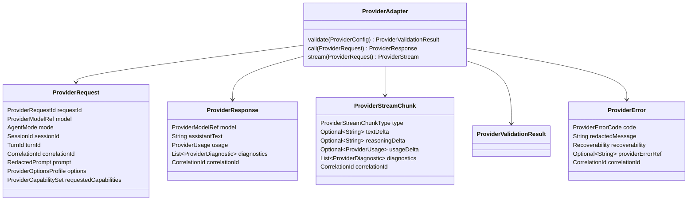
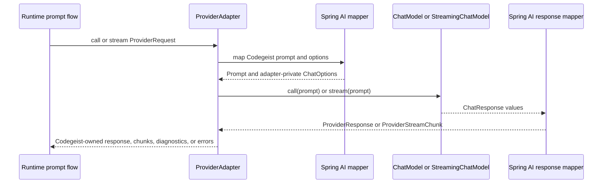

# Provider Spring AI Adapter Source Generation Contract

Source-generation handoff for the first planned Codegeist provider configuration
and Spring AI adapter contracts. This document is planned guidance only: it does
not create Java source, tests, packages, Spring beans, provider starters,
credentials, live model calls, runtime behavior, CLI/TUI behavior, or provider
behavior.

## Purpose And Status

`provider-configuration-contracts.md` defines the broad blueprint for Codegeist
provider configuration, validation, typed provider errors, and Spring AI adapter
boundaries. This handoff narrows that blueprint into the first source-generation
slice a later Java implementation task can build with TDD.

The first source pass should define Codegeist-owned provider configuration and
adapter contracts for OpenAI-compatible/OpenAI and Ollama without implementing an
end-to-end agent loop. It should stop before runtime orchestration, CLI provider
flags, context loading, tool execution, permission approval, patch/edit, shell
execution, storage, TUI rendering, server transport, Vaadin, PF4J, or JBang.

## Current Baseline

The implemented Java application is still intentionally small.

| Area | Current state |
| --- | --- |
| Module | One Maven module under `app/codegeist/cli` |
| Implemented package | `ai.codegeist.app` only |
| Entrypoint | `CodegeistApplication` starts Spring Boot |
| Spring AI | BOM imported; no provider starters, `ChatModel`, or model calls wired |
| Spring Shell | Dependency and configuration surface only; no commands yet |
| Runtime/session/event source | Planned in documentation; not Java source yet |
| Context/workspace source | Planned in documentation; not Java source yet |
| Provider source | Not implemented |
| Tests | Spring Boot context-load test only |

All package names, Java types, records, enums, ports, adapter classes, and tests
below are planned source names. They are not current source files or implemented
behavior.

## First-Wave Boundary

The first provider source slice should own only the provider-facing contracts
needed for later runtime prompt execution:

- Provider identity, model identity, provider type, enablement, and display
  metadata.
- Capability metadata for streaming, tool calling, structured output, reasoning,
  vision, local/offline posture, network requirement, and context-window hints.
- Option profiles for portable chat options that Codegeist policy allows to cross
  into provider adapters.
- Credential-source references and redaction metadata, never raw credential values.
- Offline validation of configuration shape, endpoint shape, missing model ids,
  missing credential-source references, disabled providers, and unsupported
  requested capabilities.
- Runtime-facing provider adapter port, request, response, stream chunk, usage,
  diagnostic, fallback, and typed error shapes.
- Spring AI mapping inside adapter packages only.
- First-wave OpenAI-compatible/OpenAI and Ollama adapter posture.

The slice should not implement provider selection inside runtime. Runtime may
reference `ProviderModelRef` and call a `ProviderAdapter` later, but provider code
must not create sessions, sequence events, assemble context manifests, parse CLI
input, execute tools, approve permissions, or persist prompt state.

## Planned Package Ownership

| Planned package | First-wave ownership | Must not own in the first source pass |
| --- | --- | --- |
| `ai.codegeist.provider` | Provider ids, model refs, config records, capabilities, option profiles, validation results, adapter port, request/response/chunk/usage/diagnostic/error contracts. | Prompt orchestration, session lifecycle, event sequencing, CLI parsing, workspace reads, context manifests, tool policy, storage adapters. |
| `ai.codegeist.provider.springai` | Spring AI adapter implementation boundary, prompt/options mapper, response/chunk mapper, OpenAI-compatible and Ollama adapter classes or factories. | Runtime contracts, public domain records, session projections, tool execution policy, user-facing CLI/TUI behavior. |
| `ai.codegeist.runtime` | Later consumes `ProviderAdapter`, `ProviderModelRef`, `ProviderRequest`, provider chunks, and typed provider failures. | Spring AI types, provider property binding, credential loading, direct model calls. |
| `ai.codegeist.session` and `ai.codegeist.event` | Later carry provider/model refs, redacted diagnostics, usage summaries, and provider output events created by runtime. | Provider config loading, Spring AI mapping, provider exception translation. |

`ai.codegeist.cli`, `ai.codegeist.tui`, `ai.codegeist.context`,
`ai.codegeist.workspace`, `ai.codegeist.tool`, `ai.codegeist.permission`,
`ai.codegeist.patch`, `ai.codegeist.shell`, `ai.codegeist.storage`,
`ai.codegeist.server`, `ai.codegeist.ui.vaadin`, `ai.codegeist.extension`, Spring
Shell, Agent Utils, Graphify, Repomix, PF4J, JBang, and provider SDK payload types
remain outside this first provider slice.

## Planned Provider Configuration Contracts

The provider configuration model should separate user-visible provider policy from
adapter implementation details.

| Planned shape | Package | First role |
| --- | --- | --- |
| `ProviderId` | `ai.codegeist.provider` | Stable configured provider identity, such as `openai`, `ollama`, or a workspace-specific OpenAI-compatible id. |
| `ModelId` | `ai.codegeist.provider` | Configured model string without hard-coded defaults. |
| `ProviderModelRef` | `ai.codegeist.provider` | Pair of provider id and model id, with optional variant/profile name. |
| `ProviderType` | `ai.codegeist.provider` | First values such as `OPENAI_COMPATIBLE`, `OPENAI`, `OLLAMA`, and `SPRING_AI_SUPPORTED`. |
| `ProviderConfig` | `ai.codegeist.provider` | Enabled provider record with source, credential reference, models, verification status, and diagnostics. |
| `ProviderModelConfig` | `ai.codegeist.provider` | Model display name, model ref, capability set, default option profile, and verification status. |
| `ProviderCapabilitySet` | `ai.codegeist.provider` | Declared capabilities and policy facts, including streaming, tool calling, structured output, local/offline, and network-required posture. |
| `ProviderOptionsProfile` | `ai.codegeist.provider` | Portable options such as temperature, max tokens, top-p/top-k, stop sequences, and model override when allowed. |
| `CredentialSourceRef` | `ai.codegeist.provider` | Reference to an environment variable, secret store key, local profile key, or `NONE`; never the secret value. |
| `VerificationStatus` | `ai.codegeist.provider` | `UNKNOWN`, `CONFIGURED`, `VALIDATED`, `FAILED`, or `DISABLED`. |

Raw secrets must stay outside provider records, logs, diagnostics, runtime events,
session projections, task docs, and test fixtures. A missing or unavailable
credential source is a typed provider error, not a reason to print the secret or
fall back to a hidden default.

## Planned Adapter Port And Runtime Contract

The runtime-facing contract should expose Codegeist records only.



`ProviderStream` is a placeholder for the later implementation's chosen stream
shape. It may become `Flow.Publisher<ProviderStreamChunk>`, Reactor `Flux`, or a
small Codegeist stream abstraction, but Spring AI streaming types must not leak
into runtime, session, event, CLI, or TUI contracts.

## Planned Validation And Error Model

Validation should be useful without network calls.

| Check | Offline behavior | Live behavior deferred to later smoke tests |
| --- | --- | --- |
| Provider id and enabled state | Reject missing, unknown, or disabled provider with typed diagnostics. | None. |
| Model id | Reject missing model id or model not declared under the provider. | Optional model availability check for live providers. |
| Endpoint/base URL shape | Validate URI syntax and required base URL for compatible endpoints. | Optional connection check. |
| Credential source | Verify the reference exists when a provider requires credentials; do not print values. | Optional auth check using explicit credentials. |
| Capability support | Reject requested streaming, structured output, reasoning, vision, or tool-calling capability when undeclared. | Optional provider-specific capability probe. |
| Tool execution posture | Report `TOOL_CALLING_DISABLED` or equivalent until Codegeist tool policy exists. | Later mediated tool-call smoke after `T003_09` and end-to-end loop work. |

Planned typed provider errors should include at least:

- `PROVIDER_NOT_SELECTED`
- `PROVIDER_DISABLED`
- `MODEL_NOT_SELECTED`
- `MODEL_UNAVAILABLE`
- `CREDENTIAL_SOURCE_MISSING`
- `CREDENTIAL_UNAVAILABLE`
- `ENDPOINT_INVALID`
- `CAPABILITY_UNSUPPORTED`
- `TOOL_CALLING_DISABLED`
- `STREAMING_UNAVAILABLE`
- `PROVIDER_UNAVAILABLE`
- `PROVIDER_RATE_LIMITED`
- `PROVIDER_AUTH_FAILED`
- `PROVIDER_TIMEOUT`
- `PROVIDER_RESPONSE_INVALID`

Every error crossing the provider boundary should have a redacted message,
recoverability, optional provider error reference, and correlation id. Provider SDK
exceptions and Spring AI exceptions stay adapter-private.

## Spring AI Mapping Rules

Spring AI is the adapter-side counterpart, not the Codegeist domain API. For Spring
AI `2.0.0-M6`, the relevant adapter-side concepts include `ChatModel.call(Prompt)`
for synchronous calls, streaming chat model behavior that returns streamed
`ChatResponse` values, `Prompt` for messages plus options, `ChatOptions` for
portable options, `ChatResponse` for generations and metadata, and `ToolCallback`
for tool calling. OpenAI and Ollama provider configuration is represented through
Spring Boot `spring.ai.*` properties such as OpenAI API key/base URL/chat options
and Ollama base URL/chat options.



Mapping rules:

- `ProviderRequest.prompt` becomes Spring AI messages inside `Prompt`.
- `ProviderOptionsProfile` becomes `ChatOptions` only for options allowed by
  Codegeist provider policy.
- Provider-specific Spring AI options and `spring.ai.*` properties stay inside
  adapter implementation or configuration binding code.
- `ChatResponse` generations, metadata, finish reasons, token usage, and
  provider-specific details are converted into `ProviderResponse`,
  `ProviderStreamChunk`, `ProviderUsage`, and `ProviderDiagnostic`.
- Reasoning metadata can become reasoning chunks or diagnostics only when later
  runtime/session/event display and storage policy allows it.
- `ToolCallback` registration and Spring AI internal tool execution remain
  disabled, rejected, or externally mediated until Codegeist tool, permission, and
  workspace contracts exist.

## First-Wave Provider Posture

### OpenAI-Compatible/OpenAI

The first hosted/configurable endpoint path should support an OpenAI-compatible
provider profile and an OpenAI default candidate through the same Codegeist
adapter port.

Planned configuration fields:

- `ProviderId`, usually `openai` or a workspace-specific compatible endpoint id.
- `ProviderType`, usually `OPENAI` or `OPENAI_COMPATIBLE`.
- `baseUrl`, optional for default OpenAI and required for non-default compatible
  endpoints.
- `CredentialSourceRef`, usually an environment variable or later secret/profile
  reference.
- `ModelId`, explicitly configured.
- Capability metadata for streaming, structured output, reasoning, vision, tool
  calling, context window, and network requirement.

Offline validation should catch missing model ids, missing credential-source
references, invalid base URL shape, disabled providers, unsupported requested
capabilities, and accidental internal tool execution. Live checks require an
explicit later smoke task with credentials.

### Ollama

The first local/offline path should support Ollama as a distinct provider type even
when some deployments expose it through an OpenAI-compatible endpoint.

Planned configuration fields:

- `ProviderId`, usually `ollama`.
- `ProviderType`, usually `OLLAMA`.
- `baseUrl`, with `http://localhost:11434` as a possible opt-in local default.
- `CredentialSourceRef`, usually `NONE` unless a deployment adds auth.
- `ModelId`, explicitly configured for an installed local model.
- Capability metadata for local/offline use, streaming, structured output,
  reasoning, tool calling, context window, and network requirement.

Offline validation can prove configuration coherence but must not assume a model is
installed. Local availability and minimal prompt checks belong to an explicit
later Ollama smoke test.

## Runtime Session Event Integration

Provider code reports provider outcomes; runtime owns prompt lifecycle and event
sequencing.

Integration rules:

- Runtime resolves a `ProviderModelRef` and builds a `ProviderRequest` after prompt
  acceptance, context attachment, and policy decisions it owns.
- Provider adapters validate configuration and return Codegeist-owned responses,
  chunks, diagnostics, or typed errors.
- Runtime maps provider chunks and failures into runtime events and session message
  parts later. Provider code must not assign event sequence numbers or mutate
  session state.
- Session projections may later include provider/model refs, redacted diagnostics,
  and usage summaries, not Spring AI objects or provider SDK payloads.
- CLI and TUI may later render provider diagnostics, but provider configuration
  does not parse CLI flags or own user interaction.

## Boundary Rules

- Keep Spring AI and provider SDK types inside `ai.codegeist.provider.springai` or
  adapter-private configuration classes.
- Do not expose `ChatModel`, streaming model types, `Prompt`, `ChatOptions`,
  `ChatResponse`, `ToolCallback`, provider SDK objects, or raw `spring.ai.*`
  property records through runtime, session, event, CLI, context, workspace, tool,
  permission, storage, patch/edit, shell, TUI, server, Vaadin, PF4J, or JBang
  contracts.
- Do not let provider configuration choose context profiles, read workspace files,
  ingest Graphify/Repomix artifacts, run tools, approve permissions, mutate
  sessions, sequence events, persist prompts, or render UI.
- Do not enable provider-internal tool execution before `T003_09` and later
  implementation tasks define Codegeist-owned mediation.
- Do not add provider starters, credentials, live provider tests, model listing,
  network smoke tests, or configuration binding behavior in this documentation-only
  task.
- Do not copy OpenCode's TypeScript provider SDK matrix, generated SDK shapes,
  config loader, server routes, or tool-calling implementation.

## Illustrative Java Sketches

These snippets are examples only. They are not implemented source.

```java
package ai.codegeist.provider;

import java.util.List;
import java.util.Optional;

public record ProviderConfig(
        ProviderId providerId,
        ProviderType providerType,
        String displayName,
        boolean enabled,
        ConfigurationSource source,
        Optional<CredentialSourceRef> credentialSource,
        List<ProviderModelConfig> models,
        VerificationStatus verificationStatus) {
}

public record ProviderModelConfig(
        ProviderModelRef modelRef,
        String displayName,
        ProviderCapabilitySet capabilities,
        Optional<Integer> contextWindow,
        Optional<ProviderOptionsProfile> defaultOptions,
        VerificationStatus verificationStatus) {
}
```

```java
package ai.codegeist.provider;

public interface ProviderAdapter {
    ProviderValidationResult validate(ProviderConfig config);

    ProviderResponse call(ProviderRequest request);

    ProviderStream stream(ProviderRequest request);
}
```

```java
package ai.codegeist.provider.springai;

import ai.codegeist.provider.ProviderAdapter;
import ai.codegeist.provider.ProviderRequest;
import ai.codegeist.provider.ProviderResponse;
import org.springframework.ai.chat.model.ChatModel;
import org.springframework.ai.chat.model.ChatResponse;
import org.springframework.ai.chat.prompt.Prompt;

final class SpringAiProviderAdapter implements ProviderAdapter {

    private final ChatModel chatModel;
    private final SpringAiPromptMapper promptMapper;
    private final SpringAiResponseMapper responseMapper;

    SpringAiProviderAdapter(
            ChatModel chatModel,
            SpringAiPromptMapper promptMapper,
            SpringAiResponseMapper responseMapper) {
        this.chatModel = chatModel;
        this.promptMapper = promptMapper;
        this.responseMapper = responseMapper;
    }

    @Override
    public ProviderResponse call(ProviderRequest request) {
        Prompt prompt = promptMapper.toSpringPrompt(request);
        ChatResponse response = chatModel.call(prompt);
        return responseMapper.toCodegeistResponse(response, request.correlationId());
    }
}
```

The adapter example intentionally imports Spring AI types only from the
adapter-private package. Runtime-facing code sees only Codegeist provider records.

## TDD Handoff

The later Java implementation task should add or update focused tests with the
source change. Documentation-only work in this task creates no tests.

First tests to write:

| Planned test | Proves |
| --- | --- |
| `ProviderConfigBindingTests#bindsOpenAiCompatibleProviderWithoutSecretValue` | OpenAI-compatible provider config maps ids, base URL, model id, and credential-source reference without storing a raw credential. |
| `ProviderConfigBindingTests#bindsOllamaProviderWithoutCredentialRequirement` | Ollama config can represent local/offline posture and explicit model id without a cloud credential. |
| `ProviderValidationTests#reportsMissingCredentialSourceAsTypedError` | Missing required credential reference maps to a redacted typed provider error. |
| `ProviderValidationTests#rejectsInvalidEndpointBeforeNetworkCall` | Invalid base URL shape fails offline validation without a live provider call. |
| `ProviderValidationTests#rejectsUnsupportedCapabilityBeforeAdapterCall` | Requested capability mismatches fail before Spring AI invocation. |
| `ProviderValidationTests#keepsToolCallingDisabledUntilPolicyExists` | Tool-calling capability or callback registration is rejected or marked externally mediated until tool/permission contracts exist. |
| `ProviderAdapterContractTests#mapsResponseWithoutExposingSpringAiTypes` | Runtime-facing provider response uses Codegeist records, not Spring AI classes. |
| `ProviderAdapterContractTests#mapsStreamingUnavailableToTypedFallback` | Missing streaming support returns a typed diagnostic or error rather than silently pretending to stream. |
| `ProviderDependencyTests#publicProviderContractsDoNotExposeFrameworkTypes` | `ai.codegeist.provider` public contracts do not expose Spring Shell, Spring AI, provider SDK, Agent Utils, storage, CLI/TUI, Vaadin, PF4J, or JBang types. |

Suggested first verification after implementation:

```bash
cd app/codegeist/cli
mvn --batch-mode --no-transfer-progress -Dtest=ProviderValidationTests test
mvn --batch-mode --no-transfer-progress -Dtest=ProviderAdapterContractTests test
```

Broader verification can remain `task test` once focused contract tests pass. No
live provider credentials, hosted network calls, local Ollama availability, native
image build, shell execution, patch/edit, filesystem-heavy checks, or TUI startup
should be part of the first provider tests unless a later task explicitly owns that
smoke path.

## Deferrals

| Deferred behavior | Later owner |
| --- | --- |
| Runtime prompt orchestration, provider selection policy, and event sequencing | Runtime/session/event implementation and `T003_13` |
| CLI provider/model flags, default provider selection UX, and command rendering | `T003_14` or a focused CLI provider task |
| Context manifest construction and prompt attachment | Context/workspace implementation and `T003_13` |
| Tool descriptor registry, permission decisions, workspace target validation, and provider tool-call mediation | `T003_09` and later tool implementation |
| Patch/edit proposals and apply results | `T003_10` and later patch implementation |
| Controlled shell requests and process execution | `T003_11` and later shell implementation |
| Storage ports, continuation, and provider diagnostic persistence | `T003_12` and later storage implementation |
| End-to-end provider streaming, tool loop, projections, and usable prompt flow | `T003_13` |
| Live OpenAI-compatible/OpenAI and Ollama smoke tests | Packaging/provider smoke tasks after safe credentials or local model availability exist |
| Native, packaging, startup, binary smoke, and release checks | `T003_15` |

## Later Implementation Checklist

Before creating provider Java source, the later source task should verify:

- The task is explicitly source-generating and no longer documentation-only.
- Runtime/session/event minimum contracts exist or the task creates only the
  smallest typed references needed by provider contract tests.
- Tests are written first or the solve result records why test-first work was not
  reasonable.
- Public provider contracts use Codegeist records, enums, sealed interfaces, and
  ports rather than Spring AI or provider SDK types.
- Raw credential values never enter config records, logs, diagnostics, events,
  sessions, task docs, or test fixtures.
- Offline validation fails before network access for malformed config, missing
  credentials, disabled providers, invalid endpoints, and unsupported capabilities.
- Spring AI `ToolCallback` and internal tool execution are disabled, rejected, or
  externally mediated until Codegeist tool/permission/workspace policy is real.
- Verification reports targeted Maven/JUnit commands, approximate duration, and
  whether broader `task test` was run.
- `docs/developer/architecture/architecture.md` is updated after any provider
  package, configuration binding, Spring AI adapter, test, or provider dependency
  becomes real source.
