# Runtime Harness Implementation Specification

Planned implementation specification for the Codegeist-owned runtime harness.

## Purpose

This document defines how the T007 runtime harness should be implemented across
small tested slices. It translates the source-backed OpenCode and Spring AI Agent
Utils analysis into Codegeist-owned Java/Spring boundaries without copying
OpenCode package structure, storage schemas, TypeScript models, or UI framework
choices.

This is planned architecture, not current-state architecture. Current implemented
state stays in `docs/developer/architecture/architecture.md`.

## Sources

- `docs/tasks/T007_build-codegeist-runtime-harness/task.md` defines the epic,
  child order, acceptance criteria, and non-goals.
- `docs/tasks/T007_build-codegeist-runtime-harness/tasks/T007_01_analyze-opencode-runtime-and-agent-utils-harness.md`
  contains the source-backed OpenCode and Spring AI Agent Utils evidence.
- `docs/developer/specification/runtime-vocabulary.md` defines the vocabulary and
  ownership direction.
- `docs/developer/specification/java-generation-guidance.md` remains the guardrail
  for adding only source required by focused tests.
- `docs/developer/specification/llm-provider-implementation.md` defines the
  existing provider-neutral chat seam that the runtime must reuse.

## Implementation Rules

- Implement one T007 child at a time. Do not create future package trees or empty
  placeholder classes before the child test needs them.
- Start with a focused failing test when practical, then add the smallest Spring
  service, record, enum, or adapter needed to pass it.
- Keep runtime orchestration in Codegeist-owned services. CLI, TUI, server, and
  later Vaadin/API clients submit input and render events only.
- Reuse `CodegeistConfig.defaultProvider()`, `ProviderConfig.defaultModel()`,
  `CodegeistChatService`, `CodegeistChatRequest`, and `CodegeistChatResponse` for
  provider calls. Do not add a second provider path.
- Register tools with providers only through Codegeist-owned callbacks. Never pass
  raw Agent Utils `@Tool` objects, raw Agent Utils `ToolCallback`s, raw MCP tools,
  or raw shell/file mutation helpers directly to Spring AI providers.
- Put mode, permission, workspace, result bounding, and event mapping between a
  model/tool request and every side effect.
- Keep durable storage deferred until runtime events and tool results have a real
  tested shape.
- Update `docs/developer/architecture/architecture.md` in the implementation task
  that adds actual packages, classes, configuration, runtime flows, or tests.

## Slice Order

| Slice | Implementation focus | Must not add |
| --- | --- | --- |
| `T007_02` | Runtime prompt service, turn identity if needed, typed in-process events, provider-backed final result. | Tools, permissions, TUI, storage, streaming deltas unless tested. |
| `T007_03` | Terminal client over runtime events, deterministic renderer, line-oriented fallback. | Second runtime, provider/tool direct calls, polished full-screen parity. |
| `T007_04` | Codegeist tool descriptors, registry/lookup, workspace boundary, read/list/glob/grep results. | Write/edit/shell/network/MCP/plugin/subagent tools. |
| `T007_05` | Mode policy, approval request/reply events, side-effect gates, post-approval workspace validation. | Persistent wildcard approvals, server auth, side-effect tool implementations except test fakes. |
| `T007_06` | Spring AI tool calling through Codegeist-owned callbacks and tool service. | Raw Agent Utils registration, broad provider-specific callback branches. |
| `T007_07` | First controlled patch/edit or shell tool after policy is proven. | Unrestricted shell, network/MCP/plugin/JBang/PF4J/LSP/subagent tools. |
| `T007_08` | Smallest session/event/tool-result storage and resume path. | OpenCode table parity, migration system before shipped data requires it. |

## Package Plan

These package names are the intended direction. Introduce each package only when a
focused task adds its first real class.

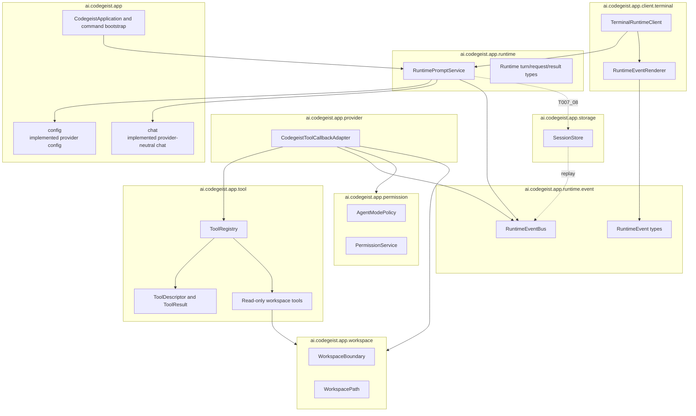

Dependency direction:

- `runtime` may depend on `config`, `chat`, and `runtime.event`.
- `client.terminal` may depend on `runtime` and event types, but not on provider or
  tool implementation classes.
- `tool` may depend on `workspace` for validation and on event/result types only
  where a current test requires event emission.
- `provider` adapter code may depend on `tool`, `permission`, `workspace`, and
  Spring AI callback APIs, but provider-specific imports should stay isolated.
- `storage` depends on stable runtime/event/tool-result contracts; other packages
  should not depend on a concrete storage implementation.

## Runtime Event Spine

`T007_02` wraps the existing one-shot `ask` provider path in a runtime service. The
first implementation should prefer concrete Spring services over interfaces unless
tests need a seam.

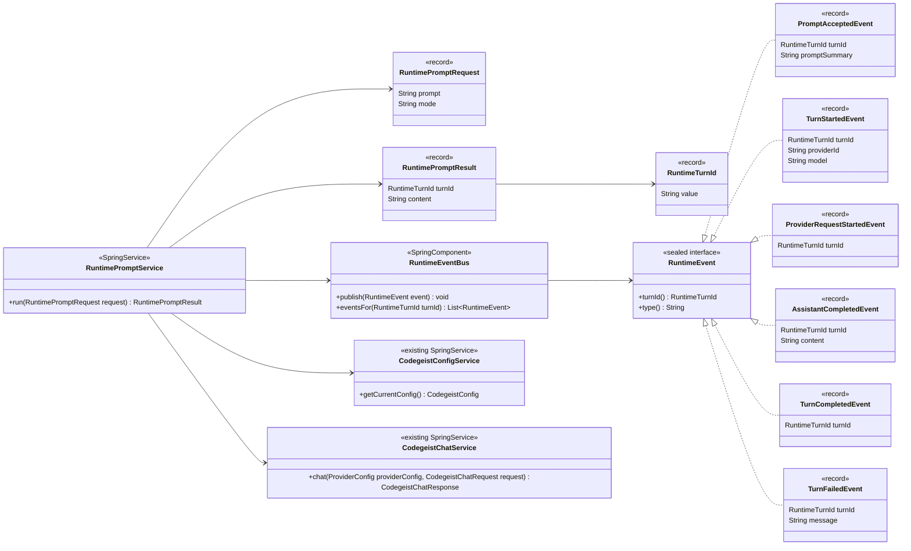

Notes:

- `mode` should be omitted from `RuntimePromptRequest` until a test requires mode
  selection. It appears in the diagram because `T007_05` needs a natural place to
  add it.
- `RuntimeTurnId` should exist only when event-order tests or clients need
  correlation. Otherwise use the smallest deterministic correlation field in the
  first slice and introduce the record later.
- Do not add token counts, cost, reasoning parts, retry state, compaction state, or
  storage ids in `T007_02`.

### Prompt Turn Flow

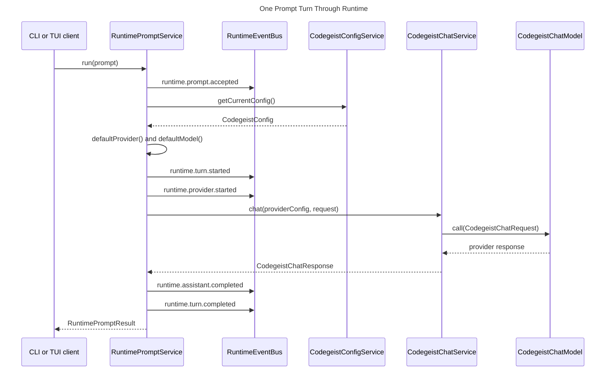

Failure flow:

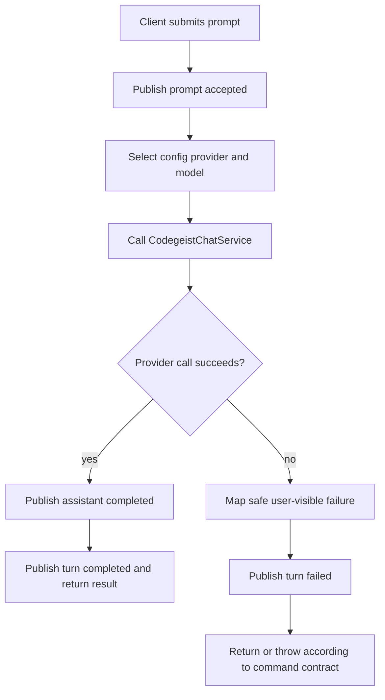

## Terminal Client Harness

`T007_03` adds a terminal client over runtime events. The first client should be
line-oriented and deterministic before any full-screen TUI is attempted.

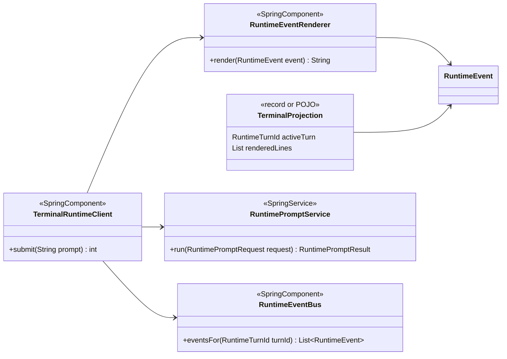

Renderer rules:

- Render only events that exist in the runtime event set.
- Keep stdout contracts for `--version`, `--show-config`, and one-shot `ask`
  unchanged.
- Keep approval/question renderers out of this slice until permission events exist.

## Tool Registry And Workspace Tools

`T007_04` introduces Codegeist-owned tools. Tools are not raw Java methods exposed
to a provider; they are capabilities executed through Codegeist policy and result
mapping.

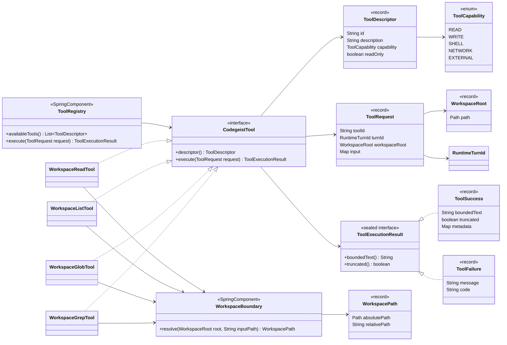

Workspace validation flow:

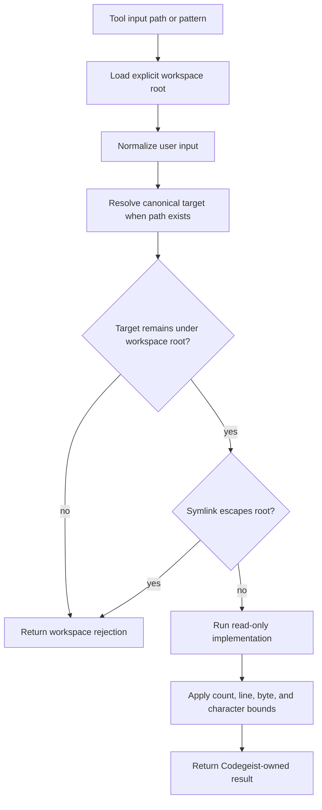

Agent Utils can be used only behind this boundary. `GrepTool`, `GlobTool`,
`ListDirectoryTool`, and read-only `FileSystemTools` behavior may be implementation
details after Codegeist validates paths and normalizes output.

## Permission And Side-Effect Gates

`T007_05` adds mode and approval policy before side effects. Tool implementations
must not classify their own trust level.

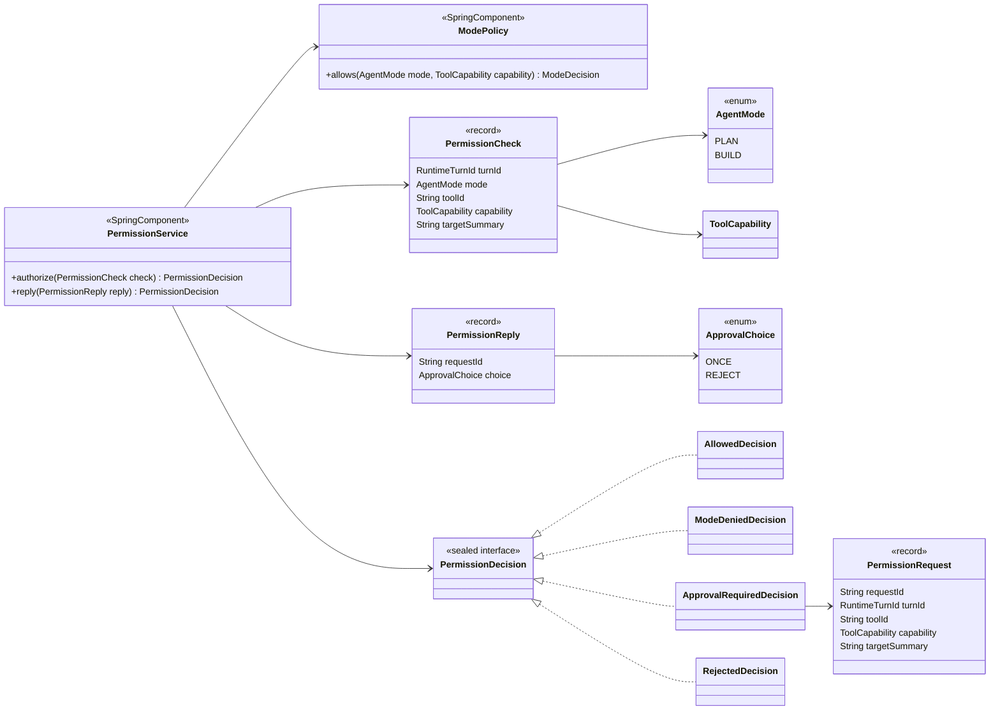

Approval flow:

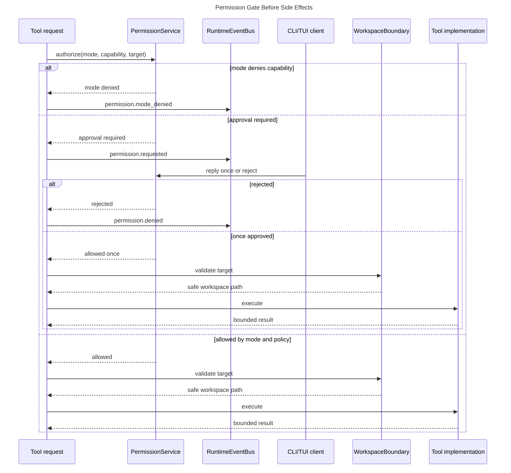

Persistent `always` approvals should not be implemented before storage exists
unless a focused test explicitly adds that behavior.

## Spring AI Tool Calling Boundary

`T007_06` lets a provider request tools without bypassing Codegeist policy.

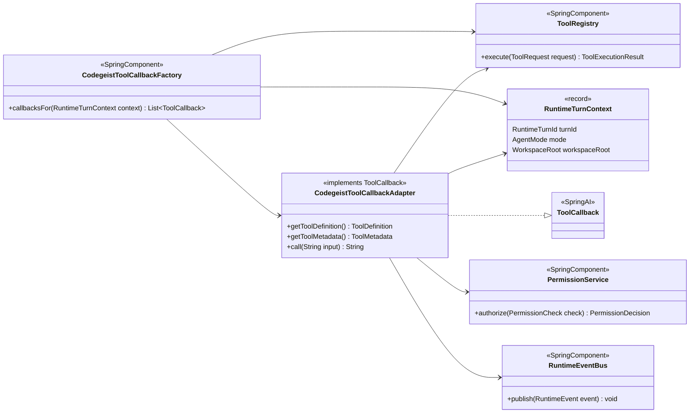

Tool-calling sequence:

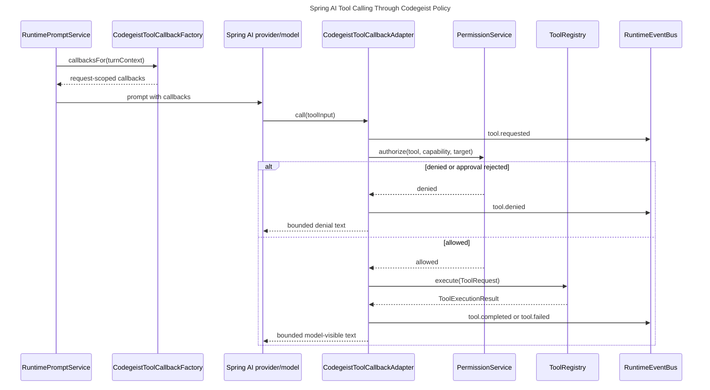

Registration rule:

- Prefer request-scoped `toolCallbacks(...)` for the current runtime turn.
- Use builder-level `defaultToolCallbacks(...)` only if a future test proves a
  shared default is required and still policy-safe.
- Do not use raw `@Tool` object registration for Agent Utils or Codegeist tools.

## Patch/Edit And Shell Tools

`T007_07` should split patch/edit and shell if doing both makes the task too large.

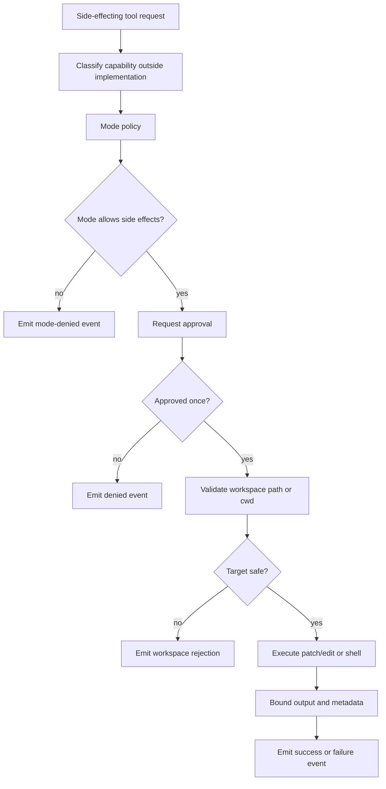

Patch/edit requirements:

- Validate every path under the workspace root.
- Produce a reviewable diff or patch summary before mutation when the active task
  asks for review behavior.
- Mutate only after mode and approval allow it.

Shell requirements:

- Validate cwd under the workspace root.
- Apply timeout and output bounds.
- Avoid broad destructive-command claims unless tests define exact behavior.
- Treat Agent Utils `ShellTools` as a concept reference only until Codegeist owns
  command classification, permission, cwd, timeout, and output policy.

## Session Storage And Resume

`T007_08` persists only the state that previous slices already produce.

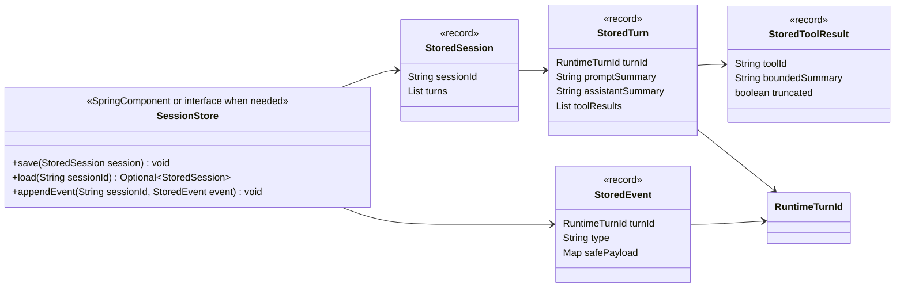

Replay flow:

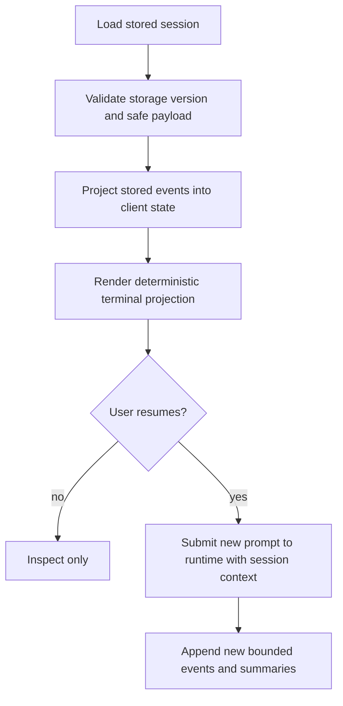

Storage must not persist provider credentials, evaluated secrets, OAuth tokens,
cloud credentials, raw unbounded prompts, or raw unbounded tool output.

## End-To-End Target Flow

The long-term T007 harness should converge on this flow after the child slices are
implemented:

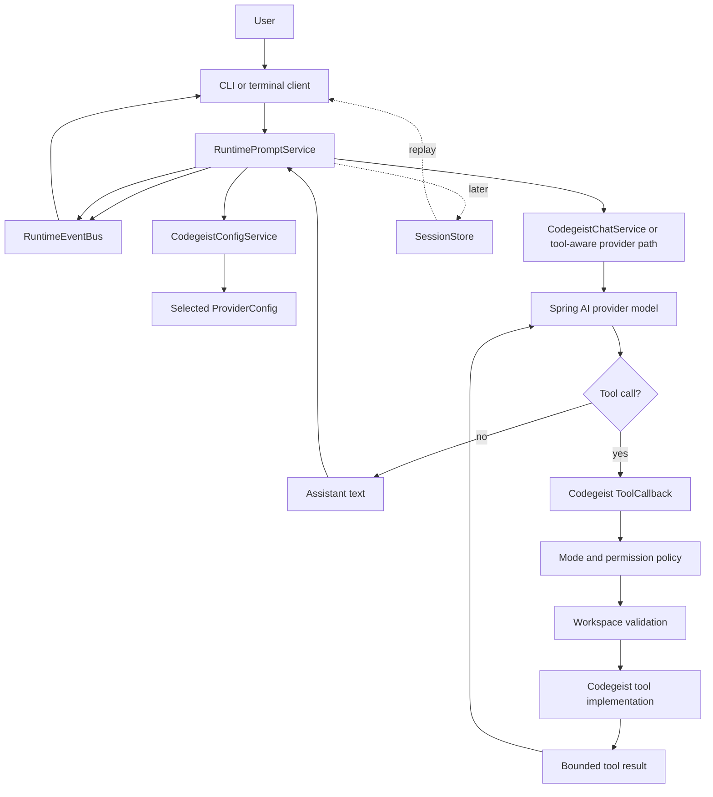

## Verification Matrix

Use the Taskfile from `app/codegeist/cli` for implementation verification.

| Slice | Focused verification |
| --- | --- |
| `T007_02` | `task test TEST=<runtime-event-test-selector>` and local provider selector only when the test calls Ollama. |
| `T007_03` | `task test TEST=<terminal-renderer-test-selector>`; add a smoke only if a noninteractive terminal entrypoint exists. |
| `T007_04` | `task test TEST=<workspace-tool-test-selector>` with temporary workspace fixtures. |
| `T007_05` | `task test TEST=<permission-test-selector>` for mode denial, approval, and post-approval workspace validation. |
| `T007_06` | `task test TEST=<tool-callback-test-selector>` and local provider selector only for real model tool calling. |
| `T007_07` | `task test TEST=<patch-or-shell-test-selector>`; smoke only when command runtime or packaging behavior changes. |
| `T007_08` | `task test TEST=<storage-test-selector>` with temporary storage roots. |

Local provider-backed checks must opt in explicitly:

```bash
CODEGEIST_TEST_PROVIDER_CATEGORY=local task test TEST=<focused-selector>
```

Broad verification after implementation slices:

```bash
task test
```

Documentation-only edits should at least run:

```bash
git --no-pager diff --check
```

Do not document direct `mvn test` commands for new Codegeist implementation work.

## Non-Goals

- Do not implement PF4J, JBang, Vaadin, headless server, SDK/OpenAPI, plugin
  marketplace behavior, MCP server management, LSP, skills, memory, or subagents in
  the first runtime harness slices.
- Do not copy OpenCode's Effect layers, Hono routes, OpenTUI/Solid components,
  generated SDK, SQLite tables, Drizzle migrations, or TypeScript schemas.
- Do not broaden provider coverage or call hosted providers as part of the runtime
  harness.
- Do not create security sandboxing claims beyond explicit tested mode,
  permission, workspace, timeout, and output-bound checks.
