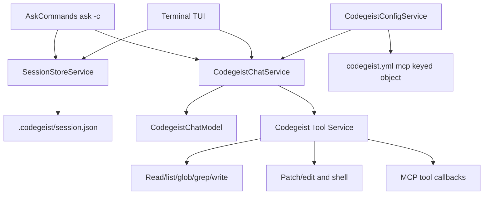

# Session Store Tool Harness Implementation Specification

Planned implementation specification for the current T007 session-store tool harness.

## Purpose

This document defines the planned implementation after T007 was expanded from a
minimal MCP-only chat into a resumable local coding-agent harness. The central
artifact is `.codegeist/session.json`: `ask -c/--continue <prompt>` and the
terminal TUI both load, update, and save the same directory-local session store.

T007 should implement TUI, tools, patch/edit, shell, MCP, and file-based chat
storage. It should not implement a database, server-side session runtime, remote
sync, API/SDK, Vaadin, PF4J, JBang, LSP, skills, memory, or subagents.

## Sources

- `docs/tasks/T007_build-codegeist-runtime-harness/task.md` defines the current
  parent epic, completion feature set, child tasks, acceptance criteria, and
  non-goals.
- `docs/tasks/T007_build-codegeist-runtime-harness/tasks/T007_01_define-chat-file-tool-harness-scope.md`
  records the current feature scope.
- `docs/developer/specification/llm-provider-implementation.md` defines the existing
  provider-neutral chat seam that this work must reuse.
- Spring AI `2.0.0-M6` MCP documentation identifies `spring-ai-starter-mcp-client`
  and `SyncMcpToolCallbackProvider` / `ToolCallbackProvider` as the MCP integration
  boundary. Codegeist owns the user-facing `codegeist.yml` MCP schema and maps it
  into Spring AI MCP client support.

## Implementation Rules

- Keep `ask` as the direct CLI chat command and add optional `-c/--continue`.
- Reuse `CodegeistConfig.defaultProvider()`, `ProviderConfig.defaultModel()`,
  `CodegeistChatService`, `CodegeistChatRequest`, and `CodegeistChatResponse` until
  a focused test requires a small extension.
- Keep `CodegeistChatRequest` focused on model and prompt. Put resumable chat state
  in the session store model, not in this request record.
- Use direct `codegeist.yml` for provider and MCP config. The first MCP shape is a
  top-level `mcp:` map keyed by client id.
- Treat `.codegeist/session.json` as the source of truth for resuming and saving
  local chat state.
- Keep tool outputs bounded before they are written to `.codegeist/session.json` or
  shown in the TUI.
- Update `docs/developer/architecture/architecture.md` in the implementation task
  that changes actual packages, classes, command behavior, TUI behavior, or tests.

## Slice Order

| Slice | Implementation focus | Must not add |
| --- | --- | --- |
| `T007_01` | Scope definition and stale minimal-MCP-only plan removal. | Java runtime changes. |
| `T007_02` | Versioned `.codegeist/session.json` model, file save/load, and `ask -c/--continue`. | TUI, patch/edit, shell, database. |
| `T007_03` | Codegeist MCP config plus read/list/glob/grep/write tool path. | Patch/edit, shell, TUI, custom MCP transports. |
| `T007_04` | Bounded patch/edit and shell tools recorded into `.codegeist/session.json`. | Unbounded shell, server runtime, database. |
| `T007_05` | Minimum usable terminal coding-agent TUI over the same `.codegeist/session.json`. | Second persistence model, server, Vaadin, desktop. |
| `T007_06` | Focused and broad verification plus architecture docs. | New feature scope beyond T007. |

## Component Direction

Introduce only classes needed by focused tests.



Dependency direction:

- `AskCommands` and the TUI are clients over session-store and chat services.
- The session store service owns `.codegeist/session.json` schema versioning, load,
  save, and bounded state updates by default. `CodegeistSpringAppProperties` owns the
  built-in defaults and binds Spring keys `codegeist.session.directory` and
  `codegeist.session.store-file`; external Spring application properties or
  `CODEGEIST_SESSION_DIRECTORY` and `CODEGEIST_SESSION_STORE_FILE` can override the
  path. These settings are separate from direct `codegeist.yml` provider/tool
  configuration.
- The tool service owns Codegeist tool descriptors, execution, and result mapping.
- Read/write, patch/edit, and shell tools must write bounded summaries into
  `.codegeist/session.json`.
- MCP config belongs to `CodegeistConfig`; Spring AI MCP properties are not the
  public Codegeist config contract.

## Session Store Contract

The first `.codegeist/session.json` shape is versioned and inspectable:

```json
{
  "schemaVersion": 1,
  "workingDir": "/home/test/Projects/codegeist-ai/codegeist",
  "createdAt": "2026-06-06T12:00:00Z",
  "updatedAt": "2026-06-06T12:01:00Z",
  "sessions": [
    {
      "id": "11111111-1111-4111-8111-111111111111",
      "title": "New session - 2026-06-06T12:00:00Z",
      "createdAt": "2026-06-06T12:00:00Z",
      "updatedAt": "2026-06-06T12:01:00Z",
      "messages": []
    }
  ]
}
```

Rules:

- Use one session store per working directory at `.codegeist/session.json` by default;
  external Spring application properties or `CODEGEIST_SESSION_DIRECTORY` and
  `CODEGEIST_SESSION_STORE_FILE` may override the directory and file name for tests
  or local workflow isolation.
- Store multiple sessions in that file.
- If `ask -c/--continue` receives an existing store, load the session with the
  newest `updatedAt` and append to it.
- If `ask -c/--continue` receives a missing or empty store, create a new session.
- Plain `ask <prompt>` creates a new session and saves the turn while keeping stdout
  limited to the provider response.
- Corrupt or unsupported existing stores fail instead of being overwritten.
- Store only chat-relevant information needed to resume and save the chat.
- Do not store API keys, OAuth tokens, cloud credentials, or evaluated secret values.
- Do not store provider config, selected provider, selected model, MCP client
  definitions, enabled tool definitions, permission rules, runtime status, or TUI
  state in `.codegeist/session.json`.
- Resolve provider selection, model selection, MCP clients, and enabled tools from
  current config and runtime behavior when continuing a chat.
- Bound large tool outputs and file content.

## MCP Configuration Contract

Use Codegeist's direct `codegeist.yml` shape:

```yaml
mcp:
  filesystem:
    type: stdio
    command: npx
    args:
      - -y
      - "@modelcontextprotocol/server-filesystem"
      - .
```

Rules:

- `mcp` is a map keyed by Codegeist MCP client id.
- The first supported client type is `stdio`.
- The first `stdio` fields are `type`, `command`, and `args`.
- Add environment, timeout, enablement, SSE, HTTP, OAuth, or dynamic discovery only
  when a focused task needs them.
- Do not expose Spring AI's `spring.ai.mcp.client.*` tree as the Codegeist user
  config contract for T007.

## Explicitly Deferred Work

- Database-backed storage, remote sync, server-side session APIs, SDK/OpenAPI, Vaadin,
  desktop UI, PF4J, JBang, LSP, skills, memory, and subagents.
- Custom MCP transports, MCP OAuth, MCP server lifecycle management, MCP permission
  mediation, or MCP tool filtering beyond the implemented config map.
- OpenCode storage/API/schema compatibility.

## Verification

Implementation tasks should use the Taskfile from `app/codegeist/cli`:

```bash
task test TEST=<test-selector>
task test
```

Use local provider verification only when a test intentionally hits the local
Ollama provider:

```bash
CODEGEIST_TEST_PROVIDER_CATEGORY=local task test TEST=<test-selector>
```

Documentation-only edits should run:

```bash
git --no-pager diff --check
```
