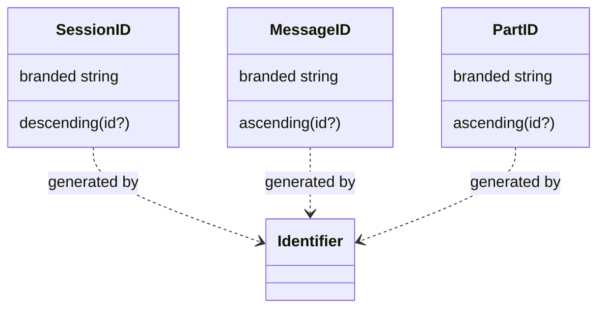
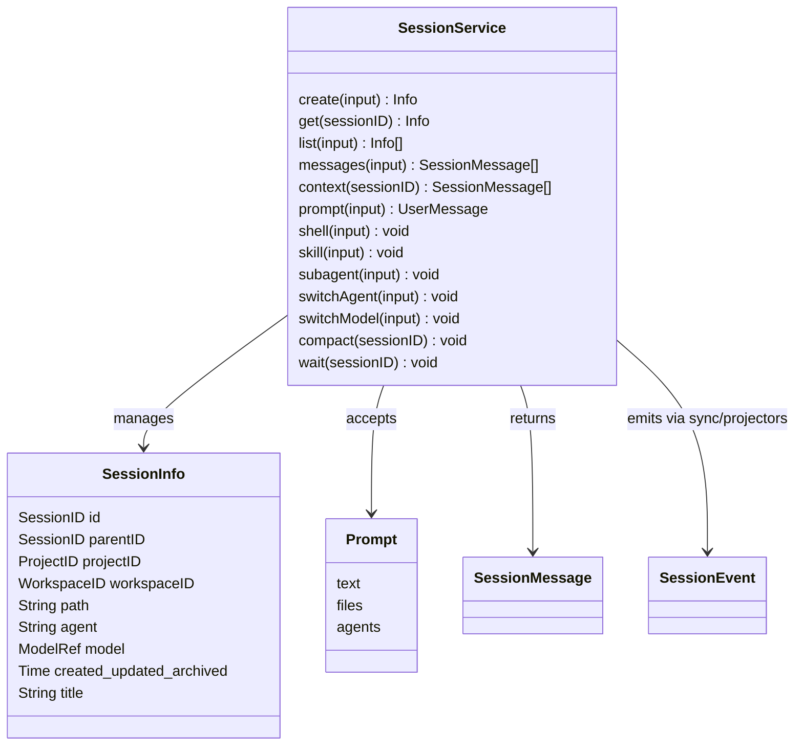
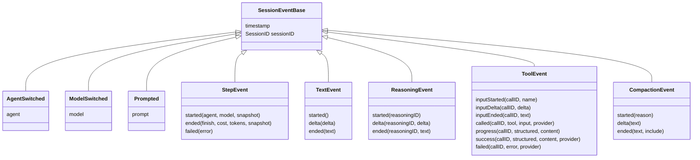
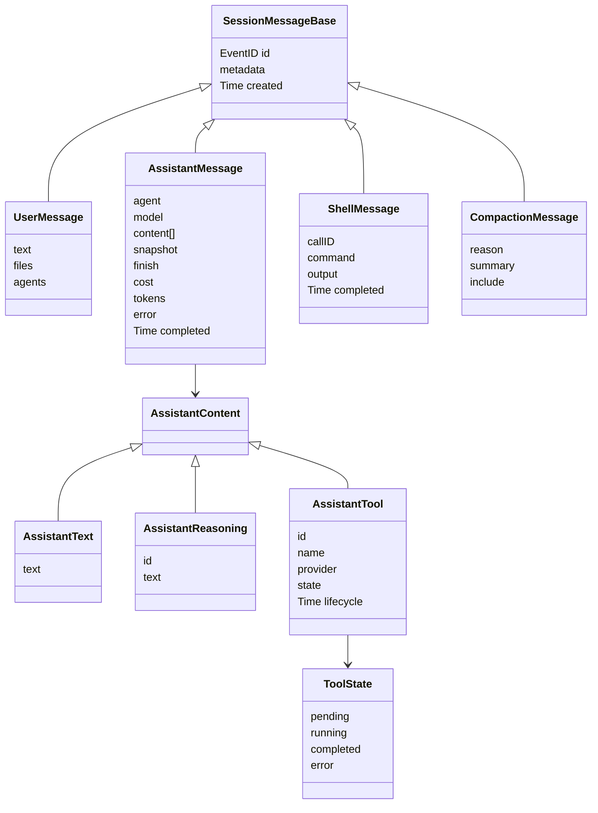
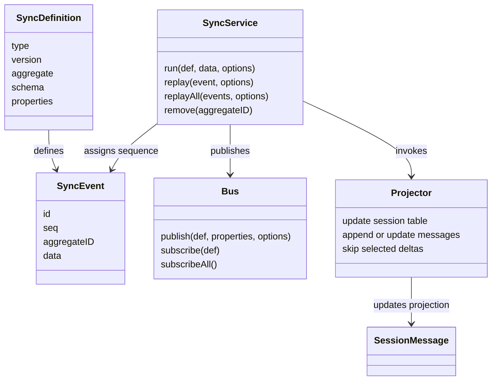
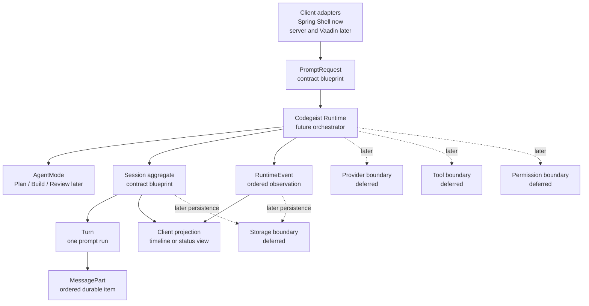
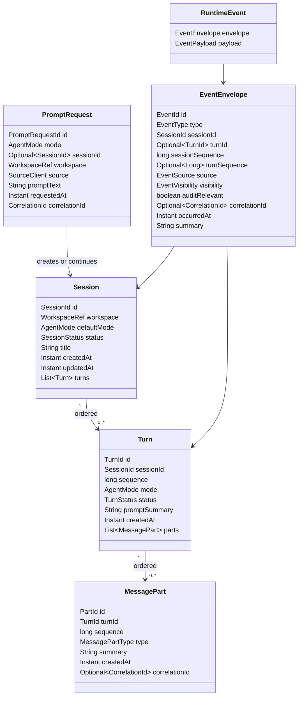
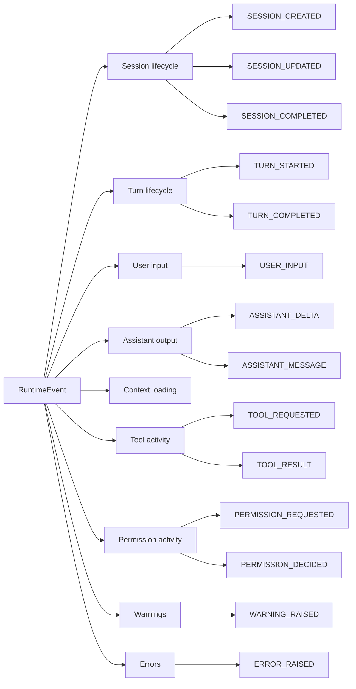
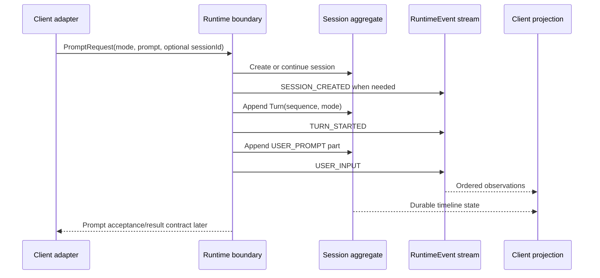
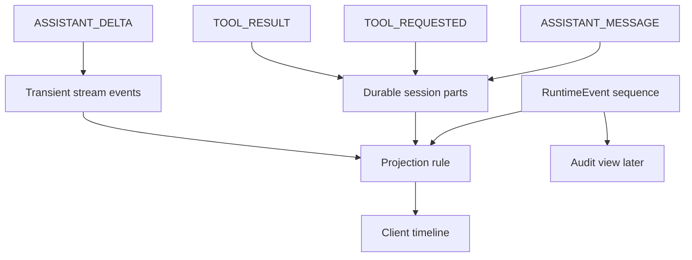

# Runtime Session Event Contracts

Architecture blueprint for future Codegeist runtime, session, and event Java
contracts. This document describes intended contracts and diagrams only. It does
not create Java packages, source files, tests, runtime services, storage schemas,
or client adapters.

## Purpose

`runtime-vocabulary.md` defines the words and ownership boundaries. This document
turns that vocabulary into a precise contract blueprint that later tasks can
implement when behavior is needed.

The immediate goals are:

- Make the first `PromptRequest`, `Session`, `Turn`, `MessagePart`, and
  `RuntimeEvent` shapes visible before Java source exists.
- Preserve the Codegeist ownership boundary: Runtime owns orchestration, Session
  owns user-work history, Event owns observable activity, and clients render
  projections.
- Translate OpenCode source evidence into Java-first Codegeist contracts without
  copying OpenCode's TypeScript, Effect, Drizzle, bus, route, or storage shape.

## OpenCode Source Evidence

OpenCode is the feature reference for this slice. The following files were read
through the local `/ask-project opencode` workflow and targeted source inspection:

| OpenCode source | Evidence used for Codegeist |
| --- | --- |
| `packages/opencode/src/session/schema.ts` | Sessions, messages, and parts use stable typed identities such as `SessionID`, `MessageID`, and `PartID`. |
| `packages/opencode/src/v2/session.ts` | Session operations include create, list, messages, prompt, shell, subagent, agent/model switches, compaction, and wait. |
| `packages/opencode/src/v2/session-event.ts` | Runtime activity is split into event families for prompting, agent/model changes, shell, step lifecycle, text, reasoning, tools, retry, and compaction. |
| `packages/opencode/src/v2/session-message.ts` | Client-friendly session messages are projected into user, assistant, shell, tool, and compaction forms. |
| `packages/opencode/src/sync/index.ts` | Sync events carry `id`, `seq`, `aggregateID`, and data, with monotonic sequence checks per aggregate. |
| `packages/opencode/src/bus/index.ts` | Runtime events can be published to typed and wildcard subscribers. |
| `packages/opencode/src/session/projectors-next.ts` | Event projectors update persisted/read-model session messages; some streaming delta events are transient while final events update projections. |

Codegeist should keep the architectural lessons and reject direct implementation
copying. The first Java contracts should not include OpenCode's Effect service
layers, TypeScript schema helpers, Drizzle tables, Hono routes, SDK-generated
types, or storage-first event sourcing decisions.

## OpenCode Concept Model

OpenCode implements the relevant concepts as a TypeScript and Effect-based system
with schema classes, tagged unions, a session service, sync events, a bus, and
projectors. The diagrams below describe the implementation shape as evidence for
Codegeist contract design; they are not a Java package plan.

### OpenCode Session Identity

`session/schema.ts` defines stable branded identifiers for the session domain.
The important lesson for Codegeist is to keep ids typed at boundaries instead of
passing unqualified strings through Runtime, Session, Turn, MessagePart, and Event
contracts.



### OpenCode Session Service

`v2/session.ts` models a session as service-managed information plus operations.
`Session.Info` holds identity, project/workspace links, selected agent/model,
title, and timestamps. The service owns operations such as create, list, prompt,
shell, subagent, switch agent/model, compact, and wait.



Codegeist should translate this into a Runtime-owned boundary. The first Java
contract should not expose storage queries, Effect return types, or OpenCode's
provider/model references directly.

### OpenCode Session Events

`v2/session-event.ts` defines session-scoped event families through `EventV2`.
Each event carries a common base of timestamp and `sessionID`, declares
`aggregate: "sessionID"`, and is later used by sync/projector code. Event family
coverage is broad enough to guide Codegeist's future event taxonomy.



Codegeist should keep the family separation but use Codegeist event names and a
clear `EventEnvelope` so visibility, audit relevance, source, and correlation are
explicit from the start.

### OpenCode Session Messages

`v2/session-message.ts` projects runtime activity into timeline-friendly message
types. Messages are a read/presentation shape built from events and persisted
rows, not the same thing as every streaming event.



Codegeist should model durable `MessagePart` records separately from transient
`RuntimeEvent` streaming observations. A future CLI/server/Vaadin timeline can be
a projection of both.

### OpenCode Sync, Bus, And Projectors

`sync/index.ts`, `bus/index.ts`, and `session/projectors-next.ts` connect events
to ordering, publication, persistence, and projections. Sync events have an `id`,
`seq`, `aggregateID`, and `data`; sequence validation is per aggregate. Projectors
turn final events into session messages while some deltas remain transient.



Codegeist should preserve the architectural constraints: monotonic ordering per
session, idempotent display by event id, and separate projection rules. The first
contract blueprint should not require event sourcing, a database, SSE, or an
in-process bus implementation.

## Concept Reference

The table below summarizes every concept this task describes, how OpenCode
implements the comparable idea, and how Codegeist should translate it.

| Concept | OpenCode implementation evidence | Codegeist blueprint |
| --- | --- | --- |
| Request | `v2/session.ts` accepts `prompt(input)` with `sessionID`, `prompt`, optional event id, and delivery. | `PromptRequest` accepts mode, optional session continuation, workspace, source client, prompt text, and correlation id. |
| Agent mode | OpenCode records agent switching through `session.next.agent.switched` and stores `agent` on session/message shapes. | `AgentMode` is a Codegeist enum-like contract for `PLAN`, `BUILD`, and later `REVIEW`; it is recorded on request/session/turn. |
| Session identity | `SessionID` is a branded identifier in `session/schema.ts`. | `SessionId` should be a typed value object or record, not a bare string at boundaries. |
| Session info | `Session.Info` includes id, parent, project, workspace, agent/model, title, and timestamps. | `Session` owns workspace reference, default mode, status, title, timestamps, and ordered turns. |
| Turn | OpenCode v2 models prompt work through session events and messages rather than a named `Turn` class. | `Turn` is an explicit Codegeist concept for one prompt run, with sequence, mode, status, prompt summary, and parts. |
| Message identity | OpenCode has `MessageID`, `PartID`, and `SessionMessage.ID`. | `TurnId` and `PartId` should be typed ids; later storage can decide whether messages and parts are separate persisted entities. |
| Message part | OpenCode message content distinguishes user, assistant text, reasoning, tool, shell, and compaction shapes. | `MessagePart` is a durable ordered item; streaming deltas remain events until finalized. |
| Runtime event | OpenCode `SessionEvent` families describe agent/model, prompt, step, text, reasoning, tool, retry, and compaction activity. | `RuntimeEvent` wraps a typed payload in an `EventEnvelope` with sequence, source, visibility, audit flag, and correlation id. |
| Event sequence | OpenCode `SyncEvent` assigns `seq` per `aggregateID` and validates replay order. | Runtime assigns monotonic `sessionSequence` per session, and optionally `turnSequence` per turn. |
| Event publication | OpenCode `Bus` exposes typed and wildcard publish/subscribe. | Codegeist may add a publisher port later; the contract does not require a bus implementation now. |
| Projection | OpenCode projectors update session-message rows and skip some deltas. | Codegeist projections derive CLI/server/Vaadin timelines from sessions and runtime events. |
| Storage | OpenCode stores sessions/messages/events through Drizzle tables and sync rows. | Codegeist storage is deferred; contracts should stay persistence-ready but storage-neutral. |

## Boundary Overview



The runtime is the only planned writer for session state transitions and runtime
state-transition events. Clients submit requests and render projections; they do
not mutate sessions directly.

## Contract Vocabulary

| Concept | Contract role | Must not own |
| --- | --- | --- |
| `PromptRequest` | User input accepted by Runtime, including requested mode and optional continuation session. | Shell parsing, HTTP DTOs, provider prompts, tool calls. |
| `AgentMode` | Behavior profile for a request, session, and turn. Initial values are `PLAN` and `BUILD`; `REVIEW` can remain reserved. | Client command names or provider-specific modes. |
| `Session` | Runtime-owned aggregate for related user work in one workspace. | Provider SDK calls, tool side effects, UI state, storage implementation. |
| `Turn` | One user prompt and the runtime activity it starts. | Provider streaming implementation or tool execution internals. |
| `MessagePart` | Ordered durable item inside a turn, safe to project later. | Unbounded raw output, provider-native payloads, UI widgets. |
| `RuntimeEvent` | Ordered observation emitted by runtime-owned work. | Command intent, client mutation, storage schema. |
| `Projection` | Read/view shape derived from sessions and events for CLI/server/Vaadin. | Source-of-truth state transitions. |

## Domain Shape



This is a contract sketch, not a generated API model. Field names are stable
guidance for later Java records/classes, but implementation tasks may adjust exact
types after tests and behavior exist.

## Runtime Request Contract

A future `PromptRequest` should represent a single user submission before any
provider, tool, permission, or storage work starts.

Required first fields:

| Field | Purpose |
| --- | --- |
| `id` | Stable request identity for logs and correlation. |
| `mode` | Requested `PLAN` or `BUILD` behavior. |
| `sessionId` | Optional continuation identity; absent means create a session. |
| `workspace` | Workspace/root reference; detailed path policy belongs to workspace tasks. |
| `source` | Origin classification such as CLI, server, Vaadin, extension, or system. |
| `promptText` | User prompt text or redacted prompt body. |
| `requestedAt` | Runtime timestamp. |
| `correlationId` | Shared id for request, turn, provider/tool events, and final projection. |

The request is not a Spring Shell command object, HTTP request DTO, Vaadin view
model, Spring AI prompt, or storage entity.

## Session And Turn Contract

A `Session` is the runtime-owned aggregate for related work over time. A `Turn`
is one prompt execution inside that session.

First statuses:

| Status enum | Initial values | Notes |
| --- | --- | --- |
| `SessionStatus` | `ACTIVE`, `WAITING_FOR_APPROVAL`, `COMPLETED`, `ABORTED`, `ERROR` | `WAITING_FOR_APPROVAL` should be derived from active turn state when possible. |
| `TurnStatus` | `PENDING`, `RUNNING`, `WAITING_FOR_APPROVAL`, `COMPLETED`, `ABORTED`, `ERROR` | `PENDING` and `RUNNING` separate accepted work from executing work. |

Ordering rules:

- Turn sequence is monotonic within a session.
- Message part sequence is monotonic within a turn.
- Historical turns and parts should be append-oriented. Later revert, compact,
  delete, and fork behavior must be explicit lifecycle operations.
- Session `updatedAt` changes when runtime-owned metadata, status, default mode,
  or turns change.

## Message Part Contract

Message parts are durable, ordered items that can be shown in a timeline or
persisted later. They are not required to capture every transient stream chunk.

Initial part families:

| Part type | First role | Later expansion |
| --- | --- | --- |
| `USER_PROMPT` | Redacted user prompt summary for the turn. | Attachments, selected context hints, redaction metadata. |
| `ASSISTANT_TEXT` | Final assistant text or safe summary. | Provider/model refs, citations, token/cost metadata. |
| `REASONING_NOTE` | Optional visible reasoning/diagnostic note when policy allows. | Provider-specific reasoning policies. |
| `TOOL_CALL` | Summary of requested tool and classified capability. | Exact tool input schema belongs to tool tasks. |
| `TOOL_RESULT` | Summary or artifact reference for tool output. | Storage-backed output refs and diffs. |
| `APPROVAL_REFERENCE` | Link between a side-effect request and permission decision. | Permission cache and audit details. |
| `WARNING` | Non-fatal runtime warning. | Typed warning codes. |
| `ERROR` | Recoverable or terminal runtime error. | Support bundle refs and remediation hints. |
| `SUMMARY` | Later compaction or summary marker. | Storage/context compaction behavior. |
| `SNAPSHOT_REFERENCE` | Later reference to patch/file/workspace snapshots. | Workspace and patch/edit tasks. |

OpenCode has richer message and part forms. Codegeist should start small and
expand only when the matching provider, tool, permission, workspace, or storage
task needs a real field.

## Runtime Event Contract

A `RuntimeEvent` is an observation emitted by runtime-owned work. It is suitable
for CLI output now and future server/Vaadin/TUI streams, but it is not the source
of truth by default.

Every event should carry an envelope before event-specific payload fields:

| Envelope field | Purpose |
| --- | --- |
| `eventId` | Stable id for deduplication, rendering, and later persistence. |
| `type` | Typed event name, preferably enum-backed in the first Java contract. |
| `occurredAt` | Runtime timestamp. |
| `sessionId` | Owning session aggregate. |
| `turnId` | Present for turn-scoped events. |
| `sessionSequence` | Monotonic order within the session. |
| `turnSequence` | Optional monotonic order within a turn. |
| `source` | Runtime, client, context, provider, tool, permission, workspace, storage, or extension. |
| `visibility` | `USER_VISIBLE`, `INTERNAL`, or `AUDIT_ONLY`. |
| `auditRelevant` | Marks events that later audit storage should retain. |
| `correlationId` | Links paired request/result, permission, tool, or streaming events. |
| `summary` | Short redacted text safe for logs or display. |

Sequencing rules:

- Runtime assigns `sessionSequence` before publishing or returning events.
- Session-scoped events are monotonic per session, matching the OpenCode aggregate
  sequence lesson from `sync/index.ts`.
- Turn-scoped events may also carry `turnSequence` for prompt-local rendering.
- Replaying the same `eventId` must not duplicate user-visible output.
- Clients consume events; they do not publish state-transition events.

## Event Families



Initial event names should be Codegeist names. OpenCode names such as
`session.next.text.delta` and `session.next.tool.success` are useful evidence for
families and ordering, not names to copy verbatim.

## Prompt Sequence



This sequence intentionally stops before provider calls, context loading, tool
execution, permissions, storage, or CLI rendering behavior. Later tasks can insert
those steps without changing the initial session/turn/event ownership model.

## Event Projection



OpenCode's `projectors-next.ts` shows the same principle: some deltas are useful
for live rendering but do not have to become durable messages, while final events
update the session message projection. Codegeist should keep that distinction.

## Illustrative Java Sketches

The following snippets are examples only. They are not implemented source and
should not be copied into Java files until an implementation task needs them.

```java
record SessionId(String value) {}
record TurnId(String value) {}
record EventId(String value) {}
record CorrelationId(String value) {}

enum AgentMode {
    PLAN,
    BUILD,
    REVIEW
}
```

```java
record EventEnvelope(
    EventId eventId,
    EventType type,
    SessionId sessionId,
    Optional<TurnId> turnId,
    long sessionSequence,
    OptionalLong turnSequence,
    EventSource source,
    EventVisibility visibility,
    boolean auditRelevant,
    Optional<CorrelationId> correlationId,
    Instant occurredAt,
    String summary
) {}
```

```java
record PromptRequest(
    PromptRequestId id,
    AgentMode mode,
    Optional<SessionId> sessionId,
    WorkspaceRef workspace,
    SourceClient source,
    String promptText,
    Instant requestedAt,
    CorrelationId correlationId
) {}
```

When implemented later, contracts should prefer small value records, explicit
enums, and sealed event payloads only when they clarify real behavior. Avoid
adding placeholder classes just to reserve package names.

## Later Implementation Rules

- Implement the smallest concrete contracts required by the next behavior task.
- Keep provider SDK types behind provider adapters.
- Keep Spring Shell, HTTP, Vaadin, PF4J, JBang, and storage DTOs out of core
  runtime/session/event contracts.
- Assign event sequences in the runtime before publication or return.
- Keep transient stream events separate from durable message parts.
- Add contract tests only when Java source exists and behavior can be verified.
- Update `docs/developer/architecture/architecture.md` when any described package becomes real
  application code.

## Non-Goals

- No Java source files or empty package directories are created by this document.
- No provider calls, tool execution, permission prompts, shell commands, file
  edits, storage, server endpoints, Vaadin views, PF4J plugins, or JBang execution
  are implemented here.
- No event store, event bus, database schema, SSE transport, or CLI renderer is
  selected here.
- No OpenCode TypeScript schema, Effect service, route, SDK, or Drizzle table is
  copied into Codegeist.
