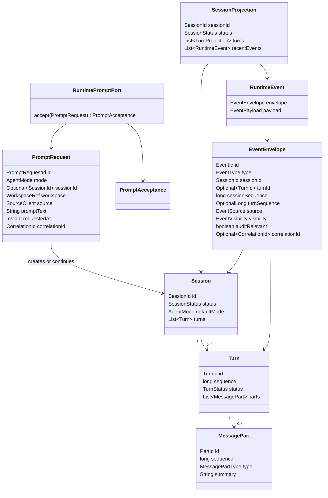

# Runtime Session Event Source Generation Contract

Source-generation handoff for the first planned Codegeist runtime, session, and
event Java contracts. This document is planned guidance only: it does not create
Java source, tests, packages, runtime services, storage, client adapters, or
behavior.

## Purpose And Status

`runtime-session-event-contracts.md` defines the broad blueprint for Codegeist
runtime, session, and event contracts. This handoff narrows that blueprint into
the first source-generation slice a later Java implementation task can build with
TDD.

The first source pass should create only the core contract shapes needed to
accept a prompt request, create or continue a session, append a turn and durable
message parts, emit ordered runtime events, and produce a small client projection.
It should stop before provider streaming, context loading, tools, permissions,
workspace policy, patch/edit, shell execution, storage adapters, CLI rendering,
TUI behavior, server transport, Vaadin, PF4J, or JBang.

## Current Baseline

The implemented Java application is still intentionally small.

| Area | Current state |
| --- | --- |
| Module | One Maven module under `app/codegeist/cli` |
| Implemented package | `ai.codegeist.app` only |
| Entrypoint | `CodegeistApplication` starts Spring Boot |
| Spring Shell | Dependency and configuration surface only; no commands yet |
| Spring AI | BOM imported; no provider starters or model calls yet |
| Spring AI Agent Utils | BOM and core artifact present; no runtime utility wired yet |
| Runtime/session/event source | Not implemented |
| Tests | Spring Boot context-load test only |

All Java names below are planned source names. They are not current source files
or packages.

## First-Wave Boundary

The first runtime/session/event source slice should own contract-level types for:

- Request identity and prompt intake before any framework, provider, tool, or
  storage work starts.
- Agent mode selection for `PLAN` and `BUILD`, with `REVIEW` reserved only when
  useful for stable type shape.
- Session identity, lifecycle metadata, and append-oriented turn history.
- Turn identity, prompt summary, status, ordering, and durable message parts.
- Runtime event envelopes, small payload families, and monotonic session order.
- A projection shape that clients can render without becoming source-of-truth
  state.
- Typed contract failures for invalid ids, invalid prompt requests, sequence
  violations, and projection conflicts.

The slice should not include runtime orchestration against a provider. A minimal
`RuntimePromptPort` may exist as a boundary interface only when the later source
task needs a tested call target for CLI or future client adapters.

## Planned Package Ownership

| Planned package | First-wave ownership | Must not own in the first source pass |
| --- | --- | --- |
| `ai.codegeist.runtime` | `PromptRequest`, request ids, `AgentMode`, `SourceClient`, `RuntimePromptPort`, `PromptAcceptance`, and request-level failures. | Spring Shell commands, Spring AI prompts, provider/model calls, tool execution, permission policy, workspace reads, storage adapters. |
| `ai.codegeist.session` | `SessionId`, `TurnId`, `PartId`, `Session`, `Turn`, `MessagePart`, statuses, and session projection records. | Provider callbacks, tool results beyond summaries, UI widgets, persistence schema, continuation storage. |
| `ai.codegeist.event` | `RuntimeEvent`, `EventEnvelope`, event ids, event type/source/visibility enums, minimal payload family, sequencing rules. | Event bus, SSE, database event store, audit storage, UI rendering, provider-native stream chunks. |

Other planned packages are clients, dependencies, or later owners:
`ai.codegeist.cli`, `ai.codegeist.tui`, `ai.codegeist.provider`,
`ai.codegeist.context`, `ai.codegeist.tool`, `ai.codegeist.permission`,
`ai.codegeist.workspace`, `ai.codegeist.patch`, `ai.codegeist.shell`, and
`ai.codegeist.storage` must not leak types into these core contracts.

## Planned Contract Diagram



## Minimum Planned Java Shapes

| Shape | Planned package | First-wave role |
| --- | --- | --- |
| `PromptRequestId`, `CorrelationId` | `ai.codegeist.runtime` | Typed request and correlation values. |
| `PromptRequest` | `ai.codegeist.runtime` | User prompt intake with mode, optional continuation session, workspace ref, source client, text, timestamp, and correlation id. |
| `SourceClient` | `ai.codegeist.runtime` | Small enum for `CLI`, `TUI`, `SERVER`, `VAADIN`, `EXTENSION`, and `SYSTEM`, even when most clients are later. |
| `AgentMode` | `ai.codegeist.runtime` | `PLAN`, `BUILD`, and optionally reserved `REVIEW`; not provider-specific. |
| `RuntimePromptPort` | `ai.codegeist.runtime` | Boundary interface for accepting a prompt request when a tested adapter target is needed. |
| `PromptAcceptance` | `ai.codegeist.runtime` | Result with request id, session id, turn id, accepted mode, and initial events or projection. |
| `SessionId`, `TurnId`, `PartId` | `ai.codegeist.session` | Typed identifiers for session aggregate, prompt turn, and ordered parts. |
| `Session`, `Turn`, `MessagePart` | `ai.codegeist.session` | Append-oriented state contracts for future runtime-owned mutation. |
| `SessionStatus`, `TurnStatus`, `MessagePartType` | `ai.codegeist.session` | Small enums for first lifecycle and timeline values. |
| `SessionProjection`, `TurnProjection`, `MessagePartProjection` | `ai.codegeist.session` | Read shapes for CLI/TUI/server/Vaadin rendering without owning state transitions. |
| `EventId`, `EventType`, `EventSource`, `EventVisibility` | `ai.codegeist.event` | Typed event metadata values. |
| `EventEnvelope`, `RuntimeEvent`, `EventPayload` | `ai.codegeist.event` | Ordered runtime observation contract. |
| `RuntimeContractFailure` | `ai.codegeist.runtime` or shared subpackage under the first owner | Sealed typed failure family for invalid request, invalid id, invalid sequence, projection conflict, and unsupported mode. |

`WorkspaceRef` is referenced as a boundary value but detailed workspace policy
belongs to the context/workspace source-generation task. The first implementation
may use a minimal record if tests need a typed workspace reference, but it must
not read files, resolve symlinks, inspect ignore rules, or hard-code this repo's
`docs/` layout.

## First Event-Family Cut

The first event enum should include only event names required to prove request,
session, turn, user-input, and basic diagnostic flow:

| Event type | First role | Deferred expansion |
| --- | --- | --- |
| `SESSION_CREATED` | A new session was accepted. | Parent/fork/continuation metadata. |
| `SESSION_UPDATED` | Session metadata or status changed. | Storage-backed continuation details. |
| `TURN_STARTED` | A prompt turn was appended and started. | Provider step and context loading detail. |
| `USER_INPUT` | A redacted user prompt summary was accepted into the turn. | Attachments and selected context summaries. |
| `TURN_COMPLETED` | A turn reached a terminal first-wave status. | Provider finish reason, token/cost, tool state. |
| `WARNING_RAISED` | Non-fatal runtime warning. | Typed warning catalog. |
| `ERROR_RAISED` | Recoverable or terminal contract/runtime error. | Support bundle refs and remediation. |

Provider streaming, assistant deltas, context loading, tool calls, permission
requests, shell commands, patch proposals, storage events, compaction, retry, and
bus/transport events are later expansions.

## Sequencing And Projection Rules

- `sessionSequence` is monotonic per session and assigned before an event is
  returned, published, or projected.
- `turnSequence` is optional but monotonic within a turn when present.
- `EventId` is stable enough for idempotent rendering; replaying the same event id
  must not duplicate client-visible output.
- Session turns and message parts are append-oriented in the first source pass.
  Delete, fork, compact, revert, and archival behavior need explicit later tasks.
- `SessionProjection` is a read model derived from session state and runtime
  events. It is not the owner of state transitions.
- Projections may include recent events and durable message parts, but they should
  not require an event store, database schema, SSE stream, or in-process bus.

## Boundary Rules

- Core contracts use Codegeist records, enums, sealed interfaces, and small ports.
- Do not expose Spring Shell, Spring AI, Agent Utils, provider SDK, Vaadin, HTTP,
  storage adapter, PF4J, JBang, filesystem, process, or terminal UI types from
  runtime, session, or event contracts.
- Do not register provider tools or Agent Utils callbacks in this first slice.
- Do not implement persistence, event sourcing, sync, bus, SSE, or HTTP transport.
- Do not make CLI, TUI, server, or Vaadin code mutate sessions directly; clients
  submit requests and render projections.
- Do not copy OpenCode TypeScript schema, Effect layers, Drizzle tables, Hono
  routes, generated SDK models, or event names directly.

## Illustrative Java Sketches

These snippets are examples only. They are not implemented source.

```java
record PromptRequest(
    PromptRequestId id,
    AgentMode mode,
    Optional<SessionId> sessionId,
    WorkspaceRef workspace,
    SourceClient source,
    String promptText,
    Instant requestedAt,
    CorrelationId correlationId
) {}

enum AgentMode {
    PLAN,
    BUILD,
    REVIEW
}

interface RuntimePromptPort {
    PromptAcceptance accept(PromptRequest request);
}
```

```java
record EventEnvelope(
    EventId id,
    EventType type,
    SessionId sessionId,
    Optional<TurnId> turnId,
    long sessionSequence,
    OptionalLong turnSequence,
    EventSource source,
    EventVisibility visibility,
    boolean auditRelevant,
    Optional<CorrelationId> correlationId,
    Instant occurredAt,
    String summary
) {}

sealed interface EventPayload permits SessionCreated, TurnStarted, UserInput,
        TurnCompleted, SessionUpdated, WarningRaised, ErrorRaised {}
```

```java
sealed interface RuntimeContractFailure permits InvalidPromptRequest,
        InvalidIdentifier, InvalidSequence, ProjectionConflict, UnsupportedMode {
    String redactedMessage();
    Recoverability recoverability();
}
```

## TDD Handoff

The later source-generation task should add tests before implementation unless it
records a concrete reason that test-first work is not reasonable. These tests
should be plain JVM tests and individually executable through Maven/JUnit
selectors.

| Future test | Behavior to prove |
| --- | --- |
| `RuntimeSessionEventContractTests#acceptsPromptWithoutFrameworkTypes` | A `PromptRequest` can be created and accepted through Codegeist contracts without Spring Shell, Spring AI, Agent Utils, provider SDK, storage, CLI, or TUI types. |
| `RuntimeSessionEventContractTests#rejectsBlankPromptWithTypedFailure` | Invalid prompt text maps to a `RuntimeContractFailure` with a redacted message and recoverability. |
| `RuntimeSessionEventContractTests#appendsTurnsAndPartsInOrder` | Session turn and message-part sequences are append-oriented and monotonic. |
| `RuntimeSessionEventContractTests#assignsMonotonicSessionEventSequence` | Runtime event envelopes preserve monotonic session order and optional turn order. |
| `RuntimeSessionEventContractTests#projectsEventsIdempotentlyByEventId` | Replaying the same event id does not duplicate projection output. |
| `RuntimeSessionEventDependencyTests#coreContractsDoNotExposeFrameworkTypes` | Runtime/session/event packages do not expose Spring, provider SDK, storage adapter, CLI, TUI, HTTP, Vaadin, PF4J, or JBang types. |

Suggested first commands for that later implementation task:

```bash
cd app/codegeist/cli
mvn --batch-mode --no-transfer-progress -Dtest=RuntimeSessionEventContractTests test
mvn --batch-mode --no-transfer-progress -Dtest=RuntimeSessionEventContractTests#acceptsPromptWithoutFrameworkTypes test
```

## Deferrals

| Later owner | Deferred behavior |
| --- | --- |
| `T003_06` CLI prompt contract | Spring Shell `plan` and `build` command source-generation handoff over these runtime contracts. |
| `T003_07` context/workspace contract | Workspace path validation, context source selection, deterministic manifest assembly, and diagnostics. |
| `T003_08` provider adapter contract | Provider configuration, Spring AI adapter isolation, OpenAI-compatible/OpenAI and Ollama first-wave posture, streaming fallback. |
| `T003_09` tool/permission/workspace contract | Tool descriptors, permission requests/decisions, workspace target validation, bounded tool results. |
| `T003_10` patch/edit contract | Proposal identity, freshness checks, exact approval binding, apply results, patch summaries. |
| `T003_11` controlled shell contract | Build-mode shell approval, cwd/env/stdin policy, timeout/cancellation, bounded output. |
| `T003_12` storage/continuation contract | Storage ports, session continuation, artifact references, in-memory-first and later file-backed posture. |
| `T003_13` end-to-end agent loop | Provider streaming, tools, permissions, storage, event/session projection, and usable prompt loop. |
| `T003_14` OpenCode parity CLI workflows | User-visible workflow parity over implemented runtime and CLI adapters. |
| `T003_15` packaging/native/startup validation | Artifact packaging, GitHub Releases, platform smoke checks, startup/native posture. |

## Later Implementation Checklist

Before creating runtime/session/event Java source, verify that the implementation
task:

- Starts with the narrow tests named in this handoff or records a concrete
  test-first blocker.
- Keeps the first source under the current `app/codegeist/cli` Maven module unless
  tests prove a module split is needed.
- Creates only the packages and types required by the first failing tests.
- Keeps framework, provider, storage, UI, process, filesystem, and extension types
  outside core contracts.
- Keeps event publication, persistence, provider streaming, tools, permissions,
  context loading, shell execution, patch/edit, CLI rendering, and TUI behavior out
  of the first pass.
- Updates `docs/developer/architecture/architecture.md` after any planned package
  becomes real source.
