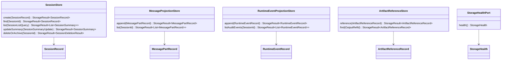
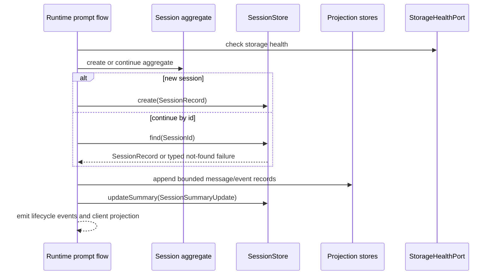

# Storage Session Continuation Source Generation Contract

Source-generation handoff for the first planned Codegeist storage ports, session
continuation records, projection stores, artifact references, storage health, and
in-memory adapter contracts. This document is planned guidance only: it does not
create Java source, tests, packages, storage ports, storage adapters, filesystem
persistence, database schemas, migrations, event sourcing, encryption, Spring
beans, runtime behavior, CLI/TUI behavior, or provider/tool behavior.

## Purpose And Status

`storage-port-posture.md` defines the broad storage posture: begin with in-memory
storage behind replaceable ports, keep file-backed restart support deferred until a
concrete CLI continuation workflow requires it, and keep event sourcing optional.
This handoff narrows that posture into the first source-generation slice a later
Java implementation task can build with TDD.

The first source pass should create only the contract-level types needed to store
session records, continue a session by stable id inside the running process, list
recent session summaries, append bounded message and runtime-event projections,
attach metadata-only artifact references, report storage health, and distinguish
typed storage failures. It should stop before file-backed persistence, restart
survival, database storage, serialization formats, migrations, retention engines,
durable audit logs, event replay, CLI commands, TUI/session browsing, server
routes, Vaadin, PF4J, JBang, or an end-to-end agent loop.

## Current Baseline

The implemented Java application is still intentionally small.

| Area | Current state |
| --- | --- |
| Module | One Maven module under `app/codegeist/cli` |
| Implemented package | `ai.codegeist.app` only |
| Entrypoint | `CodegeistApplication` starts Spring Boot |
| Runtime/session/event source | Planned in documentation; not Java source yet |
| Tool, patch/edit, and shell source | Planned in documentation; not Java source yet |
| Storage and continuation source | Not implemented |
| Tests | Spring Boot context-load test only |

All package names, Java types, ports, records, enums, adapters, and tests below
are planned source names. They are not current source files or implemented
behavior.

## First-Wave Boundary

The first storage source slice should own contract-level types for:

- Session persistence records and summaries that support create, continue by id,
  list recent, update summary, and delete or archive inside the running process.
- Message projection records that preserve bounded, ordered user-visible timeline
  entries without storing raw prompts, provider payloads, full shell output, full
  patches, stack traces, environment maps, credentials, or secrets.
- Runtime event projection records that keep selected audit-relevant summaries
  separate from user-visible message parts and from transient streaming deltas.
- Artifact reference records that point to bounded output metadata from tool,
  patch/edit, shell, or provider boundaries without becoming a generic artifact
  blob store.
- Storage health, mode, status, typed failures, recoverability, and adapter
  diagnostics that are safe to render in events or CLI output.
- An in-memory-first adapter posture that can satisfy contract tests without file,
  database, migration, lock, encryption, or event-replay behavior.

Storage contracts provide persistence facts only. Runtime owns prompt execution,
session lifecycle, continuation orchestration, event sequencing, provider/tool
coordination, permission decisions, shell execution, and patch/edit apply flow.

## Planned Package Ownership

| Planned package | First-wave ownership | Must not own in the first source pass |
| --- | --- | --- |
| `ai.codegeist.storage` | Storage ports, record snapshots, projection records, artifact reference metadata, health records, storage failures, in-memory adapter contracts. | Runtime orchestration, event sequencing, prompt execution, provider calls, tool execution, permission decisions, workspace validation, patch/edit apply behavior, shell execution. |
| `ai.codegeist.session` | Stable session, turn, and part ids; session lifecycle vocabulary consumed by storage records. | Storage adapter internals, file paths, database schemas, retention policy. |
| `ai.codegeist.event` | Event ids, event families, visibility, and audit relevance consumed by event projection records. | Durable event store, replay engine, sync bus, persistence decisions. |
| `ai.codegeist.tool`, `ai.codegeist.patch`, `ai.codegeist.shell`, `ai.codegeist.provider` | Later produce bounded summaries and `OutputRef` metadata that storage can reference. | Storage implementation, retention mechanics, continuation behavior. |
| `ai.codegeist.runtime` | Later coordinates when to create, continue, update, project, delete/archive, and summarize sessions through storage ports. | Adapter-specific encoding, locks, migrations, raw artifact storage. |

`ai.codegeist.cli`, `ai.codegeist.tui`, `ai.codegeist.context`,
`ai.codegeist.workspace`, `ai.codegeist.permission`, `ai.codegeist.server`,
`ai.codegeist.ui.vaadin`, `ai.codegeist.extension`, Spring Shell, Spring AI,
Agent Utils, OpenCode, MCP, PF4J, JBang, Graphify, Repomix, filesystem, SQL,
JSON codec, lock, migration, process, terminal, and patch-library types remain
outside the first public storage contracts.

## Planned Port Contracts

The first storage ports should be small and behavior-driven.



Port rules:

- `SessionStore` owns record persistence, not session mutation rules.
- `MessageProjectionStore` stores bounded user-visible parts only after runtime or
  session logic has chosen the projection.
- `RuntimeEventProjectionStore` stores selected audit-relevant event summaries only
  when later runtime policy marks them as durable.
- `ArtifactReferenceStore` stores metadata and lookup handles, not raw output
  payloads or file/blob contents.
- Every write should return a typed `StorageResult` or equivalent result shape so
  unavailable storage, duplicate ids, stale projections, redaction denials, and
  adapter failures can be handled without leaking implementation exceptions.

## Planned Record Shapes

| Planned shape | Package | First role |
| --- | --- | --- |
| `SessionRecord` | `ai.codegeist.storage` | Storage snapshot for session id, workspace ref, title, status, default mode, created/updated times, archived flag, summary, and version. |
| `SessionSummary` | `ai.codegeist.storage` or `session` | Recent-list and client-safe summary with id, title, status, workspace summary, last activity, bounded last message summary, and redaction state. |
| `SessionListQuery` | `ai.codegeist.storage` | Limit, sort order, optional workspace filter, optional status filter, and include-archived flag. |
| `SessionSummaryUpdate` | `ai.codegeist.storage` | Runtime-provided bounded title/summary/status update with expected version for stale-write detection. |
| `SessionDeletionResult` | `ai.codegeist.storage` | Deleted or archived outcome, session id, timestamp, and redacted reason. |
| `MessagePartRecord` | `ai.codegeist.storage` | Session id, turn id, part id, sequence, part type, bounded summary, output refs, visibility, and redaction status. |
| `RuntimeEventRecord` | `ai.codegeist.storage` | Event id, session id, optional turn id, event type, sequence, visibility, audit relevance, redacted summary, and correlation id. |
| `ArtifactReferenceRecord` | `ai.codegeist.storage` | Output ref id, output kind, producer family, session/turn metadata, bounded description, optional workspace target summary, retention class, and availability status. |
| `StorageHealth` | `ai.codegeist.storage` | Mode, status, degraded reason, read/write capability, persistence horizon, and redacted diagnostics. |
| `StorageMode` | `ai.codegeist.storage` | `IN_MEMORY`, `FILE_BACKED`, and `DATABASE_BACKED` as planned modes. |
| `StorageStatus` | `ai.codegeist.storage` | `AVAILABLE`, `DEGRADED`, `READ_ONLY`, `UNAVAILABLE`, and `SKIPPED`. |
| `StorageFailure` | `ai.codegeist.storage` | Typed, redacted, recoverability-aware failure returned by storage ports. |

Record rules:

- Records use Codegeist ids and summaries, not adapter objects or raw framework
  payloads.
- `OutputRef` metadata is consumed from planned tool, patch/edit, shell, and
  provider boundaries; storage must not redefine generic tool policy or output
  bounding.
- Versions or sequence tokens should be present where stale projection detection is
  needed, but concurrency locking remains adapter-private.
- Timestamps should use Java time types in planned source; serialization formats
  belong to later adapters.

## Session Continuation Behavior

The first implementation should support continuation only within the active
process through in-memory records.



Continuation rules:

- Create stores a new `SessionRecord` with stable ids and an initial summary, but
  runtime still owns the session aggregate and lifecycle transition.
- Continue by id finds a record and lets runtime reconstruct or attach to the
  session aggregate shape. Storage must not execute prompts or append turns by
  itself.
- List recent returns `SessionSummary` rows safe for CLI/TUI/server rendering; it
  must not expose raw prompts, provider text, stdout/stderr, patches, environment
  data, stack traces, credentials, or secret values.
- Update summary is a bounded metadata operation, not a transcript rewrite or event
  replay.
- Delete or archive should be explicit. The first implementation may choose
  in-memory delete; durable archival, retention policy, compaction, and legal/audit
  holds are later tasks.

## Projection And Artifact Rules

Storage should preserve the separation defined by the runtime/session/event,
tool/permission/workspace, patch/edit, and shell source-generation handoffs.

| Input family | Session-ready storage posture |
| --- | --- |
| User prompt | Store a bounded summary or redacted message part chosen by runtime, not the raw prompt by default. |
| Assistant response | Store final bounded assistant text or summary; streaming deltas remain transient unless later policy selects them. |
| Runtime events | Store selected audit-relevant summaries separately from message parts; no event sourcing by default. |
| Tool results | Store bounded `ToolResultSummary`-style message parts plus `OutputRef` metadata. |
| Patch/edit proposals and apply results | Store proposal/apply summaries and output refs; no full patches, file contents, or patch-library objects. |
| Shell verification | Store bounded stdout/stderr summaries and output refs; no full logs, raw snippets, resolved env values, or process objects. |
| Provider output and diagnostics | Store bounded assistant text, usage summaries, diagnostics refs, and provider error refs; no provider SDK payloads or credentials. |

Projection rules:

- Streaming deltas, progress events, raw tool payloads, full stdout/stderr, command
  payloads, full diffs, provider payloads, stack traces, environment maps,
  credentials, and secrets stay out of ordinary session records.
- Large or sensitive detail must be represented by `OutputRef` or a redacted
  unavailable artifact reference until a dedicated artifact store exists.
- Projection appends should be idempotent by typed ids and sequence values so
  runtime retries do not duplicate user-visible timeline entries.
- Redaction failures are typed storage failures, not silent truncation when the
  rejected value could leak sensitive content.

## Failure Taxonomy

Initial `StorageFailureKind` values should distinguish at least:

| Failure kind | First-wave meaning |
| --- | --- |
| `UNAVAILABLE` | Storage cannot accept the operation. |
| `NOT_FOUND` | A session, projection, event, or artifact reference id is missing. |
| `DUPLICATE_ID` | A create or append operation reused an id that must be unique. |
| `STALE_PROJECTION` | Expected version, sequence, or content identity no longer matches. |
| `REDACTION_REQUIRED` | The requested record contains data that must be summarized or redacted first. |
| `RETENTION_DENIED` | A record cannot be stored under the current retention or sensitivity policy. |
| `ARTIFACT_UNAVAILABLE` | An `OutputRef` points to unavailable or expired artifact metadata. |
| `SERIALIZATION_UNSUPPORTED` | Reserved for later adapters when a record cannot be encoded safely. |
| `ADAPTER_FAILURE` | Adapter-private failure mapped to a redacted message. |
| `HEALTH_DEGRADED` | Storage health prevents reliable writes or reads. |

`StorageFailure` should include a failure kind, redacted message, recoverability,
operation name, optional affected id, optional remediation, and audit relevance. It
must not include raw exceptions, file paths outside approved summaries, SQL, JSON
payloads, credentials, secrets, stdout/stderr, stack traces, provider payloads, or
raw patch content.

## In-Memory First And File-Backed Deferral

The first adapter should be in-memory because it proves the contracts without
introducing persistence mechanics prematurely.

In-memory rules:

- Keep deterministic maps/lists scoped to the application process or test fixture.
- Prove create, continue, list, update, append, reference, delete/archive, health,
  duplicate-id, missing-id, stale-projection, and redaction behavior with plain JVM
  tests.
- Do not imply restart survival, multi-process safety, lock semantics, or durable
  retention from the in-memory adapter.

File-backed persistence may be added only after a later task supplies all of this
acceptance evidence:

- A user-visible CLI or TUI workflow requires sessions to be listed or continued
  after process restart.
- Serialization shape, redaction rules, retention policy, delete/archive behavior,
  and migration posture are documented before implementation.
- File path ownership, workspace/global storage location, lock behavior, corruption
  handling, and backup/compaction posture are explicit.
- Tests prove restart/continue/list behavior through temporary fixtures without
  using this repository as storage.

Database storage, durable audit logs, event sourcing, compaction, sharing,
server/Vaadin browsing, encryption, and migration systems remain later tasks.

## Runtime, Session, And Event Integration

Runtime coordinates storage and maps outcomes to events and summaries. Storage
returns facts.

Initial event-family expansion for later runtime work may include
`STORAGE_HEALTH_REPORTED`, `SESSION_CONTINUATION_REQUESTED`,
`SESSION_CONTINUATION_SUCCEEDED`, `SESSION_CONTINUATION_FAILED`,
`SESSION_SUMMARY_UPDATED`, `PROJECTION_APPEND_FAILED`, and
`ARTIFACT_REFERENCE_RECORDED`. Those names are planned handoff hints, not current
implemented events.

Integration rules:

- Storage health can create warnings or diagnostics, but runtime decides whether a
  prompt may proceed without durable projection.
- Missing-session and duplicate-id failures become typed runtime/session outcomes;
  storage does not ask the user for alternate ids.
- Projection failures should be visible enough for CLI/TUI diagnostics without
  leaking raw payloads.
- Storage must not publish events, mutate session aggregates, execute retries, call
  providers, invoke tools, ask permissions, validate workspace paths, apply edits,
  run shell commands, or render UI.

## Future File Map

These are illustrative implementation targets only and should not be created until
a later Java task requires them.

```text
app/codegeist/cli/src/main/java/ai/codegeist/storage/SessionStore.java
app/codegeist/cli/src/main/java/ai/codegeist/storage/MessageProjectionStore.java
app/codegeist/cli/src/main/java/ai/codegeist/storage/RuntimeEventProjectionStore.java
app/codegeist/cli/src/main/java/ai/codegeist/storage/ArtifactReferenceStore.java
app/codegeist/cli/src/main/java/ai/codegeist/storage/StorageHealthPort.java
app/codegeist/cli/src/main/java/ai/codegeist/storage/SessionRecord.java
app/codegeist/cli/src/main/java/ai/codegeist/storage/SessionSummary.java
app/codegeist/cli/src/main/java/ai/codegeist/storage/SessionListQuery.java
app/codegeist/cli/src/main/java/ai/codegeist/storage/MessagePartRecord.java
app/codegeist/cli/src/main/java/ai/codegeist/storage/RuntimeEventRecord.java
app/codegeist/cli/src/main/java/ai/codegeist/storage/ArtifactReferenceRecord.java
app/codegeist/cli/src/main/java/ai/codegeist/storage/StorageHealth.java
app/codegeist/cli/src/main/java/ai/codegeist/storage/StorageMode.java
app/codegeist/cli/src/main/java/ai/codegeist/storage/StorageStatus.java
app/codegeist/cli/src/main/java/ai/codegeist/storage/StorageFailure.java
app/codegeist/cli/src/main/java/ai/codegeist/storage/StorageFailureKind.java
app/codegeist/cli/src/main/java/ai/codegeist/storage/memory/InMemorySessionStore.java
app/codegeist/cli/src/main/java/ai/codegeist/storage/memory/InMemoryProjectionStore.java
app/codegeist/cli/src/main/java/ai/codegeist/storage/memory/InMemoryArtifactReferenceStore.java
app/codegeist/cli/src/test/java/ai/codegeist/storage/InMemorySessionStoreTests.java
app/codegeist/cli/src/test/java/ai/codegeist/storage/ProjectionStoreContractTests.java
app/codegeist/cli/src/test/java/ai/codegeist/storage/ArtifactReferenceStoreTests.java
app/codegeist/cli/src/test/java/ai/codegeist/storage/StorageRedactionContractTests.java
app/codegeist/cli/src/test/java/ai/codegeist/storage/StorageBoundaryIsolationTests.java
```

## TDD Handoff

No tests are created by this documentation task. The later implementation task
should start test-first with plain JVM contract tests.

| Test area | What to prove | Startup or side effects |
| --- | --- | --- |
| In-memory create/continue/list/delete | Sessions can be created, found by id, listed by recent query, updated, and deleted or archived in memory. | No Spring context, file, database, provider, tool, shell, or patch side effect. |
| Projection append ordering | Message and event records preserve session/turn ordering and reject duplicate ids or stale sequence values. | No side effects. |
| Missing and duplicate ids | `NOT_FOUND` and `DUPLICATE_ID` failures are typed and redacted. | No side effects. |
| Bounded message summaries | Raw prompts, provider payloads, stdout/stderr, patch contents, env maps, stack traces, credentials, and secrets are rejected or require redaction. | No side effects. |
| Artifact references | Output refs store metadata, producer family, availability, retention class, and redacted description without raw payloads. | No side effects. |
| Storage health | In-memory health reports available mode and degraded/unavailable results are mapped to typed failures. | No side effects. |
| Runtime/session/event handoff | Storage records use runtime/session/event ids and summaries without owning lifecycle or sequencing. | Fakes only. |
| Implementation-type isolation | Public storage contracts expose no filesystem, SQL, JSON codec, Spring, OpenCode, provider SDK, process, terminal, or patch-library types. | Static or reflection-free contract assertions. |

Do not run `task test` merely for this documentation handoff. Future Java tasks
should report targeted Maven/JUnit selectors and timing according to
`testing-strategy-and-agent-rules.md`.

## Deferrals

Deferred to later T003 or backlog tasks:

- File-backed restart/continue/list persistence.
- Database storage, migration, locking, corruption recovery, compaction, sharing,
  encryption, durable audit logs, event sourcing, and replay.
- Dedicated artifact blob storage for full shell logs, patch snapshots, generated
  files, provider diagnostics, or support bundles.
- CLI/TUI session browsing beyond the first runtime-owned continuation flow.
- Server, Vaadin, SDK/API, PF4J, JBang, and plugin-facing storage behavior.
- End-to-end prompt loop integration with provider streaming, tools, permissions,
  workspace policy, patch/edit, shell, and storage projections.
- Native-image and release validation for storage adapters.

## Later Implementation Checklist

- Confirm the runtime/session/event source contracts exist before wiring storage
  into runtime orchestration.
- Add the narrow failing in-memory storage contract tests first.
- Keep public contracts Codegeist-owned and implementation-type-free.
- Implement in-memory ports before file-backed or database-backed adapters.
- Return typed `StorageFailure` results for every recoverable boundary failure.
- Keep projections bounded and redacted; use artifact references for large or
  sensitive detail.
- Update `docs/developer/architecture/architecture.md` only when storage packages or
  adapters become implemented source.
