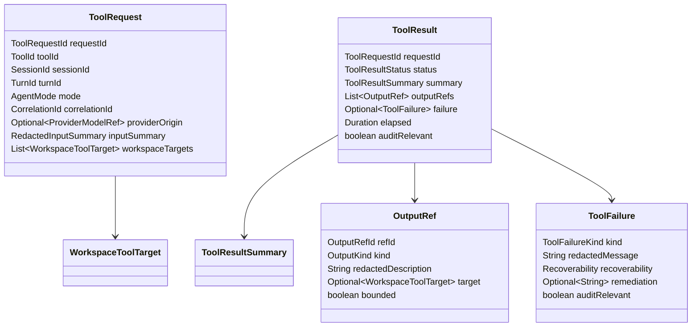
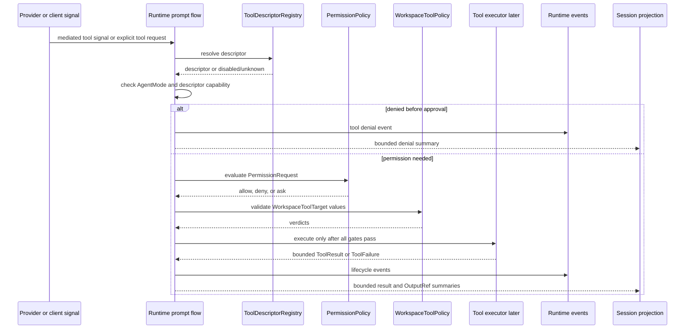

# Tool Permission Workspace Source Generation Contract

Source-generation handoff for the first planned Codegeist tool descriptor,
permission, and workspace policy contracts. This document is planned guidance only:
it does not create Java source, tests, packages, Spring beans, provider callbacks,
tool execution, permission approval, workspace policy code, shell execution,
patch/edit behavior, storage, or runtime behavior.

## Purpose And Status

`tool-permission-workspace-contracts.md` defines the broad blueprint for future
Codegeist tools, permissions, workspace validation, bounded results, and provider
tool-call mediation. This handoff narrows that blueprint into the first
source-generation slice a later Java implementation task can build with TDD.

The first source pass should create only the contract-level types needed to
classify tools, expose descriptors safely, construct tool requests, represent
permission requests and decisions, validate tool-scoped workspace targets, and
return bounded results. It should stop before concrete file tools, shell execution,
patch application, provider-internal tool execution, approval UI, storage, TUI,
server transport, Vaadin, PF4J, JBang, MCP execution, Graphify, Repomix, or an
end-to-end agent loop.

## Current Baseline

The implemented Java application is still intentionally small.

| Area | Current state |
| --- | --- |
| Module | One Maven module under `app/codegeist/cli` |
| Implemented package | `ai.codegeist.app` only |
| Entrypoint | `CodegeistApplication` starts Spring Boot |
| Runtime/session/event contracts | Planned in documentation; not Java source yet |
| Context/workspace loading contracts | Planned in documentation; not Java source yet |
| Provider adapter contracts | Planned in documentation; not Java source yet |
| Tool/permission/workspace source | Not implemented |
| Tests | Spring Boot context-load test only |

All package names, Java types, records, enums, ports, policy classes, and tests
below are planned source names. They are not current source files or implemented
behavior.

## First-Wave Boundary

The first tool/permission/workspace source slice should own contract-level types
for:

- Tool identity, display metadata, source classification, capability
  classification, mode compatibility, permission needs, workspace needs, result
  limits, and audit posture.
- A descriptor registry boundary that can classify built-in tools now and keep
  provider-signaled, MCP, PF4J, JBang, script, plugin, LSP, and subagent tools
  denied until explicitly registered and classified later.
- Tool request identity, redacted input summaries, provider-origin metadata,
  workspace targets, lifecycle statuses, typed failures, bounded result summaries,
  and output references.
- Permission request and decision records with decision value, scope, expiry,
  approval source, redacted reason, and audit metadata.
- Tool-scoped workspace target validation for read targets, write targets,
  command cwd values, output references, symlink escapes, generated or ignored
  posture, secret-like posture, and external-directory candidates.
- Integration contracts for runtime, session, event, and provider adapters without
  making tool policy own prompt execution, session persistence, event sequencing,
  provider invocation, context loading, patch/edit apply, or shell execution.

The first source pass should not implement executors. A descriptor can be
classifiable and a request can be denied, skipped, or represented as approval
required without any tool side effect existing yet.

## Planned Package Ownership

| Planned package | First-wave ownership | Must not own in the first source pass |
| --- | --- | --- |
| `ai.codegeist.tool` | Tool ids, descriptors, source and capability enums, descriptor registry port, tool requests, result statuses, bounded summaries, output refs, and typed tool failures. | Permission-policy decisions, path escape policy, provider invocation, file mutation, shell processes, patch application, storage adapters. |
| `ai.codegeist.permission` | Permission requests, decisions, decision values, scopes, expiry, approval source metadata, redacted reason, audit flags, and a policy port. | Approval UI, CLI/TUI rendering, persistent caches, workspace validation, tool execution, runtime event sequencing. |
| `ai.codegeist.workspace` | Tool-scoped targets, target kinds, validation purposes, verdicts, and a policy port that reuses the planned workspace identity/path boundary. | Context profile selection, file reads/writes, permission approval, external-directory trust, shell/process execution. |
| `ai.codegeist.runtime` | Later coordinates descriptor lookup, mode checks, permission evaluation, workspace validation, tool lifecycle events, and session summaries. | Descriptor storage, UI approval collection, provider SDK payloads, concrete executor internals. |
| `ai.codegeist.session` and `ai.codegeist.event` | Later carry bounded tool and permission lifecycle summaries created by runtime. | Tool policy, permission policy, workspace validation, output-ref storage implementation. |
| `ai.codegeist.provider` and `ai.codegeist.provider.springai` | Later emit or consume mediated tool-call signals and keep Spring AI tool execution disabled until Codegeist gates run. | Tool trust, permission decisions, workspace validation, provider-internal tool execution. |

`ai.codegeist.cli`, `ai.codegeist.tui`, `ai.codegeist.context`,
`ai.codegeist.patch`, `ai.codegeist.shell`, `ai.codegeist.storage`,
`ai.codegeist.server`, `ai.codegeist.ui.vaadin`, `ai.codegeist.extension`, Spring
Shell, Spring AI public types, provider SDK payloads, Agent Utils, MCP, PF4J,
JBang, Graphify, and Repomix remain outside this first source slice.

## Planned Descriptor Contracts

Descriptors classify what a tool is before runtime can expose it to a model, a
client, or a future extension boundary.

| Planned shape | Package | First role |
| --- | --- | --- |
| `ToolId` | `ai.codegeist.tool` | Stable descriptor and request identity used by runtime, events, permissions, and provider mediation. |
| `ToolDescriptor` | `ai.codegeist.tool` | Display name, source, capability, supported modes, permission need, workspace need, input redaction, result limit, audit policy, and enabled flag. |
| `ToolSource` | `ai.codegeist.tool` | First values such as `BUILT_IN`, `SPRING_AI_SIGNAL`, `MCP`, `PF4J`, `JBANG`, `SCRIPT`, `PLUGIN`, `LSP`, and `SUBAGENT`. |
| `ToolCapability` | `ai.codegeist.tool` | `READ_WORKSPACE`, `MUTATE_WORKSPACE`, `PATCH_EDIT`, `SHELL_PROCESS`, `NETWORK`, `PROVIDER_MEDIATED`, `PLUGIN`, `SCRIPT`, `LSP_CODE_INTELLIGENCE`, and `SUBAGENT`. |
| `PermissionNeed` | `ai.codegeist.tool` | `NEVER`, `ASK`, `ALWAYS_REQUIRED`, and `DENIED_UNTIL_CLASSIFIED`. |
| `WorkspaceNeed` | `ai.codegeist.tool` | `NONE`, `READ_TARGET`, `WRITE_TARGET`, `COMMAND_CWD`, `OUTPUT_REF`, and `EXTERNAL_DIRECTORY_CANDIDATE`. |
| `ToolDescriptorRegistry` | `ai.codegeist.tool` | Port for resolving enabled descriptors and classifying exposure without executing tools. |

Descriptor rules:

- Capability classification is required before a tool can be model-facing.
- Plan mode starts read-only. Build mode may request side effects only through
  descriptor, mode, permission, workspace, and result-limit gates.
- Provider-signaled, MCP, PF4J, JBang, script, plugin, LSP, and subagent tools are
  denied until registered, classified, and explicitly exposed by Codegeist policy.
- Descriptor limits remain enforceable after permission approval; approval does
  not upgrade capability, bypass result limits, or make disabled descriptors
  executable.

## Planned Request And Result Contracts

The request/result layer should be useful before concrete executors exist. It
lets runtime prove gate order, typed denial, and bounded summaries without side
effects.



Initial `ToolResultStatus` values should include:

| Status | First-wave meaning |
| --- | --- |
| `DENIED_BY_MODE` | Active mode forbids the requested capability before permission. |
| `DENIED_BY_PERMISSION` | Policy or a user/client decision denied execution. |
| `DENIED_BY_WORKSPACE` | Workspace validation denied at least one required target. |
| `SKIPPED_DISABLED` | Tool calling, the descriptor, or the source is disabled. |
| `APPROVAL_REQUIRED` | The request is valid but awaits an approval decision. |
| `STARTED` | Execution began after all gates passed; mostly reserved until executors exist. |
| `COMPLETED` | Execution completed with a bounded summary. |
| `FAILED` | Execution failed with a typed failure. |
| `CANCELLED` | Runtime or user cancellation stopped the request. |

Initial `ToolFailureKind` values should distinguish at least invalid descriptor,
mode denied, permission denied, workspace denied, disabled source, unsupported
capability, input invalid, output overflow, provider mediation unavailable,
executor unavailable, cancelled, and unexpected failure. Messages must be
redacted and should never include full file contents, full patches, stdout/stderr
logs, provider payloads, credentials, or secret values.

## Planned Permission Contracts

Permission records should model the policy question separately from UI collection
and storage.

| Planned shape | Package | First role |
| --- | --- | --- |
| `PermissionRequestId` | `ai.codegeist.permission` | Stable approval request identity. |
| `PermissionRequest` | `ai.codegeist.permission` | Session, turn, tool request, tool id, capability, requested action, requested scope, redacted summary, targets, request time, and audit flag. |
| `PermissionDecisionId` | `ai.codegeist.permission` | Stable decision identity for events and summaries. |
| `PermissionDecision` | `ai.codegeist.permission` | Decision value, granted scope, source client, deciding actor, decision time, optional expiry, redacted reason, and audit flag. |
| `PermissionDecisionValue` | `ai.codegeist.permission` | `ALLOW`, `DENY`, `ASK`, and `CORRECT_AND_RETRY` when later clients can revise requests. |
| `PermissionScope` | `ai.codegeist.permission` | `ONE_REQUEST`, `ONE_TURN`, `ONE_SESSION`, `WORKSPACE_TARGET`, and `DESCRIPTOR_DEFAULT`. |
| `PermissionPolicy` | `ai.codegeist.permission` | Port that evaluates deterministic rules and returns allow/deny/ask without owning UI. |

Permission rules:

- Mode checks happen before permission prompts.
- Permission approval cannot override mode denial, deterministic workspace denial,
  secret-like path posture, ignored/generated posture, symlink escapes,
  outside-root denials, disabled descriptors, or descriptor capability limits.
- `ONE_REQUEST` is the safest first-wave default for side-effecting tools.
- Broader scopes require explicit expiry semantics and audit metadata before use.
- Approval payloads use redacted summaries and bounded target metadata.
- Persistent permission caches are deferred; the first source slice may model
  scopes without implementing storage.

## Planned Workspace Tool Target Contracts

Tool-scoped workspace validation reuses the planned workspace identity and path
classification boundary from `context-workspace-loading-source-generation-contract.md`
and adds target purpose. It is not a second context loader.

| Planned shape | Package | First role |
| --- | --- | --- |
| `WorkspaceToolTarget` | `ai.codegeist.workspace` | Workspace ref, target kind, requested path/ref, optional normalized path, validation purpose, and external-directory candidate flag. |
| `WorkspaceToolTargetKind` | `ai.codegeist.workspace` | `READ_FILE`, `WRITE_FILE`, `PATCH_TARGET`, `COMMAND_CWD`, `OUTPUT_REF`, and `EXTERNAL_DIRECTORY`. |
| `WorkspaceValidationPurpose` | `ai.codegeist.workspace` | Purpose enum for `TOOL_READ`, `TOOL_WRITE`, `PATCH_APPLY`, `SHELL_CWD`, `OUTPUT_REFERENCE`, and `EXTERNAL_DIRECTORY_APPROVAL`. |
| `WorkspaceToolVerdict` | `ai.codegeist.workspace` | Target, verdict code, redacted summary, execution blocker flag, and audit flag. |
| `WorkspaceToolPolicy` | `ai.codegeist.workspace` | Port that validates explicit tool targets before execution or output-reference use. |

Initial verdicts should include `ALLOWED`, `MISSING_OPTIONAL`, `OUTSIDE_ROOT`,
`SYMLINK_ESCAPE`, `GENERATED`, `IGNORED`, `SECRET_LIKE`, `UNSUPPORTED_TARGET`,
and `EXTERNAL_DIRECTORY_REQUIRES_PERMISSION`.

Workspace rules:

- Runtime validates all tool paths, command working directories, patch targets,
  and output-reference targets through one workspace policy boundary before side
  effects.
- Read-only requests can proceed only for allowed read targets and still respect
  secret-like, ignored, generated, outside-root, and symlink rules.
- Write, patch, shell, plugin, and script requests require permission approval and
  workspace validation before mutation or process start.
- External-directory access is explicit and permission-gated, but approval cannot
  turn an unsupported or secret-like target into allowed input.
- Generated, ignored, and heavy artifacts are denied or skipped by default unless a
  later explicit policy creates a narrow exception.

## Runtime, Session, And Event Integration

Runtime owns gate ordering, event sequencing, and session summaries. Tool,
permission, and workspace packages provide policy records and verdicts only.



Initial event families for later runtime expansion should map to the finalized
runtime/session/event source contract without making tool policy publish events
directly: `TOOL_REQUESTED`, `TOOL_DENIED_BY_MODE`, `PERMISSION_REQUESTED`,
`PERMISSION_DECIDED`, `TOOL_DENIED_BY_PERMISSION`, `TOOL_DENIED_BY_WORKSPACE`,
`TOOL_STARTED`, `TOOL_PROGRESS`, `TOOL_COMPLETED`, `TOOL_FAILED`, and
`TOOL_OUTPUT_TRUNCATED`.

Session message parts should store bounded `TOOL_CALL`, `APPROVAL_REFERENCE`,
`TOOL_RESULT`, `WARNING`, and `ERROR` summaries. They should not store raw tool
input, raw provider payloads, unbounded output, full file contents, full patch
contents, stack traces, credentials, or secret values.

## Provider And Spring AI Mediation

Spring AI and provider SDK details stay adapter-private. Provider capability to
call tools is only an input to Codegeist policy, not permission to execute tools.

Rules for later provider integration:

- Keep Spring AI internal tool execution disabled until Codegeist can mediate tool
  calls through descriptor, mode, permission, workspace, and bounded-result gates.
- If a provider emits a tool-call signal before mediation exists, return a typed
  disabled-tool-calling result such as `TOOL_CALLING_DISABLED` from the provider
  boundary.
- When mediation exists, map provider-native tool payloads into Codegeist
  `ToolRequest` and `RedactedInputSummary` values before runtime policy runs.
- Tool results sent back to a provider should use bounded summaries and structured
  metadata, not raw workspace contents, command output, provider SDK objects, or
  approval UI payloads.
- `ToolCallback`, MCP tool definitions, PF4J tools, JBang scripts, and Agent Utils
  utilities are adapter or executor implementation details; they must not appear in
  runtime, session, event, permission, or workspace contracts.

## Boundary Rules

- Do not create Java source, Java tests, package directories, Maven changes,
  Taskfile commands, Spring beans, provider callbacks, tool callbacks, tool
  execution, permission approval, workspace validation code, shell execution,
  patch/edit behavior, storage adapters, TUI behavior, server routes, Vaadin,
  PF4J, JBang, MCP execution, Graphify, Repomix, or native/build behavior in this
  documentation slice.
- Do not let descriptor or permission contracts own provider configuration,
  provider invocation, runtime prompt execution, session lifecycle, event
  sequencing, CLI parsing, context manifest construction, storage persistence,
  patch/edit semantics, shell/process execution, UI rendering, or extension trust.
- Do not expose Spring Shell, Spring AI, Agent Utils, provider SDK, OpenCode, MCP,
  PF4J, JBang, shell, patch, process, terminal, filesystem, storage, Vaadin, or HTTP
  implementation types through Codegeist contracts.
- Do not copy OpenCode's TypeScript, Bun, Effect, tool registry implementation,
  permission rule implementation, external-directory prompts, MCP runtime,
  truncation implementation, event bus, or storage shape. Use OpenCode only as a
  behavior reference.

## Future File Map

These are illustrative implementation targets only and should not be created until
a later Java task requires them.

```text
app/codegeist/cli/src/main/java/ai/codegeist/tool/ToolId.java
app/codegeist/cli/src/main/java/ai/codegeist/tool/ToolDescriptor.java
app/codegeist/cli/src/main/java/ai/codegeist/tool/ToolDescriptorRegistry.java
app/codegeist/cli/src/main/java/ai/codegeist/tool/ToolCapability.java
app/codegeist/cli/src/main/java/ai/codegeist/tool/ToolSource.java
app/codegeist/cli/src/main/java/ai/codegeist/tool/PermissionNeed.java
app/codegeist/cli/src/main/java/ai/codegeist/tool/WorkspaceNeed.java
app/codegeist/cli/src/main/java/ai/codegeist/tool/ToolRequest.java
app/codegeist/cli/src/main/java/ai/codegeist/tool/ToolResult.java
app/codegeist/cli/src/main/java/ai/codegeist/tool/ToolResultStatus.java
app/codegeist/cli/src/main/java/ai/codegeist/tool/ToolFailure.java
app/codegeist/cli/src/main/java/ai/codegeist/tool/OutputRef.java
app/codegeist/cli/src/main/java/ai/codegeist/permission/PermissionRequest.java
app/codegeist/cli/src/main/java/ai/codegeist/permission/PermissionDecision.java
app/codegeist/cli/src/main/java/ai/codegeist/permission/PermissionPolicy.java
app/codegeist/cli/src/main/java/ai/codegeist/permission/PermissionScope.java
app/codegeist/cli/src/main/java/ai/codegeist/workspace/WorkspaceToolTarget.java
app/codegeist/cli/src/main/java/ai/codegeist/workspace/WorkspaceToolPolicy.java
app/codegeist/cli/src/main/java/ai/codegeist/workspace/WorkspaceToolVerdict.java
app/codegeist/cli/src/test/java/ai/codegeist/tool/ToolDescriptorContractTests.java
app/codegeist/cli/src/test/java/ai/codegeist/tool/ToolRequestPolicyFlowTests.java
app/codegeist/cli/src/test/java/ai/codegeist/permission/PermissionPolicyContractTests.java
app/codegeist/cli/src/test/java/ai/codegeist/workspace/WorkspaceToolPolicyContractTests.java
app/codegeist/cli/src/test/java/ai/codegeist/provider/ProviderToolMediationContractTests.java
```

## Illustrative Java Sketches

These snippets are examples only. They are not implemented source.

```java
record ToolDescriptor(
    ToolId toolId,
    String displayName,
    ToolSource source,
    ToolCapability capability,
    Set<AgentMode> supportedModes,
    PermissionNeed permissionNeed,
    WorkspaceNeed workspaceNeed,
    InputRedactionPolicy inputRedaction,
    ResultSummaryPolicy resultSummary,
    EventAuditPolicy auditPolicy,
    boolean enabled
) {}

interface ToolDescriptorRegistry {
    Optional<ToolDescriptor> findEnabled(ToolId toolId);
}
```

```java
record ToolRequest(
    ToolRequestId requestId,
    ToolId toolId,
    SessionId sessionId,
    TurnId turnId,
    AgentMode mode,
    CorrelationId correlationId,
    Optional<ProviderModelRef> providerOrigin,
    RedactedInputSummary inputSummary,
    List<WorkspaceToolTarget> workspaceTargets
) {}

record ToolResult(
    ToolRequestId requestId,
    ToolResultStatus status,
    ToolResultSummary summary,
    List<OutputRef> outputRefs,
    Optional<ToolFailure> failure,
    Duration elapsed,
    boolean auditRelevant
) {}
```

```java
interface PermissionPolicy {
    PermissionDecision decide(PermissionRequest request);
}

record PermissionDecision(
    PermissionDecisionId decisionId,
    PermissionRequestId requestId,
    PermissionDecisionValue value,
    PermissionScope grantedScope,
    SourceClient sourceClient,
    Optional<String> decidingActor,
    Instant decidedAt,
    Optional<Instant> expiresAt,
    String redactedReason,
    boolean auditRelevant
) {}
```

```java
interface WorkspaceToolPolicy {
    List<WorkspaceToolVerdict> validateTargets(
        WorkspaceRef workspaceRef,
        List<WorkspaceToolTarget> targets
    );
}
```

The exact Java constructor validation, package-private helpers, and whether a
later runtime service returns `ToolResult` directly or wraps it in a larger prompt
step result belong to the later implementation task.

## TDD Handoff

No tests are created by this documentation task. Later implementation tasks should
prefer deterministic plain-JVM contract tests before Spring context tests or real
tool execution.

| Test area | What to prove | Runtime side effects needed |
| --- | --- | --- |
| Descriptor classification | Built-in, provider-mediated, MCP, PF4J, JBang, script, plugin, shell, patch/edit, network, LSP, subagent, and read-only descriptors classify source and capability. | No |
| Mode denial | Plan mode denies mutating, shell, network, plugin, script, subagent, and apply-style capabilities before permission prompts. | No |
| Permission decision | Build-mode side-effect requests produce `ASK` or approval-required outcomes with redacted summaries and safest default scope. | No |
| Approval not override | Permission approval cannot override mode denial, workspace denial, secret-like posture, ignored/generated posture, disabled descriptors, or result limits. | No |
| Workspace target validation | Outside-root, symlink escape, generated, ignored, secret-like, missing optional, external-directory, and unsupported targets map to typed verdicts. | No |
| Bounded result | Large file, shell, patch, provider, or plugin output becomes a summary plus `OutputRef` rather than session-ready raw content. | No |
| Provider mediation disabled | Spring AI internal tool execution remains disabled or returns typed disabled-tool-calling output until Codegeist mediation exists. | No live provider |
| Spring AI type isolation | Runtime, session, event, permission, and workspace contracts expose Codegeist types only, not `ToolCallback` or provider SDK types. | No |
| Event/session projection | Tool and permission lifecycle outcomes can be represented as bounded event/session summaries without policy publishing events directly. | No |

Targeted verification for the later Java implementation should use class-level or
method-level Maven selectors, then broaden to `task test` only after the narrow
contract tests pass. Startup-heavy, live provider, shell/process, native, and
filesystem-heavy checks should remain explicit and separate.

## Deferrals

- `T003_10` owns patch/edit proposal and apply-result source-generation details.
- `T003_11` owns controlled shell request/result, safety classification, process
  executor handoff, timeout, cancellation, environment, stdin, and bounded
  stdout/stderr details.
- `T003_12` owns storage ports, session continuation, projection storage, artifact
  references, storage health, redaction, and persistence deferral criteria.
- `T003_13` owns end-to-end prompt orchestration with providers, tools,
  permissions, workspace gates, and session/event projection.
- Later CLI/TUI parity, packaging/native, PF4J, JBang, Vaadin, server, API, MCP,
  Graphify, Repomix, and extension tasks must attach through these policy
  boundaries instead of bypassing them.

## Later Implementation Checklist

Before a future Java source task marks the first tool/permission/workspace slice
solved, it should prove:

- Descriptor, permission, workspace, request/result, failure, and output-reference
  contracts exist only in their planned packages.
- Runtime-facing contracts use Codegeist records, enums, sealed interfaces, and
  small ports, not Spring AI, provider SDK, OpenCode, MCP, PF4J, JBang, shell,
  patch, process, terminal, or filesystem implementation types.
- Mode denial, permission decision, workspace denial, disabled descriptors, and
  bounded-result behavior are covered by focused tests.
- Spring AI tool execution remains disabled or externally mediated until runtime
  can construct and gate Codegeist `ToolRequest` values.
- No concrete file read, file write, patch apply, shell execution, provider call,
  approval UI, storage adapter, plugin/script execution, or end-to-end agent loop
  slips into the first contract slice.
