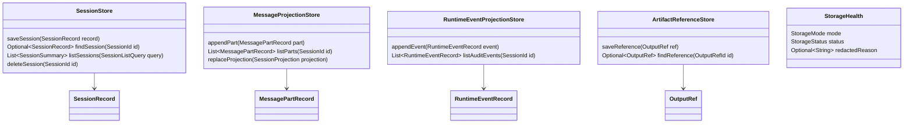
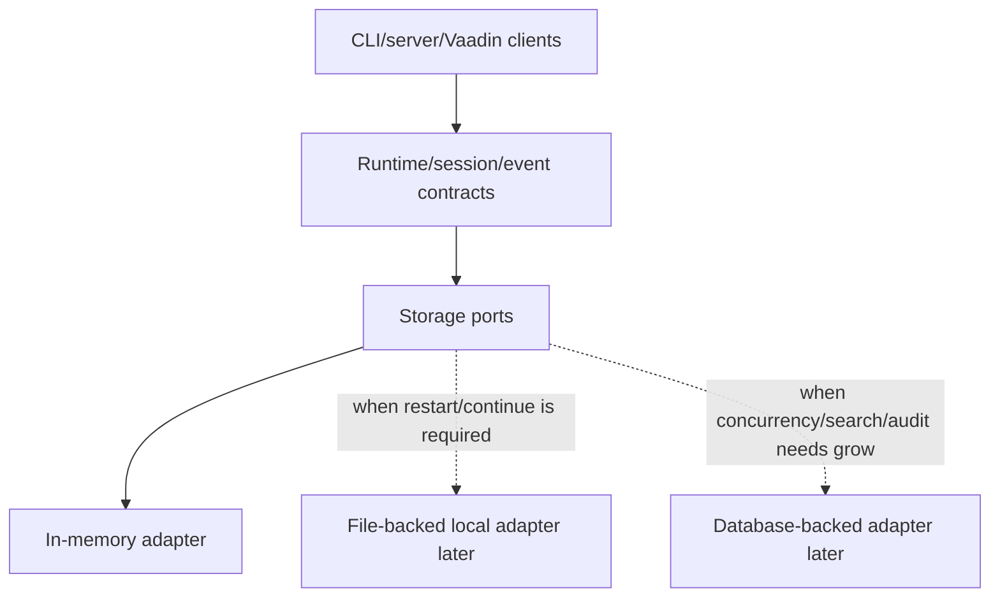
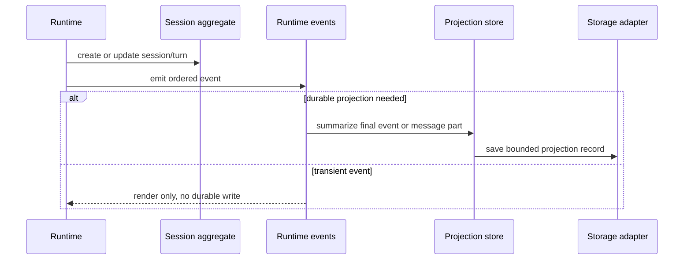

# Storage Port Posture

Blueprint for future Codegeist storage ports, in-memory-first session projections,
redaction boundaries, and later replaceable persistence adapters.

## Scope

This document specifies planned contracts only. It does not describe implemented
Java source, Spring beans, package directories, tests, storage ports, storage
adapters, database schemas, migrations, encryption, durable audit logs, sharing,
compaction, event replay, or runtime behavior.

The first Codegeist storage posture is explicit: start with in-memory session and
projection storage behind ports. Add file-backed storage only when a concrete CLI
restart/continue/list workflow needs persistence across process restarts.

## Decision

Use in-memory storage first for the MVP foundation.

Reasons:

- The current application has no prompt execution loop, session continuation
  command, provider call, tool execution, or runtime service yet.
- `docs/developer/runtime-session-event-contracts.md` already keeps sessions,
  turns, message parts, and runtime events persistence-ready without requiring a
  database or event store.
- File-backed storage should prove a narrow user-visible continuation need before
  it introduces serialization, redaction, retention, concurrency, and migration
  concerns.
- Event sourcing remains optional. Runtime events are event-sourcing-friendly, but
  they are not the source of truth by default.

This decision does not block later local file storage. It requires the first Java
implementation to define replaceable ports so an in-memory adapter can be swapped
for a file-backed adapter without changing runtime, session, event, provider,
tool, permission, workspace, or client contracts.

## Evidence

### OpenCode Feature Evidence

OpenCode is a behavior reference, not an implementation blueprint.

| Source | Relevant lesson for Codegeist |
| --- | --- |
| `docs/third-party/opencode/source/packages/opencode/src/storage/storage.ts` | OpenCode has a JSON-like key-value storage service with `read`, `write`, `update`, `remove`, `list`, migrations, locks, and filesystem-backed data under a global data path. Codegeist should learn the port shape and migration risk, not copy the storage layout. |
| `docs/third-party/opencode/source/packages/opencode/src/session/session.sql.ts` | OpenCode persists sessions, messages, parts, session messages, todos, permissions, summaries, and timestamps through Drizzle/SQLite tables. Codegeist should keep these as later adapter concerns, not core runtime contracts. |
| `docs/third-party/opencode/source/packages/opencode/src/session/session.ts` | OpenCode session services create, list, fork, update, archive, delete, summarize, and query session data through storage and sync services. Codegeist should keep runtime/session behavior above storage ports so persistence does not own orchestration. |
| `docs/third-party/opencode/source/packages/opencode/src/session/projectors-next.ts` | OpenCode projects final session events into stored session messages and skips selected streaming deltas. Codegeist should separate durable projections from transient events and avoid persisting high-volume deltas by default. |
| `docs/third-party/opencode/source/packages/opencode/src/session/schema.ts` | Stable typed ids exist independently of persistence. Codegeist should keep `SessionId`, `TurnId`, `PartId`, and `EventId` stable before choosing a storage adapter. |

## Ownership Rules

- Runtime owns orchestration, session state transitions, event sequencing, and
  approval/tool/provider/workspace interactions.
- Session owns the aggregate shape and continuation identity.
- Event contracts own observation shape, visibility, audit relevance, and
  projection hints.
- Storage ports persist and retrieve projections or records; they do not decide
  runtime behavior.
- Storage adapters own encoding, file paths, database tables, migrations,
  concurrency, retention mechanics, and adapter-specific failures.
- Credentials and secrets do not use ordinary session or tool-output storage.

## Minimal Port Set



Initial ports should be small and behavior-driven:

| Port | First reason to exist | First adapter |
| --- | --- | --- |
| `SessionStore` | Create, continue, list, and delete session records when runtime behavior exists. | In-memory map. |
| `MessageProjectionStore` | Keep user-visible turn/message summaries separate from transient events. | In-memory ordered list. |
| `RuntimeEventProjectionStore` | Retain audit-relevant summaries only when a later task needs them. | Optional in-memory list. |
| `ArtifactReferenceStore` | Track bounded output references from shell, patch/edit, tool, or provider tasks. | In-memory metadata only until artifacts exist. |
| `StorageHealth` | Report whether persistence is in-memory, skipped, file-backed, or failed. | In-memory status value. |

Do not create these Java ports until a later implementation task needs runtime
behavior. This document is the handoff for that task.

## Persistence Categories

| Category | Initial posture | Later posture |
| --- | --- | --- |
| Sessions and turns | In-memory records with stable ids and summaries. | File-backed or database-backed projections when restart/continue/list is required. |
| Message parts | Bounded summaries and ordered projection data. | Durable timeline projection with compaction and deletion policy. |
| Runtime events | Transient by default; retain only selected audit-relevant summaries if needed. | Optional audit/event log with retention and replay policy. |
| Tool and shell outputs | Summary plus `OutputRef`; no full stdout/stderr in ordinary session records. | Artifact store with retention, redaction, and deletion policy. |
| Patch/edit artifacts | Proposal and apply summaries plus output refs. | File-backed proposal snapshots only after apply contracts exist. |
| Permission decisions | Runtime decision references; no broad persistent approval cache initially. | Explicit cache/revocation/audit storage after permission policy is implemented. |
| Provider telemetry | Optional redacted ids, token/cost summaries, and typed errors. | Provider diagnostics store after provider behavior exists. |
| Credentials and secrets | Out of scope for ordinary storage. | Dedicated secret integration or OS-backed secure store. |

## Adapter Evolution



Adapter rules:

- Runtime calls ports, not file paths, JSON codecs, SQL tables, or migration APIs.
- In-memory storage is the first safe adapter for contract tests and prompt-flow
  smoke behavior.
- File-backed storage may be introduced only with explicit restart/continue/list
  acceptance criteria.
- Database-backed storage is deferred until server/Vaadin concurrency, search,
  sharing, durable audit retention, or multi-workspace behavior requires it.
- Event sourcing can be added later as an adapter strategy or separate event log;
  it is not the default source-of-truth model.

## Redaction And Retention

Storage is a high-risk boundary because it turns transient runtime data into
durable state. The first implementation should make redaction explicit even when
the adapter is in-memory.

Rules:

- Store summaries and typed references rather than raw prompts, provider payloads,
  stdout, stderr, patch contents, full file contents, stack traces, or environment
  maps.
- Keep credentials, tokens, API keys, and local secret files outside ordinary
  session, event, tool, and artifact stores.
- Treat shell logs, patch diffs, provider responses, and generated artifacts as
  potentially sensitive or large by default.
- Record whether a value is user-visible, internal, audit-relevant, or redacted
  before it becomes durable.
- Define retention and deletion behavior before adding broad file-backed or
  database-backed persistence.

## Event And Projection Posture

`docs/developer/runtime-session-event-contracts.md` keeps events and message parts
separate. Storage should preserve that separation.



Projection rules:

- Final assistant text, tool result summaries, shell result summaries, permission
  references, and errors may become durable message parts.
- Streaming deltas and progress updates are transient by default.
- Audit-relevant events may be stored separately from user-visible message parts
  when a future audit requirement exists.
- Projection storage must be idempotent by typed ids to avoid duplicate timeline
  entries after retries or replay.

## Future File Map

These are illustrative implementation targets only and should not be created
until a later Java task requires them.

```text
app/codegeist/cli/src/main/java/ai/codegeist/storage/SessionStore.java
app/codegeist/cli/src/main/java/ai/codegeist/storage/MessageProjectionStore.java
app/codegeist/cli/src/main/java/ai/codegeist/storage/RuntimeEventProjectionStore.java
app/codegeist/cli/src/main/java/ai/codegeist/storage/ArtifactReferenceStore.java
app/codegeist/cli/src/main/java/ai/codegeist/storage/StorageHealth.java
app/codegeist/cli/src/main/java/ai/codegeist/storage/StorageMode.java
app/codegeist/cli/src/main/java/ai/codegeist/storage/InMemorySessionStore.java
app/codegeist/cli/src/main/java/ai/codegeist/storage/InMemoryProjectionStore.java
app/codegeist/cli/src/test/java/ai/codegeist/storage/InMemorySessionStoreTests.java
app/codegeist/cli/src/test/java/ai/codegeist/storage/StorageRedactionContractTests.java
app/codegeist/cli/src/test/java/ai/codegeist/storage/StoragePortSeparationTests.java
```

## Illustrative Java Sketches

These snippets are examples only. They are not implemented source.

```java
interface SessionStore {
    void save(SessionRecord record);
    Optional<SessionRecord> find(SessionId sessionId);
    List<SessionSummary> list(SessionListQuery query);
    void delete(SessionId sessionId);
}

record SessionRecord(
    SessionId sessionId,
    WorkspaceRef workspace,
    SessionStatus status,
    String title,
    Instant createdAt,
    Instant updatedAt
) {}
```

```java
interface MessageProjectionStore {
    void append(MessagePartRecord part);
    List<MessagePartRecord> list(SessionId sessionId);
}

record MessagePartRecord(
    PartId partId,
    SessionId sessionId,
    TurnId turnId,
    long sequence,
    MessagePartType type,
    RedactedSummary summary,
    List<OutputRef> outputRefs
) {}
```

```java
enum StorageMode {
    IN_MEMORY,
    FILE_BACKED,
    DATABASE_BACKED
}
```

The exact Java package structure, serialization shape, and adapter technology
belong to later implementation tasks.

## Future Test Handoff

No tests are created by this documentation task. Later implementation tasks should
start with deterministic in-memory tests.

| Test area | What to prove | Runtime side effects needed |
| --- | --- | --- |
| In-memory lifecycle | Create, find, list, update, and delete session records through ports. | No file or database I/O. |
| Port separation | Runtime-facing code depends on ports, not adapter classes or file paths. | No |
| Projection ordering | Message part records keep stable session/turn ordering and idempotent ids. | No |
| Event projection | Final events can become durable summaries while deltas stay transient. | No |
| Redaction boundary | Secrets, credentials, raw shell output, raw patch content, provider payloads, and environment values are rejected or summarized. | No |
| Artifact references | Large outputs become `OutputRef` metadata rather than ordinary session text. | No |
| File-backed continuation later | Restart/continue/list behavior survives process restart when file-backed storage is explicitly selected. | File fixture only in later task. |
| Event sourcing optionality | Session continuation works without requiring an event log or replay engine. | No |

## Later Implementation Rules

- Implement in-memory ports before file-backed or database-backed adapters.
- Add file-backed storage only with an explicit restart/continue/list acceptance
  criterion.
- Keep event sourcing optional and unimplemented until replay/sync requirements are
  real.
- Keep credentials and secrets out of ordinary storage.
- Store summaries and references for tool, shell, patch/edit, provider, and
  generated outputs.
- Define retention, deletion, and migration behavior before broad durable storage.
- Update `docs/developer/architecture.md` when storage packages or adapters become
  real application code.
