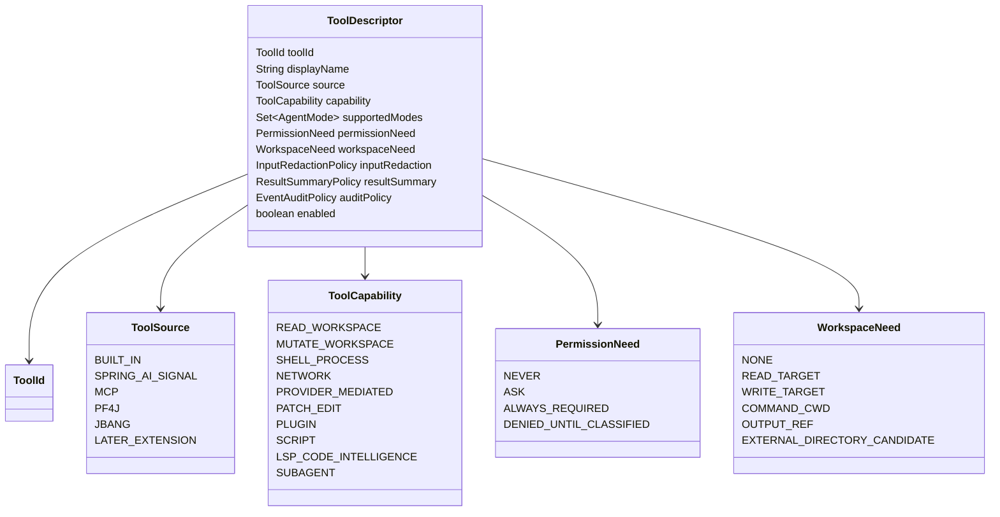
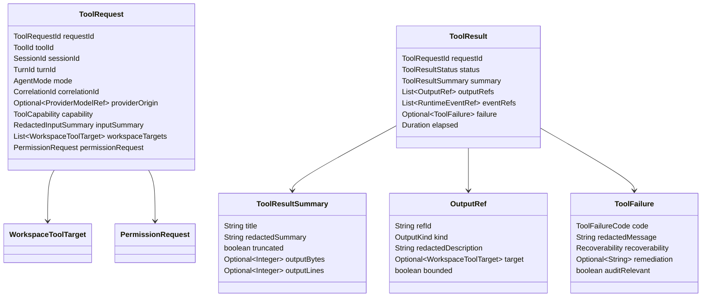
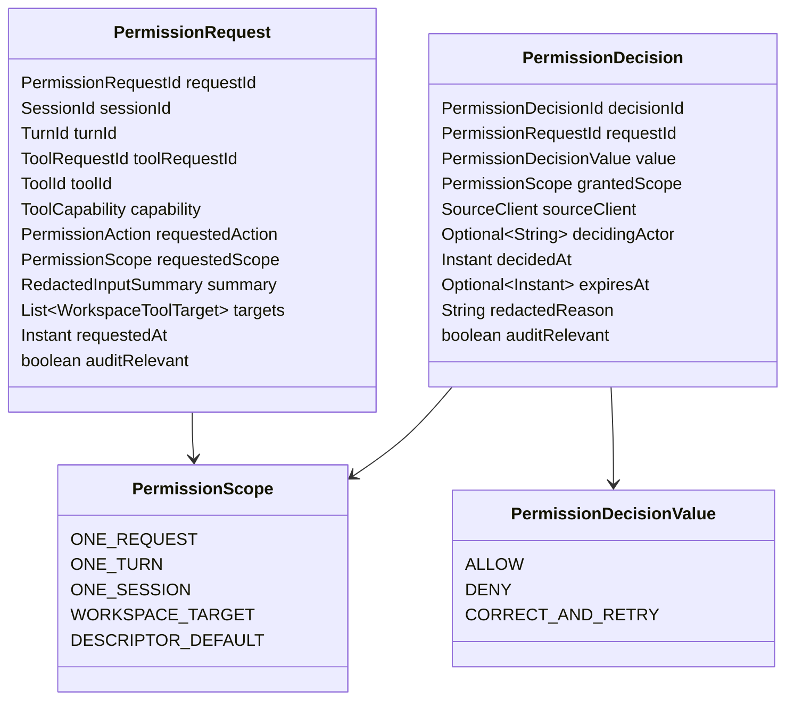
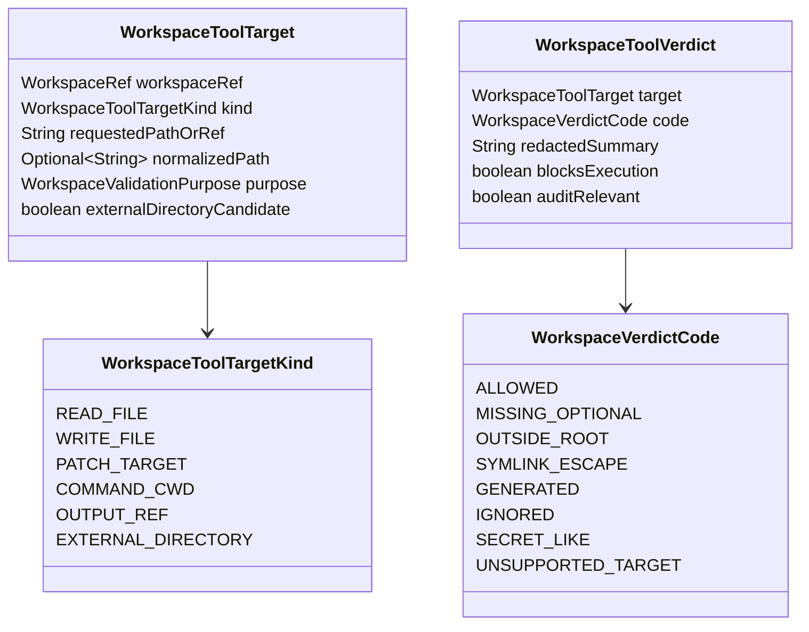
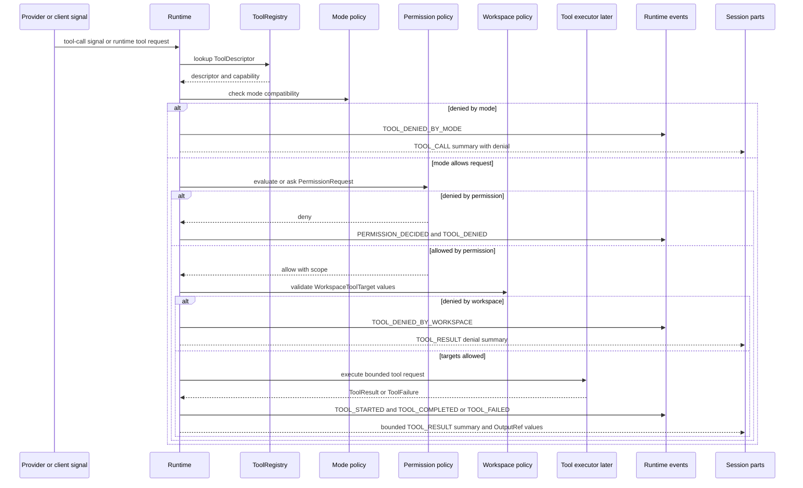
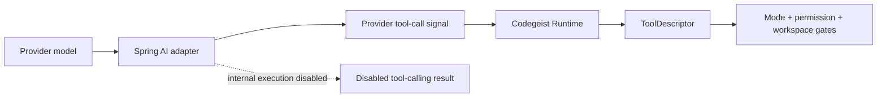
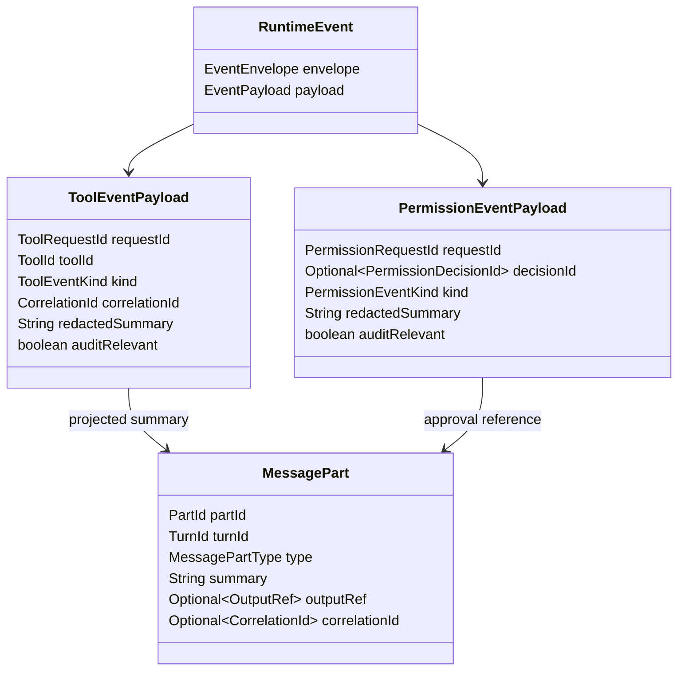

# Tool Permission Workspace Contracts

Blueprint for future Codegeist tool descriptors, permission decisions, workspace
validation, and bounded tool results.

## Scope

This document specifies planned contracts only. It does not describe implemented
Java source, Spring beans, provider callbacks, tool execution, permission UI,
workspace path-policy code, tests, storage, PF4J plugins, JBang scripts, shell
execution, or patch application.

The first implementation wave should use these contracts to keep tool-capable
work behind Codegeist-owned runtime policy:

- Tool descriptors declare capability, mode compatibility, permission needs,
  workspace needs, input redaction, result limits, and audit posture.
- Tool requests pass through mode checks, permission decisions, workspace
  validation, and bounded result handling before session state or events record an
  outcome.
- Spring AI tool calls, PF4J tools, and JBang scripts are adapter or extension
  inputs. They do not bypass Codegeist tool, permission, workspace, event, or
  session contracts.

## Evidence

### OpenCode Feature Evidence

OpenCode is a behavior reference, not an implementation blueprint.

| Source | Relevant lesson for Codegeist |
| --- | --- |
| `docs/third-party/opencode/source/packages/opencode/src/tool/tool.ts` | Tool definitions carry ids, parameter schemas, execution functions, session/message ids, call ids, permission ask hooks, metadata updates, and output truncation. Codegeist should split these concerns into descriptors, requests, permission decisions, result summaries, and runtime events. |
| `docs/third-party/opencode/source/packages/opencode/src/tool/registry.ts` | Built-in, plugin, dynamic file, task, read, shell, edit, write, patch, web, skill, and LSP tools are gathered through a registry and filtered before model exposure. Codegeist should keep one runtime-owned registry and classify contributed tools before exposure. |
| `docs/third-party/opencode/source/packages/opencode/src/permission/index.ts` | Permission requests include ids, session ids, permission names, patterns, metadata, always scopes, and optional tool call metadata; decisions can be once, always, or reject. Codegeist should model decision scope and audit metadata explicitly. |
| `docs/third-party/opencode/source/packages/opencode/src/permission/evaluate.ts` | Permission rules resolve `allow`, `deny`, or `ask` from wildcard rules, defaulting to ask. Codegeist should keep deterministic policy evaluation separate from UI collection. |
| `docs/third-party/opencode/source/packages/opencode/src/tool/external-directory.ts` | External directory access is checked separately from ordinary tool permissions and prompts with target metadata. Codegeist should keep workspace classification deterministic and make external-directory approval a permission layer above it. |
| `docs/third-party/opencode/source/packages/opencode/src/tool/read.ts` | File reads resolve paths, check external-directory posture, ask read permission, handle directories, binary files, offsets, limits, and truncation metadata. Codegeist should centralize path validation and represent bounded read results. |
| `docs/third-party/opencode/source/packages/opencode/src/tool/write.ts` | Writes create a diff, ask edit permission with path and diff metadata, then write and publish file events. Codegeist should keep patch/edit writes behind a later dedicated proposal/apply contract. |
| `docs/third-party/opencode/source/packages/opencode/src/tool/apply_patch.ts` | Patch application parses and verifies hunks, validates paths, asks edit permission with per-file metadata, applies changes, and summarizes touched files. Codegeist should require reviewable proposal and apply-result contracts before workspace mutation. |
| `docs/third-party/opencode/source/packages/opencode/src/tool/shell.ts` | Shell execution scans command paths, asks external-directory and shell permissions, controls cwd/env/stdin, streams output, enforces timeout, and records truncation metadata. Codegeist should model shell as a high-risk tool, not as a generic command string. |
| `docs/third-party/opencode/source/packages/opencode/src/tool/truncate.ts` | Tool output is capped by line/byte limits and can be stored out-of-band with an output path. Codegeist should store summaries and `OutputRef` values instead of unbounded output in sessions. |
| `docs/third-party/opencode/source/packages/opencode/src/v2/session-event.ts` | Tool input, called, progress, success, and failure events are distinct session event families with call ids and provider metadata. Codegeist should use typed event families for tool lifecycle and audit flow. |
| `docs/third-party/opencode/source/packages/opencode/src/v2/session-message.ts` | Assistant tool message parts carry tool id, name, optional provider metadata, tool state, content, structured output, and lifecycle times. Codegeist should record message-part summaries separately from transient runtime events. |
| `docs/third-party/opencode/source/packages/opencode/src/mcp/index.ts` | MCP exposes remote/server tools by listing definitions and converting them to model-facing dynamic tools. Codegeist should treat MCP as a later provider/extension input that still flows through descriptors and permission/workspace gates. |

### Spring AI Posture

`docs/developer/provider-configuration-contracts.md` records the provider-side
boundary. Spring AI `ToolCallback` and provider options such as
`internal-tool-execution-enabled` are adapter-side details. Codegeist runtime must
not register Spring AI callbacks that execute tools internally until these future
contracts are implemented and verified.

If a provider emits a tool-call signal, the adapter should either:

- convert it into a Codegeist `ToolRequest` for runtime mediation, or
- reject it with a typed disabled-tool-calling result when mediation is not
  available.

## Ownership Rules

- Runtime owns tool request sequencing, mode checks, correlation ids, events, and
  session result summaries.
- Tool registry owns descriptor registration and exposure decisions.
- Permission policy owns approval requirements, decisions, scopes, expiry, and
  audit metadata.
- Workspace policy owns deterministic path, cwd, output-ref, generated, ignored,
  secret-like, symlink, and outside-root classification.
- Tool executors own only the concrete side effect after all policy gates pass.
- Clients may collect approval input later, but they do not own permission policy.
- Provider adapters, PF4J plugins, JBang scripts, and MCP tools may contribute or
  signal tools later, but they do not define trust.

## Tool Descriptor Model



Descriptor rules:

- Descriptor ids are stable names used by runtime policy, provider mediation,
  events, and session summaries.
- Capability classification is required before a tool can be exposed to a model or
  user workflow.
- Plan mode starts with read-only tools only. Build mode may request side effects,
  but mode compatibility is checked before permission prompts.
- Plugin, JBang, MCP, and provider-signaled tools are denied until registered,
  classified, and explicitly exposed by runtime policy.
- Descriptor-declared limits remain enforceable even after a permission approval.

## Tool Request And Result Model



The future runtime should create a `ToolRequest` before a tool executor runs.
Provider tool-call payloads, CLI commands, plugin calls, and scripts all need to
be converted into this request shape or rejected.

Initial result statuses:

| Status | Meaning |
| --- | --- |
| `DENIED_BY_MODE` | The active mode forbids the requested capability. |
| `DENIED_BY_PERMISSION` | Permission policy or user decision denied the request. |
| `DENIED_BY_WORKSPACE` | Workspace validation denied at least one required target. |
| `SKIPPED_DISABLED` | Tool-calling or the descriptor is not enabled. |
| `STARTED` | Execution began after all gates passed. |
| `COMPLETED` | Execution completed and produced a bounded summary. |
| `FAILED` | Execution failed with a typed failure. |
| `CANCELLED` | Runtime or user cancellation stopped the request. |

## Permission Model



Policy rules:

- Mode checks happen before permission prompts.
- Approval cannot grant a capability denied by the active mode.
- Approval cannot override deterministic workspace denials, secret-like path
  posture, protected/ignored path posture, symlink escapes, outside-root denials,
  or descriptor capability limits.
- Denied permission decisions should become event-ready audit metadata.
- `ONE_REQUEST` is the safest default for side-effecting tools.
- Broader scopes such as `ONE_SESSION` or `WORKSPACE_TARGET` require explicit
  future implementation decisions and clear expiry semantics.
- Approval payloads must use redacted summaries and must not expose secrets,
  credentials, full file contents, or unbounded command output.

## Workspace Validation Model

`docs/developer/context-workspace-manifest.md` owns workspace identity and default
path classification. Tool-scoped validation reuses that boundary and adds purpose.



Workspace rules:

- Runtime validates all tool paths and command working directories through one
  workspace policy boundary before execution.
- Read-only tools can proceed only for `ALLOWED` read targets.
- Write, patch, and shell tools require permission approval and then workspace
  validation before mutation or process start.
- External-directory candidates are permission-gated but still explicit; default
  context loading must not silently read or write outside the workspace.
- Generated, ignored, and heavy artifacts are denied or skipped by default unless a
  later explicit policy creates a narrow exception.
- Secret-like paths are blocked before read and should only appear as redacted
  metadata.

## Runtime Tool Flow



This is a future contract. It does not imply that runtime, registry, permission,
workspace, executor, event, or session Java implementations exist now.

## Spring AI And Provider Tool Mediation



Provider rules:

- Spring AI internal tool execution should stay disabled until Codegeist can
  mediate tool calls.
- Provider/model capability metadata may say a model can call tools, but
  availability is still the intersection of provider capability, Codegeist
  descriptor, active mode, permission policy, and workspace policy.
- Provider-native tool payloads should be converted to redacted Codegeist request
  summaries. Provider SDK payloads must not become session state.
- Tool results sent back to a provider later should use bounded summaries and
  structured metadata, not raw workspace contents or unbounded command output.

## Event And Session Projection



Initial event families:

| Event family | Purpose |
| --- | --- |
| `TOOL_REQUESTED` | Runtime accepted a request for policy evaluation. |
| `TOOL_DENIED_BY_MODE` | Active mode blocked the capability before permission. |
| `PERMISSION_REQUESTED` | Permission policy requires a decision. |
| `PERMISSION_DECIDED` | A user, client, or policy decision was recorded. |
| `TOOL_DENIED_BY_PERMISSION` | Permission policy or decision denied execution. |
| `TOOL_DENIED_BY_WORKSPACE` | Workspace validation denied a target. |
| `TOOL_STARTED` | Execution began after gates passed. |
| `TOOL_PROGRESS` | Optional bounded progress summary. |
| `TOOL_COMPLETED` | Execution completed with a bounded result. |
| `TOOL_FAILED` | Execution failed with a typed failure. |
| `TOOL_OUTPUT_TRUNCATED` | Output exceeded summary limits and was referenced out-of-band. |

Session parts should store `TOOL_CALL`, `APPROVAL_REFERENCE`, `TOOL_RESULT`,
`WARNING`, and `ERROR` summaries. They should not store unbounded raw output,
full file contents, full patch contents, provider SDK payloads, stack traces, or
secret values.

## Initial Capability Matrix

| Capability | Plan default | Build default | Workspace gate | Permission gate | Notes |
| --- | --- | --- | --- | --- | --- |
| Read workspace file | Allow | Allow | Read target | Usually no, unless protected/external | Secret-like and ignored paths can still deny. |
| Read generated analysis artifact | Allow through explicit workflow | Allow through explicit workflow | Read target or output ref | Usually no | Keep Graphify/Repomix behind explicit repo workflows. |
| Patch/edit proposal | Allow to propose only | Allow to propose | Read/write targets later | Apply requires approval | Actual apply belongs to `T002_08`. |
| Apply patch/edit | Deny | Ask | Write targets | Required | Later task owns conflict and apply result details. |
| Shell/process | Deny | Ask | Command cwd and referenced paths | Required | `T002_09` owns concrete shell contract. |
| Network/fetch | Deny by default | Ask | Usually none, output refs later | Required | Provider calls are separate provider behavior. |
| Provider-mediated tool | Deny until mediated | Ask or allow by descriptor | Depends on tool | Depends on descriptor | Spring AI internal execution remains disabled. |
| PF4J tool | Deny until classified | Ask after classification | Depends on tool | Required unless read-only classified | Plugin trust is not implicit. |
| JBang script | Deny until classified | Ask after classification | Command cwd and script targets | Required | Script dependencies and remote loading are untrusted by default. |
| LSP/code intelligence | Read-only only | Read-only or ask | Workspace source roots | Depends on operation | Mutating refactors need patch/edit mediation. |
| Subagent/nested task | Deny by default | Ask or explicit later policy | Context/workspace scope | Required | Should create scoped child runtime context. |

## Future File Map

These are illustrative implementation targets only and should not be created until
a later Java task requires them.

```text
app/codegeist/cli/src/main/java/ai/codegeist/tool/ToolId.java
app/codegeist/cli/src/main/java/ai/codegeist/tool/ToolDescriptor.java
app/codegeist/cli/src/main/java/ai/codegeist/tool/ToolCapability.java
app/codegeist/cli/src/main/java/ai/codegeist/tool/ToolSource.java
app/codegeist/cli/src/main/java/ai/codegeist/tool/PermissionNeed.java
app/codegeist/cli/src/main/java/ai/codegeist/tool/WorkspaceNeed.java
app/codegeist/cli/src/main/java/ai/codegeist/tool/ToolRequest.java
app/codegeist/cli/src/main/java/ai/codegeist/tool/ToolResult.java
app/codegeist/cli/src/main/java/ai/codegeist/tool/ToolFailure.java
app/codegeist/cli/src/main/java/ai/codegeist/tool/ToolResultSummary.java
app/codegeist/cli/src/main/java/ai/codegeist/tool/OutputRef.java
app/codegeist/cli/src/main/java/ai/codegeist/permission/PermissionRequest.java
app/codegeist/cli/src/main/java/ai/codegeist/permission/PermissionDecision.java
app/codegeist/cli/src/main/java/ai/codegeist/permission/PermissionScope.java
app/codegeist/cli/src/main/java/ai/codegeist/permission/PermissionPolicy.java
app/codegeist/cli/src/main/java/ai/codegeist/workspace/WorkspaceToolTarget.java
app/codegeist/cli/src/main/java/ai/codegeist/workspace/WorkspaceToolVerdict.java
app/codegeist/cli/src/test/java/ai/codegeist/tool/ToolDescriptorContractTests.java
app/codegeist/cli/src/test/java/ai/codegeist/tool/ToolRequestFlowTests.java
app/codegeist/cli/src/test/java/ai/codegeist/permission/PermissionPolicyTests.java
app/codegeist/cli/src/test/java/ai/codegeist/workspace/WorkspaceToolTargetTests.java
```

## Illustrative Java Sketches

These snippets are examples only. They are not implemented source.

```java
record ToolDescriptor(
    ToolId toolId,
    String displayName,
    ToolSource source,
    ToolCapability capability,
    Set<AgentMode> supportedModes,
    PermissionNeed permissionNeed,
    WorkspaceNeed workspaceNeed,
    ResultSummaryPolicy resultSummaryPolicy,
    EventAuditPolicy auditPolicy,
    boolean enabled
) {}

enum ToolCapability {
    READ_WORKSPACE,
    MUTATE_WORKSPACE,
    SHELL_PROCESS,
    NETWORK,
    PROVIDER_MEDIATED,
    PATCH_EDIT,
    PLUGIN,
    SCRIPT,
    LSP_CODE_INTELLIGENCE,
    SUBAGENT
}
```

```java
record ToolRequest(
    ToolRequestId requestId,
    ToolId toolId,
    SessionId sessionId,
    TurnId turnId,
    AgentMode mode,
    CorrelationId correlationId,
    Optional<ProviderModelRef> providerOrigin,
    ToolCapability capability,
    RedactedInputSummary inputSummary,
    List<WorkspaceToolTarget> workspaceTargets
) {}

record ToolResult(
    ToolRequestId requestId,
    ToolResultStatus status,
    ToolResultSummary summary,
    List<OutputRef> outputRefs,
    Optional<ToolFailure> failure,
    Duration elapsed
) {}
```

```java
interface PermissionPolicy {
    PermissionDecision decide(PermissionRequest request);
}

record PermissionDecision(
    PermissionDecisionId decisionId,
    PermissionRequestId requestId,
    PermissionDecisionValue value,
    PermissionScope grantedScope,
    SourceClient sourceClient,
    Optional<String> decidingActor,
    Instant decidedAt,
    Optional<Instant> expiresAt,
    String redactedReason,
    boolean auditRelevant
) {}
```

The exact Java package structure and whether policies return values or publish
events directly belong to later implementation tasks.

## Future Test Handoff

No tests are created by this documentation task. Later implementation tasks should
prefer deterministic contract tests before any real tool execution.

| Test area | What to prove | Runtime side effects needed |
| --- | --- | --- |
| Descriptor classification | Built-in, provider-mediated, PF4J, JBang, shell, patch/edit, network, and read-only descriptors classify source and capability. | No |
| Mode denial | Plan mode denies mutating, shell, network, plugin, script, and subagent capabilities before permission prompts. | No |
| Permission required | Build mode side-effect tools produce approval-required decisions with redacted summaries. | No |
| Approval not override | Approval cannot override mode denial, workspace denial, secret-like paths, protected/ignored posture, or descriptor capability limits. | No |
| Workspace target validation | Outside-root, symlink escape, generated, ignored, secret-like, missing optional, and unsupported targets map to typed verdicts. | No |
| Provider tool-calling disabled | Spring AI internal tool execution stays disabled or externally mediated until Codegeist mediation exists. | No |
| Bounded results | Large stdout, file contents, patch contents, and provider payloads become summaries plus `OutputRef` values. | No |
| Event/session projection | Tool and permission lifecycle events can produce bounded session message parts. | No |
| Shell handoff | Shell requests require Build mode, permission, cwd validation, timeout, env policy, and output limits. | No process runner in this task |
| Patch/edit handoff | Patch apply requires proposal/apply-result contracts and workspace targets before mutation. | No file mutation in this task |

## Later Implementation Rules

- Implement descriptor and permission contracts before concrete side-effecting
  tools.
- Keep provider tool calls disabled or externally mediated until Codegeist can
  construct and gate `ToolRequest` values.
- Implement workspace target validation once and reuse it for file, patch, shell,
  plugin, and script tools.
- Prefer output references and summaries for large or sensitive tool results.
- Keep raw secrets, credentials, full provider payloads, full command output, and
  full file contents out of events, logs, task docs, and session message parts.
- Derive concrete Java implementation tasks from this blueprint only when the user
  explicitly reopens the area as implementation work.
