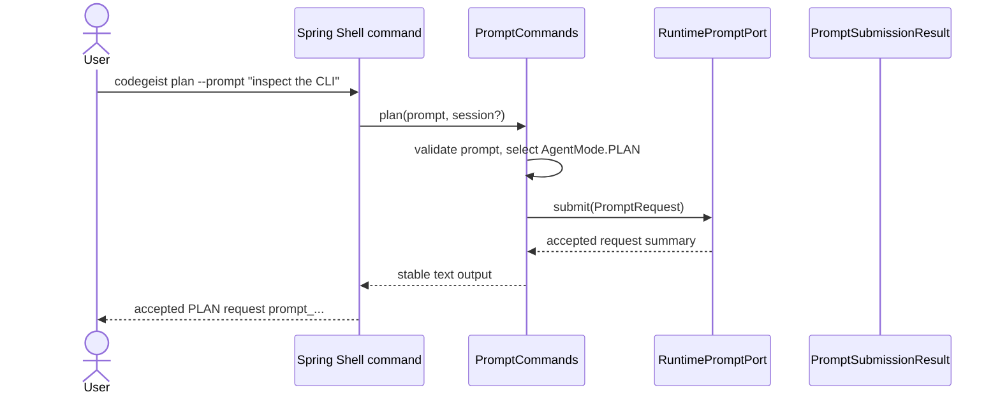

# T002_04 Wire CLI Prompt Mode Contract

Parent: `T002_implement-codegeist-mvp-foundation`

Sources: `T001_04`, `T001_05`, `T001_22`, `T001_23`

Status: finalized

## Goal

Describe the first Spring Shell command contract in enough implementation detail
that a later task can translate CLI input into a runtime prompt request with an
explicit agent mode without rediscovering the boundary.

## Context

The architecture makes Spring Shell the first client surface. CLI commands parse
input and render output, but runtime owns sessions, modes, provider calls, tools,
permissions, workspace policy, and events.

`T002_03` now provides a documentation blueprint for runtime/session/event
contracts rather than implemented Java contracts. This task must therefore stay in
the same documentation-first style. It may describe exact future Java records,
interfaces, Spring Shell adapters, and tests, but it must not create runtime or CLI
source files yet.

## OpenCode Reference Implementation Evidence

Use the local `/ask-project opencode ...` workflow from
`.oc_local/commands/ask-project.md`, backed by `docs/third-party/opencode/`, when
planning or solving this task. The current source checkout provides these relevant
reference points:

| OpenCode source | Relevant behavior | Codegeist translation |
| --- | --- | --- |
| `packages/opencode/src/cli/cmd/tui/thread.ts` | The TUI entry command parses CLI options such as `--prompt`, `--agent`, `--model`, `--continue`, `--session`, and `--fork`, then passes them as adapter arguments into the TUI runtime instead of owning session behavior. | Spring Shell commands should parse prompt text and explicit mode/agent intent, then delegate to a runtime boundary. |
| `packages/opencode/src/config/config.ts` | Configuration defines `default_agent`, deprecated `mode`, and current `agent` entries for `plan`, `build`, and other agents. | Codegeist should expose explicit `plan` and `build` modes first, and avoid hiding mode choice behind an implicit default command. |
| `packages/opencode/src/config/agent.ts` | Agent configuration normalizes `mode` values such as `primary`, `subagent`, and `all`, and can load legacy `mode/modes/*.md` files as primary agents. | Codegeist should not copy OpenCode's agent taxonomy, but it should keep `PLAN` and `BUILD` as runtime-owned behavior profiles rather than CLI-only labels. |
| `packages/opencode/src/agent/agent.ts` | Built-in `build` and `plan` agents are primary agents. `plan` denies edit tools while `build` permits tool use through permissions; `defaultAgent()` rejects subagents and hidden agents. | Mode wiring should leave permission differences to later runtime/permission tasks while preserving the visible distinction between Plan and Build. |
| `packages/opencode/src/server/routes/instance/httpapi/groups/session.ts` | `PromptPayload`, `CommandPayload`, and session paths separate prompt, async prompt, command, and shell API contracts. | Codegeist CLI should keep prompt-mode submission separate from future shell, command-template, and async/server contracts. |
| `packages/opencode/src/server/routes/instance/httpapi/handlers/session.ts` | Prompt handlers pass payload plus `sessionID` into `SessionPrompt.prompt`; command handlers delegate to `SessionPrompt.command`. | Spring Shell should stay an adapter that builds input and calls a runtime/service boundary, not the owner of prompt execution. |
| `packages/opencode/src/session/prompt.ts` | `PromptInput` includes `sessionID`, optional `messageID`, optional `model`, optional `agent`, `noReply`, format/system/variant, and typed parts. `CommandInput` resolves command templates, agent/model choice, and then calls `prompt`. | The first Codegeist `PromptRequest` can be smaller: prompt text, explicit `AgentMode`, optional session id, and source metadata. Command-template behavior should remain out of this slice. |

OpenCode also shows what not to copy: Bun worker setup, Effect layers, HTTP API
schemas, generated SDK shape, command-template expansion, subagent execution,
provider/model resolution, permission enforcement, and tool execution belong to
later Codegeist tasks or adapters.

## Concrete Solution

1. Expand this task as a documentation-only solution design, not as Java source.
2. Describe only explicit `plan` and `build` Spring Shell commands for the first
   implementation slice.
3. Show that `plan` selects `AgentMode.PLAN` and `build` selects
   `AgentMode.BUILD` through future Java examples.
4. Defer `run` until a default-mode policy exists; do not hide mode selection in
   this task.
5. Document the smallest runtime request boundary needed by the future commands
   and tests.
6. Include deep source-code examples for future records, ports, adapters, and
   focused tests, clearly marked as examples rather than files to add now.

## Solved Documentation-Only Design

This task is a detailed implementation handoff. A later implementation task may
copy, adapt, or split these examples, but this task itself should only update the
task documentation and related developer documentation if needed.

The solved scope is intentionally narrow: document the future `plan` and `build`
Spring Shell adapter path in enough detail that implementation can be mechanical,
while keeping the current repository free of new Java packages, empty directories,
tests, or build changes.

### Source Evidence Used During Solve

- `cli/cmd/tui/thread.ts` parses prompt, agent, model, continuation, session, and
  fork input, resolves stdin plus `--prompt`, validates session options, then
  passes those values into the TUI runtime arguments. Codegeist should preserve the
  adapter lesson but start with only prompt text, mode, and optional session id.
- `config/config.ts` exposes `default_agent`, legacy `mode`, and current `agent`
  configuration with first-class `plan` and `build` entries. Codegeist should keep
  Plan and Build as named runtime modes instead of treating them as CLI labels.
- `agent/agent.ts` defines built-in `build` and `plan` primary agents. Build allows
  configured tool use, while Plan denies edit tools except its own plan artifacts.
  Codegeist should document the distinction now and leave enforcement to later
  permission/tool tasks.
- `server/routes/instance/httpapi/groups/session.ts` separates prompt, async
  prompt, command, and shell payloads. Codegeist should keep prompt-mode
  submission separate from command-template and shell contracts.
- `server/routes/instance/httpapi/handlers/session.ts` delegates prompt payloads to
  `SessionPrompt.prompt`, async prompts to a forked prompt call, commands to
  `SessionPrompt.command`, and shell input to `SessionPrompt.shell`. Codegeist CLI
  should similarly delegate to a runtime port instead of owning execution.
- `session/prompt.ts` shows prompt handling as a runtime/session service with
  agent lookup, model selection, message creation, event publication, command
  template expansion, shell handling, tools, permissions, and provider streaming.
  Codegeist should explicitly exclude those behaviors from this first CLI
  prompt-mode handoff.

### Future File Layout

When a later implementation task creates Java source, use this narrow file map as
the starting point. Each type below should live in its own `.java` file unless the
implementer has a concrete reason to keep package-private helper types together.

| Future file | Role | Notes |
| --- | --- | --- |
| `app/codegeist/cli/src/main/java/ai/codegeist/runtime/AgentMode.java` | Runtime-owned mode enum | Only `PLAN` and `BUILD` for the first implementation. |
| `app/codegeist/cli/src/main/java/ai/codegeist/runtime/SourceClient.java` | Request source enum | Only `CLI` until server/Vaadin adapters exist. |
| `app/codegeist/cli/src/main/java/ai/codegeist/runtime/SessionId.java` | Optional continuation id | Value object only; no lifecycle behavior. |
| `app/codegeist/cli/src/main/java/ai/codegeist/runtime/PromptRequestId.java` | Prompt request identity | Generated by the adapter until a runtime factory exists. |
| `app/codegeist/cli/src/main/java/ai/codegeist/runtime/CorrelationId.java` | Cross-event correlation identity | Generated by the adapter for the first slice. |
| `app/codegeist/cli/src/main/java/ai/codegeist/runtime/PromptRequest.java` | Runtime request DTO | Not a Spring Shell object, HTTP DTO, provider prompt, or storage row. |
| `app/codegeist/cli/src/main/java/ai/codegeist/runtime/PromptSubmissionResult.java` | Accepted-request projection | Should not claim provider output exists. |
| `app/codegeist/cli/src/main/java/ai/codegeist/runtime/RuntimePromptPort.java` | CLI-to-runtime boundary | One `submit(PromptRequest)` method. |
| `app/codegeist/cli/src/main/java/ai/codegeist/runtime/AcceptingRuntimePromptPort.java` | Temporary no-provider runtime adapter | Spring bean only when real source is added later. |
| `app/codegeist/cli/src/main/java/ai/codegeist/cli/PromptCommands.java` | Spring Shell adapter | Builds a request and delegates to `RuntimePromptPort`. |
| `app/codegeist/cli/src/test/java/ai/codegeist/cli/PromptCommandsTest.java` | Focused adapter tests | Prefer direct tests over process-level CLI tests for this first slice. |

### Command Flow



The same path applies to `build`, except the adapter selects `AgentMode.BUILD`.
There is no separate Build implementation in the CLI. Runtime and later
permission/tool services decide what Build is allowed to request.

### Boundary Rules For The Future Implementation

- The CLI may parse prompt text, optional session id, and the selected command
  name.
- The CLI may generate request/correlation ids temporarily because no runtime
  request factory exists yet.
- The CLI must not choose tools, provider, model, context sources, permission
  policy, session state transitions, or event sequences.
- `AgentMode` belongs to `ai.codegeist.runtime`, not `ai.codegeist.cli`.
- A future HTTP, Vaadin, or TUI adapter must be able to construct the same
  `PromptRequest` without depending on Spring Shell classes.
- The temporary accepted-request result is an adapter smoke path, not an assistant
  response and not a provider placeholder.

### Command Contract

- Describe `plan` and `build` as the only new user-facing commands.
- Accept prompt text as the required command input.
- Accept an optional session continuation id only if it can be represented as a
  plain optional string without implementing session lifecycle behavior.
- Do not add `run`, `continue`, `fork`, command-template, async, provider/model,
  permission, tool, context-loading, or event-stream flags in this task.
- Specify a deterministic return string that includes the selected mode and a
  generated request id or accepted status, but does not claim provider work
  happened.

### Future Java Type Sketches

These are target shapes for a later implementation, not files to add in this
documentation-only task.

- `ai.codegeist.runtime.AgentMode`: enum with `PLAN` and `BUILD` only.
- `ai.codegeist.runtime.SourceClient`: enum with `CLI` only.
- `ai.codegeist.runtime.SessionId`: value record around `String` if optional
  session input is included.
- `ai.codegeist.runtime.PromptRequestId`: value record around `String`.
- `ai.codegeist.runtime.CorrelationId`: value record around `String`.
- `ai.codegeist.runtime.PromptRequest`: record with `id`, `mode`, optional
  `sessionId`, `source`, `promptText`, `requestedAt`, and `correlationId`.
- `ai.codegeist.runtime.PromptSubmissionResult`: small return record for the
  deterministic accepted-request summary.
- `ai.codegeist.runtime.RuntimePromptPort`: interface with one submission method.
- `ai.codegeist.runtime.AcceptingRuntimePromptPort`: Spring bean implementation
  that validates accepted input and returns a deterministic summary result without
  provider, tool, permission, storage, session, or event behavior.
- `ai.codegeist.cli.PromptCommands`: Spring Shell adapter that builds a
  `PromptRequest` and delegates to `RuntimePromptPort`.

Example future runtime contracts:

```java
package ai.codegeist.runtime;

import java.time.Instant;
import java.util.Optional;

public enum AgentMode {
    PLAN,
    BUILD
}

public enum SourceClient {
    CLI
}

public record SessionId(String value) {
    public SessionId {
        if (value == null || value.isBlank()) {
            throw new IllegalArgumentException("session id must not be blank");
        }
    }
}

public record PromptRequestId(String value) {
    public PromptRequestId {
        if (value == null || value.isBlank()) {
            throw new IllegalArgumentException("prompt request id must not be blank");
        }
    }
}

public record CorrelationId(String value) {
    public CorrelationId {
        if (value == null || value.isBlank()) {
            throw new IllegalArgumentException("correlation id must not be blank");
        }
    }
}

public record PromptRequest(
    PromptRequestId id,
    AgentMode mode,
    Optional<SessionId> sessionId,
    SourceClient source,
    String promptText,
    Instant requestedAt,
    CorrelationId correlationId
) {
    public PromptRequest {
        if (id == null) {
            throw new IllegalArgumentException("id is required");
        }
        if (mode == null) {
            throw new IllegalArgumentException("mode is required");
        }
        if (sessionId == null) {
            sessionId = Optional.empty();
        }
        if (source == null) {
            throw new IllegalArgumentException("source is required");
        }
        if (promptText == null || promptText.isBlank()) {
            throw new IllegalArgumentException("prompt text must not be blank");
        }
        promptText = promptText.trim();
        if (requestedAt == null) {
            throw new IllegalArgumentException("requestedAt is required");
        }
        if (correlationId == null) {
            throw new IllegalArgumentException("correlationId is required");
        }
    }
}
```

In a real source tree, the enum and each record above should be split into its
own file. They are shown together here only so the handoff is easier to scan.

Example future runtime port:

```java
package ai.codegeist.runtime;

import org.springframework.stereotype.Service;

public interface RuntimePromptPort {
    PromptSubmissionResult submit(PromptRequest request);
}

public record PromptSubmissionResult(
    PromptRequestId requestId,
    AgentMode mode,
    String summary
) {
    public PromptSubmissionResult {
        if (requestId == null) {
            throw new IllegalArgumentException("requestId is required");
        }
        if (mode == null) {
            throw new IllegalArgumentException("mode is required");
        }
        if (summary == null || summary.isBlank()) {
            throw new IllegalArgumentException("summary must not be blank");
        }
    }
}

@Service
public final class AcceptingRuntimePromptPort implements RuntimePromptPort {
    @Override
    public PromptSubmissionResult submit(PromptRequest request) {
        return new PromptSubmissionResult(
            request.id(),
            request.mode(),
            "accepted " + request.mode() + " request " + request.id().value()
        );
    }
}
```

If package scanning is needed later because `CodegeistApplication` currently lives
in `ai.codegeist.app`, the implementation task should update the application
annotation to scan `ai.codegeist` rather than moving the entrypoint package in the
same slice.

### Future Adapter Behavior

- Keep request construction in the CLI adapter thin and visible.
- Trim or reject blank prompt text at the command boundary before delegation.
- Generate ids and timestamps at the adapter boundary only because no runtime
  request factory exists yet; do not create broader lifecycle services.
- Keep `AgentMode` a runtime-owned enum, not a CLI enum or Spring Shell option.
- Keep output stable enough for tests, for example `accepted PLAN request <id>` or
  an equivalent deterministic format that avoids provider-like wording.

Example future Spring Shell adapter:

```java
package ai.codegeist.cli;

import ai.codegeist.runtime.AgentMode;
import ai.codegeist.runtime.CorrelationId;
import ai.codegeist.runtime.PromptRequest;
import ai.codegeist.runtime.PromptRequestId;
import ai.codegeist.runtime.PromptSubmissionResult;
import ai.codegeist.runtime.RuntimePromptPort;
import ai.codegeist.runtime.SessionId;
import ai.codegeist.runtime.SourceClient;
import java.time.Clock;
import java.util.Optional;
import java.util.UUID;
import org.springframework.shell.standard.ShellComponent;
import org.springframework.shell.standard.ShellMethod;
import org.springframework.shell.standard.ShellOption;

@ShellComponent
public final class PromptCommands {
    private final RuntimePromptPort runtime;
    private final Clock clock;

    public PromptCommands(RuntimePromptPort runtime, Clock clock) {
        this.runtime = runtime;
        this.clock = clock;
    }

    @ShellMethod(key = "codegeist plan", value = "Submit a read-only planning prompt")
    public String plan(
        @ShellOption(names = "--prompt") String prompt,
        @ShellOption(names = "--session", defaultValue = ShellOption.NULL) String session
    ) {
        return submit(AgentMode.PLAN, prompt, session);
    }

    @ShellMethod(key = "codegeist build", value = "Submit an implementation prompt")
    public String build(
        @ShellOption(names = "--prompt") String prompt,
        @ShellOption(names = "--session", defaultValue = ShellOption.NULL) String session
    ) {
        return submit(AgentMode.BUILD, prompt, session);
    }

    private String submit(AgentMode mode, String prompt, String session) {
        PromptRequest request = new PromptRequest(
            new PromptRequestId("prompt_" + UUID.randomUUID()),
            mode,
            optionalSession(session),
            SourceClient.CLI,
            prompt,
            clock.instant(),
            new CorrelationId("corr_" + UUID.randomUUID())
        );

        PromptSubmissionResult result = runtime.submit(request);
        return result.summary();
    }

    private Optional<SessionId> optionalSession(String session) {
        if (session == null || session.isBlank()) {
            return Optional.empty();
        }
        return Optional.of(new SessionId(session.trim()));
    }
}
```

The example deliberately avoids provider/model flags, context selection, command
templates, `continue`, `fork`, event streaming, and permission decisions. Those
belong to later tasks.

The example uses Spring Shell's standard `@ShellComponent`, `@ShellMethod`, and
`@ShellOption` annotations because they are the stable annotation surface already
documented by Spring Shell. A later implementation may use the newer command
registration API if it gives clearer command grouping, but it should preserve the
same runtime request boundary.

### Future Test Examples

- Describe direct command-adapter tests that inject a recording `RuntimePromptPort` and
  assert `plan` maps to `AgentMode.PLAN` and `build` maps to `AgentMode.BUILD`.
- Assert prompt text and optional session id are passed through the
  `PromptRequest` as runtime input.
- Assert blank prompt input is rejected with a clear exception or command error.
- Keep the existing Spring Boot context-load test and update it only if package
  scanning or bean registration requires new properties.
- Prefer focused JUnit tests over broad shell process tests for this first slice;
  add a Spring Shell integration smoke only if direct tests cannot prove command
  registration.

Example future adapter test:

```java
package ai.codegeist.cli;

import static org.assertj.core.api.Assertions.assertThat;
import static org.assertj.core.api.Assertions.assertThatThrownBy;

import ai.codegeist.runtime.AgentMode;
import ai.codegeist.runtime.PromptRequest;
import ai.codegeist.runtime.PromptSubmissionResult;
import ai.codegeist.runtime.RuntimePromptPort;
import java.time.Clock;
import java.time.Instant;
import java.time.ZoneOffset;
import org.junit.jupiter.api.Test;

final class PromptCommandsTest {
    private final RecordingRuntimePromptPort runtime = new RecordingRuntimePromptPort();
    private final PromptCommands commands = new PromptCommands(
        runtime,
        Clock.fixed(Instant.parse("2026-05-15T00:00:00Z"), ZoneOffset.UTC)
    );

    @Test
    void planMapsPromptToPlanModeRequest() {
        String output = commands.plan("inspect the CLI", null);

        assertThat(output).contains("accepted PLAN request");
        assertThat(runtime.lastRequest.mode()).isEqualTo(AgentMode.PLAN);
        assertThat(runtime.lastRequest.promptText()).isEqualTo("inspect the CLI");
        assertThat(runtime.lastRequest.sessionId()).isEmpty();
    }

    @Test
    void buildMapsPromptAndSessionToBuildModeRequest() {
        commands.build("add tests", "session-123");

        assertThat(runtime.lastRequest.mode()).isEqualTo(AgentMode.BUILD);
        assertThat(runtime.lastRequest.promptText()).isEqualTo("add tests");
        assertThat(runtime.lastRequest.sessionId())
            .hasValueSatisfying(session -> assertThat(session.value()).isEqualTo("session-123"));
    }

    @Test
    void blankPromptIsRejectedBeforeRuntimeSubmission() {
        assertThatThrownBy(() -> commands.plan(" ", null))
            .isInstanceOf(IllegalArgumentException.class)
            .hasMessageContaining("prompt text");
    }

    private static final class RecordingRuntimePromptPort implements RuntimePromptPort {
        private PromptRequest lastRequest;

        @Override
        public PromptSubmissionResult submit(PromptRequest request) {
            this.lastRequest = request;
            return new PromptSubmissionResult(
                request.id(),
                request.mode(),
                "accepted " + request.mode() + " request " + request.id().value()
            );
        }
    }
}
```

Example future Spring context smoke test, only if command registration cannot be
proved through direct adapter tests:

```java
package ai.codegeist.cli;

import static org.assertj.core.api.Assertions.assertThat;

import org.junit.jupiter.api.Test;
import org.springframework.beans.factory.annotation.Autowired;
import org.springframework.boot.test.context.SpringBootTest;
import org.springframework.shell.Shell;

@SpringBootTest(
    webEnvironment = SpringBootTest.WebEnvironment.NONE,
    properties = {
        "spring.shell.interactive.enabled=false",
        "spring.shell.noninteractive.enabled=false"
    }
)
final class PromptCommandsShellRegistrationTest {
    @Autowired
    private Shell shell;

    @Test
    void planCommandIsRegistered() {
        Object result = shell.evaluate(() -> "codegeist plan --prompt 'inspect the CLI'");

        assertThat(result.toString()).contains("accepted PLAN request");
    }
}
```

This smoke test is optional because it is broader and more Spring-Shell-specific
than the direct adapter tests. Prefer it only when command registration itself is
the risk being protected.

### Future Acceptance Checklist

The implementation task that eventually creates source should prove these points:

- `codegeist plan --prompt "..."` creates a `PromptRequest` with
  `AgentMode.PLAN`, `SourceClient.CLI`, trimmed prompt text, generated request id,
  generated correlation id, and no session id unless supplied.
- `codegeist build --prompt "..."` creates the same request shape with
  `AgentMode.BUILD`.
- `--session <id>` is passed as `Optional<SessionId>` without creating,
  validating, continuing, forking, or mutating a session.
- Blank prompt text fails before `RuntimePromptPort.submit` is called.
- Output says that the request was accepted; it does not say the prompt was
  answered, streamed, executed, or completed.
- There is still no `codegeist run` command unless a separate task defines an
  explicit default-mode policy.
- No provider/model, context loading, tool execution, permission prompt, storage,
  command-template expansion, async prompt, or event-stream behavior is added.

### Documentation Updates

- Update `docs/developer/architecture.md` only if this documentation-only task
  changes current-state claims. Do not claim packages exist until Java source is
  actually added by a later implementation task.
- Keep `docs/developer/runtime-session-event-contracts.md` as the broader
  blueprint; only adjust it if the implemented minimal Java contract deliberately
  differs from the documented field names or boundaries.

## Scope

- This task document.
- Related developer docs only if they need to point to the deeper CLI prompt-mode
  solution design.
- Future source examples for `ai.codegeist.cli` and `ai.codegeist.runtime`, kept
  inside documentation rather than added as Java files.

## Acceptance Criteria

- CLI command code remains an adapter over runtime contracts.
- Plan and Build modes are explicit in the command-to-runtime request mapping.
- `run` is not introduced; the task documents that it stays deferred until a
  default-mode policy exists.
- No Java runtime or CLI source files are created by this task.
- The task contains detailed future Java examples for the minimal runtime
  contracts, Spring Shell adapter, and command-adapter tests.
- The task cites OpenCode source references for CLI prompt input, agent/mode
  selection, session prompt delegation, and command-template boundaries.
- The specification makes clear which OpenCode behaviors are translated into
  Codegeist and which are deferred.
- No provider call, tool execution, permission prompt, storage, or event streaming
  is implemented.
- Test examples show how future tests prove CLI input maps to runtime request
  contracts.
- `docs/developer/architecture.md` remains accurate and does not claim concrete
  packages, commands, or verification behavior that do not exist yet.

## Verification

```bash
git --no-pager diff --check
```

`task test` is not required for this solve pass because no Java source, tests,
build files, or runtime behavior change.

## Dependencies

- Depends on `T002_02` for package vocabulary and `T002_03` for the documented
  runtime/session/event contract blueprint.
- Must not assume `T002_03` created Java source files, packages, services, or
  tests.
- Use `/ask-project opencode "How does CLI or TUI input select prompt text, agent
  mode, model, and session before delegating to session prompt handling? Cite
  source files."` or equivalent targeted source inspection before planning or
  solving implementation details.

## Non-Goals

- Do not implement a full-screen TUI.
- Do not implement provider calls, context loading, tools, approvals, or durable
  sessions.
- Do not create Java source files, tests, empty packages, or build changes in this
  task.
- Do not add `codegeist run`, default-agent resolution, model selection,
  command-template expansion, async prompt submission, continuation/fork behavior,
  or TUI/full-screen behavior.

## Open Questions

- None for the documentation-only solution pass. `codegeist run` is intentionally
  deferred until a default mode policy exists.

## Specification Check Result

- Rechecked with the T002 parent default hints.
- The command adapter boundary is clear: CLI maps input to runtime requests and
  must not own session, mode, provider, tool, permission, or event behavior.
- `codegeist run` should stay explicit or deferred until a default mode policy is
  chosen during implementation.
- Rechecked after `T002_03` was narrowed to a documentation blueprint. This task
  remains the likely first slice that may need concrete Java request/mode types,
  but only if its implementation plan keeps them minimal and adapter-focused.
- Rechecked with OpenCode source evidence after the user requested reference
  implementations. Relevant files are `cli/cmd/tui/thread.ts`,
  `config/config.ts`, `config/agent.ts`, `agent/agent.ts`,
  `server/routes/instance/httpapi/groups/session.ts`,
  `server/routes/instance/httpapi/handlers/session.ts`, and `session/prompt.ts`.
- OpenCode confirms the adapter boundary: CLI/TUI gathers prompt, agent, model,
  session, continuation, and fork inputs, while prompt execution is delegated to
  session services. Codegeist should translate this into minimal Spring Shell
  adapters that produce explicit Plan/Build runtime requests.

## Phase Status

- Phase: `/specify-task` for
  `docs/tasks/T002_implement-codegeist-mvp-foundation/tasks/T002_04_wire_cli_prompt_mode_contract.md`.
- Context or instructions considered: the user requested OpenCode reference
  implementation research and documentation for the CLI prompt mode contract.
- Parent considered:
  `docs/tasks/T002_implement-codegeist-mvp-foundation/task.md`.
- Adjacent tasks considered:
  `T002_03_introduce-runtime-session-event-contracts.md`; `T002_04` depends on
  its blueprint but not on Java source from that task.
- Hints considered: `docs/tasks/hints/opencode-solving-guidance.md`,
  `docs/tasks/hints/opencode-source-solving-guidance.md`, and
  `.oc_local/rules/codegeist-task-specification.md`.
- Result: specified. The task now records source-backed OpenCode references and
  the Codegeist translation boundary for CLI prompt, mode, session, and command
  handling.
- Open decisions or blockers: whether `codegeist run` should be deferred remains
  open until planning selects the exact command set.
- Next recommended phase: run `/plan-task` for this task and decide the smallest
  concrete Java types and tests needed for Spring Shell Plan/Build adapter wiring.
- Phase: `/plan-task` for
  `docs/tasks/T002_implement-codegeist-mvp-foundation/tasks/T002_04_wire_cli_prompt_mode_contract.md`.
- Upstream phase dependency: satisfied; the task was already specified with
  OpenCode source evidence and the `T002_03` blueprint dependency clarified.
- Context or instructions considered: continue the current planning pass and stop
  only if clarification is needed.
- Parent considered:
  `docs/tasks/T002_implement-codegeist-mvp-foundation/task.md`.
- Adjacent tasks considered: `T002_03` remains a documentation blueprint, and
  `T002_05` owns context/workspace manifest behavior that must not be pulled into
  this CLI slice.
- Hints considered: `docs/tasks/hints/opencode-solving-guidance.md`,
  `docs/tasks/hints/opencode-source-solving-guidance.md`,
  `.oc_local/rules/codegeist-task-specification.md`, and shared
  `.opencode/rules/task-phases.md`.
- Result: planned. The earlier implementation-oriented plan selected explicit
  Spring Shell `plan` and `build` adapters over minimal runtime request contracts
  and deferred `run`.
- Open decisions or blockers: none.
- Next recommended phase: run `/solve-task` for this task.
- Phase update: user clarified that this task should first describe the solution
  in minute detail, with deep source-code examples, rather than implement Java
  source.
- Result after clarification: planned as documentation-only. The next solve pass
  should deepen the written solution design and examples, not create source files,
  tests, packages, or build changes.
- Next recommended phase: run `/solve-task` for this task as a documentation-only
  solution pass.
- Phase: `/solve-task` for
  `docs/tasks/T002_implement-codegeist-mvp-foundation/tasks/T002_04_wire_cli_prompt_mode_contract.md`.
- User instructions considered: solve `t002_04` as an existing task, with the
  prior clarification that this task should first describe the solution in minute
  detail and include deep source-code examples instead of adding Java source.
- Upstream phase dependency: satisfied; the task had a current `/plan-task` status
  and was explicitly replanned as documentation-only before this solve pass.
- Hints and overlays considered: `docs/tasks/hints/opencode-solving-guidance.md`,
  `docs/tasks/hints/opencode-source-solving-guidance.md`,
  `.oc_local/rules/codegeist-task-specification.md`,
  `.oc_local/rules/architecture-doc.md`, and the shared task, documentation, test,
  language, and chat rules.
- Source evidence considered: `cli/cmd/tui/thread.ts`, `config/config.ts`,
  `agent/agent.ts`, `session/prompt.ts`,
  `server/routes/instance/httpapi/groups/session.ts`, and
  `server/routes/instance/httpapi/handlers/session.ts` from the local OpenCode
  checkout.
- Adjacent tasks considered: `T002_03` remains the runtime/session/event blueprint
  and `T002_05` owns context/workspace manifest behavior, so this task keeps CLI
  prompt-mode mapping separate from both concrete runtime implementation and
  context loading.
- Result: solved as documentation-only. The task now contains source-evidence
  notes, a future file map, a command-flow sequence diagram, explicit boundary
  rules, Spring Shell examples, direct adapter test examples, an optional command
  registration smoke test, and a future acceptance checklist.
- Verification: `git --no-pager diff --check`.
- Acceptance criteria status: satisfied for the documentation-only slice; no Java
  source, tests, packages, provider behavior, tools, permissions, storage,
  sessions, event streaming, or build changes were created.
- Open decisions or blockers: none for this documentation pass. The first real
  Java implementation remains a later task.
- Next recommended phase: run `/finalize-task` for this task.
- Phase: `/finalize-task` for
  `docs/tasks/T002_implement-codegeist-mvp-foundation/tasks/T002_04_wire_cli_prompt_mode_contract.md`.
- User instructions considered: finalize `t002_04` after the documentation-only
  solve pass.
- Upstream phase dependency: satisfied; the task had top-level `Status: solved`
  and a successful `/solve-task` phase status before finalization.
- Impacted tasks reviewed: parent
  `docs/tasks/T002_implement-codegeist-mvp-foundation/task.md`, dependency
  `T002_03_introduce-runtime-session-event-contracts.md`, and adjacent
  `T002_05_add_context_workspace_manifest_slice.md`.
- Documentation update review: applied the `update-documentation` semantics by
  checking task docs, project memory, hint files, and current-state architecture
  docs. `docs/developer/architecture.md` did not need an update because no current
  code or command behavior changed.
- Updated documentation: this task file, `docs/memory-bank/chat.md`, and
  `T002_05_add_context_workspace_manifest_slice.md` for the context-loading
  boundary impact.
- Remaining follow-ups: run the next task phase on `T002_05` when ready. The first
  real Java CLI/runtime implementation remains a later task.
- Verification: `git --no-pager diff --check`.
- Result: finalized.

## Solution Note

Solved as a documentation-only handoff for future CLI prompt-mode implementation.
The task now describes explicit `codegeist plan` and `codegeist build` adapter
contracts, explains why `codegeist run` is deferred, maps relevant OpenCode source
behavior to Codegeist boundaries, and includes deep illustrative Java examples for
future runtime contracts, Spring Shell adapter code, and tests without adding any
Java source files yet.

## Finalization Note

Finalized after impact review. The solved documentation affects the next context
slice only by confirming that CLI prompt-mode wiring should not pass active task
paths, select context sources, or own workspace policy. That boundary remains with
`T002_05_add_context_workspace_manifest_slice.md` and later context/runtime work.
No current-state developer documentation changed because no Java packages,
commands, tests, build files, or runtime behavior were added.

## Creation Note

Derived from the CLI/shell, agent mode, MVP cut, and prompt-flow architecture as
one CLI adapter implementation slice.
