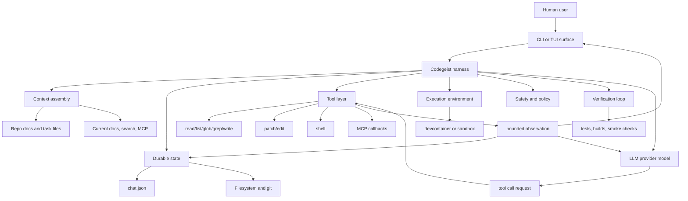
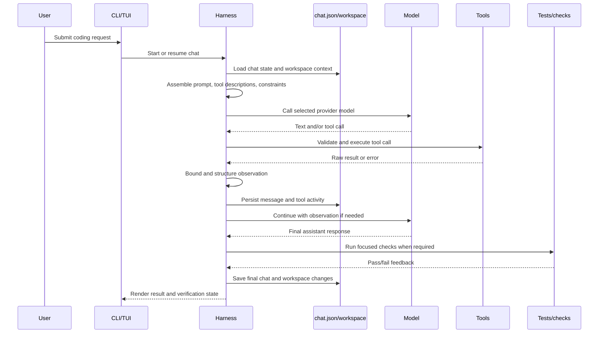

# Coding Agent Harness

Deep design model for what a coding agent harness is and how Codegeist should use
that concept for T007 and later runtime work.

Historical scope note: the harness concepts remain useful, but T007's old chat-file
examples were superseded by the completed `.codegeist/session.json`,
`ask -c/--continue`, `ChatHarnessService`, and TerminalUI contracts. Use the parent
task and current architecture docs for implemented names and behavior.

## Purpose

This document defines a coding agent harness at system-design depth. Use it before
implementing Codegeist runtime harness work, especially the T007 chat-file tool
harness.

The guiding model comes from LangChain's article, "The Anatomy of an Agent
Harness": `https://www.langchain.com/blog/the-anatomy-of-an-agent-harness`. The
article frames an agent as a model plus a harness. The model supplies
language-model intelligence. The harness is the surrounding system that turns that
intelligence into useful, observable, repeatable work.

## Core Definition

A coding agent is not just an LLM call. It is a work system made from two parts:

```text
coding agent = model + harness
```

The model is the probabilistic reasoning and generation engine. It receives input
tokens and produces output tokens or structured tool-call requests. The harness is
everything around the model that is not the model itself: prompts, state,
configuration, tools, execution environment, orchestration, persistence,
observation, constraints, verification, and user interfaces.

For a coding agent, the harness is the part that gives the model a computer-like
work loop. It lets the model read a repository, edit files, run tests, inspect
errors, continue work after a context boundary, and leave artifacts for humans or
future agents.

## Model Boundary

The model should be treated as a powerful but bounded component:

- It can interpret context, propose plans, choose tools, write code, and explain
  work.
- It cannot durably remember prior sessions without state injected by the harness.
- It cannot read files, execute commands, call MCP servers, or inspect current web
  content unless the harness exposes those capabilities.
- It cannot enforce safety boundaries by itself. The harness must validate paths,
  bound output, restrict side effects, and protect secrets.
- It cannot prove correctness alone. The harness must provide executable checks,
  logs, observations, and retry loops.

This boundary keeps Codegeist's design honest: when a desired behavior requires
state, tools, execution, verification, or policy, it belongs in harness design, not
inside provider-specific model code.

## Harness Boundary

The harness owns the deterministic and operational parts of the agent system.

| Area | Harness responsibility |
| --- | --- |
| Prompting | System prompts, task instructions, context selection, tool descriptions, output constraints. |
| State | Chat history, tool activity, task files, summaries, durable artifacts, resumability. |
| Tools | Tool schemas, validation, execution, result mapping, output bounding, error mapping. |
| Workspace | Filesystem access, git state, working-directory policy, generated artifacts, collaboration files. |
| Execution | Shell commands, test runners, package managers, sandboxes, timeouts, process cleanup. |
| Knowledge | Repo docs, memory files, web search, current library docs, MCP context sources. |
| Orchestration | Model-call loop, tool-call loop, continuation, handoffs, model routing, retries. |
| Safety | Permissions, path boundaries, secret avoidance, network policy, destructive-action policy. |
| Verification | Tests, builds, diff checks, smoke checks, logs, screenshots, structured pass/fail feedback. |
| Interfaces | CLI, TUI, future UI/API clients, renderer state, user prompts, progress reporting. |

For Codegeist, this means `CodegeistChatModel` should stay focused on provider
execution while the harness coordinates the workspace, chat file, tools, and user
interfaces.

## Why Coding Agents Need Harnesses

### Durable State

Coding work spans many turns and often many sessions. A raw model has only its
current context window. A harness provides durable state so work can resume after a
model call, a context compaction, an application restart, or a handoff to another
agent.

For Codegeist T007, `chat.json` is the first durable state artifact. It should
store chat history and tool activity needed to render and continue the local chat.
It must not become a dump of runtime configuration or secrets.

### Workspace Access

Coding agents need to interact with real project files. The filesystem is the most
important collaboration surface because humans, agents, tests, build tools, and git
all operate on it.

A harness should expose workspace access through explicit tools and policies:

- list and read repository files;
- search with glob and grep;
- write or patch files with path validation;
- record what changed;
- use git status and diff to understand work state;
- keep generated or large artifacts out of durable chat state unless explicitly
  needed.

Git is part of the wider workspace harness. It is not the model's memory, but it
provides versioned work history, branch isolation, collaboration, and a way to
inspect or package intentional changes.

### General-Purpose Execution

Predefined tools are never enough for all coding tasks. A shell or command runner
lets the model use installed language runtimes, package managers, test tools, and
small scripts. This is what turns a chat model into an agent that can observe and
repair its own work.

Shell execution must be a harness feature with strict contracts:

- explicit command, cwd, timeout, and environment policy;
- bounded stdout and stderr;
- captured exit code and duration;
- no silent background process persistence unless a focused task adds it;
- result summaries persisted into chat state when the run belongs to a chat.

### Tool Execution And Observation

Tools convert model intent into real-world effects. A robust harness does more than
call a function. It owns the full lifecycle:

1. Describe available tools to the model.
2. Receive a model-selected tool call.
3. Validate the tool input.
4. Check workspace and permission constraints.
5. Execute the tool or fail before side effects happen.
6. Bound and normalize output.
7. Persist structured tool activity.
8. Return a model-visible observation.
9. Render the result for the user.

This lifecycle matters because tool results are both operational feedback for the
model and audit data for the user. A tool result should be structured enough to
answer what happened, where it happened, whether it succeeded, what was truncated,
and what the model can safely use next.

### Current Knowledge And External Context

Models have a training cutoff. Harnesses add current context through documentation
lookup, web search, repository analysis, MCP servers, and local docs. For coding
work, current context often decides whether generated code compiles against the
actual library version in the project.

In Codegeist, MCP should be treated as a harness extension point. A Codegeist-owned
`codegeist.yml` `mcp:` map describes external context/tool clients. The public
Codegeist config contract should not expose Spring AI's internal MCP property tree
as the user-facing schema.

### Context Management

Context is limited and noisy context can degrade model performance. Harnesses must
therefore decide what enters the model context and what stays offloaded.

Important context-management patterns are:

- select only task-relevant files and docs;
- summarize prior turns when context grows too large;
- bound large tool output before returning it to the model;
- store full or larger outputs outside the model context when needed;
- progressively disclose specialized tools or instructions instead of loading every
  possible capability up front;
- keep durable state inspectable so a later compacted or resumed run can recover.

T007 should implement the small, concrete part first: bounded tool outputs and a
resumable `chat.json`. Broader memory, skill loading, subagent context, and advanced
compaction are deferred.

### Verification And Feedback Loops

A coding agent should not stop at plausible code. It needs feedback loops that run
the project's real checks and return failures to the model or the user.

The harness owns these loops:

- run focused tests after focused changes;
- run broad tests when the changed behavior needs full-suite confidence;
- capture logs, durations, exit codes, and failing assertions;
- feed concise failures back to the model for repair;
- prevent a task from being reported as complete before verification has run or a
  blocker has been stated.

For Codegeist implementation tasks, the harness-level verification entrypoint is
`task test` from `app/codegeist/cli`, with focused selectors where possible.

### Long-Horizon Work

Complex coding tasks need more than one model call. A long-horizon harness provides
state, planning, continuation, verification, and handoff artifacts.

Useful long-horizon primitives include:

- a file-backed plan or task state;
- a resumable chat transcript;
- structured tool history;
- git diffs as the durable work product;
- verification records;
- continuation prompts or loops when the model exits before the task is complete;
- handoff documents for future agents.

T007 should not add subagents or autonomous continuation loops yet. It should make
those future features possible by keeping chat state structured, bounded, and
separate from provider configuration.

## Coding Agent Harness Component Model



The diagram intentionally keeps the model as one component. Everything else is
harness design. Provider-specific model adapters are important, but they should not
own chat state, workspace policy, tool policy, or UI rendering.

## Basic Harness Loop

The minimal coding-agent loop is:



This loop can be synchronous at first. Streaming, cancellation, parallel tools,
subagents, and background jobs are later orchestration features, not prerequisites
for a useful first harness.

## Codegeist T007 Translation

T007 should implement a local, file-backed subset of the full coding agent harness.

| Harness concern | T007 implementation direction | Deferred beyond T007 |
| --- | --- | --- |
| Durable chat state | One portable `chat.json` loaded and saved by `ask --chat` and the TUI. | Database, server-side sessions, remote sync. |
| Provider boundary | Reuse `CodegeistChatService`, `CodegeistChatRequest`, `CodegeistConfig.defaultProvider()`, and provider-owned `defaultModel()`. | Provider catalogs, hosted provider expansion, model routers. |
| Workspace tools | Read/list/glob/grep/write under the chat working directory. | Broad permission systems, remote workspaces. |
| Mutation tools | Patch/edit with bounded summaries and path checks. | Advanced review workflows, LSP diagnostics, background formatters. |
| Shell | Bounded local command execution with cwd, timeout, exit code, stdout/stderr previews. | Long-running daemons, job scheduler, remote execution fleet. |
| MCP | Codegeist-owned top-level `mcp:` config mapped into Spring AI MCP support, starting with `stdio` plus a focused `streamable_http` path for Docker remote-smoke coverage. | OAuth, SSE, additional remote transports, dynamic MCP management. |
| Context management | Persist structured chat and bounded tool output. | General memory, skills, subagents, advanced compaction. |
| UI | Terminal TUI renders and updates the same `chat.json`. | Vaadin, desktop UI, API/SDK clients. |
| Verification | Focused tests and broad `task test` for implementation slices. | Release or platform smoke checks unless affected behavior requires them. |

## `chat.json` As Harness State

`chat.json` is not a provider request and not a config file. It is harness state.
It should contain only the information needed to resume and render one chat:

- schema version;
- chat id;
- created and updated timestamps;
- working directory;
- user messages;
- assistant responses;
- tool calls and tool results;
- bounded file, patch, edit, shell, MCP, error, and truncation summaries.

It must not contain:

- API keys, OAuth tokens, cloud credentials, or evaluated secret values;
- provider config or selected provider;
- selected model or generation options;
- MCP client definitions or connection status;
- enabled tool definitions;
- TUI layout, scroll position, draft prompt text, or other UI-only state;
- broad task memory or learned project rules.

This separation is essential. It lets a chat resume against the current config and
runtime environment without freezing old credentials, model choices, tool lists, or
transient status into the persisted chat.

## Tool Result Contract

Every Codegeist tool should have a structured result shape that can serve three
consumers at once:

- the model, which needs a concise observation;
- the user, who needs a reviewable audit trail;
- the chat file, which needs durable bounded state.

The result should answer:

- tool name and call id;
- start and end time or duration when useful;
- status such as `running`, `completed`, `failed`, `timed_out`, or `cancelled`;
- validated input summary;
- affected paths or cwd;
- bounded stdout, stderr, file content, diff, or error preview;
- truncation marker and original size/count when output was bounded;
- safe next observation text for the model.

Tool implementation details can differ, but persisted tool activity should stay
uniform enough for the TUI and future continuation logic to render it without
knowing each tool's internals.

## Harness Safety Rules

Safety is a harness responsibility because the model can request unsafe actions.
The first Codegeist harness should enforce simple, explicit rules rather than
claiming broad sandbox guarantees it does not implement.

Minimum rules:

- Mutating file tools must stay under the chat working directory unless a focused
  future task defines an external-directory policy.
- Shell tools must use an explicit cwd and timeout.
- Large outputs must be bounded before they enter model context, the TUI, or
  `chat.json`.
- Secrets and evaluated credentials must not be written into `chat.json`.
- Provider config and MCP client definitions remain runtime/config state, not chat
  state.
- Destructive or broad behavior should be added only behind focused tests and a
  documented user-visible contract.

## Design Principles For Codegeist

- Treat the model as the intelligence engine, not as the runtime owner.
- Keep harness state separate from provider config.
- Make `chat.json` the only T007 chat persistence source.
- Resolve provider, model, MCP clients, and enabled tools from current runtime state
  when a chat continues.
- Introduce Java classes only when a focused test needs them.
- Prefer small synchronous flows before streaming, parallelism, or background jobs.
- Bound tool output before it reaches the model, TUI, or persisted chat file.
- Make side effects explicit, reviewable, and tied to working-directory policy.
- Keep UI state out of chat state.
- Verify through real repo entrypoints and persist only useful summaries.
- Defer database, server runtime, remote sync, API/SDK, Vaadin, PF4J, JBang, LSP,
  skills, memory, and subagents until later tasks intentionally add them.

## Implementation Consequence

The first Codegeist coding agent harness should be narrow but real: `ask --chat`
creates or resumes a portable chat file, the model can use bounded Codegeist-owned
tools, tool activity is persisted and rendered, and focused tests prove the loop.

This is enough to turn the existing one-shot provider call into a local coding
agent harness without overbuilding the future platform.
