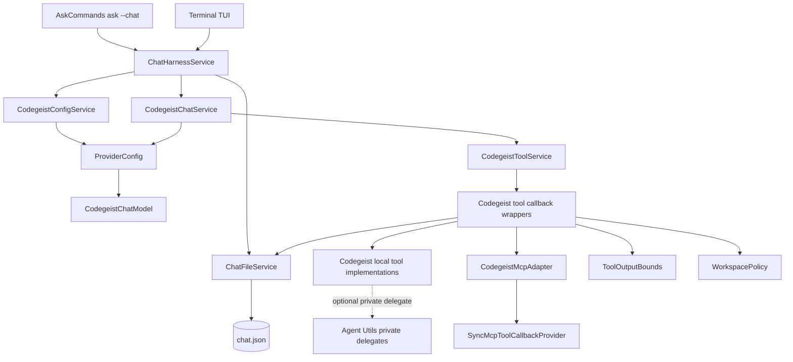
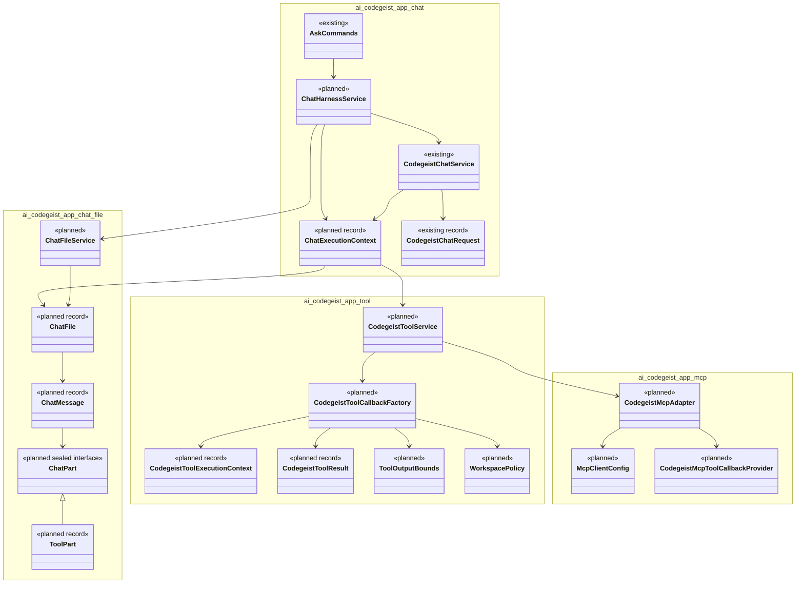
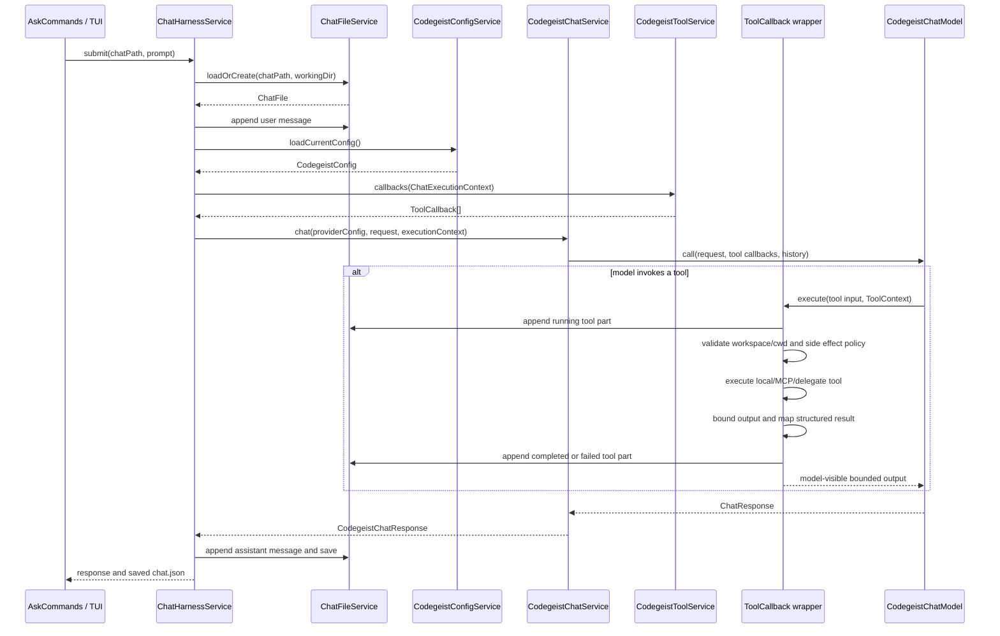
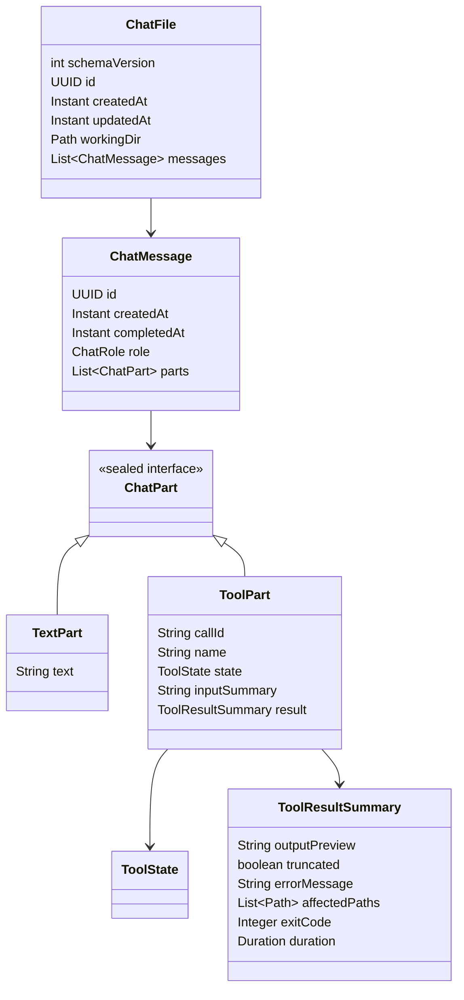
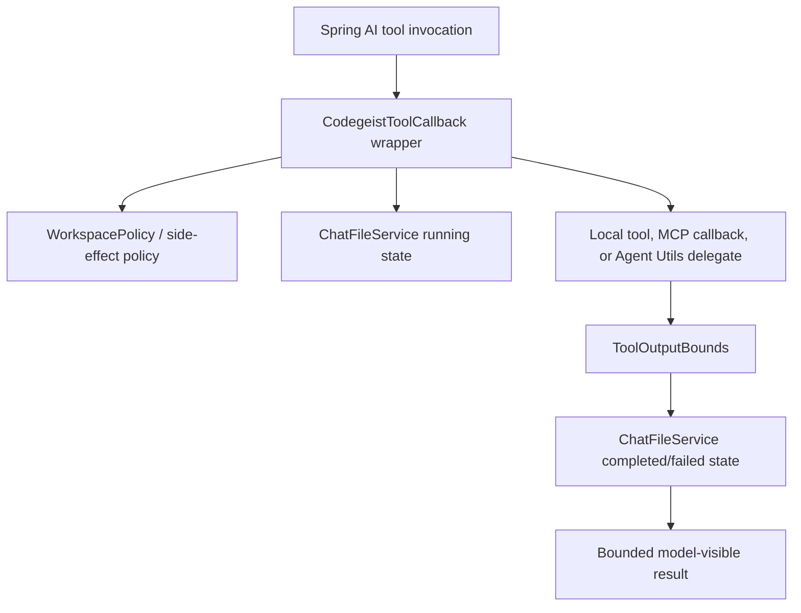
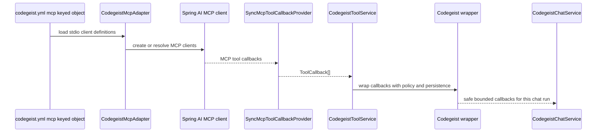

# Java Workflow Implementation

Planned Java/Spring implementation approach for translating the OpenCode prompt,
tool, MCP, and TUI workflow into the Codegeist T007 chat-file tool harness.

This document is a design guide for later implementation slices. It does not
create Java classes by itself. Keep the active child task small and introduce
classes only when focused tests need them.

## Evidence

Sources used for this implementation guide:

- `docs/tasks/T007_build-codegeist-runtime-harness/opencode-workflow-analysis.md`
  for the OpenCode behavior reference.
- Context7 `/spring-projects/spring-ai/v2.0.0-m6` for Spring AI `ChatClient`,
  `ChatModel`, `ToolCallback`, `ToolCallingChatOptions`, `ToolContext`, MCP client,
  and `SyncMcpToolCallbackProvider` usage.
- Context7 `/spring-ai-community/spring-ai-agent-utils` for Java agent tool wiring,
  `FileSystemTools`, `ShellTools`, `GrepTool`, `GlobTool`, `TaskTool`, `SkillsTool`,
  advisors, and tests.
- Local `/ask-project`-style Repomix deep dive over
  `docs/third-party/spring-ai-agent-utils/repomix-output.xml`. The current checkout
  also has regenerated structural Graphify artifacts for navigation, but
  source-level conclusions still rely on Repomix, existing analysis docs, and
  direct source reads.
- Current Codegeist source under `app/codegeist/cli/src/main/java/ai/codegeist/app`:
  `AskCommands`, `CodegeistChatService`, `CodegeistChatRequest`,
  `CodegeistChatResponse`, `CodegeistChatModel`, `OllamaChatModel`,
  `ProviderConfig`, and `CodegeistConfig`.

Relevant Spring AI facts from Context7:

- A single request can attach tools to `ChatClient` with
  `chatClient.prompt(...).toolCallbacks(toolCallback).call().content()`.
- A direct `ChatModel` call can attach tools with
  `ToolCallingChatOptions.builder().toolCallbacks(...).toolContext(...).build()`
  and `new Prompt(message, chatOptions)`.
- Runtime `toolContext` can pass per-call data such as chat id, chat path, or
  working directory into tool callbacks.
- Spring AI MCP exposes MCP tools through `SyncMcpToolCallbackProvider`, which can
  be passed to a `ChatClient` or used to retrieve `ToolCallback[]`.
- MCP stdio clients can be configured programmatically with `McpClient.sync(...)`,
  `StdioClientTransport`, and `ServerParameters`, or through Spring Boot MCP
  properties. Codegeist should keep direct `codegeist.yml mcp:` as the public
  contract and map it privately.

Relevant Spring AI Agent Utils facts from local source and Repomix:

- Agent Utils exposes many tools as Spring AI `@Tool` methods registered through
  `defaultTools(...)` or `MethodToolCallbackProvider`.
- `TaskTool` and `SkillsTool` build explicit `ToolCallback` instances with
  `FunctionToolCallback`, but both are T007 non-goals.
- Useful tool references include `FileSystemTools`, `ListDirectoryTool`,
  `GlobTool`, `GrepTool`, and `ShellTools`.
- Agent Utils does not provide a Codegeist-ready `chat.json` persistence model,
  workspace policy, permission boundary, MCP config mapper, or TUI state model.
- Raw Agent Utils file and shell tools should not be exposed directly to Codegeist
  chats; wrap or reimplement behind Codegeist policy and persistence.

## Current Codegeist Seam

Current implemented chat behavior is small and provider-oriented:

- `AskCommands.ask(...)` selects the first configured provider and default model.
- `CodegeistChatService.chat(ProviderConfig, CodegeistChatRequest)` maps the
  selected access-only provider config to a concrete `CodegeistChatModel` adapter and
  returns only response text.
- `CodegeistChatRequest` contains only runtime model and prompt.
- `OllamaChatModel` maps `CodegeistChatRequest.model()` to `OllamaChatOptions` and
  calls Spring AI's Ollama model with a simple `Prompt`.

T007 should preserve this seam. Add chat-file history, tool callbacks, and runtime
context as separate objects instead of putting provider config, selected provider,
MCP config, or tool definitions into `CodegeistChatRequest` or `chat.json`.

## Target Component Shape



Important direction:

- `ChatHarnessService` owns the `ask --chat` orchestration.
- `ChatFileService` owns file load, validation, append, save, and atomic writes.
- `CodegeistChatService` remains the provider call boundary.
- `CodegeistToolService` owns available tool callbacks for a specific chat run.
- Tool wrappers own policy, bounding, status transitions, and chat-file persistence.
- Agent Utils may be a private delegate only after Codegeist wrappers enforce
  `workingDir`, no-secret, bounded-output, and side-effect contracts.
- The TUI reads/writes the same `ChatFileService`; it does not own another
  persistence model.

## Java Package Direction



## Prompt And Tool Sequence



This sequence collapses OpenCode's server, SDK, and SQLite sync architecture into a
single file-backed Java path. It intentionally keeps provider/model selection and
tool registration runtime-only.

## Chat File Service

`ChatFileService` is the first implementation slice because every later tool and
TUI feature depends on it.

Responsibilities:

- Load an existing `chat.json` or create one when the path does not exist.
- Validate `schemaVersion` and fail clearly on corrupt JSON or unsupported future
  versions before provider calls or side effects.
- Store only chat-relevant resume/render data.
- Append messages and tool parts in chronological order.
- Bound large tool data before persistence.
- Save atomically so an interrupted write does not leave a partial JSON file.
- Avoid storing provider config, selected provider, selected model, MCP client
  definitions, enabled tool definitions, secrets, runtime status, or TUI layout.

Preferred record direction:



The existing T007 diagrams may still use separate `toolCalls` and `toolResults`
while the design is refined. During implementation, prefer the message-part shape
when it keeps resume and TUI rendering simpler.

## Chat Service And Tool Callbacks

Codegeist has two viable Spring AI integration paths:

1. Keep using `ChatModel` directly and pass `ToolCallingChatOptions` to the
   provider-specific model call.
2. Introduce `ChatClient` inside provider-specific `CodegeistChatModel`
   implementations when the selected provider works better with advisors or
   callback composition.

The smallest T007-compatible path is to extend the existing `CodegeistChatModel`
contract with a separate execution context when the first tool-calling test needs
it. Do not put context into `CodegeistChatRequest`.

Illustrative shape only:

```java
record ChatExecutionContext(
        Path chatPath,
        ChatFile chatFile,
        ToolCallback[] toolCallbacks,
        Map<String, Object> toolContext) {
}
```

Spring AI direct model-call direction:

```java
ChatOptions options = ToolCallingChatOptions.builder()
        .toolCallbacks(context.toolCallbacks())
        .toolContext(context.toolContext())
        .build();
ChatResponse response = chatModel.call(new Prompt(messages, options));
```

Spring AI `ChatClient` direction:

```java
String content = chatClient.prompt()
        .messages(messages)
        .toolCallbacks(context.toolCallbacks())
        .toolContext(context.toolContext())
        .call()
        .content();
```

Use these snippets as API orientation. Actual implementation should follow the
current Spring AI `2.0.0-M6` APIs available in the Maven baseline and the focused
test slice.

## Tool Callback Wrapper Pattern

Agent Utils can provide useful tool implementations, but Codegeist must wrap every
tool that can read files, mutate files, call MCP, or run commands.



Wrapper responsibilities:

- Create a Codegeist tool activity id. Do not depend on provider-specific tool-call
  ids unless Spring AI exposes a stable id in the active version and tests prove it.
- Append a `RUNNING` tool part before side effects.
- Canonicalize and validate paths or cwd before side effects.
- Execute the local tool, MCP callback, or private Agent Utils delegate.
- Convert raw strings, exceptions, non-zero exit codes, and timeouts into typed
  `CodegeistToolResult` records.
- Bound output before returning to the model or writing `chat.json`.
- Append `COMPLETED`, `FAILED`, `TIMED_OUT`, or `CANCELLED` state.
- Return only safe bounded text to the model.

## Agent Utils Usage Policy

Use Agent Utils as Java/Spring evidence and optional private delegates. Do not make
it the public runtime contract for T007.

| T007 need | Agent Utils evidence | Codegeist use |
| --- | --- | --- |
| Read file | `FileSystemTools.Read` with offset/limit and line formatting. | Reimplement or delegate after `workingDir` guard and bounded-result mapping. |
| List directory | `ListDirectoryTool` with depth and limit. | Reimplement or delegate after `workingDir` guard and ignored/generated policy. |
| Glob | `GlobTool` with Java NIO search and result limits. | Good private delegate candidate after path/result policy. |
| Grep | `GrepTool` with regex, output modes, context, offset, and limits. | Good private delegate candidate after path/result policy. |
| Write/edit | `FileSystemTools.Write` and `FileSystemTools.Edit`. | Do not expose raw; use exact-edit ideas behind Codegeist mutation service. |
| Patch | No broad Agent Utils apply-patch equivalent found. | Codegeist-owned patch tool. |
| Shell | `ShellTools` with timeout, output, stderr, background, and kill support. | Concept reference; implement Codegeist cwd, timeout, no background persistence, and chat records. |
| Tool callback builders | `TaskTool`, `SkillsTool`, `FunctionToolCallback`. | Use as callback-building examples only; task/skills are T007 non-goals. |
| Memory/advisors | `MessageWindowChatMemory`, `AutoMemoryTools`, memory advisors. | Do not use as durable chat persistence. `chat.json` is source of truth. |

Raw Agent Utils file and shell tools are too permissive for T007 because they do
not own Codegeist `workingDir`, permission, `chat.json`, no-secret, MCP config, or
TUI rendering contracts. `AutoMemoryTools` is useful as a safe-root pattern because
it rejects absolute paths and traversal, but it is memory-specific and not a chat
transcript model.

## MCP Adapter

Codegeist should keep a direct public config shape:

```yaml
mcp:
  filesystem:
    type: stdio
    command: npx
    args:
      - -y
      - "@modelcontextprotocol/server-filesystem"
      - .
```

Implementation direction:

- Add `McpClientConfig` under Codegeist config with YAML-key `id`, `type`,
  `command`, and `args` first.
- Keep only `stdio` in the first T007 MCP slice unless a focused test requires
  another transport.
- `CodegeistMcpAdapter` maps direct Codegeist config to Spring AI MCP clients.
- Use `SyncMcpToolCallbackProvider` to expose MCP tool callbacks to the same
  `CodegeistToolService` callback list as local tools.
- Wrap MCP callbacks with Codegeist persistence and output bounds before exposing
  them to a chat run.
- Keep MCP config, status, connected clients, resources, and enabled tool
  definitions out of `chat.json`.



## Bounded Output And Error Mapping

Spring AI Agent Utils bounds output per tool. OpenCode uses a common truncation
service plus tool-specific limits. Codegeist should centralize this in
`ToolOutputBounds` so persisted `chat.json` fields are uniform.

Required output fields for tool results:

- `contentPreview` or `outputPreview`.
- `stdoutPreview` and `stderrPreview` for shell.
- `truncated` flag.
- `omittedCharacters` or `omittedLines` when known.
- `resultCount` for list/search tools when known.
- `affectedPaths` for write/edit/patch.
- `exitCode`, `timedOut`, and `duration` for shell.
- `errorMessage` for failed tools.

Do not persist raw unbounded file contents, command output, secret-bearing config,
or evaluated credential values.

## Implementation Slices

### T007_02 Chat File And `ask --chat`

Implement:

- `ChatFileService` with schema version `1`.
- `ChatHarnessService` for create/load/append/save around the existing chat call.
- `ask --chat <chat.json>` without tool callbacks.
- Existing no-`--chat` `ask` behavior unchanged.

Test first:

- New file creation.
- Existing file append.
- Corrupt JSON and unsupported schema failures.
- No provider/model/MCP/tool/status persistence.
- No-`--chat` stdout remains response-only.

### T007_03 MCP And Read/Write Tools

Implement:

- Codegeist direct `mcp:` config model.
- `CodegeistMcpAdapter` with first `stdio` support.
- `CodegeistToolService` and callback wrapper contract.
- Read/list/glob/grep/write tools with `WorkspacePolicy` and `ToolOutputBounds`.
- Fake MCP `ToolCallbackProvider` test before real MCP process tests.

Use Agent Utils only as a private reference or delegate after wrappers exist.

### T007_04 Patch/Edit And Shell

Implement:

- Exact edit and/or patch only as needed by tests.
- Shell with explicit cwd under `workingDir`, timeout, exit code, duration,
  stdout/stderr previews, and no background process persistence.
- Typed failed/timed-out/cancelled tool activity.

Do not claim sandboxing beyond tested path and cwd guards.

### T007_05 Agent Control Loop

Implement:

- A synchronous model/tool/model loop owned by Codegeist.
- Fake-model and fake-tool tests proving tool results feed model continuation.
- Integration through `ChatHarnessService` without changing command stdout behavior.

### T007_06 Terminal TUI

Implement:

- Spring Shell `TerminalUI` over the existing `codegeist tui` command.
- Prompt submission through the same agent-loop-backed `ChatHarnessService` used by
  `ask -c/--continue`.
- Synchronous response display in TerminalUI-visible state.
- No custom JLine console, deterministic line renderer pipeline, or second
  persistence path.

## Test Strategy

Use Agent Utils test style as a pattern, not as copied code:

- JUnit 5, `@TempDir`, `@Nested`, readable display names, and focused assertions.
- Direct tool tests for deterministic file/search/shell behavior.
- Spring Boot command tests only when command registration or output behavior is
  being verified.
- Fake provider/model/tool callbacks for most chat-file tests.
- Local Ollama category tests only when the test intentionally proves real provider
  behavior.

Suggested Codegeist test groups:

- `ChatFileServiceTest` for schema, create/load/save/append, corrupt data, and
  atomic write behavior.
- `AskChatFileCommandTest` for `ask --chat` create/resume and no-`--chat` stdout.
- `CodegeistToolServiceTest` for callback wrapping and tool state transitions.
- `WorkspacePolicyTest` for path and cwd escape failures.
- `ToolOutputBoundsTest` for truncation fields and markers.
- `ReadWriteToolsTest`, `PatchEditToolsTest`, and `ShellToolTest` for focused tool
  contracts.
- `CodegeistMcpAdapterTest` for direct config mapping and fake callback exposure.
- `TerminalTuiRendererTest` for deterministic rendering.

Use the Taskfile entrypoint from `app/codegeist/cli`:

```bash
task test TEST=<selector>
task test
```

## What Not To Adopt In T007

Do not add these while implementing this Java workflow:

- A database or server-side session service.
- Spring AI memory as durable transcript persistence.
- Agent Utils `TaskTool`, `SkillsTool`, subagents, A2A, memory tools, or web tools.
- Raw Agent Utils file or shell tools without Codegeist wrappers.
- OpenCode SDK sync, plugin model, OpenTUI/Solid structure, or SQLite schema.
- Remote MCP beyond the accepted `streamable_http` smoke path, OAuth MCP,
  prompt/resource MCP browsing, or dynamic server management.
- Provider catalog, model selection flags, token/cost accounting, or hosted provider
  calls outside the focused task.

## Decision Summary

The Java implementation should combine three inputs:

- OpenCode supplies the behavior: resumable chat, message parts, tool lifecycle,
  bounded output, permission posture, MCP tool availability, and TUI rendering.
- Spring AI supplies the Java call mechanism: `ChatClient`/`ChatModel`,
  `ToolCallback`, `ToolCallingChatOptions`, runtime `toolContext`, and MCP callback
  providers.
- Spring AI Agent Utils supplies Java tool examples and tests, but only behind
  Codegeist-owned wrappers or as source-backed behavior references.

Codegeist owns the actual T007 contracts: `chat.json`, provider config boundary,
tool policy, bounded output, MCP config mapping, persistence, and TUI projection.
