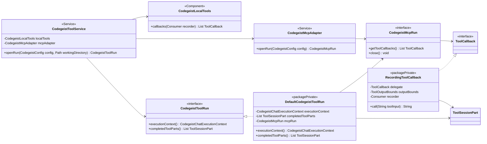
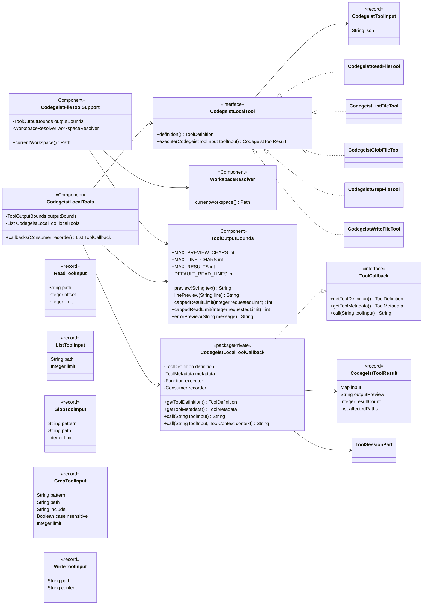
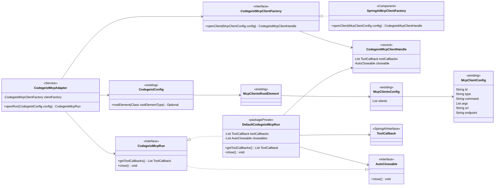
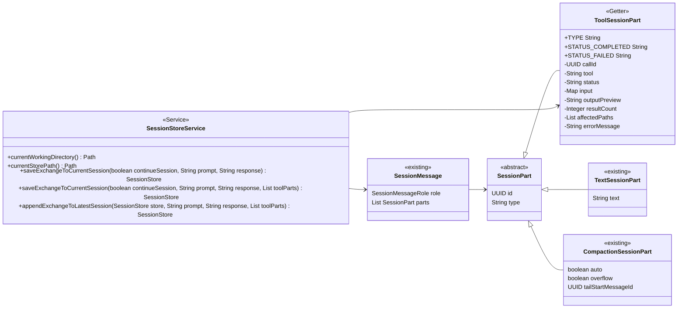
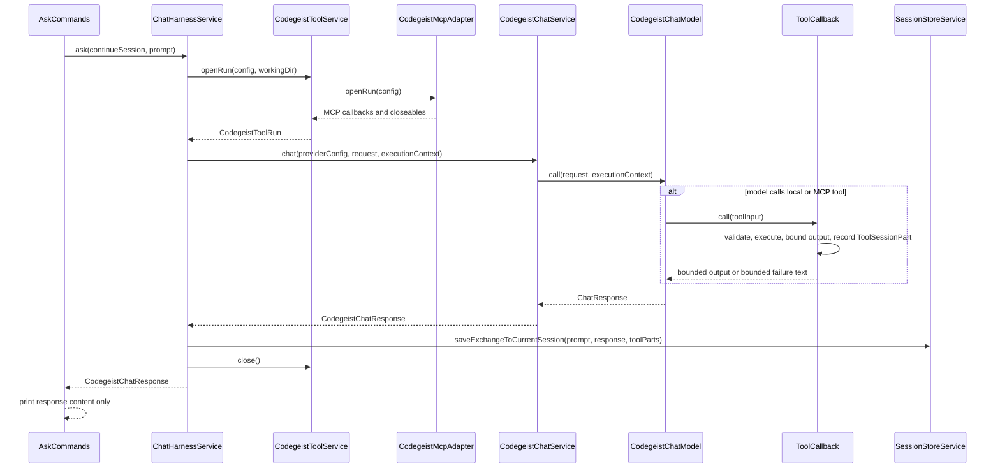

# T007_03 MCP And Read Write Tools Implementation Plan

Implementation handoff for `T007_03_add-mcp-and-read-write-tools/task.md`.

This document is the concrete implementation plan for the already accepted
`T007_03` specification. It defines the Java packages, class contracts,
workflows, persistence shape, tests, and verification order so a later
implementation pass can write the code directly without reopening broad design
work.

## Source References

- Task:
  `docs/tasks/T007_build-codegeist-runtime-harness/tasks/T007_03_add-mcp-and-read-write-tools/task.md`
- Specification:
  `docs/tasks/T007_build-codegeist-runtime-harness/mcp-and-readwrite-tools-spec.md`
- Research:
  `docs/tasks/T007_build-codegeist-runtime-harness/mcp-and-readwrite-tools-research.md`
- Runtime harness strategy:
  `docs/developer/specification/runtime-harness-implementation.md`
- Current architecture:
  `docs/developer/architecture/architecture.md`
- Test guidance:
  `docs/tests/README.md`

## Baseline

Implemented before this plan:

- `app/codegeist/cli` is the only runtime module.
- `CodegeistConfig` can parse direct `codegeist.yml` top-level `mcp:` entries
  through `McpClientsRootElement`, `McpClientsConfig`, and `McpClientConfig`.
- `ask` selects the first configured provider, uses that provider's
  `defaultModel()`, calls `CodegeistChatService`, prints only response text, and
  saves a text-only exchange to `.codegeist/session.json`.
- `CodegeistChatRequest` contains only `model` and `prompt`.
- `SessionPart` supports only `text` and `compaction`.
- No Spring AI MCP client dependency, MCP adapter, local read/write tools, tool
  callbacks, workspace resolution, or persisted tool parts exist yet.

## Target Result

After implementation:

- `AskCommands` is a thin Spring Shell adapter over `ChatHarnessService`.
- `ChatHarnessService` owns one prompt turn: provider selection, model selection,
  scoped tool callback setup, chat call, session persistence, and MCP cleanup.
- `CodegeistChatRequest` stays unchanged with exactly `model` and `prompt`.
- Local Codegeist tools expose these callback names:
  - `codegeist_read`
  - `codegeist_list`
  - `codegeist_glob`
  - `codegeist_grep`
  - `codegeist_write`
- Direct `codegeist.yml` `mcp:` clients are lazily converted to Spring AI MCP
  `ToolCallback` values for a chat run.
- Tool calls and bounded results are persisted as assistant `ToolSessionPart`
  values in `.codegeist/session.json` before the assistant text part.
- `.codegeist/session.json` still does not store provider config, selected
  provider/model, MCP client definitions, enabled tool definitions, permission
  state, runtime status, or TUI state.

## Non-Goals

- No patch/edit tool.
- No shell tool.
- No terminal TUI.
- No provider-facing reconstruction from stored history.
- No SSE, OAuth, environment-variable, public timeout, enablement, or
  server-management MCP config fields. `streamable_http` is in scope only as the
  first remote MCP transport and is covered by an explicit Docker smoke fixture.
- No broad tool registry, plugin system, permission prompt UI, repo map, git
  automation, lint/test loop, database, server runtime, API/SDK, Vaadin, PF4J,
  JBang, LSP, skills, memory, or subagents.

## Package Map

| Package | Classes to add or change | Responsibility |
| --- | --- | --- |
| `ai.codegeist.app.chat` | `ChatHarnessService`, `CodegeistChatExecutionContext`, `AskCommands`, `CodegeistChatService`, `CodegeistChatModel`, `OllamaChatModel` | One-turn chat orchestration and provider chat calls with runtime tool callbacks. |
| `ai.codegeist.app.config` | `WorkspaceRootElement`, `WorkspaceConfig` | Direct `codegeist.yml` `workspace.directory` parsing. |
| `ai.codegeist.app.tool` | `CodegeistToolService`, `CodegeistToolRun`, `DefaultCodegeistToolRun`, `CodegeistLocalTools`, `WorkspaceResolver`, `ToolOutputBounds`, `CodegeistLocalToolCallback`, `RecordingToolCallback`, `CodegeistToolResult` | Local file tools, workspace resolution, output bounds, callback assembly, and tool-result recording. |
| `ai.codegeist.app.mcp` | `CodegeistMcpAdapter`, `CodegeistMcpRun`, `DefaultCodegeistMcpRun`, `CodegeistMcpClientFactory`, `SpringAiMcpClientFactory`, `CodegeistMcpClientHandle` | Lazy mapping from Codegeist `mcp:` config to Spring AI MCP callbacks and closeable `stdio` or `streamable_http` resources, with a package-private fakeable seam for unit tests. |
| `ai.codegeist.app.session` | `ToolSessionPart`, `SessionPart`, `SessionStoreService` | Persist bounded tool activity in the existing session store model. |
| `app/codegeist/cli` build/resources | `pom.xml`, `Taskfile.yml`, remote MCP smoke fixture, `reflect-config.json` | Add Spring AI MCP dependency, the explicit Docker-backed remote MCP smoke entrypoint, and native reflection metadata. |

Use package-private helper records/classes where possible. Add public classes only
when another package or a test needs the contract.

## Task Split

Implement this plan through the focused child tasks under
`docs/tasks/T007_build-codegeist-runtime-harness/tasks/T007_03_add-mcp-and-read-write-tools/tasks/`.

| Child task | Implementation focus | Depends on |
| --- | --- | --- |
| `T007_03_01_add-tool-session-persistence.md` | `ToolSessionPart`, session-store append overloads, `currentWorkingDirectory()`, and native reflection metadata. | `T007_02` |
| `T007_03_02_add-workspace-resolution-and-output-bounds.md` | `WorkspaceRootElement`, `WorkspaceConfig`, `WorkspaceResolver`, and `ToolOutputBounds`. | `T007_02` |
| `T007_03_03_add-local-file-tools.md` | `CodegeistLocalTools`, `CodegeistLocalToolCallback`, `CodegeistToolResult`, and `codegeist_read`/`list`/`glob`/`grep`/`write`. | `T007_03_01`, `T007_03_02` |
| `T007_03_04_add-tool-aware-chat-harness.md` | `ChatHarnessService`, `CodegeistChatExecutionContext`, tool-aware chat/model overloads, `CodegeistToolService`, `CodegeistToolRun`, and `AskCommands` refactor. | `T007_03_03` |
| `T007_03_05_add-mcp-callback-adapter.md` | Spring AI MCP dependency, `CodegeistMcpAdapter`, `CodegeistMcpRun`, `stdio` and `streamable_http` mapping, Docker-backed remote MCP smoke, and MCP callback recording integration. | `T007_03_04` |
| `T007_03_06_finalize-tool-docs-and-verification.md` | Architecture docs, task progress updates, optional memory refresh, focused verification, and broad `task test`. | `T007_03_05` |

This split supersedes the earlier monolithic checklist. Keep the class contracts
in this plan as the technical target, but implement them only in the child task
that owns the relevant slice.

## Planned Class Views

The stereotypes in these Mermaid diagrams represent planned Java, Spring,
Lombok, Jackson, and interface annotations. Package-private implementation
classes and records are included where they define an implementation boundary.

### Chat Orchestration View

This view shows the command path and provider call boundary. It intentionally
omits local tool internals and MCP setup details.

```mermaid
classDiagram
    direction LR

    class AskCommands {
      <<Component>>
      <<Slf4j>>
      <<RequiredArgsConstructor>>
      -ChatHarnessService chatHarnessService
      -CommandOutputService outputService
      +ask(CommandContext context, boolean continueSession, String prompt) void
    }

    class ChatHarnessService {
      <<Service>>
      <<Slf4j>>
      <<RequiredArgsConstructor>>
      -CodegeistConfig config
      -CodegeistChatService chatService
      -CodegeistToolService toolService
      -SessionStoreService sessionStoreService
      +ask(boolean continueSession, String prompt) CodegeistChatResponse
    }

    class CodegeistChatService {
      <<Service>>
      <<Slf4j>>
      +chat(ProviderConfig providerConfig, CodegeistChatRequest request) CodegeistChatResponse
      +chat(ProviderConfig providerConfig, CodegeistChatRequest request, CodegeistChatExecutionContext context) CodegeistChatResponse
    }

    class CodegeistChatExecutionContext {
      <<record>>
      <<NonNullComponents>>
      Path workingDirectory
      List ToolCallback toolCallbacks
      +empty(Path workingDirectory) CodegeistChatExecutionContext
      +toolCallbackArray() ToolCallback[]
    }

    class CodegeistChatModel {
      <<abstract>>
      #ProviderConfig providerConfig
      +call(CodegeistChatRequest request, CodegeistChatExecutionContext context) ChatResponse
    }

    class OllamaChatModel {
      -OllamaChatModel delegate
      +call(CodegeistChatRequest request, CodegeistChatExecutionContext context) ChatResponse
    }

    class CodegeistToolService {
      <<Service>>
    }

    class CodegeistToolRun {
      <<interface>>
      +executionContext() CodegeistChatExecutionContext
      +completedToolParts() List ToolSessionPart
    }

    class SessionStoreService {
      <<Service>>
      +currentWorkingDirectory() Path
      +currentStorePath() Path
      +saveExchangeToCurrentSession(boolean continueSession, String prompt, String response, List toolParts) SessionStore
    }

    AskCommands --> ChatHarnessService
    ChatHarnessService --> CodegeistToolService
    ChatHarnessService --> CodegeistToolRun
    ChatHarnessService --> CodegeistChatService
    ChatHarnessService --> SessionStoreService
    CodegeistToolRun --> CodegeistChatExecutionContext
    CodegeistChatService --> CodegeistChatModel
    CodegeistChatModel <|-- OllamaChatModel
```



### Tool Run Assembly View

This view shows how one chat run receives local callbacks, MCP callbacks, and a
single ordered recorder list.



### Local File Tool View

This view shows only the Codegeist-owned read/list/glob/grep/write tool path.



### MCP Adapter View

This view shows only the new MCP runtime adapter, its package-private test seam, and
the existing config inputs it consumes. The factory seam keeps unit tests away from
real processes and Docker while the production factory owns the milestone Spring AI
MCP API details for `stdio` and `streamable_http`.



### Session Persistence View

This view shows the additive `ToolSessionPart` schema and the session service
overload that writes tool parts before the assistant text part.



## Maven Dependency

Add the Spring AI MCP client starter to `app/codegeist/cli/pom.xml`:

```xml
<dependency>
    <groupId>org.springframework.ai</groupId>
    <artifactId>spring-ai-starter-mcp-client</artifactId>
</dependency>
```

Rules:

- Keep direct `codegeist.yml` as the public Codegeist config contract.
- Do not require users to configure `spring.ai.mcp.client.*`.
- Do not let config parsing, `--show-config`, or Spring context startup spawn MCP
  processes. MCP client creation belongs only inside `CodegeistToolRun`.
- If the pinned Spring AI `2.0.0-M6` artifacts require a separate streamable HTTP
  transport dependency beyond `spring-ai-starter-mcp-client`, add only the smallest
  matching Spring AI MCP transport artifact needed to compile the adapter.

## Chat Package Contracts

### `ChatHarnessService`

Location: `app/codegeist/cli/src/main/java/ai/codegeist/app/chat/ChatHarnessService.java`

Annotations:

```java
@Slf4j
@Service
@RequiredArgsConstructor
public class ChatHarnessService {
}
```

Constructor-injected collaborators:

- `CodegeistConfig config`
- `CodegeistChatService chatService`
- `CodegeistToolService toolService`
- `WorkspaceResolver workspaceResolver`
- `SessionStoreService sessionStoreService`

Public method:

```java
public CodegeistChatResponse ask(boolean continueSession, @NonNull String prompt)
```

Algorithm:

```java
ProviderConfig providerConfig = config.defaultProvider()
        .orElseThrow(() -> new IllegalStateException(CodegeistConfig.NO_PROVIDER_MESSAGE));
String model = providerConfig.defaultModel();
Path workingDirectory = workspaceResolver.currentWorkspace();

try (CodegeistToolRun toolRun = toolService.openRun(config, workingDirectory)) {
    CodegeistChatResponse response = chatService.chat(
            providerConfig,
            new CodegeistChatRequest(model, prompt),
            toolRun.executionContext());
    sessionStoreService.saveExchangeToCurrentSession(
            continueSession,
            prompt,
            response.content(),
            toolRun.completedToolParts());
    return response;
}
```

Behavior:

- Keep output printing outside the harness. `AskCommands` prints returned content.
- Let `CodegeistCommandExceptionMapper` handle command-boundary exceptions.
- If MCP setup fails while opening the run, fail before the provider call.
- If a provider call fails after tools ran, do not add complex partial persistence
  in this slice unless a failing test requires it.

### `CodegeistChatExecutionContext`

Location:
`app/codegeist/cli/src/main/java/ai/codegeist/app/chat/CodegeistChatExecutionContext.java`

Shape:

```java
public record CodegeistChatExecutionContext(
        @NonNull Path workingDirectory,
        @NonNull List<ToolCallback> toolCallbacks) {

    public static CodegeistChatExecutionContext empty(Path workingDirectory) { ... }

    public ToolCallback[] toolCallbackArray() { ... }
}
```

Rules:

- Store runtime callback availability only. Do not put provider config, selected
  provider/model, MCP config, session state, or enabled-tool snapshots here.
- Do not put a public recorder in this context unless implementation proves it is
  needed. Recording belongs to the scoped `CodegeistToolRun` callbacks.
- Copy incoming callback lists defensively.

### `AskCommands`

Change:

- Remove direct dependency on `CodegeistConfig`, `CodegeistChatService`, and
  `SessionStoreService`.
- Inject `ChatHarnessService` and `CommandOutputService`.
- Keep command constants, option names, prompt argument, and exception mapper.

Target method body:

```java
CodegeistChatResponse response = chatHarnessService.ask(continueSession, prompt);
outputService.print(context, response.content());
```

Behavior:

- Stdout remains provider response text only.
- The command annotation still references
  `CodegeistCommandExceptionMapper.BEAN_NAME`.

### `CodegeistChatService`

Keep existing API:

```java
public CodegeistChatResponse chat(
        @NonNull ProviderConfig providerConfig,
        @NonNull CodegeistChatRequest request)
```

Add overload:

```java
public CodegeistChatResponse chat(
        @NonNull ProviderConfig providerConfig,
        @NonNull CodegeistChatRequest request,
        @NonNull CodegeistChatExecutionContext context)
```

Implementation:

- Existing method delegates to the overload with
  `CodegeistChatExecutionContext.empty(Path.of("."))` or directly to the model
  without tools.
- The overload asks `providerConfig.createChatModel()` and calls
  `chatModel.call(request, context)`.
- Response extraction remains first result output text.

### `CodegeistChatModel<T extends ProviderConfig>`

Use the context-aware method as the provider implementation contract:

```java
public abstract ChatResponse call(
        @NonNull CodegeistChatRequest request,
        @NonNull CodegeistChatExecutionContext context);
```

This avoids silently dropping a caller-supplied context. Keep no-tool compatibility at
`CodegeistChatService` by having its request-only overload supply an empty execution
context before invoking the selected model.

### `OllamaChatModel`

Override the context-aware method.

Target shape:

```java
@Override
public ChatResponse call(
        @NonNull CodegeistChatRequest request,
        @NonNull CodegeistChatExecutionContext context) {
    OllamaChatOptions options = OllamaChatOptions.builder()
            .model(request.model())
            .toolCallbacks(context.toolCallbackArray())
            .build();
    return delegate.call(new Prompt(request.prompt(), options));
}
```

Notes:

- The pinned Spring AI `2.0.0-M6` API has `OllamaChatOptions` implementing
  `org.springframework.ai.model.tool.ToolCallingChatOptions` and the inherited
  builder method `toolCallbacks(...)`.
- Keep Ollama-specific Spring AI imports isolated in `OllamaChatModel`.

## Tool Package Contracts

### `CodegeistToolService`

Location: `app/codegeist/cli/src/main/java/ai/codegeist/app/tool/CodegeistToolService.java`

Annotations:

```java
@Slf4j
@Service
@RequiredArgsConstructor
public class CodegeistToolService {
}
```

Constructor-injected collaborators:

- `CodegeistLocalTools localTools`
- `CodegeistMcpAdapter mcpAdapter`

Public method:

```java
public CodegeistToolRun openRun(
        @NonNull CodegeistConfig config,
        @NonNull Path workingDirectory)
```

Algorithm:

1. Create a mutable ordered `List<ToolSessionPart>` recorder list.
2. Build local file callbacks for the run using `workingDirectory` and the recorder.
3. Open MCP callbacks through `CodegeistMcpAdapter.openRun(config)`.
4. Wrap MCP callbacks with `RecordingToolCallback` so MCP outputs and failures are
   bounded and persisted.
5. Return a `CodegeistToolRun` containing:
   - immutable callback list for `CodegeistChatExecutionContext`
   - ordered recorded parts

Rules:

- Local callbacks are always available.
- MCP callbacks are available only when `config.rootElement(McpClientsRootElement.class)`
  exists and contains clients.
- Callback names from local tools must be prefixed with `codegeist_`.
- MCP callback names are whatever Spring AI exposes, wrapped only for recording.

### `CodegeistToolRun`

Location: `app/codegeist/cli/src/main/java/ai/codegeist/app/tool/CodegeistToolRun.java`

Shape:

```java
public interface CodegeistToolRun {
    CodegeistChatExecutionContext executionContext();

    List<ToolSessionPart> completedToolParts();
}
```

Implementation rules:

- The first implementation can use a package-private `DefaultCodegeistToolRun`.
- `completedToolParts()` returns a defensive immutable copy in call order.
- Keep the local-only run non-closeable until the MCP slice introduces an actual
  resource-owning run or delegates cleanup through `CodegeistMcpRun`.

### `WorkspaceRootElement` And `WorkspaceConfig`

Locations:

- `app/codegeist/cli/src/main/java/ai/codegeist/app/config/WorkspaceRootElement.java`
- `app/codegeist/cli/src/main/java/ai/codegeist/app/config/WorkspaceConfig.java`

Public direct YAML shape:

```yaml
workspace:
  directory: /some/path
```

Rules:

- `workspace:` and `workspace.directory` are optional.
- A present non-object `workspace:` root fails with a concise config validation
  message.
- `WorkspaceRootElement.rootName()` returns `workspace`.
- `WorkspaceRootElement.configType()` returns `WorkspaceConfig.class`.
- `WorkspaceConfig` extends `CodegeistConfigElement` and stores nullable
  `directory` only.
- Do not add path-safety fields, ignored-file fields, write rules, or future
  workspace metadata in this slice.

### `WorkspaceResolver`

Location: `app/codegeist/cli/src/main/java/ai/codegeist/app/tool/WorkspaceResolver.java`

Annotations:

```java
@Component
@RequiredArgsConstructor
public class WorkspaceResolver {
}
```

Constructor-injected collaborators:

- `CodegeistConfig config`

Field injection:

```java
@Value("${user.dir}")
String workingDir;
```

Public method:

```java
public Path currentWorkspace()
```

Resolution rules:

- Use `Path.of(workingDir).toAbsolutePath().normalize()` as the process working
  directory.
- If direct `codegeist.yml` has no `workspace:` root, return the process working
  directory.
- If `workspace.directory` is absent or blank, return the process working directory.
- If `workspace.directory` is absolute, normalize and return it.
- If `workspace.directory` is relative, resolve it against the process working
  directory, normalize it, and return it.
- A filesystem root or drive root is valid.
- Do not reject paths outside the repository, symlinks, traversal segments after
  normalization, or the active session store path. The configured workspace is
  intentional user input, not an access-control boundary.

### `ToolOutputBounds`

Location: `app/codegeist/cli/src/main/java/ai/codegeist/app/tool/ToolOutputBounds.java`

Annotations:

```java
@Component
public class ToolOutputBounds {
}
```

Constants:

```java
public static final int MAX_PREVIEW_CHARS = 8000;
public static final int MAX_LINE_CHARS = 500;
public static final int MAX_RESULTS = 200;
public static final int DEFAULT_READ_LINES = 200;
```

Suggested methods:

```java
public String preview(String text)
public String linePreview(String line)
public int cappedResultLimit(Integer requestedLimit)
public int cappedReadLimit(Integer requestedLimit)
public String errorPreview(String message)
```

Rules:

- Bound output before returning it to Spring AI.
- Persist the same bounded preview returned to the model.
- Cap requested result limits instead of trusting model-supplied values.

### `CodegeistLocalTools`

Location: `app/codegeist/cli/src/main/java/ai/codegeist/app/tool/CodegeistLocalTools.java`

Annotations:

```java
@Component
@RequiredArgsConstructor
public class CodegeistLocalTools {
}
```

Constructor-injected collaborators:

- `ToolOutputBounds outputBounds`
- `List<CodegeistLocalTool> localTools`

Public method:

```java
public List<ToolCallback> callbacks(@NonNull Consumer<ToolSessionPart> recorder)
```

Implementation:

- Return one `CodegeistLocalToolCallback` instance for each local tool. Callback
  order is not part of the runtime contract because tools are selected by callback
  name.
- Local file tools define their own input records as package-private records or
  static nested records:
  - `ReadToolInput(String path, Integer offset, Integer limit)`
  - `ListToolInput(String path, Integer limit)`
  - `GlobToolInput(String pattern, String path, Integer limit)`
  - `GrepToolInput(String pattern, String path, String include, Boolean caseInsensitive, Integer limit)`
  - `WriteToolInput(String path, String content)`
- Local callbacks should use explicit Spring AI `ToolDefinition` values with JSON
  input schemas. Use
  `org.springframework.ai.tool.definition.ToolDefinition.builder()` and
  `ToolMetadata.builder().returnDirect(false).build()`.

### `CodegeistLocalToolCallback`

Location:
`app/codegeist/cli/src/main/java/ai/codegeist/app/tool/CodegeistLocalToolCallback.java`

Purpose: custom Spring AI `ToolCallback` for Codegeist-owned local tools that need
bounded output and persisted tool activity.

Constructor inputs:

- `ToolDefinition definition`
- `ToolMetadata metadata`
- `Function<String, CodegeistToolResult> executor`
- `Consumer<ToolSessionPart> recorder`

Behavior:

- Generate one `callId` per invocation.
- Parse tool JSON input inside the executor or a parser helper.
- On success:
  - record `ToolSessionPart` with `status = "completed"`
  - return `outputPreview` to the model
- On validation or execution failure:
  - record `ToolSessionPart` with `status = "failed"`
  - return bounded failure text to the model
- Do not throw local tool validation failures out to the provider call unless the
  failure is a programming error that tests should expose.

### `CodegeistToolResult`

Use as a package-private record inside the tool package.

Suggested shape:

```java
record CodegeistToolResult(
        Map<String, Object> input,
        String outputPreview,
        Integer resultCount,
        List<String> affectedPaths) {
}
```

Rules:

- `input` contains only sanitized scalar values needed for display.
- Bound long string inputs before persistence. For `codegeist_write`, persist at
  most a bounded content preview or content length; do not persist full large
  content.

### `RecordingToolCallback`

Location:
`app/codegeist/cli/src/main/java/ai/codegeist/app/tool/RecordingToolCallback.java`

Purpose: wrap MCP callbacks so external tool executions are also recorded in the
session store.

Constructor inputs:

- delegate `ToolCallback`
- `ToolOutputBounds outputBounds`
- `Consumer<ToolSessionPart> recorder`

Behavior:

- Preserve delegate `ToolDefinition` and `ToolMetadata`.
- Call the delegate with the original input.
- Record bounded completed output on success.
- Record bounded failed output on exception, then return the bounded failure text
  to the model.
- Do not try to infer result counts or affected paths for MCP tools in this slice.

## Local Tool Behavior

### `codegeist_read`

Input:

```json
{"path":"README.md","offset":1,"limit":200}
```

Behavior:

- `path` is required.
- `offset` defaults to `1` and is 1-based.
- `limit` defaults to `ToolOutputBounds.DEFAULT_READ_LINES` and is capped.
- Resolve relative paths against the active workspace.
- Accept absolute paths as caller-provided filesystem paths.
- Reject missing paths, directories, and binary files.
- Return line-numbered text decoded with the configured workspace encoding.
- Truncate each line to `MAX_LINE_CHARS` and total output to
  `MAX_PREVIEW_CHARS`.
- Persist `resultCount` as returned line count.

Binary detection:

- The first implementation can reject files containing a NUL byte in the bounded
  sample it reads.
- Do not add charset detection dependencies.

### `codegeist_list`

Input:

```json
{"path":".","limit":200}
```

Behavior:

- `path` defaults to `.`.
- `limit` defaults to `MAX_RESULTS` and is capped.
- Resolve relative paths against the active workspace.
- Accept absolute paths as caller-provided filesystem paths.
- Reject file paths.
- List only direct entries; do not recurse.
- Sort lexicographically by relative path.
- Return entries with stable markers:
  - `[DIR] relative/path/`
  - `[FILE] relative/path`
- Persist `resultCount` as returned entry count.

### `codegeist_glob`

Input:

```json
{"pattern":"**/*.java","path":".","limit":200}
```

Behavior:

- `pattern` is required.
- `path` defaults to `.` and is the base directory.
- `limit` defaults to `MAX_RESULTS` and is capped.
- Resolve relative base paths against the active workspace.
- Accept absolute base paths as caller-provided filesystem paths.
- Walk without following symbolic links.
- Match relative paths from the base directory with Java NIO glob semantics.
- Include files and directories.
- Sort relative matched paths lexicographically.
- Persist `resultCount` as returned match count.
- Do not shell out to `find`, `grep`, or `rg`.

### `codegeist_grep`

Input:

```json
{"pattern":"class .*Service","path":"src","include":"**/*.java","caseInsensitive":false,"limit":200}
```

Behavior:

- `pattern` is required and is a Java regular expression.
- `path` defaults to `.` and may be a file or directory.
- `include` is an optional Java glob filter relative to the search base.
- `caseInsensitive` defaults to `false`.
- `limit` defaults to `MAX_RESULTS` and is capped.
- Search text files only.
- Reject invalid regex with a failed tool result, not an unhandled exception.
- Sort candidate files lexicographically.
- Return `relative/path:lineNumber: line preview`.
- Truncate individual line previews and total output.
- Do not support multiline regex, before/after context, replacement, or shell-backed
  grep in this slice.

### `codegeist_write`

Input:

```json
{"path":"notes/example.txt","content":"hello\n"}
```

Behavior:

- `path` and `content` are required.
- Create a new regular text file when the parent directory exists.
- Overwrite an existing regular text file.
- Resolve relative paths against the active workspace.
- Accept absolute paths as caller-provided filesystem paths.
- Reject directories and missing parent directories.
- Do not create parent directories.
- Do not delete, rename, chmod, patch, insert, or partially edit files.
- Return affected relative path, created/overwritten state, and content character
  count.
- Persist `affectedPaths` with the relative path.
- Persist only bounded content preview or bounded output summary, never unbounded
  content.

## MCP Package Contracts

### `CodegeistMcpAdapter`

Location: `app/codegeist/cli/src/main/java/ai/codegeist/app/mcp/CodegeistMcpAdapter.java`

Annotations:

```java
@Slf4j
@Service
public class CodegeistMcpAdapter {
}
```

Public method:

```java
public CodegeistMcpRun openRun(@NonNull CodegeistConfig config)
```

Algorithm:

1. Read `config.rootElement(McpClientsRootElement.class)`.
2. If absent or empty, return an empty `CodegeistMcpRun`.
3. For each configured client:
   - if `type` is `stdio`, require `command` and build Spring AI MCP stdio transport
     from `command` and `args`
    - if `type` is `streamable_http`, require `url`, default blank `endpoint` to
     `/mcp`, and build the Spring AI streamable HTTP client transport
   - reject every other `type` before provider execution
   - create a synchronous MCP client
   - initialize it
4. Convert created clients to `ToolCallback` values through
   `SyncMcpToolCallbackProvider`.
5. Return callbacks and closeable clients/resources in `CodegeistMcpRun`.

Expected Spring AI API names from `2.0.0-M6` docs:

- `io.modelcontextprotocol.client.McpClient`
- `io.modelcontextprotocol.client.McpSyncClient`
- `io.modelcontextprotocol.client.transport.ServerParameters`
- `io.modelcontextprotocol.client.transport.StdioClientTransport`
- `org.springframework.ai.mcp.client.webflux.transport.WebClientStreamableHttpTransport`
- `org.springframework.ai.mcp.SyncMcpToolCallbackProvider`
- `org.springframework.ai.tool.ToolCallback`

Implementation must compile against the pinned dependency after adding the starter;
adjust package names only for actual Spring AI `2.0.0-M6` artifacts.

Rules:

- Only `stdio` and `streamable_http` are supported.
- Unsupported MCP `type` fails before the provider call.
- Do not add environment, public timeout, enablement, SSE, OAuth, discovery, or
  server lifecycle management fields.
- Do not persist MCP command, args, status, resources, prompts, or tool definitions
  in `.codegeist/session.json`.
- Keep Docker out of runtime adapter code. The Docker container belongs only to the
  explicit remote MCP smoke entrypoint.

### `CodegeistMcpRun`

Location: `app/codegeist/cli/src/main/java/ai/codegeist/app/mcp/CodegeistMcpRun.java`

Shape:

```java
public interface CodegeistMcpRun extends AutoCloseable {
    List<ToolCallback> getToolCallbacks();

    @Override
    void close();
}
```

Implementation rules:

- The empty run returns an empty callback list and closes as a no-op.
- The non-empty run closes every created MCP client/resource in reverse creation
  order when practical.
- `close()` should not mask the original provider exception during
  try-with-resources cleanup; log cleanup failures at debug level if needed.

## Session Package Contracts

### `ToolSessionPart`

Location: `app/codegeist/cli/src/main/java/ai/codegeist/app/session/ToolSessionPart.java`

Shape:

```java
@Getter
@Setter
public final class ToolSessionPart extends SessionPart {
    public static final String TYPE = "tool";
    public static final String STATUS_COMPLETED = "completed";
    public static final String STATUS_FAILED = "failed";

    private UUID callId;
    private String tool;
    private String status;
    private Map<String, Object> input;
    private String outputPreview;
    private Integer resultCount;
    private List<String> affectedPaths;
    private String errorMessage;

    @JsonCreator
    public ToolSessionPart() {
        super(TYPE);
    }
}
```

Rules:

- Use persisted JSON field names from the Java property names:
  `callId`, `tool`, `status`, `input`, `outputPreview`, `resultCount`,
  `affectedPaths`, `errorMessage`.
- Keep `status` as a lower-case string for now. Do not add an enum unless a test
  requires stronger typing.
- Do not add title, metadata, token counts, timestamps, server status, raw MCP
  definitions, or extra lifecycle states.
- `input` values must be sanitized scalar values only: string, number, boolean,
  or null.
- `outputPreview` and `errorMessage` must already be bounded before persistence.

### `SessionPart`

Update:

```java
@JsonSubTypes({
        @JsonSubTypes.Type(value = TextSessionPart.class, name = TextSessionPart.TYPE),
        @JsonSubTypes.Type(value = CompactionSessionPart.class, name = CompactionSessionPart.TYPE),
        @JsonSubTypes.Type(value = ToolSessionPart.class, name = ToolSessionPart.TYPE)
})
public abstract sealed class SessionPart permits TextSessionPart, CompactionSessionPart, ToolSessionPart {
}
```

Do not change `SessionStore.SCHEMA_VERSION` in this slice. Existing version `1`
stores must continue to load, and the new part type is an additive extension to
the current T007 session model.

### `SessionStoreService`

Add:

```java
public Path currentWorkingDirectory() {
    return Path.of(workingDir).toAbsolutePath().normalize();
}
```

Change `currentStorePath()` to use `currentWorkingDirectory()`.

Keep existing text-only methods and delegate with `List.of()`:

```java
public SessionStore saveExchangeToCurrentSession(
        boolean continueSession,
        @NonNull String prompt,
        @NonNull String response) {
    return saveExchangeToCurrentSession(continueSession, prompt, response, List.of());
}
```

Add overloads:

```java
public SessionStore saveExchangeToCurrentSession(
        boolean continueSession,
        @NonNull String prompt,
        @NonNull String response,
        @NonNull List<ToolSessionPart> toolParts)

public SessionStore appendExchangeToLatestCurrentSession(
        @NonNull SessionStore store,
        @NonNull String prompt,
        @NonNull String response,
        @NonNull List<ToolSessionPart> toolParts)

public SessionStore appendExchangeToLatestSession(
        @NonNull SessionStore store,
        @NonNull String prompt,
        @NonNull String response,
        @NonNull List<ToolSessionPart> toolParts)
```

Assistant message part rules:

- If `toolParts` is empty, keep the existing single text part behavior.
- If `toolParts` is non-empty, assistant parts are:
  1. recorded tool parts in call order
  2. assistant text `TextSessionPart`
- Preserve tool part ids created by callbacks. If a tool part has no id, assign one
  before persistence.
- Do not persist provider config, selected provider/model, MCP definitions, enabled
  tools, permission state, runtime status, or TUI state.

## Native Metadata

Update `app/codegeist/cli/src/main/resources/META-INF/native-image/reflect-config.json`:

- Add `ai.codegeist.app.session.ToolSessionPart` with declared constructors,
  fields, and public methods.
- If Spring AI tool schema generation needs reflection for local input records in
  native smoke, add only the specific input records used by the local file tools.
  Do not add broad package-level reflection.

Run `task native-smoke` only if implementation or tests show the new reflection
metadata affects native behavior beyond the additive `ToolSessionPart` entry.

## End-To-End Workflow



## Test Plan

Use the Taskfile from `app/codegeist/cli` for every test command.

### `CodegeistWorkspaceConfigTest`

Prove:

- direct YAML `workspace.directory` loads into `WorkspaceConfig`
- omitted `workspace:` root is accepted
- blank `workspace.directory` is accepted for resolver fallback
- non-object `workspace:` root fails clearly

### `WorkspaceResolverTest`

Prove:

- absent workspace config resolves to the process working directory
- blank `workspace.directory` resolves to the process working directory
- absolute workspace overrides are normalized and returned
- relative workspace overrides resolve against the process working directory
- filesystem root or drive root is accepted as the active workspace
- traversal segments in configured workspace values are normalized, not treated as
  errors

### `ToolOutputBoundsTest`

Prove:

- previews cap at `MAX_PREVIEW_CHARS`
- line previews cap at `MAX_LINE_CHARS`
- requested result limits cap at `MAX_RESULTS`
- requested read line limits default and cap correctly
- error previews are bounded

### `CodegeistLocalToolsTest`

Use `@TempDir` fixtures.

Prove:

- `codegeist_read` returns line-numbered bounded text
- `codegeist_read` resolves relative paths from the active workspace and rejects
  missing files, directories, and binary files
- `codegeist_list` returns stable direct entries with `[DIR]` and `[FILE]`
- `codegeist_glob` returns sorted relative matches and honors limits
- `codegeist_grep` returns sorted `path:line: preview` matches
- `codegeist_grep` records invalid regex as failed tool result
- `codegeist_write` creates a file when parent exists
- `codegeist_write` overwrites an existing regular file
- `codegeist_write` resolves relative paths from the active workspace and rejects
  directories plus missing parent directories
- every successful and failed tool records a bounded `ToolSessionPart`

### `CodegeistMcpAdapterTest`

Prefer fake seams before real process fixtures.

Prove:

- absent `mcp:` config returns an empty run
- empty `mcp:` config returns an empty run
- unsupported MCP `type` fails clearly before provider call
- one `stdio` config maps into the client creation path without exposing Spring AI
  properties as public config
- one `streamable_http` config maps into the remote client creation path without
  exposing Spring AI properties as public config
- returned MCP callbacks are exposed from the run
- `close()` closes created resources

If the direct Spring AI MCP classes are hard to unit-test without launching a
process, split a small package-private factory seam inside `CodegeistMcpAdapter`
and test that seam with hand-written fakes. Do not use Mockito; it is excluded
from the current test dependency set.

### `CodegeistToolServiceTest`

Prove:

- local callbacks are always included
- fake MCP callbacks are included when configured
- MCP callbacks are wrapped with recording behavior
- completed tool parts are returned in call order
- MCP resource cleanup is covered by `CodegeistMcpRun` or a later resource-owning
  tool-run boundary when the MCP implementation introduces real resources

### `CodegeistMcpRemoteSmokeIT`

Run through `task mcp-remote-smoke`, not through the default `task test` path.

Prove:

- a Docker container can host a deterministic MCP server reachable as a remote
  `streamable_http` endpoint
- Codegeist direct `mcp:` config with `type: streamable_http` can open the remote
  run and expose at least one callback
- a deterministic callback such as `remote_echo` can be invoked directly through
  the adapter or tool-run path without involving Ollama or another provider
- bounded callback output is recorded through the same MCP recording wrapper used by
  normal tool runs
- the smoke script stops and removes the container through a trap even when the test
  fails

### `SessionStoreServiceTest`

Add coverage for:

- `ToolSessionPart` JSON round-trip
- assistant message stores tool parts before text part
- no-tool exchange preserves existing text-only JSON shape
- bounded tool output is what persists
- representative runtime-only fields remain absent:
  - `provider`
  - `selectedProvider`
  - `selectedModel`
  - `mcp`
  - `enabledTools`
  - `permission`
  - `runtimeStatus`
  - `tui`

### `ChatHarnessServiceTest`

Use hand-written fakes.

Prove:

- harness selects default provider and default model
- harness opens a tool run with resolved workspace
- harness passes tool callbacks to the chat service through
  `CodegeistChatExecutionContext`
- harness saves prompt, recorded tool parts, and assistant text
- harness closes the tool run
- `CodegeistChatRequest` still has only `model` and `prompt`

### `AskCommandsSessionStoreTest`

Update existing test shape:

- Replace direct stub `CodegeistChatService` dependency with a stub
  `ChatHarnessService`, or test harness behavior separately and keep command tests
  focused on parsing plus stdout.
- Keep assertions that stdout is response text only.
- Keep Spring Shell parser assertions for `-c` and `--continue`.
- Keep exception mapper annotation assertion.

## Implementation Order

Follow the child task order. Inside each child, start with the focused failing
test where practical, implement only that slice, and run the child-specific
Taskfile selector documented in the child task file.

1. `T007_03_01_add-tool-session-persistence.md`
2. `T007_03_02_add-workspace-resolution-and-output-bounds.md`
3. `T007_03_03_add-local-file-tools.md`
4. `T007_03_04_add-tool-aware-chat-harness.md`
5. `T007_03_05_add-mcp-callback-adapter.md`
6. `T007_03_06_finalize-tool-docs-and-verification.md`

## Verification Commands

Focused command after implementation:

```bash
task test TEST=CodegeistWorkspaceConfigTest,WorkspaceResolverTest,ToolOutputBoundsTest,CodegeistLocalToolsTest,CodegeistMcpAdapterTest,CodegeistToolServiceTest,SessionStoreServiceTest,ChatHarnessServiceTest,AskCommandsSessionStoreTest
```

Broad JVM verification:

```bash
task test
```

Remote MCP smoke verification:

```bash
task mcp-remote-smoke
```

Keep this command separate from broad JVM verification because it builds and starts a
Docker container.

Documentation-only verification while this file is only a plan:

```bash
git --no-pager diff --check
```

Native verification:

```bash
task native-smoke
```

Run native verification only if implementation changes native-sensitive metadata,
resource loading, command startup, or Spring AI tool schema behavior enough that
JVM tests cannot prove the contract.

## Documentation Updates During Implementation

When the Java implementation is complete, update these files in the same task:

- `docs/developer/architecture/architecture.md`
  - Add implemented `ai.codegeist.app.tool` and `ai.codegeist.app.mcp` packages.
  - Describe `ChatHarnessService` as the command/TUI-reusable one-turn harness.
  - Describe local tool names, workspace resolution, MCP callback setup, and
    persisted `ToolSessionPart` behavior.
  - Move implemented items out of the `Not Implemented Yet` section.
- `docs/tasks/T007_build-codegeist-runtime-harness/tasks/T007_03_add-mcp-and-read-write-tools/task.md`
  - Mark implementation progress and verification evidence.
- `docs/memory-bank/chat.md`
  - Refresh only if future sessions need the new current-state summary.

## Sharp Edges

- Spring AI MCP and tool APIs are milestone APIs. Compile against the pinned
  `2.0.0-M6` artifacts and keep adapter code isolated in `ai.codegeist.app.mcp`
  and provider-specific tool option code in `OllamaChatModel`.
- MCP tools can have side effects outside Codegeist's active local workspace. This
  slice records MCP calls and bounds results, but it does not sandbox remote or
  external MCP server behavior.
- Do not weaken existing no-session error behavior. `NoSessionToContinueException`
  remains specific to corrupt or unsupported session stores, not local tool
  failures.
- Do not add public helper methods only for tests. Prefer package-private helpers
  in the same package or hand-written fakes.
