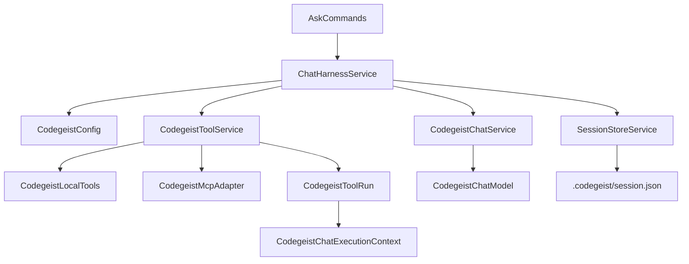
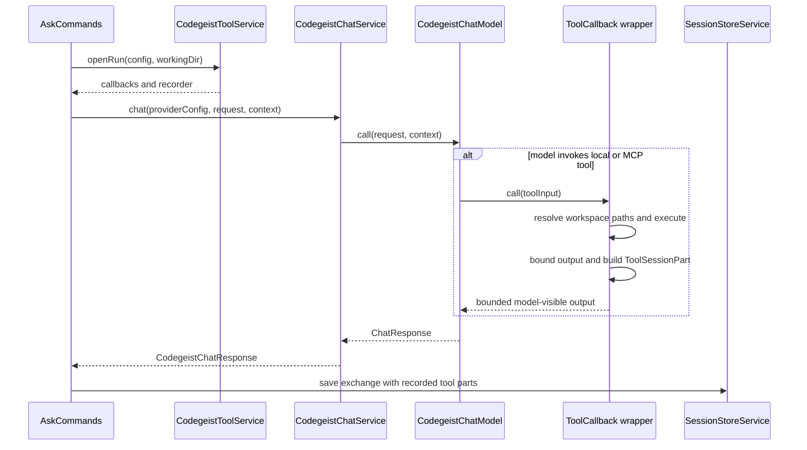

# T007_03 MCP And Read Write Tools Specification

Planned specification for adding Codegeist-owned MCP callbacks and the first
read/write file tools to the T007 session-store tool harness.

This document is intentionally specification-only. It describes the desired
implementation contract for `T007_03`; it does not claim that the runtime code
already exists.

## Purpose

`T007_03` should make tools available to resumable chats without changing the
provider request contract or storing runtime configuration in
`.codegeist/session.json`.

The slice adds two tool sources:

- MCP tools from direct `codegeist.yml` `mcp:` client definitions.
- Codegeist-owned local file tools for `read`, `list`, `glob`, `grep`, and
  `write` under the active chat working directory.

The slice also adds bounded tool activity persistence so future TUI and patch/shell
work can render what happened in a continued chat.

## Current Baseline

Implemented before this slice:

- `app/codegeist/cli` is the only runtime module.
- `CodegeistConfig` can parse direct top-level `mcp:` YAML through
  `McpClientsRootElement`, `McpClientsConfig`, and `McpClientConfig`.
- The first MCP config shape is a YAML object keyed by client id with `type`,
  `command`, and `args` fields. `type` remains the transport kind.
- `ask` selects the first configured provider, uses `ProviderConfig.defaultModel()`,
  creates `CodegeistChatRequest(model, prompt)`, and calls `CodegeistChatService`.
- `CodegeistChatRequest` contains only runtime `model` and `prompt`.
- `SessionStoreService` writes `.codegeist/session.json` with user and assistant
  text parts, and `ask -c/--continue` appends to the newest session.
- `SessionPart` currently supports `text` and `compaction` only.

Not implemented before this slice:

- `spring-ai-starter-mcp-client` is not in `app/codegeist/cli/pom.xml`.
- No MCP client is created from Codegeist config.
- No Spring AI MCP tool callbacks are exposed to chat calls.
- No Codegeist-owned local file tools exist.
- No tool calls or tool results are persisted in `.codegeist/session.json`.

## Research Reference

Source-backed answers for the OpenCode and Spring AI Agent Utils question catalog
live in
`docs/tasks/T007_build-codegeist-runtime-harness/mcp-and-readwrite-tools-research.md`.
The broader coding-agent harness comparison table lives in
`docs/tasks/T007_build-codegeist-runtime-harness/coding-agent-harness-implementations.md`.

Key conclusions:

- OpenCode evidence supports a harness boundary because tool execution crosses
  provider calls, dynamic MCP registration, workspace resolution, output bounds, and
  persisted assistant message parts.
- Spring AI Agent Utils is useful as source inspiration and a callback-pattern
  reference, but its file tools must not be exposed directly without Codegeist
  workspace resolution, output bounds, and session persistence wrappers.
- Codegeist should start with a narrow `ChatHarnessService` plus subordinate
  `CodegeistToolRun`, not a broad runtime framework.
- Aider, SWE-agent, and mini-SWE-agent support this narrowness from smaller-agent
  designs: keep repo maps, git automation, benchmark trajectories, Docker execution,
  and shell-first loops out of T007_03.

## Design Decisions

- Keep `CodegeistChatRequest` unchanged. It must remain only runtime model and
  prompt.
- Add a narrow `ChatHarnessService` for this slice. It should select the configured
  provider/model, open a scoped tool run, call the chat service, save prompt/tool
  activity/assistant text, and return the response content to command or future TUI
  callers.
- Add chat-run context beside the request instead of putting tools, history,
  provider config, selected provider, selected model, MCP config, or session state
  into the request.
- Build tool callbacks lazily for a chat run. `--show-config`, config loading, and
  Spring context startup must not spawn MCP processes.
- Treat local file tools as Codegeist-owned behavior. Spring AI Agent Utils may be a
  source reference or private delegate only after Codegeist applies workspace
  resolution, output bounds, and session persistence.
- Prefer explicit per-chat `ToolCallback` wrappers over annotation-only singleton
  `@Tool` methods. Wrappers can capture the active working directory, bounds, and
  recorder without leaking these details into global application state.
- Store bounded tool activity in the session store, but do not store the enabled tool
  registry, MCP client definitions, MCP runtime status, permission settings, or TUI
  state.

## User-Facing Config Contract

Codegeist-owned MCP config stays in direct `codegeist.yml`, not in Spring AI's
public property tree.

```yaml
mcp:
  filesystem:
    type: stdio
    command: npx
    args:
      - -y
      - "@modelcontextprotocol/server-filesystem"
      - .
```

Rules:

- `mcp` is a top-level map keyed by client id.
- Client ids are durable Codegeist config ids. They are not stored in the session
  store.
- The first supported client `type` is `stdio`.
- `command` is required and must be non-blank.
- `args` is optional and defaults to an empty list.
- Unsupported client types must fail with a clear Codegeist config or MCP adapter
  error before a provider call attempts to use them.
- Do not add public config fields for environment variables, timeout, enablement,
  SSE, HTTP, OAuth, server discovery, or server lifecycle management in this slice.
- A fixed internal request timeout may be used by the MCP adapter, but it is not a
  public `codegeist.yml` field in `T007_03`.

## Runtime Shape

The first implementation should add only the runtime types needed by focused tests.
Names may change during implementation if a better local fit appears, but the
responsibilities should stay stable.



Suggested package responsibilities:

| Package | Planned responsibility |
| --- | --- |
| `ai.codegeist.app.chat` | Existing ask command, narrow `ChatHarnessService`, provider chat boundary, and chat execution context. |
| `ai.codegeist.app.tool` | Local tool callbacks, tool run scope, output bounds, workspace resolution, and tool result records. |
| `ai.codegeist.app.mcp` | Map Codegeist MCP config into Spring AI MCP clients and MCP tool callbacks. |
| `ai.codegeist.app.session` | Add the persisted `ToolSessionPart` and append tool parts with text exchanges. |

## Chat Harness And Execution Context

`AskCommands` should be a thin Spring Shell adapter. It should delegate the prompt
turn to `ChatHarnessService`, then print only the returned response content.

Planned harness shape:

```java
CodegeistChatResponse ask(boolean continueSession, String prompt)
```

The harness should own provider selection, default model selection, scoped tool-run
opening, chat call, session-store save, and tool-run cleanup.

The chat path needs a new context object beside `CodegeistChatRequest`.

Minimum context data:

- `ToolCallback[]` or equivalent callback collection for the current chat run.
- A tool activity recorder that receives bounded completed tool results in call
  order.
- The active working directory as resolved by the session store service.

The context is runtime-only. It must not be serialized into `.codegeist/session.json`
as a config object.

`CodegeistChatService` should keep the current method and add a tool-aware overload:

```java
CodegeistChatResponse chat(ProviderConfig providerConfig, CodegeistChatRequest request)
CodegeistChatResponse chat(
        ProviderConfig providerConfig,
        CodegeistChatRequest request,
        CodegeistChatExecutionContext context)
```

`CodegeistChatModel` should treat the context-aware call method as the provider
implementation contract. Keep no-tool compatibility at `CodegeistChatService` by
having its request-only overload supply an empty execution context before invoking the
model.

For Spring AI direct `ChatModel` calls, use runtime tool options rather than global
provider configuration. Spring AI `2.0.0-M6` supports tool callbacks through chat
options such as `ToolCallingChatOptions` or provider-specific options with
`toolCallbacks`.

## Tool Run Scope

MCP clients may start external processes. The first runtime should use an explicit
chat-run scope so resources are closed after the provider call.

Suggested shape:

```java
try (CodegeistToolRun toolRun = toolService.openRun(config, workingDir)) {
    CodegeistChatExecutionContext context = toolRun.executionContext();
    CodegeistChatResponse response = chatService.chat(providerConfig, request, context);
    sessionStoreService.saveExchangeToCurrentSession(
            continueSession,
            prompt,
            response.content(),
            toolRun.completedToolParts());
}
```

Rules:

- Opening a tool run builds local callbacks immediately.
- Opening a tool run builds MCP callbacks only from configured MCP clients.
- The run owns any closeable MCP clients created for that provider call.
- Failed MCP setup should fail the chat run before the provider call.
- Tool activity recorded before a provider failure may be returned to the command
  layer, but this slice does not need complex partial-save recovery unless a test
  requires it.

## MCP Integration

Add this dependency to `app/codegeist/cli/pom.xml` during implementation:

```xml
<dependency>
    <groupId>org.springframework.ai</groupId>
    <artifactId>spring-ai-starter-mcp-client</artifactId>
</dependency>
```

Spring AI APIs identified for the implementation:

- `McpClient.sync(...)` for a synchronous MCP client.
- `StdioClientTransport` with `ServerParameters` for first `stdio` clients.
- `SyncMcpToolCallbackProvider` to turn MCP clients into Spring AI
  `ToolCallback` values.
- `ToolCallbackProvider` as a test seam for fake MCP callback availability.

MCP rules:

- Create MCP clients lazily from `CodegeistConfig.rootElement(McpClientsRootElement.class)`.
- Do not start MCP clients while parsing config or printing `--show-config`.
- Do not store MCP command, args, connected status, resources, or tool definitions in
  `.codegeist/session.json`.
- Do not add MCP server management commands in this slice.
- Use a fake `ToolCallbackProvider` test before adding process-level MCP tests.
- If real stdio setup is unit-tested, use a lightweight local process fixture only
  when it is deterministic and does not require network access.

## Local File Tool Names

Use prefixed Spring AI callback names to avoid collisions with MCP callbacks and
future provider-native names.

| Tool callback name | User-level behavior |
| --- | --- |
| `codegeist_read` | Read a bounded text slice from one file. |
| `codegeist_list` | List bounded entries under one directory. |
| `codegeist_glob` | Match file paths under the working directory. |
| `codegeist_grep` | Search text files under the working directory with a Java regex. |
| `codegeist_write` | Create or overwrite one allowed text file. |

Persist the callback name in `ToolSessionPart.tool`.

## Workspace Resolution

All local file tools use the same active workspace for resolving relative paths.

Workspace source:

- The default active workspace is the current process working directory.
- Direct `codegeist.yml` may override it with `workspace.directory`.
- Relative `workspace.directory` values resolve against the process working
  directory.
- Absolute `workspace.directory` values are normalized and used directly.
- A filesystem root or drive root is valid when a session intentionally needs broad
  filesystem access.

Path resolution:

- Relative tool input paths resolve against the active workspace.
- Absolute tool input paths are accepted as caller-provided filesystem paths.
- This slice does not add permission rules, path escape rejection, symlink rejection,
  session-store write protection, or ignored/generated-file filtering.

Rendered paths:

- Model-visible and persisted paths should be relative to the active workspace when
  practical.
- If a path cannot be rendered relative to the workspace, use the normalized path the
  tool actually accessed.

Side effects:

- `read`, `list`, `glob`, and `grep` are read-only.
- `write` may create or overwrite a regular text file only.
- `write` should not delete files, rename files, create directories, change file
  permissions, or apply patches.

## Output Bounds

Every tool returns bounded model-visible output and persists the same bounded
preview. Suggested first constants:

| Limit | Suggested value | Applies to |
| --- | --- | --- |
| `MAX_PREVIEW_CHARS` | `8000` | Model-visible output and persisted output preview. |
| `MAX_LINE_CHARS` | `500` | Individual read and grep output lines. |
| `MAX_RESULTS` | `200` | List, glob, and grep result count. |
| `DEFAULT_READ_LINES` | `200` | `codegeist_read` when no limit is supplied. |

Rules:

- Truncate before returning output to Spring AI and before persisting to the session
  store.
- Persist only the bounded preview string plus result counts when they are cheap to
  know.
- Do not persist full file contents, full grep output, full directory trees, or full
  write content beyond the bounded preview.
- Error messages must be concise and must not include secret-bearing config values.

## Local Tool Contracts

### `codegeist_read`

Input fields:

| Field | Required | Meaning |
| --- | --- | --- |
| `path` | yes | File path. Relative values resolve against the active workspace. |
| `offset` | no | 1-based starting line. Defaults to `1`. |
| `limit` | no | Maximum lines to return. Defaults to `DEFAULT_READ_LINES` and is capped. |

Behavior:

- Reject missing paths, directories, and binary files.
- Return line-numbered text for the requested bounded range.
- Report total returned lines and truncation when known.

### `codegeist_list`

Input fields:

| Field | Required | Meaning |
| --- | --- | --- |
| `path` | no | Directory path. Relative values resolve against the active workspace. Defaults to `.`. |
| `limit` | no | Maximum entries to return. Defaults to `MAX_RESULTS` and is capped. |

Behavior:

- Reject file paths.
- Return stable lexicographic entries with a directory marker.
- Do not recurse in the first slice unless a focused test adds a `depth` contract.

### `codegeist_glob`

Input fields:

| Field | Required | Meaning |
| --- | --- | --- |
| `pattern` | yes | Java glob pattern, evaluated under the base path. |
| `path` | no | Base directory. Relative values resolve against the active workspace. Defaults to `.`. |
| `limit` | no | Maximum matched paths. Defaults to `MAX_RESULTS` and is capped. |

Behavior:

- Resolve relative base paths against the active workspace.
- Return relative matched paths in stable lexicographic order.
- Match files and directories unless implementation tests intentionally narrow it.
- Do not shell out to `find` or `grep` for this tool.

### `codegeist_grep`

Input fields:

| Field | Required | Meaning |
| --- | --- | --- |
| `pattern` | yes | Java regular expression. |
| `path` | no | File or directory. Relative values resolve against the active workspace. Defaults to `.`. |
| `include` | no | Optional Java glob include filter such as `**/*.java`. |
| `caseInsensitive` | no | Whether to use case-insensitive regex matching. Defaults to `false`. |
| `limit` | no | Maximum matching lines. Defaults to `MAX_RESULTS` and is capped. |

Behavior:

- Search text files only.
- Return relative path, line number, and bounded line preview.
- Keep output stable by sorting candidate files lexicographically.
- Return a clear failure for invalid regex syntax.
- Do not support multiline, before/after context, replacement, or shell-backed grep
  in this slice.

### `codegeist_write`

Input fields:

| Field | Required | Meaning |
| --- | --- | --- |
| `path` | yes | File path. Relative values resolve against the active workspace. |
| `content` | yes | Text content to write. |

Behavior:

- Create a new regular text file when the parent directory exists.
- Overwrite an existing regular text file.
- Reject directories and missing parent directories.
- Return affected relative path, byte or character count, and whether the file was
  created or overwritten.
- Persist only a bounded content preview, not the full content when it exceeds
  `MAX_PREVIEW_CHARS`.
- Do not implement patch, exact edit, insertion, deletion, chmod, mkdir, or rename.

## Tool Result Persistence

Add a minimal `ToolSessionPart` subtype in `ai.codegeist.app.session`.

Suggested persisted fields:

| Field | Meaning |
| --- | --- |
| `id` | Session part id. |
| `type` | Always `tool`. |
| `callId` | Runtime call id generated by Codegeist for this tool execution. |
| `tool` | Tool callback name, for example `codegeist_read`. |
| `status` | `completed` or `failed` for this slice. |
| `input` | Sanitized bounded scalar map of model-supplied inputs. |
| `outputPreview` | Bounded model-visible result or failure text. |
| `resultCount` | Number of entries or matches when relevant and known. |
| `affectedPaths` | Relative paths affected by mutating tools. |
| `errorMessage` | Bounded failure message for failed calls. |

Rules:

- Add `ToolSessionPart` to `SessionPart` Jackson subtype metadata.
- Add `ToolSessionPart` to native reflection metadata.
- Keep `ToolSessionPart` small. Do not add title, timing, token counts, tool server
  metadata, MCP client definitions, or extra lifecycle states in this slice.
- Tool parts should be recorded in call order.
- A successful exchange should append one user `text` message and one assistant
  message containing recorded `tool` parts followed by the assistant `text` part.
- If no tools run, the existing text-only session shape should remain unchanged.

Illustrative JSON shape:

```json
{
  "id": "aaaaaaaa-aaaa-4aaa-8aaa-aaaaaaaaaaaa",
  "type": "tool",
  "callId": "bbbbbbbb-bbbb-4bbb-8bbb-bbbbbbbbbbbb",
  "tool": "codegeist_read",
  "status": "completed",
  "input": {
    "path": "README.md",
    "offset": 1,
    "limit": 20
  },
  "outputPreview": "1: # Codegeist\n2: ...",
  "resultCount": 20,
  "affectedPaths": []
}
```

## Chat And Session Sequence



## Error Behavior

Tool failures should be model-visible bounded strings and persisted failed tool
parts.

Examples:

- Invalid regex: failed `codegeist_grep` result with regex error summary.
- Missing file for read: failed result saying the file does not exist.
- Write target parent missing: failed result with a concise write-target error.
- MCP setup failure: fail the chat run before provider execution unless a focused
  implementation chooses to surface it as failed MCP tool availability.

Do not map tool execution failures through `NoSessionToContinueException`; that
exception remains specific to corrupt or unsupported existing session stores.

## Test Plan

Use the Taskfile from `app/codegeist/cli` for all implementation verification.

### Config Tests

- Keep the existing config test proving a direct `mcp:` map loads one `stdio` client.
- Add or update a focused test proving unsupported MCP `type` fails clearly if the
  validation is added in this slice.

### MCP Tests

- `CodegeistMcpAdapterTest`: maps a `stdio` `McpClientConfig` into the adapter's
  client-creation path without exposing Spring AI properties as public config.
- `CodegeistToolServiceTest`: uses a fake `ToolCallbackProvider` to prove configured
  MCP callbacks are included in the chat-run callback list.
- No network-dependent MCP tests in the first implementation.

### Local Tool Tests

- `CodegeistLocalToolsTest`: uses `@TempDir` fixtures for read/list/glob/grep/write.
- Prove relative tool paths resolve from the active workspace.
- Prove absolute tool paths are accepted as caller-provided filesystem paths.
- Prove read output line and character bounds.
- Prove list, glob, and grep result limits.
- Prove grep invalid regex returns a failed bounded result.
- Prove write creates and overwrites a file relative to the active workspace.

### Session Store Tests

- `SessionStoreServiceTest`: prove `ToolSessionPart` round-trips through JSON.
- Prove saved tool output is bounded and does not persist unbounded file content.
- Prove serialized session JSON still excludes representative runtime-only fields:
  provider config, selected provider, selected model, MCP client definitions,
  enabled tool definitions, permission state, runtime status, and TUI state.

### Chat Path Tests

- `AskCommandsSessionStoreTest` or a focused chat service test should use a fake
  chat model or fake callback invocation to prove tool parts collected during a chat
  run are saved with the text exchange.
- Prove `CodegeistChatRequest` still has only `model` and `prompt` components.
- Do not require real Ollama or hosted providers for the T007_03 tool persistence
  tests.

Candidate focused command after implementation:

```bash
task test TEST=CodegeistLocalToolsTest,CodegeistToolServiceTest,CodegeistMcpAdapterTest,SessionStoreServiceTest,AskCommandsSessionStoreTest
```

Final JVM verification after implementation:

```bash
task test
```

Run native smoke only if the implementation changes native-sensitive metadata,
resource loading, or command startup behavior beyond adding reflection metadata for
`ToolSessionPart`.

## Implementation Order

Recommended order after this specification is accepted:

1. Add focused failing tests for local file tools and workspace resolution.
2. Implement `WorkspaceResolver`, `ToolOutputBounds`, and local file tool execution.
3. Add `ToolSessionPart` and session-store append support for recorded tool parts.
4. Add chat-run context and tool-aware `CodegeistChatService`/`CodegeistChatModel`
   overloads while keeping `CodegeistChatRequest` unchanged.
5. Add `CodegeistToolService` to assemble local callbacks.
6. Add the Spring AI MCP starter dependency and a minimal MCP adapter.
7. Add fake MCP callback availability tests.
8. Update `AskCommands` to use the tool run and save recorded tool parts.
9. Update current-state architecture docs after runtime behavior is implemented.

## Non-Goals

- No patch/edit tools.
- No shell command tools.
- No terminal TUI.
- No custom MCP transports beyond `stdio`.
- No MCP OAuth.
- No MCP server discovery or server management commands.
- No hosted provider calls.
- No broad tool registry, permission prompt UI, path-safety engine, or filesystem
  allow/deny rules.
- No provider-facing multi-turn reconstruction from stored sessions.
- No database, server runtime, API/SDK, Vaadin, PF4J, JBang, LSP, skills, memory, or
  subagents.

## Documentation Updates After Implementation

After implementation changes source behavior, update:

- `docs/developer/architecture/architecture.md` with implemented packages, classes,
  runtime flow, and tests.
- `docs/tasks/T007_build-codegeist-runtime-harness/tasks/T007_03_add-mcp-and-read-write-tools/task.md`
  with completed progress and verification evidence.
- `docs/memory-bank/chat.md` if future sessions need the implementation state.
