# OpenCode Workflow Analysis

Source-backed analysis of how OpenCode implements resumable chat, tool execution,
MCP, permissions, and TUI updates. Use this document as behavior evidence for the
Codegeist T007 chat-file tool harness, not as an architecture blueprint to copy.

## Scope

This document describes the implemented OpenCode workflow that is relevant to
Codegeist T007:

- Resumable session state.
- Prompt submission and assistant response generation.
- Message and part persistence.
- Tool discovery, execution, result persistence, and output bounding.
- Permission and side-effect gates for file and shell tools.
- MCP client integration and MCP tool exposure.
- TUI state synchronization and rendering inputs.

Codegeist T007 should translate the observable behavior into a Java/Spring,
file-only harness centered on `chat.json`. It should not copy OpenCode's SQLite
storage, server/SDK runtime, Effect architecture, OpenTUI/Solid UI framework,
plugin system, subagents, memory, or broader session infrastructure.

## Evidence Sources

OpenCode source paths inspected under `docs/third-party/opencode/source/`:

- `packages/opencode/src/session/session.sql.ts` - SQLite schema for sessions,
  messages, parts, todos, and permissions.
- `packages/opencode/src/session/session.ts` - session creation, message listing,
  part updates, session permissions, forks, and sync events.
- `packages/opencode/src/session/message-v2.ts` - message, part, tool-state, and
  model-message conversion schemas.
- `packages/opencode/src/session/prompt.ts` - prompt submission, prompt loop,
  tool resolution, MCP tool wrapping, provider calls, and loop continuation.
- `packages/opencode/src/session/processor.ts` - streaming event handling,
  tool-part lifecycle updates, text deltas, step snapshots, and cleanup.
- `packages/opencode/src/tool/tool.ts` - common tool contract, execution context,
  validation wrapping, and output truncation hook.
- `packages/opencode/src/tool/registry.ts` - built-in and custom tool registry.
- `packages/opencode/src/tool/read.ts` - read/list behavior, binary checks,
  line/byte limits, permissions, and metadata.
- `packages/opencode/src/tool/write.ts` - write behavior, edit permission gate,
  diff metadata, formatting, file watcher events, and diagnostics.
- `packages/opencode/src/tool/edit.ts` - exact edit behavior, per-file lock,
  permission diff preview, formatting, and diagnostics.
- `packages/opencode/src/tool/apply_patch.ts` - patch parsing, path validation,
  permission metadata, file updates, watcher events, diagnostics, and summaries.
- `packages/opencode/src/tool/shell.ts` - command parsing, cwd/path scanning,
  permissions, timeout/abort, output bounding, exit metadata, and truncation files.
- `packages/opencode/src/tool/truncate.ts` - central truncation limits and saved
  full-output files.
- `packages/opencode/src/tool/external-directory.ts` - outside-worktree permission
  gate for file and directory targets.
- `packages/opencode/src/config/mcp.ts` - MCP local and remote config schemas.
- `packages/opencode/src/mcp/index.ts` - MCP connection lifecycle, tool conversion,
  status, resources, prompts, OAuth, and connect/disconnect APIs.
- `packages/opencode/src/cli/cmd/tui/context/sync.tsx` - TUI sync store for
  providers, config, sessions, messages, parts, permissions, questions, MCP, and
  runtime status.
- `packages/opencode/src/cli/cmd/tui/routes/session/index.tsx` - session screen
  state inputs for transcript rendering, prompt visibility, permissions, questions,
  status, sidebar, and tool rendering.
- `packages/opencode/src/cli/cmd/tui/routes/session/permission.tsx` - permission
  prompt rendering for edit, shell, and other side-effect gates.

`docs/third-party/opencode/repomix-output.xml` is available for follow-up deep
dives. This workflow document is based on the local source checkout and existing
T007 third-party notes rather than a broad packed-source sweep.

## Workflow Overview

OpenCode's workflow is centered on a persisted session and a streaming processor.
A prompt is added as a user message, the loop creates an assistant message, the
model stream emits text and tool events, the processor persists each event as
message parts, and the TUI renders the same state through SDK sync events.

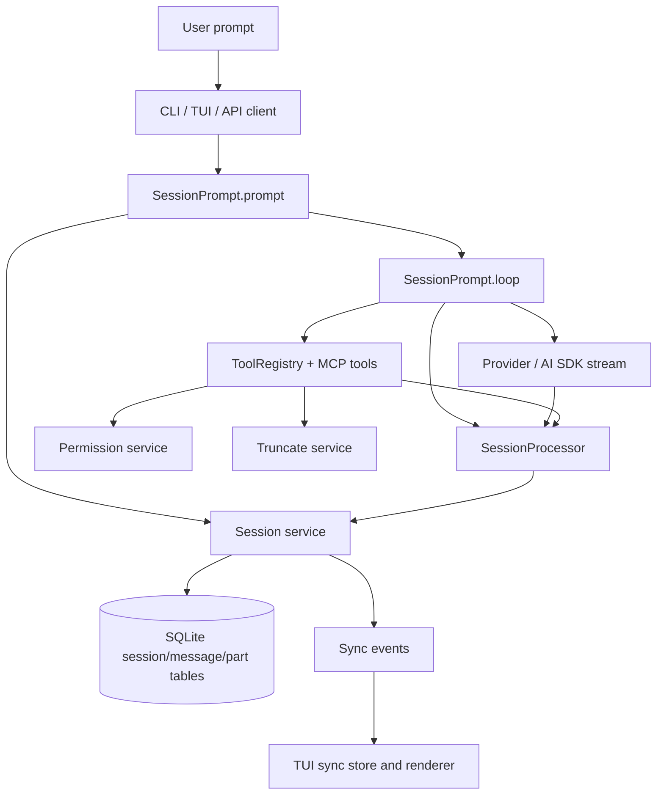

## Persistence Model

OpenCode persists resumable work in SQLite, not in a portable chat file. The
core persisted objects are:

- `SessionTable` stores session identity, project/workspace, directory, path,
  title, agent, selected model, permission rules, summary/revert metadata, and
  timestamps.
- `MessageTable` stores user and assistant message metadata as JSON data.
- `PartTable` stores message parts as JSON data, including text, files, tools,
  reasoning, snapshots, patches, retries, and compaction markers.
- `PermissionTable` stores project-level permission rules.
- `TodoTable` and `SessionMessageTable` support additional OpenCode behavior that
  is outside the minimum Codegeist T007 chat-file scope.

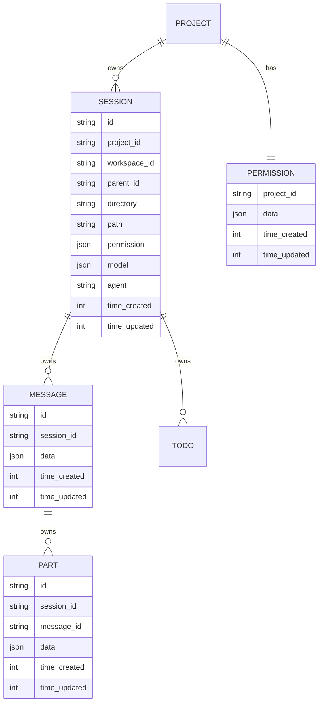

### Codegeist Translation

For T007, `chat.json` should be the portable equivalent of the subset of
OpenCode `session/message/part` that is needed to resume and render a local chat:

- Keep schema version, chat id, timestamps, working directory, messages, message
  parts, tool calls, tool results, bounded summaries, and errors.
- Do not persist provider config, selected provider, selected model, MCP client
  definitions, enabled tool definitions, permission rules, runtime status, or TUI
  layout state in `chat.json`.
- Resolve provider/model/tools/MCP/status from current runtime configuration when
  a chat is continued.

## Message And Part Model

OpenCode stores messages separately from message parts. This is important because
text, tool calls, tool results, patch summaries, snapshots, and reasoning can be
updated independently while the model stream is running.

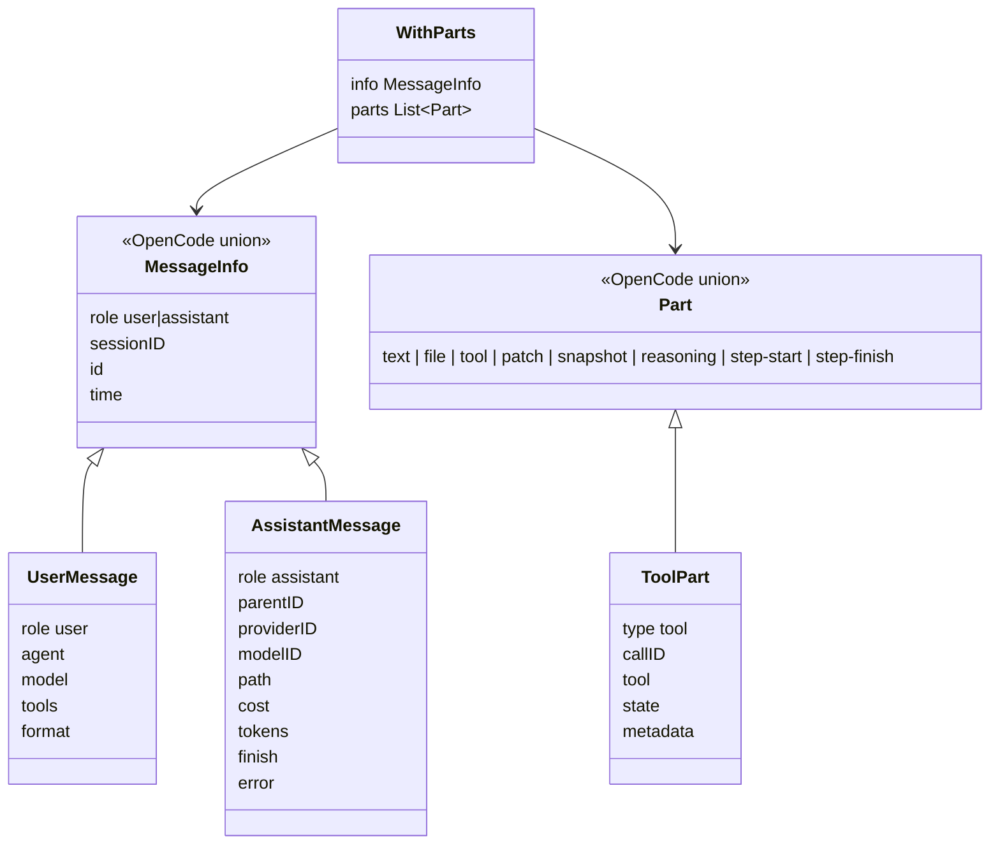

`MessageV2.toModelMessagesEffect` rebuilds provider-facing AI SDK messages from
the persisted `WithParts[]`. It includes user text/file parts, assistant text,
tool calls, tool results, step markers, and media/resource handling. This is the
key replay boundary: persisted conversation state must be rich enough to rebuild
model input without persisting runtime-only configuration.

### Codegeist Translation

Codegeist should prefer a message-with-parts shape over only flat top-level
`toolResults`. A separate top-level tool index can still exist if needed for fast
lookup, but the resumable chat transcript should remain chronological and
renderable from messages and parts.

## Prompt Flow

OpenCode's prompt path is split into `prompt`, `loop`, and `processor` roles.

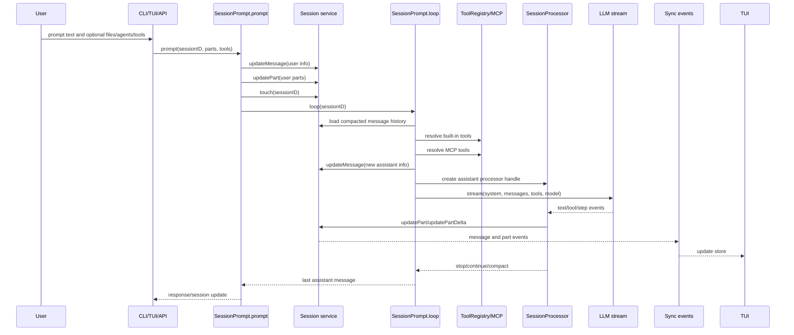

Important behavior:

- `SessionPrompt.prompt` creates and stores the user message and parts before the
  provider call starts.
- `SessionPrompt.loop` repeatedly calls the provider until the assistant is done,
  tool calls are resolved, compaction is needed, or max steps are reached.
- `SessionProcessor` owns the streaming write path. Text deltas update the active
  text part; tool events update tool parts; step events update snapshots and patch
  parts.
- `SessionRunState` prevents competing runs for the same session and provides
  cancellation semantics.

### Codegeist Translation

T007 can use a simpler synchronous flow first:

1. `ask --chat <chat.json>` loads or creates the chat file.
2. Append user message.
3. Resolve provider/model/tools from current config/runtime.
4. Call the model.
5. Execute requested tools through Codegeist tool services.
6. Append bounded tool activity and assistant message parts.
7. Save the same chat file.

The important OpenCode behavior to preserve is not the server loop; it is the
durable sequence of user message, assistant message, tool states, tool result,
continued assistant response, and final save.

## Tool Lifecycle

OpenCode represents each tool call as a `ToolPart` with a state union:

- `pending` - model has started tool input, but final input is not yet available.
- `running` - tool name and input are known, execution has started.
- `completed` - output, title, metadata, timing, and optional attachments are
  available.
- `error` - execution failed or was aborted, with error text and timing.

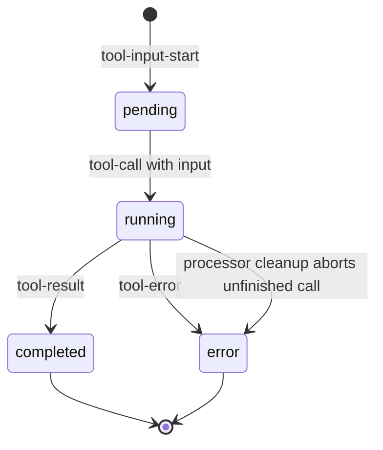

`SessionProcessor` is the source of truth for these state transitions:

- `tool-input-start` creates or updates a `ToolPart` with `pending` state.
- `tool-call` updates the same part to `running` and stores input.
- `tool-result` calls `completeToolCall`, storing output, metadata, title,
  attachments, and time.
- `tool-error` calls `failToolCall`, storing error text and time.
- Cleanup marks unfinished running tool calls as error with an abort message.

### Codegeist Translation

Codegeist can map this to:

- `PENDING` only when streaming tool input is implemented.
- `RUNNING`, `COMPLETED`, `FAILED`, `TIMED_OUT`, and `CANCELLED` for T007's first
  bounded local tool path.
- Tool result fields should include tool name, call id, input summary, status,
  timestamps/duration, bounded output, structured metadata, error message, and any
  file/change/shell summary needed by TUI rendering.

## Tool Architecture

OpenCode tools share a common contract in `tool.ts`:

- `Tool.Def` contains `id`, `description`, parameter schema, `execute`, and
  optional validation-error formatting.
- `Tool.Context` contains session id, message id, agent, abort signal, call id,
  previous messages, metadata update callback, and permission request callback.
- `Tool.ExecuteResult` contains `title`, `metadata`, `output`, and optional file
  attachments.
- `Tool.define` wraps each tool with input validation, tracing, and default output
  truncation.

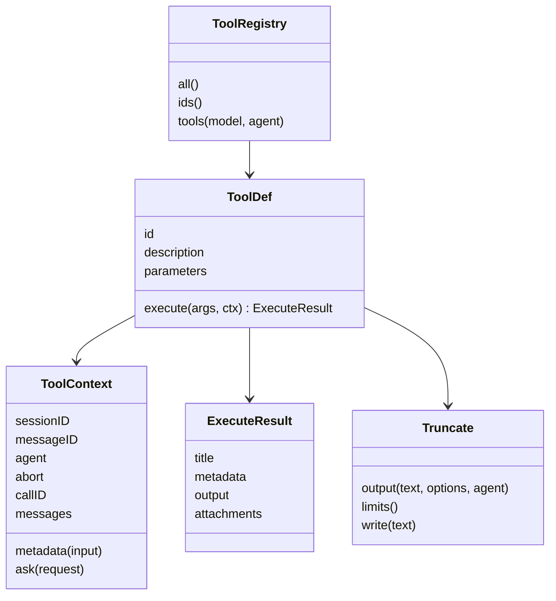

`ToolRegistry` initializes built-ins and custom/plugin tools. The built-in set
relevant to T007 includes `read`, `glob`, `grep`, `write`, `edit`, `apply_patch`,
and `shell`.

### Codegeist Translation

Codegeist should use its own Java contract, but the same behavioral split is
useful:

- Descriptor: name, description, input contract, and side-effect flags.
- Context: working directory, chat path, cancellation/timeout, and runtime status.
- Result: status, bounded model-visible output, and structured TUI/file summary.
- Service: registry and execution boundary that can persist tool activity into
  `chat.json`.

## Permission And Safety Gates

OpenCode tools call `ctx.ask(...)` before side effects or sensitive access. The
permission service merges agent-level and session-level rules. The TUI renders
permission requests and lets the user allow once, always, or reject.

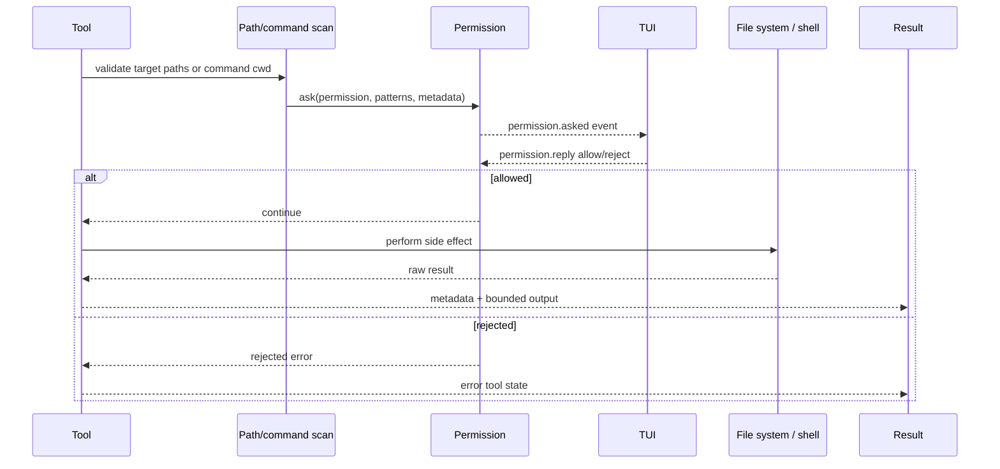

Key examples:

- `read` asks for `read` permission and checks external directories before reading.
- `write` asks for `edit` permission with a diff preview before writing.
- `edit` asks for `edit` permission with diff metadata before modifying files.
- `apply_patch` validates all hunk paths, builds per-file diff metadata, asks for
  `edit` permission, then applies changes.
- `shell` parses commands, scans path-like arguments, asks for external-directory
  access when needed, asks for shell permission patterns, then executes.

`external-directory.ts` checks whether a target is inside the active OpenCode
instance path. Outside paths require an `external_directory` permission request.

### Codegeist Translation

T007 should start with explicit, tested working-directory and cwd boundaries:

- Read/list/glob/grep/write should be scoped to the chat working directory unless
  a later task deliberately adds external-directory permissions.
- Patch/edit should reject outside-workingDir mutations before side effects.
- Shell should reject cwd escape before execution and record timeout/exit status.
- Do not claim a stronger sandbox than the implemented checks provide.

## Bounded Output Strategy

OpenCode bounds output at several levels:

- `Truncate` defaults to `MAX_LINES = 2000` and `MAX_BYTES = 50 * 1024`.
- Large tool output is written to a truncation file and the model receives a
  preview plus a hint.
- `read` enforces line count, byte count, line length, binary detection, image/PDF
  handling, and directory pagination.
- `shell` tracks live output, writes large output to a truncation file, keeps a
  tail preview, and stores `exit`, `description`, `truncated`, and `outputPath`
  metadata.

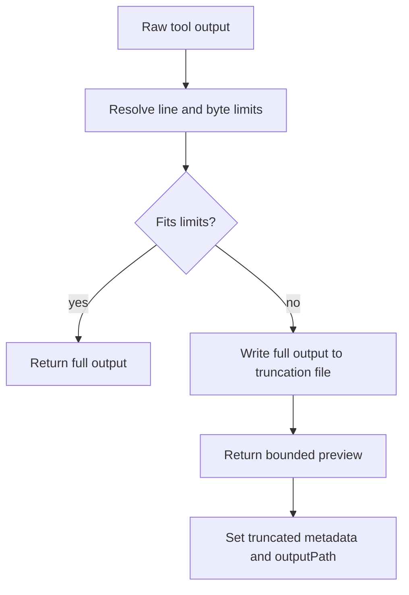

### Codegeist Translation

T007 should persist bounded output, not raw unbounded data. A future Java service
such as `ToolOutputBounds` should centralize:

- Max characters or bytes.
- Max lines.
- Head/tail selection where useful.
- Truncation markers.
- Optional durable full-output sidecar path only if a focused task needs it.

## Read, Write, Edit, Patch, And Shell Behavior

### Read/List

`read.ts` handles both directories and files:

- Relative paths resolve from the active instance directory.
- External directory access is permission-gated.
- Directories return sorted entries with offset/limit pagination.
- Files get sampled for binary detection.
- Images/PDFs can become attachments.
- Text files are returned with line numbers, line limits, byte limits, and
  continuation instructions.

### Write

`write.ts` creates or overwrites a file:

- Resolve target path.
- Check external directory boundary.
- Read old content if present.
- Build a diff preview.
- Ask `edit` permission.
- Write content with BOM handling.
- Format file if configured.
- Publish file and watcher events.
- Collect LSP diagnostics.

### Edit

`edit.ts` replaces exact text and uses a per-file semaphore:

- Reject missing `filePath` and identical old/new strings.
- Resolve and boundary-check path.
- Lock by normalized file path.
- Preserve line endings and BOM.
- Generate diff before approval.
- Ask `edit` permission.
- Write, format, publish events, collect diagnostics.
- Return diff and file summary metadata.

### Apply Patch

`apply_patch.ts` accepts a patch envelope:

- Parse patch hunks.
- Reject empty or invalid patches.
- Validate all target and move paths.
- Derive old/new content and per-file metadata.
- Build total diff and ask `edit` permission.
- Apply add/update/move/delete changes.
- Format changed files, publish file watcher events, collect diagnostics.
- Return summary lines like `A`, `M`, and `D` plus metadata.

### Shell

`shell.ts` executes a command through the configured shell:

- Resolve working directory from input or instance directory.
- Reject negative timeout.
- Parse command with tree-sitter bash or PowerShell parser.
- Scan for path arguments and command patterns.
- Ask external-directory and shell permissions.
- Build shell environment with plugin-provided additions.
- Spawn process with timeout and abort handling.
- Stream output, bound output, save large output, and record exit metadata.

### Codegeist Translation

The Codegeist first implementation can be smaller:

- `ReadFileTool`, `ListFilesTool`, `GlobFilesTool`, and `GrepFilesTool` should
  return bounded summaries under `workingDir`.
- `WriteFileTool` can support create/overwrite only, with path guard and bounded
  result metadata.
- `EditFileTool` and `ApplyPatchTool` should be separate only when the active
  child task needs both exact edit and patch semantics.
- `ShellTool` should support cwd, timeout, exit code, stdout/stderr previews, and
  timeout/cancel status.

## MCP Workflow

OpenCode config supports local and remote MCP servers:

- Local: `type: local`, `command`, optional `environment`, `enabled`, `timeout`.
- Remote: `type: remote`, `url`, optional `headers`, `oauth`, `enabled`, `timeout`.

The MCP service creates clients, connects transports, lists tool definitions,
converts MCP tool definitions into AI SDK dynamic tools, exposes status, prompts,
resources, connect/disconnect, and OAuth operations.

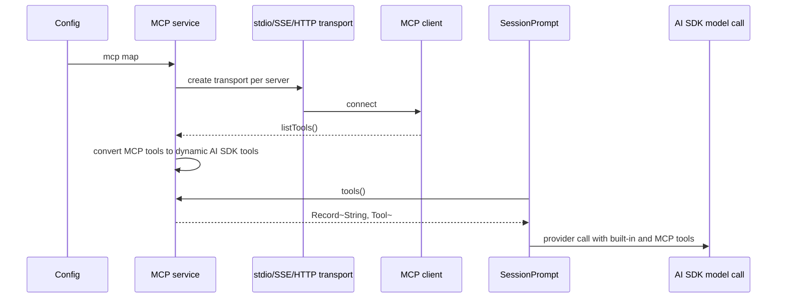

`SessionPrompt.resolveTools` wraps MCP tool execution so it triggers plugin hooks,
asks permission for the MCP tool name, calls the underlying MCP tool, converts
text/image/resource content into output and attachments, and applies truncation.

### Codegeist Translation

Codegeist T007 should keep the public config smaller than OpenCode's full MCP
surface:

- Start with top-level direct `codegeist.yml` `mcp:` map.
- Support only `stdio` unless a focused test requires another transport.
- Map Codegeist-owned config into Spring AI MCP client support privately.
- Keep MCP client definitions and status out of `chat.json`.
- Persist only MCP tool calls/results that occur inside the chat.

## TUI Workflow

OpenCode TUI does not read SQLite directly. It uses SDK clients and event streams
to populate a Solid store. The store contains both persisted session data and
runtime-only data:

- Persisted/session-like: `session`, `message`, `part`, `todo`, `session_diff`.
- Runtime/config/status: `provider`, `provider_default`, `config`, `agent`,
  `command`, `session_status`, `permission`, `question`, `lsp`, `mcp`,
  `mcp_resource`, `formatter`, `vcs`.

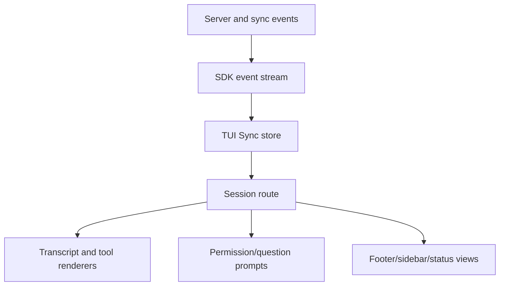

Important event handling in `sync.tsx`:

- `session.updated` inserts or updates sessions.
- `session.status` updates busy/idle state.
- `message.updated` inserts or updates message info.
- `message.part.updated` inserts or updates a message part.
- `message.part.delta` applies streaming text deltas to an existing part.
- `permission.asked` and `permission.replied` manage permission prompts.
- `question.asked`, `question.replied`, and `question.rejected` manage question
  prompts.

`routes/session/index.tsx` renders a session from `sync.session.get`,
`sync.data.message`, `sync.data.part`, permissions, questions, runtime provider
data, and UI-only settings such as sidebar visibility, timestamps, thinking
visibility, and scroll state.

### Codegeist Translation

The T007 TUI should invert OpenCode's architecture:

- Read and save one `chat.json` directly through `ChatFileService`.
- Keep runtime provider/model/MCP/tool status in transient view state.
- Render chat messages and tool activity from persisted chat state.
- Do not create a second database, SDK sync store, or server runtime.
- Keep UI-only state such as scroll offset, selected pane, keybindings, draft
  prompt, and modal state out of `chat.json`.

## Codegeist Mapping Table

| OpenCode concept | Source-backed behavior | Codegeist T007 translation |
| --- | --- | --- |
| SQLite `SessionTable` | Durable session metadata, directory, permission, model, agent. | `chat.json` stores only chat id, timestamps, workingDir, messages, and tool activity. Runtime config stays outside. |
| `MessageTable` + `PartTable` | Messages and independently updated parts. | Use message/part-like chat model so text and tool activity remain chronological. |
| `SessionPrompt.prompt` | Create user message, save parts, start loop. | `ChatHarnessService.submit` loads/creates file, appends user message, calls chat service, saves file. |
| `SessionPrompt.loop` | Repeated provider/tool loop until stop/continue/compact. | Start with one bounded local loop; add continuation only when tool-calling behavior needs it. |
| `SessionProcessor` | Converts stream events into persisted text/tool/patch parts. | Map provider/tool events into `chat.json` parts/results with bounded data. |
| `Tool.Def` and `Tool.Context` | Tool descriptor, schema, execute, metadata, permission callback. | Java tool descriptor, context, request, result, and service boundary. |
| `Truncate` | Shared line/byte bounds and saved full-output file. | `ToolOutputBounds` for bounded previews; sidecar full-output file only if needed. |
| `ctx.ask` | Permission request before reads, edits, external dirs, shell, MCP. | Start with deterministic workingDir/cwd rejection; add approval prompts only when implemented. |
| MCP service | Runtime MCP clients, status, resources, tools, OAuth. | Direct Codegeist `mcp:` config mapped privately to Spring AI MCP; persist only actual tool calls/results. |
| TUI sync store | SDK-fed state store with persisted and runtime data. | TUI view model built from `chat.json` plus transient runtime status. |

## What Codegeist Should Preserve

- Chronological chat state that can recreate model context.
- Tool calls with stable call ids, tool names, inputs, statuses, timing, outputs,
  metadata, and errors.
- Explicit state transitions for running/completed/failed tool calls.
- Bounded model-visible and TUI-visible output.
- Path/cwd validation before side effects.
- Diff or change summaries for write/edit/patch tools.
- Shell command, cwd, timeout, exit code, stdout/stderr previews, and truncation
  markers.
- Runtime-only separation for provider/model/MCP/tool registry/status.
- TUI rendering from the same persisted chat state used by the CLI path.

## What Codegeist Should Not Copy

- SQLite session/message/part schema as a database dependency.
- Server routes, SDK sync, and event-store architecture.
- OpenCode's TypeScript, Bun, Effect, OpenTUI, or Solid component architecture.
- Plugin tool loading or custom tool script discovery.
- Subagents, task tool behavior, prompt stash/history, memory, LSP panels, session
  sharing, fork/revert/export, or workspace sync.
- OpenCode's full MCP OAuth/remote/server management surface in the first T007
  slice.
- Provider catalog, model-selection, cost/token accounting, or provider-specific
  metadata unless a focused Codegeist task needs it.

## Proposed T007 Sequence

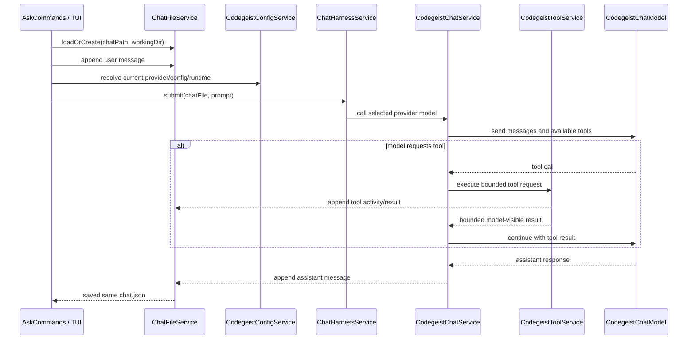

This sequence is intentionally smaller than OpenCode. It preserves the behavior
needed for a useful local coding-agent loop while keeping T007 file-only and
Spring-first.
