# Runtime Harness Specification

Planned class model for the T007 chat-file tool harness. This document is an
iterative specification: refine the model slice by slice, and create Java classes
only when the focused implementation task introduces tested source.

## Diagram Layout

The class model is split into grouped vertical diagrams instead of one large graph.
Each diagram uses `direction TB` so Mermaid renders the relationships top-to-bottom
where supported.

Existing Codegeist classes that T007 reuses or changes are marked as `existing`.
New planned Java types are marked as `planned`.

## 1. Harness Entry And Existing Chat Seam

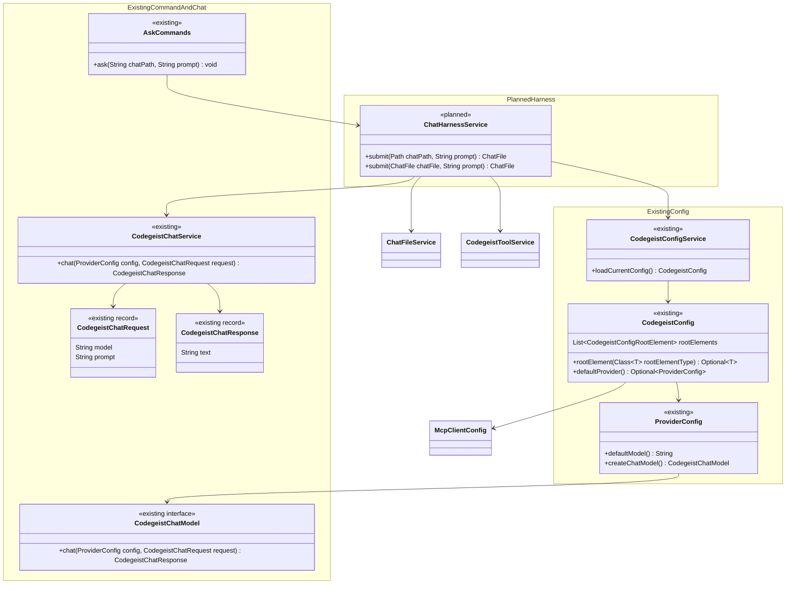

## 2. Chat File State Model

### 2.1 Chat File Service And Aggregate

### 2.2 Chat Messages

### 2.3 Tool Activity Envelope

### 2.4 Bounded Tool Summaries

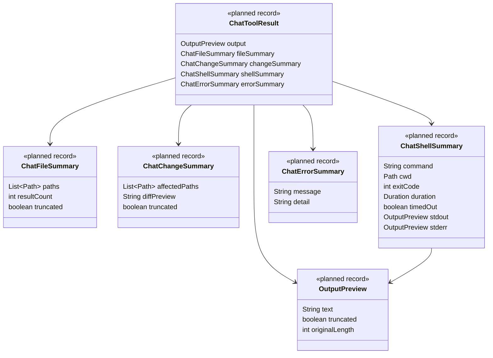

## 3. MCP And Tool Service Model

### 3.1 MCP Client Configuration

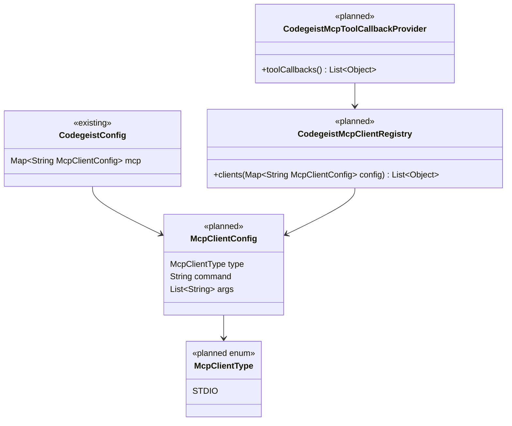

### 3.2 Tool Service Contract

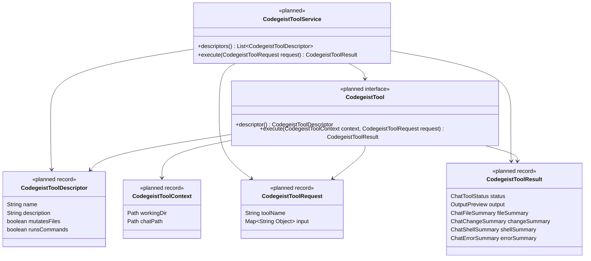

### 3.3 Tool Result Bounds And Safety

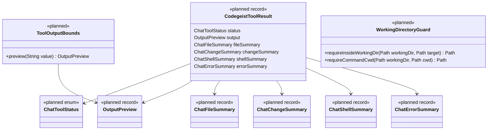

## 4. Tool Implementations

### 4.1 Read-Only File Tools

```mermaid
classDiagram
    direction TB

    class CodegeistTool {
      <<planned interface>>
    }

    class WorkingDirectoryGuard {
      <<planned>>
    }

    class ToolOutputBounds {
      <<planned>>
    }

    class ListFilesTool {
      <<planned>>
      +execute(CodegeistToolContext context, CodegeistToolRequest request) CodegeistToolResult
    }

    class ReadFileTool {
      <<planned>>
      +execute(CodegeistToolContext context, CodegeistToolRequest request) CodegeistToolResult
    }

    class GlobFilesTool {
      <<planned>>
      +execute(CodegeistToolContext context, CodegeistToolRequest request) CodegeistToolResult
    }

    class GrepFilesTool {
      <<planned>>
      +execute(CodegeistToolContext context, CodegeistToolRequest request) CodegeistToolResult
    }

    ListFilesTool ..|> CodegeistTool
    ReadFileTool ..|> CodegeistTool
    GlobFilesTool ..|> CodegeistTool
    GrepFilesTool ..|> CodegeistTool
    ListFilesTool --> WorkingDirectoryGuard
    ReadFileTool --> WorkingDirectoryGuard
    GlobFilesTool --> WorkingDirectoryGuard
    GrepFilesTool --> WorkingDirectoryGuard
    ReadFileTool --> ToolOutputBounds
    GrepFilesTool --> ToolOutputBounds
```

### 4.2 Write And File Mutation Tools

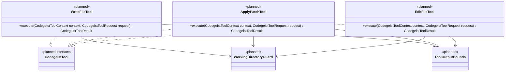

### 4.3 Shell Tool

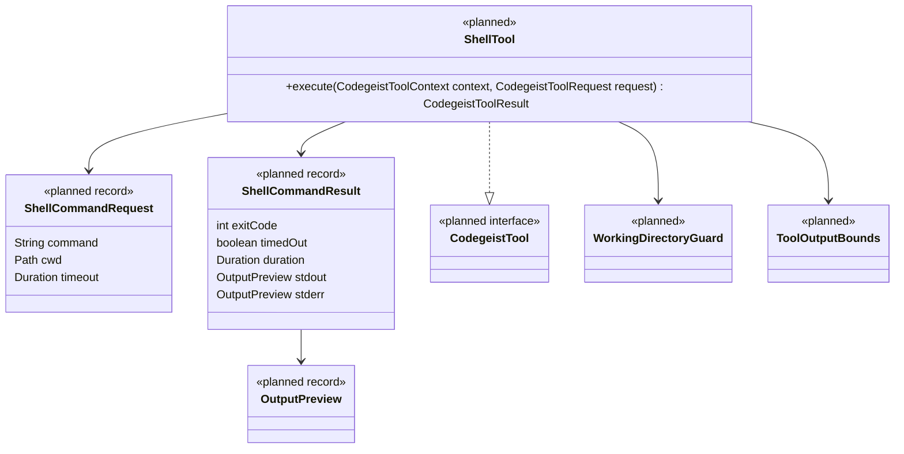

## 5. Terminal TUI Model

### 5.1 TUI Entry And Control

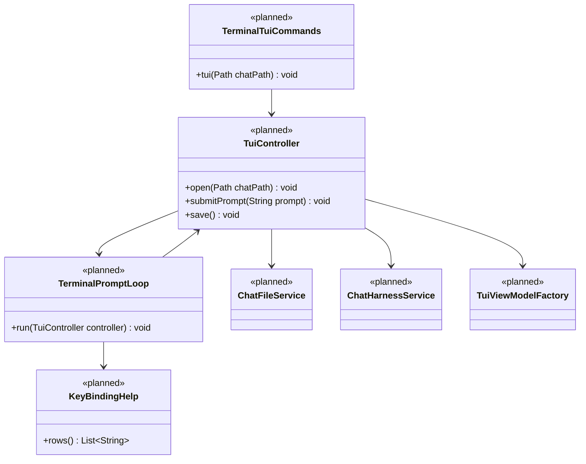

### 5.2 TUI Projection And Runtime Status

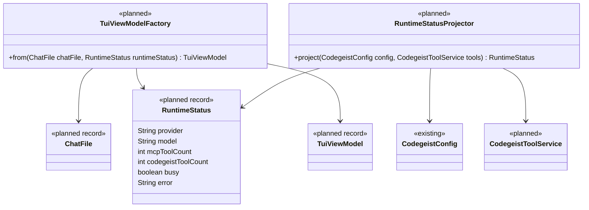

### 5.3 Persisted Chat View State

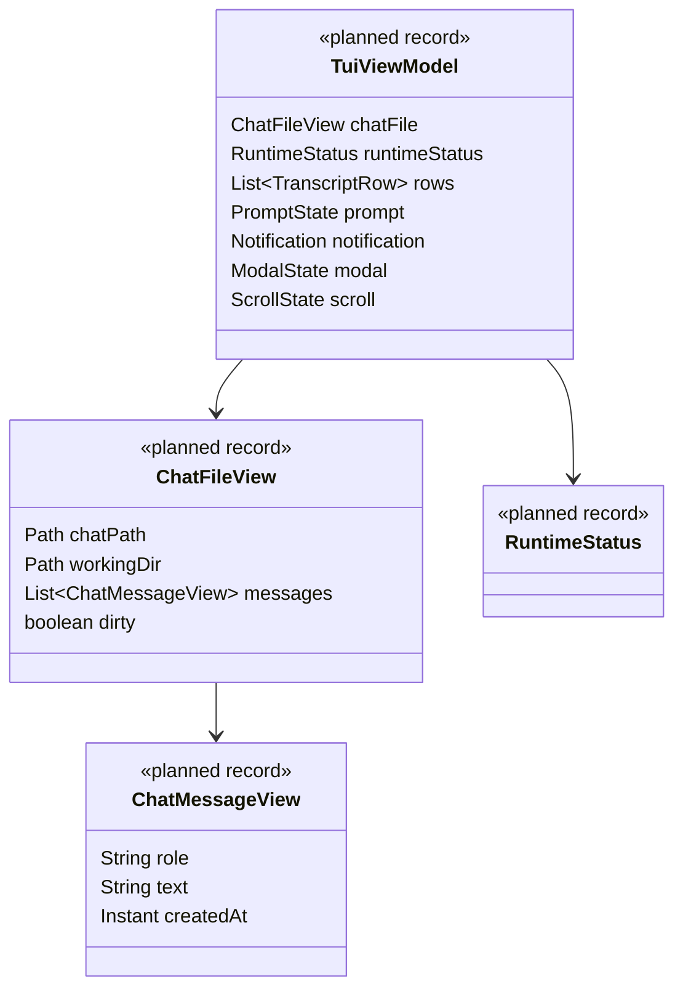

### 5.4 Transcript Rows And Activity Views

```mermaid
classDiagram
    direction TB

    class TuiViewModel {
      <<planned record>>
      List~TranscriptRow~ rows
    }

    class TranscriptRow {
      <<planned record>>
      String role
      String text
      ToolActivityView tool
      ChangeView change
      ShellView shell
      boolean truncated
    }

    class ToolActivityView {
      <<planned record>>
      String toolName
      ChatToolStatus status
      String summary
      Duration duration
    }

    class ChangeView {
      <<planned record>>
      List~Path~ affectedPaths
      String diffPreview
      boolean truncated
    }

    class ShellView {
      <<planned record>>
      String command
      Path cwd
      int exitCode
      boolean timedOut
      OutputPreview stdout
      OutputPreview stderr
    }

    class ChatToolStatus {
      <<planned enum>>
    }

    class OutputPreview {
      <<planned record>>
    }

    TuiViewModel --> TranscriptRow
    TranscriptRow --> ToolActivityView
    TranscriptRow --> ChangeView
    TranscriptRow --> ShellView
    ToolActivityView --> ChatToolStatus
    ShellView --> OutputPreview
```

### 5.5 Transient TUI State

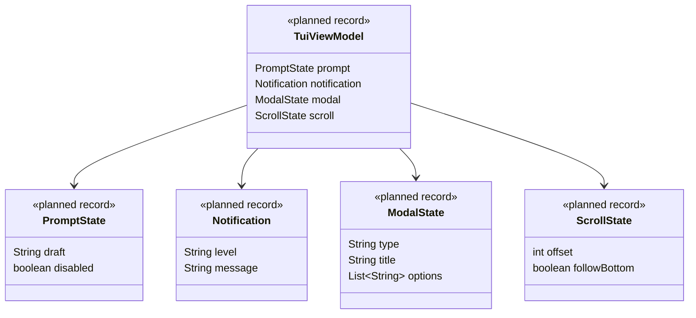

### 5.6 TUI Rendering

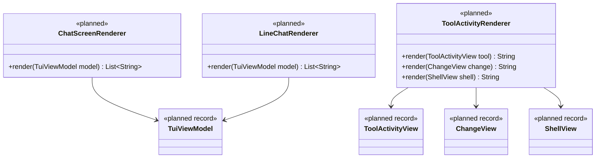

## Iteration Rule

Keep this specification synchronized with the active child task:

- `T007_02` should refine sections 1, 2.1, 2.2, 2.3, and 2.4.
- `T007_03` should refine sections 3.1, 3.2, 3.3, and 4.1.
- `T007_04` should refine sections 4.2 and 4.3.
- `T007_05` should refine sections 5.1 through 5.6.
- `T007_06` should reconcile all diagrams with the implemented source.
