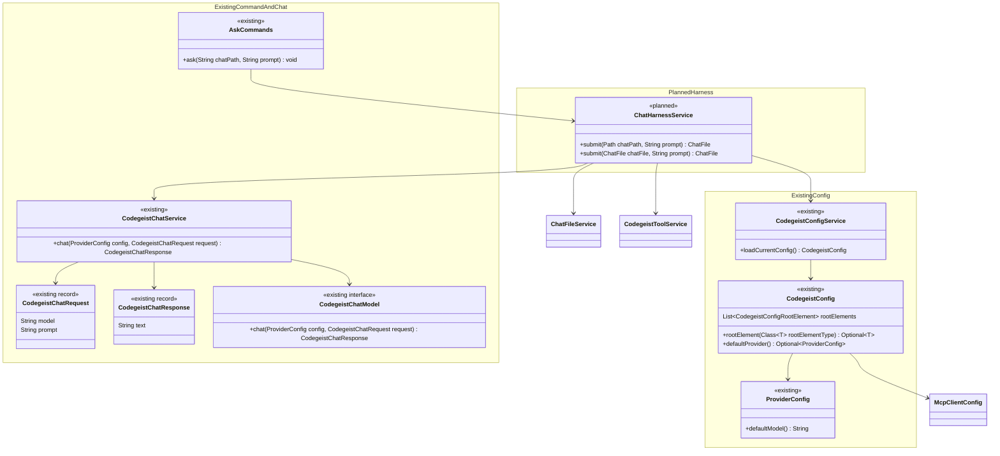
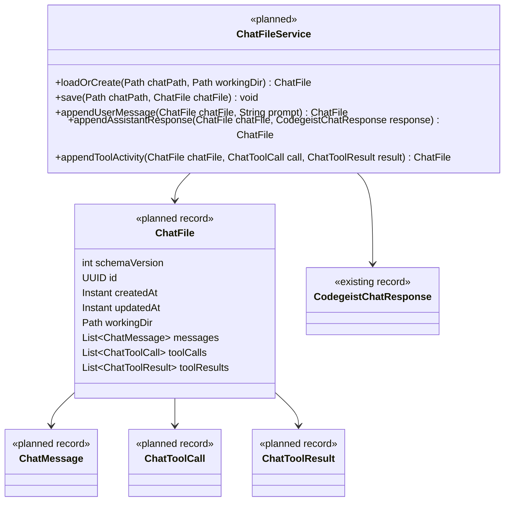
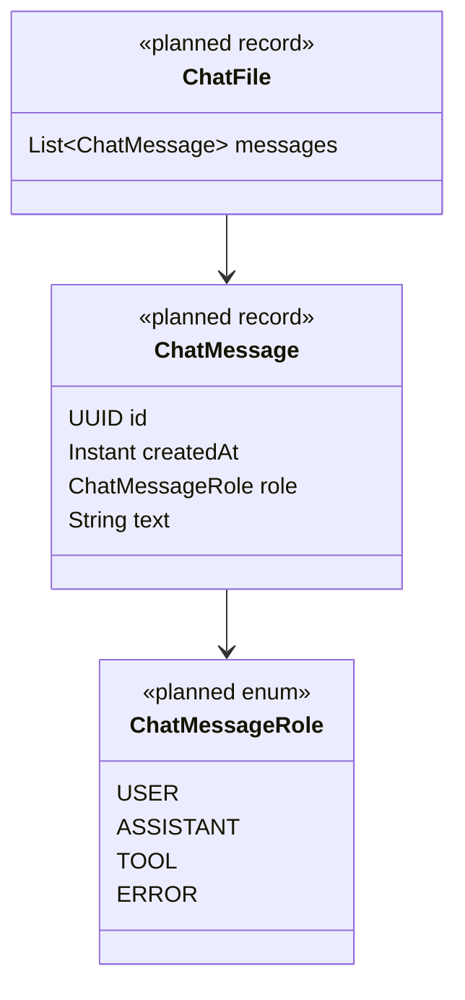
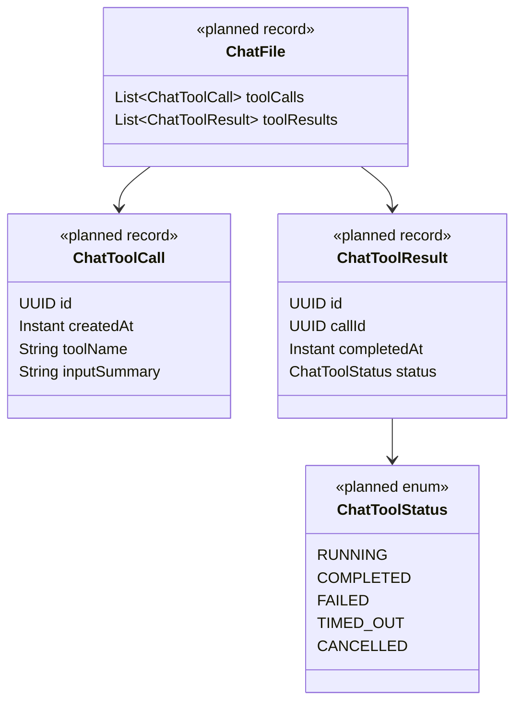
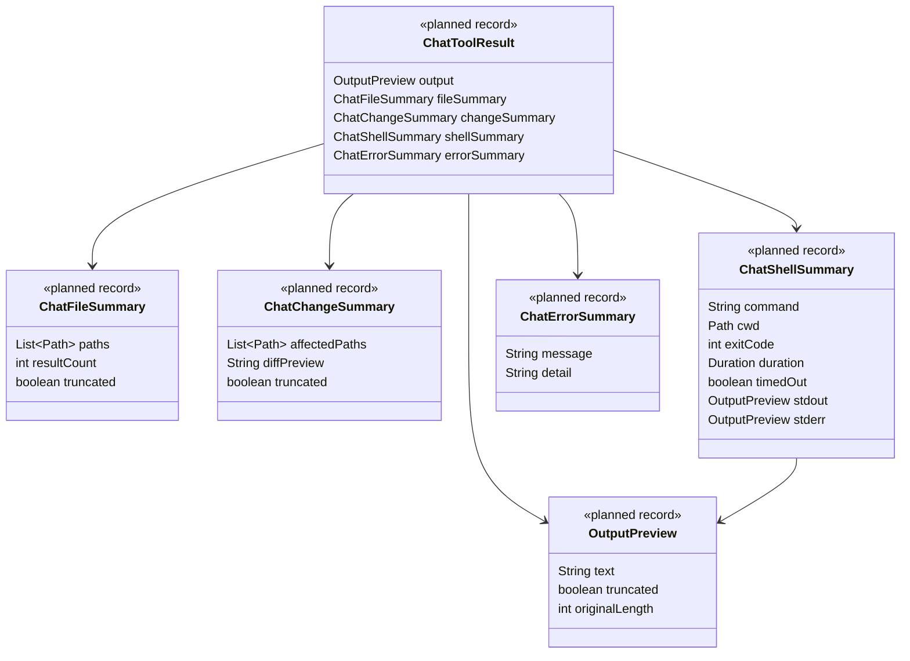
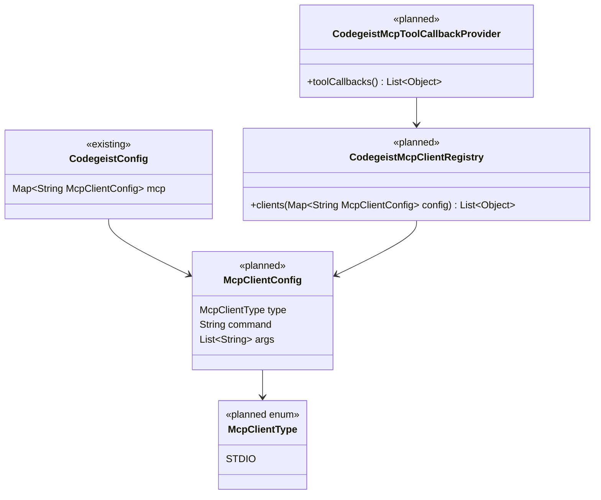
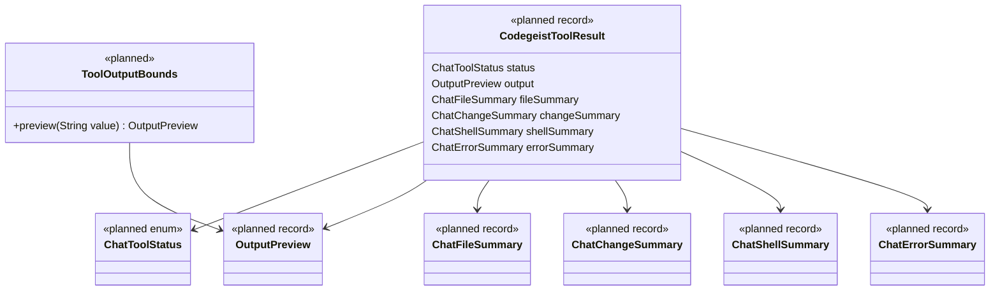
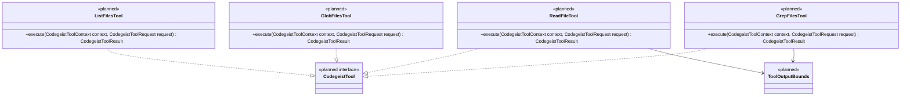
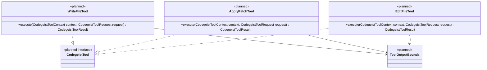
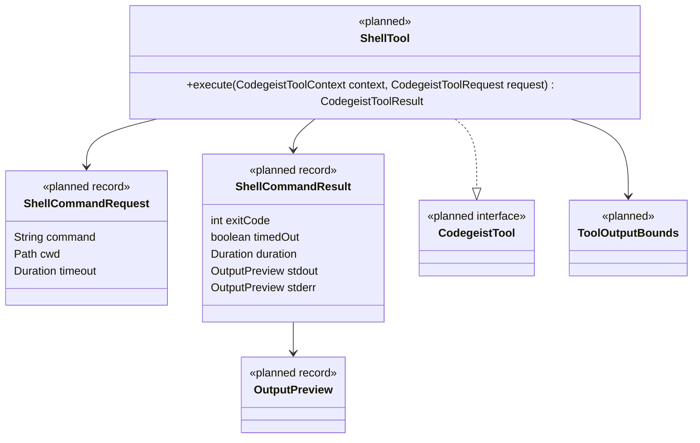

# Runtime Harness Specification

Historical planning model for the completed T007 runtime harness. The diagrams
preserve the vocabulary considered while the task was being split into tested
slices; they are not a current Java API or source map.

Use `docs/developer/architecture/architecture.md` and its focused session, tool,
agent-loop, and TUI documents for implemented behavior. The final runtime uses
`.codegeist/session.json`, `ChatHarnessService`, `CodegeistAgentLoopService`,
prompt-scoped `CodegeistToolRun` callbacks, exact edit, shell, MCP, and the Spring
Shell `TerminalUI`. Planned names below that do not exist in source must not be
treated as implementation requirements.

## Diagram Layout

The class model is split into grouped vertical diagrams instead of one large graph.
Each diagram uses `direction TB` so Mermaid renders the relationships top-to-bottom
where supported.

Existing Codegeist classes that T007 reuses or changes are marked as `existing`.
New planned Java types are marked as `planned`.

## 1. Harness Entry And Existing Chat Seam

## 2. Chat File State Model

### 2.1 Chat File Service And Aggregate

### 2.2 Chat Messages

### 2.3 Tool Activity Envelope

### 2.4 Bounded Tool Summaries

## 3. MCP And Tool Service Model

### 3.1 MCP Client Configuration

### 3.2 Tool Service Contract

### 3.3 Tool Result Bounds And Safety

## 4. Tool Implementations

### 4.1 Read-Only File Tools

### 4.2 Write And File Mutation Tools

### 4.3 Shell Tool

## 5. TerminalUI Chat Harness

T007_06 now has a minimal Spring Shell `TerminalUI` chat loop.
`ai.codegeist.app.tui.TuiCommands` exposes the `tui` command and delegates to
`CodegeistTerminalUi`. `CodegeistTerminalUi` builds `TerminalUI` instances from
`TerminalUIBuilder`, configures a bordered `GridView` root with transcript
`BoxView` and prompt `InputView`, focuses the prompt, binds `Ctrl-Q` to interrupt
the loop, and preserves the local transcript across normal `TerminalUI.run()`
returns.

Pressing Enter on a non-blank prompt submits exactly one turn through
`ChatHarnessService.ask(true, prompt)`, appends returned response text or handled
harness failures to an in-memory transcript, rebuilds the prompt input after each
submission, and supports repeated turns without restarting the Codegeist process.

`CodegeistLocaleService` uses optional app-wide `codegeist.locale` and otherwise
falls back to the JVM default locale for message lookup. The final T007_07 slice added
bounded completed-tool previews but not stored-session projection, streaming output,
live tool progress, permission prompts, a presenter, view factory, responsive layout
service, Spring Shell control wrapper package, or generic `task tui-smoke` entrypoint.
The documentation-specific `task tui-capture-smoke` path is a VHS-rendered native
capture smoke that writes local preview artifacts under
`target/smoke-test/tui-capture/`; it is not a separate TUI runtime architecture.

Keep provider selection, MCP/tool callbacks, the model/tool/model continuation loop,
and `.codegeist/session.json` persistence behind `ChatHarnessService` and existing
runtime services.

Do not restore a custom JLine console, deterministic line-renderer pipeline, or
second agent runtime unless a future task explicitly replaces the Spring Shell
approach. Streaming, cancellation, patch review UI, shell review panes, session
browsers, and richer transcript projection remain future work.

## Completion Note

T007 completed on 2026-07-18 after current-worktree focused tests, the native
VHS-recorded hello-world tool smoke, and the broad JVM suite passed. This file is
retained as task-planning history rather than being rewritten into a duplicate of
the current architecture documentation.
