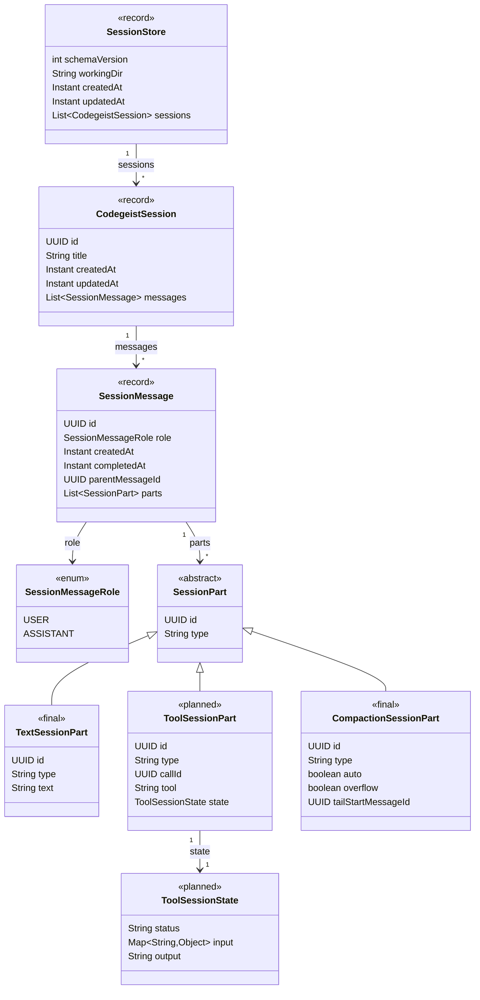

# Session Store Model Specification

Specification for the first Codegeist `.codegeist/session.json` model used by
`tasks/T007_02_add-session-store-and-continue-option.md`.

## Purpose

Document the portable directory-local session store implemented with
`ask -c/--continue`. The design is oriented by OpenCode's persisted project,
session, message, and part behavior, but Codegeist owns a Java/Spring, file-only
translation centered on one `.codegeist/session.json` file per working directory.

This document is the T007_02 implementation contract. The current implemented
architecture is summarized in `docs/developer/architecture/architecture.md`.

## Source Evidence

Use `opencode-workflow-analysis.md` as the durable source-backed analysis for
OpenCode behavior. The most relevant OpenCode source paths are:

- `docs/third-party/opencode/source/packages/core/src/session/sql.ts` - SQLite
  session, message, and part tables.
- `docs/third-party/opencode/source/packages/core/src/v1/session.ts` - message,
  part, text part, tool part, and `WithParts` schemas.
- `docs/third-party/opencode/source/packages/opencode/src/session/session.ts` -
  session creation, listing, directory/path scoping, and latest-session ordering.
- `docs/third-party/opencode/source/packages/opencode/src/session/message-v2.ts` -
  reconstruction of provider-facing model messages from persisted `WithParts[]`.
- `docs/third-party/opencode/source/packages/opencode/src/session/processor.ts` -
  streaming text, reasoning, tool, patch, and step events persisted as message
  parts.
- `docs/third-party/opencode/source/packages/opencode/src/session/compaction.ts` -
  compaction creation, summary generation, retained-tail selection, and tool-output
  pruning.
- `docs/third-party/opencode/source/packages/opencode/src/session/overflow.ts` -
  token-limit overflow detection that triggers automatic compaction.
- `docs/third-party/opencode/source/packages/opencode/src/cli/cmd/tui.ts` - CLI
  `--continue` behavior for continuing the last session.

OpenCode stores resumable work in SQLite:

- `SessionTable` stores session identity, project/workspace, directory, path,
  selected model, agent, permission rules, summary/revert metadata, cost/tokens,
  and timestamps.
- `MessageTable` stores user and assistant message metadata as JSON.
- `PartTable` stores message parts as JSON, including text, files, tools,
  reasoning, snapshots, patches, retries, compaction markers, and step markers.
- `WithParts` combines one message info object with its ordered parts so the TUI
  can render a transcript and the runtime can rebuild model input.
- Compaction adds a user message with a `compaction` part and an assistant message
  marked as a summary. The original transcript remains stored; later model context
  is selected from the summary plus a retained recent tail.

Codegeist should preserve the useful behavior, not the storage or runtime shape.

## Codegeist Translation

For T007, `.codegeist/session.json` is the default portable equivalent of the subset
of OpenCode project/session/message/part data needed to keep multiple resumable
local chats in one working directory. `CodegeistSpringAppProperties` owns the
built-in defaults and binds Spring keys `codegeist.session.directory` and
`codegeist.session.store-file`; external Spring application properties or
`CODEGEIST_SESSION_DIRECTORY` and `CODEGEIST_SESSION_STORE_FILE` environment
overrides may change the directory and file name while keeping the same store
schema. These values are not part of direct `codegeist.yml` provider/tool
configuration.

The Codegeist model must:

- Store one session store at `.codegeist/session.json` per working directory by
  default.
- Store multiple sessions in that file.
- Store schema version, working directory, store timestamps, sessions, messages,
  and ordered message parts.
- Keep each session transcript chronological and directly renderable from
  `sessions[].messages[].parts[]`.
- Keep enough structure to rebuild model context in later tasks without storing
  runtime-only configuration.
- Preserve compaction markers and summary messages so later tasks can compact
  model context without deleting original stored messages.
- Persist bounded tool activity later as message parts, not as unbounded raw output.

The Codegeist model must not store:

- API keys, OAuth tokens, cloud credentials, or evaluated secret values.
- Provider config.
- Selected provider.
- Selected model.
- MCP client definitions.
- Enabled tool definitions or tool registry state.
- Permission rules.
- Runtime status.
- TUI layout, draft, scroll, pane, or modal state.

Provider, model, MCP, tools, permissions, runtime status, and UI state are resolved
from current runtime configuration when a session continues.

## Continue Semantics

T007_02 introduces `ask -c/--continue` only:

```bash
codegeist ask "prompt"
codegeist ask -c "prompt"
codegeist ask --continue "prompt"
```

Rules:

- Plain `ask "prompt"` prints only the provider response and saves the turn to a new
  session in the configured store path, creating the store first when needed.
- `ask -c "prompt"` and `ask --continue "prompt"` load `.codegeist/session.json`
  from the current working directory's `.codegeist` directory by default when it
  exists.
- Continuation selects the session with the newest `updatedAt`. If two sessions
  have the same `updatedAt`, implementation may use stable id ordering as the
  tie-breaker.
- Continuation appends a user message and assistant message to the selected
  session and updates both session-level and store-level `updatedAt`.
- If `.codegeist/session.json` is missing or the store has no sessions,
  continuation creates a new session instead.
- Corrupt or unsupported existing `.codegeist/session.json` content fails instead
  of being overwritten.
- Do not add `--new-session` in this child.
- Do not add `--session <id>` in this child; explicit session selection can be a
  later focused task.
- Do not overwrite corrupt or unsupported existing `.codegeist/session.json` files
  when creating a new session.

## Session Class Diagram

This diagram names the intended Java-side model for the first file-backed session
store. `TextSessionPart` is the part type that `ask -c/--continue` writes in
T007_02. `CompactionSessionPart` should also be implemented so existing or
future compaction state can round-trip through the session store. `ToolSessionPart`
and its minimal state document the planned extension point for later T007 tool,
patch, and shell children. Planned tool types should not force unused Java
placeholders or optional fields in this child.



## Root Shape

The first root shape should be small and inspectable:

```json
{
  "schemaVersion": 1,
  "workingDir": "/home/test/Projects/codegeist-ai/codegeist",
  "createdAt": "2026-06-09T12:00:00Z",
  "updatedAt": "2026-06-09T12:10:00Z",
  "sessions": []
}
```

Root fields:

| Field | Meaning |
| --- | --- |
| `schemaVersion` | Integer schema version. The first version is `1`. |
| `workingDir` | Absolute working directory for this session store. It is the path boundary for later tools. |
| `createdAt` | ISO-8601 instant when the session store was created. |
| `updatedAt` | ISO-8601 instant updated on every successful save. |
| `sessions` | Ordered list of sessions/chats available in this working directory. |

Do not add a top-level `toolResults` list for T007_02. If a future task needs a
fast lookup index, it can add one after proving why
`sessions[].messages[].parts[]` is not enough.

## Session Shape

Each session is one chat:

```json
{
  "id": "11111111-1111-4111-8111-111111111111",
  "title": "New session - 2026-06-09T12:00:00Z",
  "createdAt": "2026-06-09T12:00:00Z",
  "updatedAt": "2026-06-09T12:05:00Z",
  "messages": []
}
```

Session fields:

| Field | Meaning |
| --- | --- |
| `id` | Stable session UUID. |
| `title` | Human-readable session title. Later tasks can add explicit title editing. |
| `createdAt` | ISO-8601 instant when the session was created. |
| `updatedAt` | ISO-8601 instant updated whenever the session changes. |
| `messages` | Ordered user and assistant messages with ordered parts. |

Do not store OpenCode-style `agent`, `model`, `providerID`, `modelID`, `tools`,
`cost`, `tokens`, `path`, or permission metadata in Codegeist sessions for this
slice. Those fields are runtime/config data in T007.

## Message Shape

Messages keep role and timing metadata separate from content parts:

```json
{
  "id": "22222222-2222-4222-8222-222222222222",
  "role": "user",
  "createdAt": "2026-06-09T12:00:05Z",
  "parts": []
}
```

```json
{
  "id": "44444444-4444-4444-8444-444444444444",
  "role": "assistant",
  "createdAt": "2026-06-09T12:00:10Z",
  "completedAt": "2026-06-09T12:00:20Z",
  "parentMessageId": "22222222-2222-4222-8222-222222222222",
  "parts": []
}
```

Message fields:

| Field | Meaning |
| --- | --- |
| `id` | Stable message UUID. |
| `role` | `user` or `assistant` for T007_02. |
| `createdAt` | ISO-8601 instant when the message was added. |
| `completedAt` | Optional ISO-8601 instant for assistant completion. |
| `parentMessageId` | Optional parent message id. For T007_02 assistant messages should point to the user message that triggered them. |
| `parts` | Ordered content and activity parts for this message. |

## Initial Part Shape

T007_02 should implement only text parts:

```json
{
  "id": "33333333-3333-4333-8333-333333333333",
  "type": "text",
  "text": "Fix this test"
}
```

Text part fields:

| Field | Meaning |
| --- | --- |
| `id` | Stable part UUID unique within the session store. |
| `type` | `text`. |
| `text` | User prompt text or assistant response text. |

Optional timing or metadata fields should be added only when a focused test needs
them. For T007_02, message-level timestamps are enough.

## Compaction Shape

OpenCode compaction is modeled as durable transcript state, not destructive
deletion. Codegeist should keep the same behavior in `.codegeist/session.json`:

- A user message contains a `compaction` part that marks a compaction boundary.
- An assistant message with `parentMessageId` pointing to that user message stores
  the summary text. The referenced user message's `compaction` part is the summary
  marker; no separate message-level `summary` flag is needed.
- `tailStartMessageId` identifies the first retained recent message that should be
  included raw after the summary when later model context is rebuilt.
- Original pre-compaction messages remain in the session store for rendering,
  audit, and future recovery.
- Old completed tool outputs may later be pruned by adding a focused compaction
  marker only when a later task needs it. Do not include that field in the first
  planned tool state by default.

Compaction user message:

```json
{
  "id": "66666666-6666-4666-8666-666666666666",
  "role": "user",
  "createdAt": "2026-06-09T12:10:00Z",
  "parts": [
    {
      "id": "77777777-7777-4777-8777-777777777777",
      "type": "compaction",
      "auto": true,
      "overflow": true,
      "tailStartMessageId": "88888888-8888-4888-8888-888888888888"
    }
  ]
}
```

Summary assistant message:

```json
{
  "id": "99999999-9999-4999-8999-999999999999",
  "role": "assistant",
  "createdAt": "2026-06-09T12:10:10Z",
  "completedAt": "2026-06-09T12:10:20Z",
  "parentMessageId": "66666666-6666-4666-8666-666666666666",
  "parts": [
    {
      "id": "aaaaaaaa-aaaa-4aaa-8aaa-aaaaaaaaaaaa",
      "type": "text",
      "text": "Summary of earlier work and decisions."
    }
  ]
}
```

Compaction part fields:

| Field | Meaning |
| --- | --- |
| `id` | Stable part UUID unique within the session store. |
| `type` | `compaction`. |
| `auto` | `true` when compaction was triggered automatically by context pressure. |
| `overflow` | `true` when the previous provider request exceeded the usable context. |
| `tailStartMessageId` | Optional first message id retained raw after the summary. |

T007_02 should implement the durable `CompactionSessionPart` model and support
round-tripping compaction markers plus summary assistant messages through
`.codegeist/session.json`. It should not implement token estimation, summary
generation, automatic compaction triggering, or model-context rewriting.

## Planned Tool Part Shape

Later T007 children should persist tool activity as ordered message parts. This
shape is planned design guidance and should not force unused Java placeholders in
T007_02 or optional fields before a focused task needs them:

```json
{
  "id": "bbbbbbbb-bbbb-4bbb-8bbb-bbbbbbbbbbbb",
  "type": "tool",
  "callId": "cccccccc-cccc-4ccc-8ccc-cccccccccccc",
  "tool": "read",
  "state": {
    "status": "completed",
    "input": {
      "path": "pom.xml"
    },
    "output": "bounded model-visible output"
  }
}
```

Minimum planned tool statuses:

| Status | Meaning |
| --- | --- |
| `completed` | Tool execution finished and `output` contains bounded model-visible output. |
| `failed` | Tool execution failed. Add an `error` field only when a focused failure test needs a separate error contract. |

Do not add `title`, `metadata`, timing fields, `compactedAt`, streaming states,
timeout states, or cancellation states until a concrete tool, TUI, failure, or
compaction requirement needs them.

Tool output must be bounded before it is written to `.codegeist/session.json`.
Full raw command output, large file content, or large binary/media data must not
be written into the session store by default.

If later compaction prunes old tool output, keep the tool part and add the
smallest explicit marker needed by that task instead of deleting the part.
Model-context reconstruction can then replace the old output with a short marker.

## T007_02 Continue Example

Given this existing `.codegeist/session.json`:

```json
{
  "schemaVersion": 1,
  "workingDir": "/home/test/Projects/codegeist-ai/codegeist",
  "createdAt": "2026-06-09T12:00:00Z",
  "updatedAt": "2026-06-09T12:04:00Z",
  "sessions": [
    {
      "id": "ses_older",
      "title": "Older session",
      "createdAt": "2026-06-09T11:00:00Z",
      "updatedAt": "2026-06-09T11:10:00Z",
      "messages": []
    },
    {
      "id": "ses_latest",
      "title": "Latest session",
      "createdAt": "2026-06-09T12:00:00Z",
      "updatedAt": "2026-06-09T12:04:00Z",
      "messages": []
    }
  ]
}
```

`ask --continue "Fix this test"` should append to `ses_latest` and save the same
store:

```json
{
  "schemaVersion": 1,
  "workingDir": "/home/test/Projects/codegeist-ai/codegeist",
  "createdAt": "2026-06-09T12:00:00Z",
  "updatedAt": "2026-06-09T12:05:20Z",
  "sessions": [
    {
      "id": "ses_older",
      "title": "Older session",
      "createdAt": "2026-06-09T11:00:00Z",
      "updatedAt": "2026-06-09T11:10:00Z",
      "messages": []
    },
    {
      "id": "ses_latest",
      "title": "Latest session",
      "createdAt": "2026-06-09T12:00:00Z",
      "updatedAt": "2026-06-09T12:05:20Z",
      "messages": [
        {
          "id": "dddddddd-dddd-4ddd-8ddd-dddddddddddd",
          "role": "user",
          "createdAt": "2026-06-09T12:05:05Z",
          "parts": [
            {
              "id": "eeeeeeee-eeee-4eee-8eee-eeeeeeeeeeee",
              "type": "text",
              "text": "Fix this test"
            }
          ]
        },
        {
          "id": "ffffffff-ffff-4fff-8fff-ffffffffffff",
          "role": "assistant",
          "createdAt": "2026-06-09T12:05:10Z",
          "completedAt": "2026-06-09T12:05:20Z",
          "parentMessageId": "dddddddd-dddd-4ddd-8ddd-dddddddddddd",
          "parts": [
            {
              "id": "abababab-abab-4aba-8bab-abababababab",
              "type": "text",
              "text": "I found the issue."
            }
          ]
        }
      ]
    }
  ]
}
```

## Java Naming Direction

Use names that match persisted concepts:

- `SessionStore` - root `.codegeist/session.json` document.
- `CodegeistSession` - one chat session inside the store.
- `SessionMessage` - one user or assistant message.
- `SessionMessageRole` - message role enum.
- `SessionPart` - abstract base class for persisted message parts.
- `TextSessionPart` - implemented T007_02 part type.
- `CompactionSessionPart` - implemented compaction boundary marker.
- `SessionStoreService` - load, save, find latest session, append user/assistant
  text exchange.

Avoid Java classes for tool, patch, shell, file, reasoning, and step parts until a
focused later child task persists those parts.

## Test Expectations

Focused tests should prove:

- Plain `ask` without `-c/--continue` prints only the provider response and writes a
  new session to `.codegeist/session.json`.
- `ask -c` and `ask --continue` append to the newest existing session by
  `updatedAt`.
- The user prompt is a user message with one `text` part.
- The assistant response is an assistant message with one `text` part and
  `parentMessageId` pointing to the matching user message.
- Existing older sessions stay unchanged when the latest session is continued.
- Missing `.codegeist/session.json` creates a new session.
- Empty `sessions[]` creates a new session.
- Corrupt or unsupported existing `.codegeist/session.json` content fails instead
  of being overwritten.
- The compaction shape can round-trip as a `compaction` part plus a summary
  assistant message and does not imply runtime compaction generation in T007_02.
- Representative provider config secrets and runtime-only fields are absent from
  serialized `.codegeist/session.json`.

Use the Taskfile from `app/codegeist/cli` for implementation verification:

```bash
task test TEST=<session-store-test-selector>
task test
```
