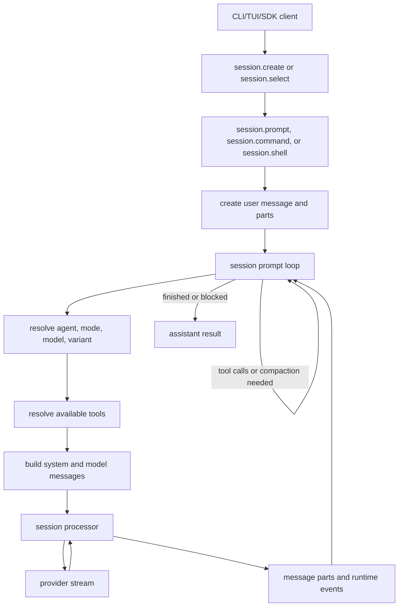
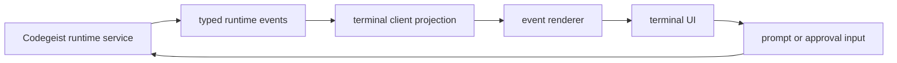
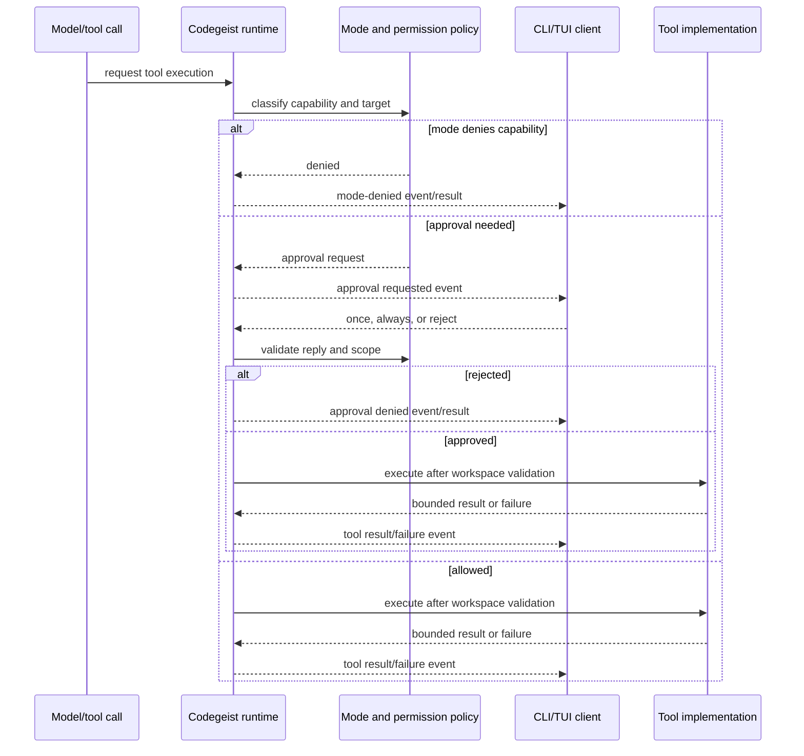

# T007_01 Analyze OpenCode Runtime And Agent Utils Harness

Parent: `T007_build-codegeist-runtime-harness`

Status: solved

## Goal

Complete a source-backed analysis pass for the runtime harness before Codegeist
starts implementing the next core slices.

The deliverable is a compact but deep handoff that explains how OpenCode implements
the user-facing runtime harness and which Spring AI or Spring AI Agent Utils pieces
Codegeist can use safely behind its own Java/Spring boundaries.

## Why This Comes First

The user goal is a real OpenCode replacement, not only a CLI prompt command. That
means Codegeist needs to understand OpenCode's full harness: TUI, session loop,
events, tools, permissions, workspace access, provider/model flow, storage, and
plugin/MCP surfaces. Implementation should start only after the exact OpenCode
behavior and Java/Spring-side replacement options are clear enough to split into
focused tested tasks.

## Already Gathered OpenCode Source Map

Use these files as the starting map for detailed questions and citations:

| Topic | Source paths |
| --- | --- |
| CLI bootstrap | `docs/third-party/opencode/source/packages/opencode/src/index.ts` |
| Headless run path | `docs/third-party/opencode/source/packages/opencode/src/cli/cmd/run.ts` |
| Server command | `docs/third-party/opencode/source/packages/opencode/src/cli/cmd/serve.ts` |
| Server assembly | `docs/third-party/opencode/source/packages/opencode/src/server/server.ts` |
| TUI SDK and SSE subscription | `docs/third-party/opencode/source/packages/opencode/src/cli/cmd/tui/context/sdk.tsx` |
| TUI event filtering | `docs/third-party/opencode/source/packages/opencode/src/cli/cmd/tui/context/event.ts` |
| TUI state projection | `docs/third-party/opencode/source/packages/opencode/src/cli/cmd/tui/context/sync.tsx` |
| TUI prompt input | `docs/third-party/opencode/source/packages/opencode/src/cli/cmd/tui/component/prompt/index.tsx` |
| TUI session screen | `docs/third-party/opencode/source/packages/opencode/src/cli/cmd/tui/routes/session/index.tsx` |
| Core prompt orchestration | `docs/third-party/opencode/source/packages/opencode/src/session/prompt.ts` |
| Stream processing | `docs/third-party/opencode/source/packages/opencode/src/session/processor.ts` |
| LLM integration | `docs/third-party/opencode/source/packages/opencode/src/session/llm.ts` |
| Message and part shape | `docs/third-party/opencode/source/packages/opencode/src/session/message-v2.ts` |
| Per-session run state | `docs/third-party/opencode/source/packages/opencode/src/session/run-state.ts` |
| Native agents and modes | `docs/third-party/opencode/source/packages/opencode/src/agent/agent.ts` |
| User-defined agents | `docs/third-party/opencode/source/packages/opencode/src/config/agent.ts` |
| Tool contract | `docs/third-party/opencode/source/packages/opencode/src/tool/tool.ts` |
| Tool registry | `docs/third-party/opencode/source/packages/opencode/src/tool/registry.ts` |
| Permission lifecycle | `docs/third-party/opencode/source/packages/opencode/src/permission/index.ts` |
| Permission rule evaluation | `docs/third-party/opencode/source/packages/opencode/src/permission/evaluate.ts` |
| SQLite storage | `docs/third-party/opencode/source/packages/opencode/src/storage/db.ts` |
| Session tables | `docs/third-party/opencode/source/packages/opencode/src/session/session.sql.ts` |
| Sync/event model | `docs/third-party/opencode/source/packages/opencode/src/sync/index.ts` |
| Runtime bus | `docs/third-party/opencode/source/packages/opencode/src/bus/index.ts` |
| Provider and model loading | `docs/third-party/opencode/source/packages/opencode/src/provider/provider.ts` |
| Auth storage | `docs/third-party/opencode/source/packages/opencode/src/auth/index.ts` |
| MCP | `docs/third-party/opencode/source/packages/opencode/src/mcp/index.ts` |
| Plugins | `docs/third-party/opencode/source/packages/opencode/src/plugin/index.ts`, `docs/third-party/opencode/source/packages/plugin/src/index.ts` |

## Already Gathered Spring AI And Agent Utils Map

Spring AI:

- `ToolCallback` owns tool definition, metadata, and execution methods.
- `ChatClient` can register `toolCallbacks(...)` for a specific request or tools
  through `@Tool`-annotated objects.
- Tool execution can be handled internally by Spring AI providers unless Codegeist
  keeps the callback boundary Codegeist-owned.

Spring AI Agent Utils:

| Topic | Source paths | Current posture |
| --- | --- | --- |
| Grep/glob | `GrepTool.java`, `GlobTool.java` | Candidate private implementation behind Codegeist workspace and output policy. |
| File/list | `ListDirectoryTool.java`, `FileSystemTools.java` | Candidate private implementation for read-only tools after path, size, and redaction checks. |
| Shell | `ShellTools.java`, `AgentEnvironment.java` | Concept/reference only until Codegeist shell policy exists. |
| Questions | `AskUserQuestionTool.java`, `CommandLineQuestionHandler.java` | Wrap through Codegeist events and client renderers. |
| Todos | `TodoWriteTool.java` | Concept reference for progress/session parts. |
| Skills/memory | `SkillsTool.java`, `AutoMemoryTools.java`, `AutoMemoryToolsAdvisor.java` | Defer or wrap because Codegeist must own trust, prompt, storage, and retention policy. |
| Task/subagents | `tools/task/TaskTool.java`, A2A module docs | Defer until child sessions, cancellation, storage, auth, and remote trust decisions exist. |

Useful Agent Utils tests to inspect as behavior references:

- `docs/third-party/spring-ai-agent-utils/source/spring-ai-agent-utils/src/test/java/org/springaicommunity/agent/tools/GrepToolTest.java`
- `docs/third-party/spring-ai-agent-utils/source/spring-ai-agent-utils/src/test/java/org/springaicommunity/agent/tools/GlobToolTest.java`
- `docs/third-party/spring-ai-agent-utils/source/spring-ai-agent-utils/src/test/java/org/springaicommunity/agent/tools/FileSystemToolsTest.java`
- `docs/third-party/spring-ai-agent-utils/source/spring-ai-agent-utils/src/test/java/org/springaicommunity/agent/tools/ShellToolsTest.java`

## Research Questions To Answer

- How exactly does OpenCode turn CLI/TUI prompt input into a session run?
- Which state is stored as durable messages, parts, permissions, todos, and sync
  events?
- Which events are required for a useful terminal/TUI client before full-screen UI
  polish exists?
- How do OpenCode build, plan, general, and explore agents restrict tools and
  permissions?
- How does OpenCode resolve tools from built-ins, plugins, MCP, and model/provider
  capabilities?
- How does OpenCode present, persist, and replay permission decisions such as
  one-shot approvals and longer-lived approvals?
- Which OpenCode tool behaviors are foundational for Codegeist replacement parity:
  read/list/glob/grep, patch/edit, shell, web fetch, task/subagent, MCP, plugins,
  LSP, or all of them?
- Which Spring AI Agent Utils tools can be used directly after Codegeist validates
  policy, and which must stay concept-only?
- Which Spring AI tool-calling configuration lets Codegeist preserve policy before
  a tool executes?

## Evidence Result

This task is a documentation-only source analysis. No OpenCode runtime, TUI,
server, provider call, plugin load, MCP connection, PTY process, or third-party
test suite was executed during this pass. Treat the findings below as
static-source evidence that guides Codegeist task sequencing; later implementation
children still need focused Codegeist tests.

### Source Evidence Boundary

OpenCode was inspected from `docs/third-party/opencode/source` at the revision
recorded in `docs/third-party/opencode/README.md`. Spring AI Agent Utils was
inspected from `docs/third-party/spring-ai-agent-utils/source`. Spring AI
tool-calling behavior was checked against the Spring AI `2.0.0-M6` documentation
through Context7 for `ToolCallback`, request-scoped `toolCallbacks(...)`,
`defaultToolCallbacks(...)`, and `@Tool` registration examples.

The strongest evidence for Codegeist implementation ordering is:

| Area | Source evidence | Codegeist implication |
| --- | --- | --- |
| Headless prompt client | `packages/opencode/src/cli/cmd/run.ts:306-395`, `run.ts:413-660`, `run.ts:670-675` | CLI clients create or select a session, subscribe to events, render message/tool parts, then submit `session.prompt`, `session.command`, or `session.shell`. Codegeist clients should not own provider or tool orchestration. |
| TUI prompt client | `packages/opencode/src/cli/cmd/tui/component/prompt/index.tsx:999-1189` | TUI collects input, editor/file context, selected agent/model/variant, then calls session APIs. Codegeist TUI should remain a runtime client. |
| TUI event subscription | `packages/opencode/src/cli/cmd/tui/context/sdk.tsx:40-130`, `context/event.ts:9-31` | TUI batches SSE/events, filters by workspace/directory/global scope, and emits local UI updates. Codegeist needs renderable events before full-screen polish. |
| TUI state projection | `packages/opencode/src/cli/cmd/tui/context/sync.tsx:133-369`, `sync.tsx:375-537` | TUI state is projected from sessions, messages, parts, permissions, questions, todos, providers, MCP, LSP, VCS, and command lists. Codegeist can start with only a small projection. |
| Session prompt service | `packages/opencode/src/session/prompt.ts:81-119`, `prompt.ts:368-545`, `prompt.ts:923-1388`, `prompt.ts:1400-1588` | Runtime orchestration belongs in a central session service that creates user messages, resolves tools, builds model input, calls the processor, handles compaction/subtasks, and loops while tool calls continue. |
| Stream processor | `packages/opencode/src/session/processor.ts:112-199`, `processor.ts:276-580`, `processor.ts:673-743` | Provider stream events become message parts and runtime events. Codegeist should start with a small event subset and grow as tools/storage need it. |
| LLM request boundary | `packages/opencode/src/session/llm.ts:36-49`, `llm.ts:90-195`, `llm.ts:336-415`, `llm.ts:449-455` | Provider/model invocation receives resolved tools and filters disabled tools through permission policy before `streamText`. Codegeist should keep provider-neutral chat boundaries and add tools only through Codegeist-owned callbacks. |
| Message and part vocabulary | `packages/opencode/src/session/message-v2.ts:86-124`, `message-v2.ts:287-447`, `message-v2.ts:546-600` | OpenCode persists small typed message parts for text, reasoning, tool state, step boundaries, patch metadata, files, agents, retries, and compaction. Codegeist should define only the parts current tests need. |
| Tool contract | `packages/opencode/src/tool/tool.ts:15-42`, `tool.ts:77-124` | Each tool receives session/message/call identity, agent, abort signal, previous messages, metadata update callback, and permission `ask(...)`; output truncation is centralized. Codegeist tools need a similar policy context, but not the TypeScript shape. |
| Tool registry | `packages/opencode/src/tool/registry.ts:118-213`, `registry.ts:221-323` | Registry mixes built-ins, plugin-defined tools, MCP conversion, model-specific filtering, plugin `tool.definition` hooks, and dynamic descriptions. Codegeist should start with built-in read-only tools only. |
| Permissions | `packages/opencode/src/permission/index.ts:40-87`, `index.ts:179-272`, `index.ts:305-319`, `permission/evaluate.ts:9-15` | Rules default to `ask`, last matching wildcard rule wins, `deny` short-circuits, `always` extends approved allow rules, and edit/write/apply-patch collapse to edit for disabled-tool checks. Codegeist needs mode and approval gates before side-effecting tools. |
| Native agents and modes | `packages/opencode/src/agent/agent.ts:28-48`, `agent.ts:90-236`, `agent.ts:238-264` | OpenCode's `build`, `plan`, `explore`, hidden, and user-defined agents are mostly permission/prompt/model presets. Codegeist should start with minimal mode labels and policy, not full agent files. |
| Storage | `packages/opencode/src/storage/db.ts:91-121`, `session/session.sql.ts:16-130`, `sync/index.ts:131-170` | OpenCode uses SQLite tables for sessions, messages, parts, todos, session messages, project approvals, and sync events. Codegeist should not copy schemas; storage waits for `T007_08`. |
| Runtime bus and event streams | `packages/opencode/src/bus/index.ts:32-45`, `bus/index.ts:87-107`, `server/routes/instance/event.ts:12-89`, `sync/index.ts:270-337` | Runtime events are published through a project bus, surfaced through SSE, and sync events can be persisted/projected. Codegeist should first expose in-process typed events. |
| MCP | `packages/opencode/src/mcp/index.ts:122-150`, `mcp/index.ts:211-236`, `mcp/index.ts:630-700` | MCP tools are external dynamic tools with transport/auth/status/resource concerns. Codegeist should defer MCP until built-in policy and tool-call boundaries are stable. |
| Plugins | `packages/opencode/src/plugin/index.ts:95-106`, `plugin/index.ts:123-147`, `plugin/index.ts:149-252`, `plugin/index.ts:258-286`, `packages/plugin/src/index.ts:222-333` | Plugins can observe events, alter chat/system/headers, define tools, hook command/tool execution, and register workspace adapters. Codegeist should defer PF4J/plugin behavior. |

### Prompt And Session Flow

OpenCode treats prompt execution as a session run, not a direct provider call.
The headless `run` command and TUI both act as clients over session APIs:

- `run.ts` parses message, stdin, `--file`, `--continue`, `--session`, `--fork`,
  `--model`, `--agent`, `--variant`, `--format`, and permission skip flags. It
  changes local working directory only before building local file attachments and
  server/client configuration.
- `run.ts` creates or selects a session through SDK calls, optionally forks an
  existing session, optionally shares it, subscribes to events, then calls
  `sdk.session.prompt(...)` or `sdk.session.command(...)`.
- In non-attach mode, `run.ts` creates an SDK client whose `fetch` delegates to
  `Server.Default().app.fetch(...)` at `http://opencode.internal`. Even the local
  headless command therefore behaves as a client over the same server/session API
  shape.
- `prompt/index.tsx` follows the same TUI direction: if there is no session it
  creates one with agent and selected model, then dispatches shell mode to
  `session.shell`, slash commands to `session.command`, and ordinary input to
  `session.prompt` with text parts plus editor/file parts.

Inside `SessionPrompt.Service`, OpenCode composes the central runtime services:
session status, sessions, agents, providers, processor, compaction, plugins,
commands, config, permissions, filesystem, MCP, LSP, tool registry, truncation,
shell process spawning, instruction handling, run state, revert cleanup, summary,
system prompt, and LLM streaming.

The core run path is:



Important source-backed behavior details:

- `resolvePromptParts(...)` converts markdown-style file references into text,
  file, or agent parts and may resolve attached files through the read tool path.
- `createUserMessage(...)` resolves default agent and model, writes the user
  message and parts, emits prompt/synthetic events, and supports attached text,
  files, directories, MCP resources, and agent references.
- `prompt(...)` stores per-prompt tool allow/deny overrides as session permission
  rules when present, then starts `loop(...)` unless `noReply` is true.
- `runLoop(...)` repeatedly loads compacted message history, handles pending
  subtask or compaction parts, selects the agent and model, creates an assistant
  message, resolves tools, transforms messages through plugins, builds system
  prompts, calls the processor, and continues while tool calls or compaction
  require another step.
- `SessionRunState` prevents duplicate concurrent session loops; `cancel(...)`
  delegates cancellation into run state.

### Stream Processing And Event Shape

`SessionProcessor` is the main evidence for what Codegeist needs from the first
runtime/event spine. It creates a per-assistant-message handle with:

- `message` accessor for the current assistant message.
- `updateToolCall(...)` to update a running tool part.
- `completeToolCall(...)` to finish a tool part with output, metadata, and
  attachments.
- `process(...)` to run an `LLM.StreamInput` and return `compact`, `stop`, or
  `continue`.

Processor event handling maps provider stream events into durable parts and
runtime events:

| Stream event | OpenCode update | Codegeist first-harness decision |
| --- | --- | --- |
| `start` | Marks session busy. | `T007_02` should emit prompt/run started or provider started. |
| `start-step` / `finish-step` | Creates step parts, tracks snapshots, emits step events, updates cost/tokens/finish. | Start with provider request started/completed; defer cost/tokens/snapshots unless tested. |
| `text-start` / `text-delta` / `text-end` | Builds text part, emits text start/end events, updates part deltas. | Start with final assistant output; add deltas only when streaming UI/test requires it. |
| `reasoning-*` | Builds reasoning parts and reasoning events. | Defer until model reasoning display is intentionally supported. |
| `tool-input-*` / `tool-call` | Creates pending/running tool parts, emits tool input/called events, checks doom-loop permission. | Defer to `T007_06`; `T007_02` should not create tool events. |
| `tool-result` / `tool-error` | Completes or fails tool parts and emits tool success/failure events. | Defer to tool tasks. |
| `error` | Parses provider error, emits failure, idles session. | `T007_02` should include failure event/result handling. |

The first Codegeist event spine should therefore be much smaller than OpenCode's
full stream vocabulary:

```text
prompt accepted
runtime turn started
provider request started
assistant output completed
runtime turn completed
runtime turn failed
```

Tool, reasoning, retry, compaction, patch, permission, storage replay, and sync
events should be introduced only by the child task that proves each behavior.

### TUI And Terminal Client Behavior

OpenCode TUI is a client over projected state, not a second runtime:

- `context/sdk.tsx` creates the SDK client, starts SSE when no injected event
  source exists, batches events within about one frame, flushes queued events,
  aborts subscriptions on cleanup, and retries SSE with exponential backoff.
- `context/event.ts` filters global SDK events by `directory`, workspace id, or
  the special global directory and ignores sync payloads for normal handlers.
- `context/sync.tsx` maintains a projection that includes providers, provider
  defaults, auth methods, agents, commands, config, sessions, session status,
  diffs, todos, messages, parts, permissions, questions, LSP, MCP, formatter,
  VCS, and console state.
- The projection handles `permission.asked/replied`, `question.asked/replied`,
  `todo.updated`, `session.updated/status/deleted`, `message.updated/removed`,
  `message.part.updated/delta/removed`, and other subsystem events.
- `routes/session/index.tsx` renders from that projection, hides the prompt while
  permissions or questions are pending, renders one `PermissionPrompt` or
  `QuestionPrompt`, and passes the session id into the prompt component.
- `routes/session/permission.tsx` displays permission-specific summaries for edit,
  read, glob, grep, list, shell, task, web fetch/search, external directory, doom
  loop, or generic tools. It replies `once`, `always`, or `reject` through the SDK.
- `routes/session/question.tsx` renders structured choices and replies or rejects
  through the SDK.
- `routes/session/index.tsx` renders each tool part through a tool-specific or
  generic renderer. Tool UI is based on part status, input, output, metadata, and
  linked permission state.

Codegeist's first TUI task should not try to match OpenCode's full projection. It
should render a deterministic subset of Codegeist runtime events from `T007_02`:
run start, assistant output, failure, and completion. Approval/question rendering
should wait for permission events from `T007_05`.



### Tool Registry And Execution Evidence

OpenCode's tool model has three important layers:

- `Tool.Def` names the tool, describes it, defines an input schema, executes with
  a `Tool.Context`, and returns a title, metadata, output text, and optional file
  attachments.
- `Tool.define(...)` wraps every tool with input decoding, tracing attributes,
  and centralized output truncation through `Truncate.Service` unless the tool
  already marks metadata with truncation state.
- `ToolRegistry` initializes built-in tools, loads repo-local and plugin-provided
  tool definitions, includes MCP tools, applies model/provider-specific filters,
  lets plugins mutate tool definitions, and dynamically augments task/skill tool
  descriptions.

`Tool.Context` is the best policy reference for Codegeist:

```text
sessionID
messageID
agent
abort signal
callID
extra runtime data
messages
metadata update callback
permission ask callback
```

This is not a Java shape to copy. It is evidence that a Codegeist tool must not be
just a raw function registered with a provider. It needs runtime identity,
workspace/mode/permission context, event mapping, abort handling, and bounded
output.

OpenCode built-ins currently include invalid, question, shell, read, glob, grep,
edit, write, task, web fetch, todo, web search, skill, apply patch, optional LSP,
and optional plan tools. Codegeist should implement them in this order:

1. Runtime/session/event spine without tools.
2. Read-only workspace tools: list, read, glob, grep.
3. Mode and permission gates before side effects.
4. Spring AI tool-calling through Codegeist-owned callbacks.
5. Patch/edit and shell tools.
6. Storage/resume for sessions, events, permission decisions, and tool results.
7. MCP, plugin, LSP, skills, memory, and subagents after built-ins are stable.

### Permission Flow Evidence

OpenCode permission rules are compact but powerful:

- A rule has `permission`, `pattern`, and `action` where action is `allow`,
  `deny`, or `ask`.
- A permission request has `id`, `sessionID`, `permission`, `patterns`,
  `metadata`, `always`, and optional linked tool message/call ids.
- Evaluation flattens rulesets, finds the last wildcard match for permission and
  pattern, and defaults to `{ action: "ask", permission, pattern: "*" }`.
- `ask(...)` checks each requested pattern against the merged agent/session and
  approved rules. `deny` immediately fails with `DeniedError`; `allow` continues;
  any remaining `ask` publishes `permission.asked` and awaits a reply.
- `reply("reject")` fails the selected request and rejects all pending permission
  requests in the same session.
- `reply("once")` releases only the selected request.
- `reply("always")` adds allow rules for the request's `always` patterns and
  releases other pending same-session requests that now evaluate to allow.
- `disabled(...)` collapses `edit`, `write`, and `apply_patch` into the `edit`
  permission when deciding which tools are disabled for an agent/session.

OpenCode native agent defaults also matter:

- `build` is the default primary agent and merges defaults with `question: allow`
  and `plan_enter: allow`.
- `plan` is a primary agent that denies edit except plan-file paths and permits
  `plan_exit`.
- `explore` is a subagent that denies `*` and allows grep, glob, list, bash, web
  fetch/search, read, and external-directory ask/allow patterns.
- Hidden compaction/title/summary agents deny all tools.
- User-defined agents/modes can override model, variant, prompt, description,
  mode, color, hidden state, steps, options, and permission.

Codegeist should not copy these defaults wholesale. For `T007_05`, it needs only:

- A read-only or plan-like mode that denies side effects before approval.
- A build-like mode that can request approval for side effects.
- Approval request/reply events.
- A rule that approval cannot override mode denial.
- Workspace validation after approval and before side effects.



### Storage And Replay Evidence

OpenCode persists more than Codegeist needs for the first harness:

- `storage/db.ts` opens SQLite, applies migrations, enables WAL, sets foreign
  keys, exposes transactions, and runs deferred side effects after transactions.
- `session.sql.ts` stores sessions, messages, parts, todos, v2 session messages,
  and project-level approved permission rules.
- `sync/index.ts` defines versioned aggregate events, enforces sequence order,
  projects events in immediate transactions, and optionally persists/publishes
  sync events.
- `bus/index.ts` provides in-process typed and wildcard pub/sub and emits global
  events with directory/project/workspace context.
- `server/routes/instance/event.ts` exposes event subscription as SSE with an
  initial `server.connected` payload, heartbeat, and shutdown on instance dispose.

Codegeist should defer all durable storage until `T007_08`. The first event spine
can use in-memory event collection or publisher behavior proven by tests. When
storage lands, Codegeist should choose the smallest format that supports current
continuation needs and should not copy OpenCode tables or migrations.

### MCP And Plugin Evidence

MCP and plugins are important for long-term replacement parity but too broad for
the first harness:

- `mcp/index.ts` creates MCP clients over stdio, SSE, or streamable HTTP,
  maintains status, handles OAuth and auth state, lists tools/prompts/resources,
  converts MCP tools into AI SDK dynamic tools, and uses timeouts.
- `SessionPrompt.resolveTools(...)` wraps MCP tool execution with permission ask,
  plugin before/after hooks, content-to-text/file mapping, truncation, and
  attachment ids.
- `plugin/index.ts` loads internal and external plugins, provides an SDK client,
  project/worktree/directory/server URL, workspace adapter registration, optional
  Bun shell access, event subscription, and deterministic hook triggering.
- `packages/plugin/src/index.ts` defines hooks for events, config, tool
  definitions, auth/provider hooks, chat message/params/headers transformations,
  command execution, tool execution, shell environment, compaction, and text
  completion.

Codegeist should keep MCP and PF4J/plugin implementation deferred until built-in
runtime, events, permissions, and read/write/shell tools are stable. The runtime
should still leave extension-ready seams by keeping client rendering, provider
calls, tool execution, permission policy, and storage separate.

### Spring AI Tool-Calling Decision

Spring AI `2.0.0-M6` exposes tools through `ToolCallback`, `toolCallbacks(...)`,
`defaultToolCallbacks(...)`, and `@Tool`-annotated tool objects. The useful Spring
AI contract for Codegeist is `ToolCallback`, because it exposes:

- `getToolDefinition()` for model-visible name, description, and input schema.
- `getToolMetadata()` for handling metadata.
- `call(String toolInput)` and `call(String toolInput, ToolContext context)` for
  execution.

Spring AI also shows convenient registration paths such as `ChatClient.prompt(...)
.toolCallbacks(callback).call().content()` and builder-level
`defaultToolCallbacks(...)`. Those are useful only after Codegeist has wrapped the
callback. Raw `@Tool` object registration and raw Spring AI Agent Utils callbacks
would let Spring AI handle tool execution internally without Codegeist enforcing
mode, permission, workspace, event, session, result, and output policy first.

The required Codegeist shape is:

```text
Spring AI provider/model tool call
  -> Codegeist-owned ToolCallback
  -> Codegeist runtime/tool service
  -> mode and permission policy
  -> workspace validation
  -> optional Agent Utils or other implementation detail
  -> Codegeist result/failure mapping
  -> bounded model-visible string
  -> runtime event/session mapping
```

`T007_06` should decide whether the current `CodegeistChatModel` path can be
augmented with request-scoped callbacks or whether a focused `ChatClient` path is
needed. The minimal safe rule is: only Codegeist-owned callbacks reach Spring AI.

### Spring AI Agent Utils Adoption Matrix

Spring AI Agent Utils can speed up implementation, but it is not a public
Codegeist architecture source. Its utilities mostly expose raw `@Tool` methods,
`ToolCallback`s, advisors, plain string outputs, or process/file side effects.
Codegeist must own public runtime, tool, permission, workspace, event, session,
storage, provider, and client contracts.

| Capability | Source evidence | Classification | Why |
| --- | --- | --- | --- |
| Grep | `GrepTool.java:50-220`, `GrepTool.java:267-360` | `wrap` | Pure Java grep supports regex, glob/type filters, output modes, context, max output, max depth, max line length, and working directory. It returns plain strings and does not enforce Codegeist workspace, redaction, relative paths, or event policy. |
| Glob | `GlobTool.java:45-145`, `GlobTool.java:176-240` | `wrap` | Pure Java glob supports max depth/results, working directory, ignored noise dirs, and mtime sorting. It follows links and returns plain paths; Codegeist must validate workspace and normalize output. |
| List directory | `ListDirectoryTool.java:34-108`, `ListDirectoryTool.java:122-145` | `wrap` | Useful read-only implementation with depth/limit and ignored dirs. It does not enforce Codegeist path traversal, symlink escape, result shape, or sensitive output policy. |
| File read | `FileSystemTools.java:40-136` | `wrap carefully` | Read behavior has line offset/limit and line truncation. It assumes absolute paths and says it can access any file; Codegeist must reject outside-workspace paths, directories, binary/media behavior, and secret output according to policy. |
| File write/edit | `FileSystemTools.java:138-277` | `avoid raw` | Write and edit mutate files directly. They must not be registered raw; Codegeist patch/edit should be reviewable, permission-gated, workspace-gated, and event-mapped. |
| Shell | `ShellTools.java:32-160`, `ShellTools.java:165-366`, `ShellTools.java:368-460` | `defer or avoid raw` | Executes OS commands, supports background shells, output polling, kill, timeouts, and truncation. It lacks Codegeist mode, permission, cwd, destructive-command, environment, output reference, and event policy. |
| Environment summary | `AgentEnvironment.java:29-95`, `AgentEnvironment.java:124-173` | `concept reference` | Can summarize cwd/git/platform and run git status/log. Codegeist should gather context through its own repo-local rules and tools, not hidden prompt helpers. |
| Ask user question | `AskUserQuestionTool.java:60-216` | `wrap` | Good question/option model and validation concept. The handler is imperative and should be routed through Codegeist runtime events and CLI/TUI renderers. |
| Todos | `TodoWriteTool.java:35-252`, `TodoWriteTool.java:261-299` | `concept reference` | Useful validation concept for progress/session parts. Codegeist should define its own todo/session event model before persisting or rendering. |
| Skills | `SkillsTool.java:36-137` | `defer or wrap` | Builds a Spring `ToolCallback` that injects skill content. Codegeist must own trust, allowed skill roots, prompt injection boundaries, storage, and event mapping. |
| Auto memory | `AutoMemoryTools.java:40-286`, `AutoMemoryToolsAdvisor.java:67-99`, `AutoMemoryToolsAdvisor.java:153-171` | `defer` | Memory tools mutate persistent memory files and advisor modifies prompts/tool callbacks. Codegeist needs its own retention, redaction, trust, and memory policy first. |
| Task/subagents | `tools/task/TaskTool.java:47-165`, `TaskTool.java:230-261`, `TaskOutputTool.java:34-99` | `defer` | Launches synchronous/background subagents with repositories and output polling. Codegeist needs child session identity, cancellation, auth/trust, storage, and UI behavior first. |

Adoption rules for later implementation children:

- `adopt` only means use as a private implementation detail after Codegeist
  validates policy first.
- `wrap` means Codegeist maps request, workspace, permission, output bounds,
  errors, and events around the utility.
- `avoid raw` means never register the utility directly with Spring AI or expose
  its public contract as Codegeist's contract.
- `defer` means useful source evidence, but not part of the first harness.

## Detailed Codegeist Runtime Harness Specification

The first runtime harness should be a small, tested Spring-owned workflow that can
grow into an OpenCode replacement without copying OpenCode internals.

### Current Baseline To Preserve

- `app/codegeist/cli` remains the only implemented application module.
- Existing `--version`, `--show-config`, and one-shot `ask` behavior must keep
  working.
- Provider-neutral chat continues through `CodegeistChatService`,
  `CodegeistChatRequest`, `CodegeistChatResponse`, `CodegeistChatModel<T extends
  ProviderConfig>`, and the selected `ProviderConfig`.
- Provider selection for commands without a model selector continues through
  `CodegeistConfig.defaultProvider()` and `ProviderConfig.defaultModel()`.
- Runtime work must not broaden provider support or trigger hosted provider calls.
- Runtime work must not recreate broad implementation handoff docs or placeholder
  Java package layers.

### Harness Principles

- Runtime owns orchestration; CLI/TUI/server/API clients render, collect input,
  and submit requests.
- Events are the client contract. Add only events a current test or renderer uses.
- Tools execute only through Codegeist-owned services, never through raw Agent
  Utils callbacks or provider-owned direct invocation.
- Permission, mode, workspace, output, result, event, and storage policies sit
  between a model/tool request and side effects.
- Read-only tools land before write, patch, shell, network, MCP, plugin, LSP,
  skill, memory, or subagent tools.
- Storage waits until runtime events and tool results have a real shape to persist.
- Spring AI and Agent Utils stay private implementation aids unless a focused task
  explicitly promotes a Codegeist-owned boundary.

### Implementation Sequence

#### `T007_02` Runtime Session Event Spine

Goal: wrap the existing prompt/chat path in the smallest runtime service.

Required behavior:

- Accept one prompt request from a client-facing service or command.
- Select the configured provider through existing config and chat services.
- Create a runtime turn with enough identity for event correlation if tests need
  it.
- Emit ordered typed events for prompt/run start, provider request start,
  assistant output, completion, and failure.
- Return the final assistant result.
- Keep event rendering separate from event creation.
- Optionally migrate `ask` to the runtime path only when a focused test proves no
  stdout regression.

Non-goals:

- No persistent session database.
- No streaming token deltas unless the current provider path and test require it.
- No tools, permissions, TUI, compaction, task/subagent, MCP, plugin, or storage.

Suggested event vocabulary for the first test:

| Event | Minimum fields | Notes |
| --- | --- | --- |
| `runtime.prompt.accepted` | turn id or correlation id, prompt summary | Do not store raw prompt in an event unless the test needs it. |
| `runtime.turn.started` | correlation id, selected provider id, model | Provider/model fields are useful for debugging. |
| `runtime.provider.started` | correlation id | Keep provider-specific details minimal. |
| `runtime.assistant.completed` | correlation id, text summary or text | Output should match the existing one-shot behavior when rendered by `ask`. |
| `runtime.turn.completed` | correlation id | End marker for clients. |
| `runtime.turn.failed` | correlation id, user-visible error | Should be deterministic and safe. |

#### `T007_03` Terminal TUI Client Harness

Goal: add a terminal client over the runtime events.

Required behavior:

- Submit prompt input through the runtime service, not `CodegeistChatService`
  directly.
- Render runtime start, assistant output, failure, and completion events.
- Keep noninteractive Spring Shell paths usable.
- Prefer Spring Shell/JLine already in the stack unless a focused test proves a new
  UI dependency is needed.
- Provide a line-oriented deterministic renderer before full-screen behavior.

Non-goals:

- No polished OpenTUI/Solid clone.
- No approval UI before permission events exist.
- No server, Vaadin, desktop, API, or SDK clients.

#### `T007_04` Tool Registry And Read-Only Workspace Tools

Goal: prove the Codegeist-owned tool boundary with low-risk read-only tools.

Required behavior:

- Define a minimal Codegeist tool descriptor: id/name, description, capability,
  read-only classification, input summary, and result/failure shape.
- Add registry/lookup only when the tests need multiple tools or Spring AI callback
  mapping.
- Validate workspace root and paths before implementation code runs.
- Reject path traversal and outside-root targets; reject symlink escape where
  practical.
- Return workspace-relative paths and bounded outputs.
- Implement list, read, glob, and grep in the smallest order supported by tests.
- Normalize Agent Utils string output, if used, into Codegeist-owned result/failure
  values before runtime, provider, or client exposure.

Suggested policy gates:

- Workspace root is explicit and stable for the request.
- Inputs are normalized to canonical paths.
- Canonical target must stay under canonical workspace root.
- Symlinked targets that resolve outside root fail.
- Outputs have count, line, byte, or character limits.
- Results identify whether output was truncated.
- Errors are structured enough for CLI/TUI rendering.

Agent Utils usage:

- `GrepTool`, `GlobTool`, and `ListDirectoryTool` can be used internally after
  Codegeist path and output policy.
- `FileSystemTools.read` can be used only behind Codegeist path policy and output
  normalization.
- `FileSystemTools.write/edit` must not be used here.

#### `T007_05` Permission And Side-Effect Gates

Goal: add mode, permission, approval, and workspace gates before side effects.

Required behavior:

- Define the smallest mode policy needed by tests: read-only/plan-like and
  build/side-effect-capable.
- Classify tool capabilities outside tool implementations.
- Prove plan/read-only mode denies side-effecting capabilities before approval is
  requested.
- Prove build mode can request approval and continue or deny based on a decision.
- Emit permission events suitable for CLI/TUI rendering.
- Ensure approval cannot override mode denial.
- Ensure workspace validation still runs after approval and before side effects.

Suggested first permission data:

| Field | Purpose |
| --- | --- |
| request id | Correlate approval events and replies. |
| runtime turn id | Tie request to current run. |
| tool id | Render and audit the requested tool. |
| capability | `read`, `write`, `shell`, `network`, `external`, or current tested subset. |
| target summary | User-visible path/command/url summary. |
| scope | `once` now; `always` only if current test needs it. |
| status | requested, granted, denied, mode-denied. |

Persistent wildcard approvals should wait for `T007_08` unless the permission test
explicitly requires them.

#### `T007_06` Spring AI Tool Calling Through Codegeist Policy

Goal: let providers request implemented tools without bypassing Codegeist policy.

Required behavior:

- Map Codegeist tool descriptors to Spring AI `ToolCallback` definitions or
  callback objects.
- Register callbacks only for the current request or runtime turn unless a focused
  reason requires defaults.
- Parse provider tool input into Codegeist request data.
- Execute through Codegeist runtime/tool service, mode policy, permission policy,
  workspace validation, and result mapping.
- Return bounded model-visible strings.
- Emit model tool-call, tool-start, tool-result, tool-failure, and denied events
  only for implemented tool behavior.
- Keep provider-neutral chat boundary Codegeist-owned and isolate provider-specific
  imports.

Raw Agent Utils tool objects, raw `@Tool` objects, raw MCP callbacks, and raw
memory/skill/task callbacks must not be registered with the provider.

#### `T007_07` Patch/Edit And Shell Tools

Goal: add first side-effecting tools after policy is proven.

Required behavior:

- Implement either patch/edit or shell first if both are too large.
- Patch/edit validates workspace paths, produces reviewable diff/patch output, and
  mutates only after mode and approval allow it.
- Shell validates cwd under workspace, classifies command capability, enforces
  timeout and output bounds, and requires approval for side effects.
- Emit request, approval, execution start, output summary, success, failure, and
  denied events.
- Bound actual output; defer large output references until storage/output-ref
  behavior exists.

Agent Utils `ShellTools` is not safe to expose raw because it owns process
execution and background process state without Codegeist policy. It can be a
concept reference for timeout/output handling only.

#### `T007_08` Session Storage And Resume

Goal: persist enough state for continuation and replay after runtime events and
tool results exist.

Required behavior:

- Choose the smallest local storage format that supports current Codegeist needs.
- Persist session identity, turns/messages, assistant output summaries, tool result
  summaries, permission decisions, and replayable event data only when those fields
  exist.
- Keep secrets, provider credentials, raw unbounded prompts, raw unbounded tool
  output, API keys, OAuth tokens, and cloud credentials out of storage.
- Make replay/projection deterministic for the implemented event subset.
- Add migration tooling only after shipped data requires migration.

OpenCode SQLite is behavior evidence only. Codegeist should not copy OpenCode
tables, Drizzle migrations, or sync-event shape.

### Required First-Harness Behavior

The first Codegeist replacement harness must provide:

- Central runtime service for prompt orchestration.
- Client adapters that submit input and render events.
- Typed in-process runtime events for one prompt turn.
- Provider call through current provider-neutral chat service.
- Read-only tool boundary before side effects.
- Mode/permission/workspace policy before side effects.
- Spring AI tool-calling only through Codegeist-owned callbacks.
- Bounded tool/model-visible outputs.
- Focused tests for each slice.

### Deferred Behavior

The following remain out of first harness scope unless a later child task is split
and explicitly accepts them:

- Full-screen TUI parity, reconnect behavior, session sidebar, model picker, agent
  picker, prompt history, editor integration, and workspace warping.
- Server, SDK/OpenAPI, Vaadin, desktop, PF4J, plugin marketplace, JBang, and remote
  workspace surfaces.
- MCP server management and dynamic external tools.
- LSP tools, formatter status, VCS operations, web search/fetch, skills, memory,
  and subagents.
- Compaction, summarization, title generation, reasoning display, retry UI, and
  token/cost accounting.
- Persistent permission wildcard approvals before storage exists.
- OpenCode table/schema/API compatibility.

### Verification Expectations For Later Children

Documentation-only follow-up tasks should run:

```bash
git --no-pager diff --check
```

Implementation children should use `app/codegeist/cli` Taskfile entrypoints:

```bash
task test TEST=<focused-selector>
task test
```

Provider-backed local runtime tests should opt in to local provider calls:

```bash
CODEGEIST_TEST_PROVIDER_CATEGORY=local task test TEST=<focused-selector>
```

Do not document direct `mvn test` commands for new implementation work.

### Acceptance Criteria Mapping

- Exact OpenCode files for prompt flow, session/event projection, TUI rendering,
  tool registry, permission flow, storage, MCP, and plugin entrypoints are named in
  the source evidence table and detailed sections above.
- Required first-harness behavior is separated from deferred behavior.
- Spring AI tool-calling decisions are recorded: Codegeist-owned `ToolCallback`
  wrappers per request are the safe seam; raw `@Tool` and raw Agent Utils objects
  must not be exposed directly to providers.
- Agent Utils capabilities are classified as `wrap`, `avoid raw`, `concept
  reference`, or `defer` with source citations.
- No runtime Java source or implementation dependency changes are part of this
  task.
- Existing T007 child task order already matches the evidence, so no child-task
  rewrite is required in this pass.

## Deliverables

- Add an `Evidence Result` section to this task or create a focused sibling handoff
  under `docs/tasks/T007_build-codegeist-runtime-harness/hints/` if the findings
  become too large for this file.
- Include source-path citations for OpenCode and Agent Utils claims that affect
  implementation ordering.
- Create small Mermaid diagrams when they make multi-file prompt, event, tool, or
  approval flows easier to implement later.
- Update later T007 child tasks if this analysis changes sequencing, non-goals, or
  acceptance criteria.

## Acceptance Criteria

- The task names the exact OpenCode files that implement prompt flow, session/event
  projection, TUI rendering, tool registry, permission flow, storage, MCP, and
  plugin entrypoints.
- The task identifies which OpenCode behaviors are required for the first Codegeist
  replacement harness and which stay deferred.
- The task records Spring AI tool-calling decisions relevant to Codegeist policy.
- The task classifies Agent Utils capabilities as adopt, wrap, avoid, or defer.
- The task does not add runtime Java source or implementation dependencies beyond
  documentation updates.

## Non-Goals

- Do not implement TUI, runtime, tools, permissions, storage, MCP, plugins, or
  Spring AI tool callbacks in this research task.
- Do not run OpenCode TUI/server runtime unless a later explicit verification task
  asks for it.
- Do not copy OpenCode TypeScript, storage schemas, package names, or UI framework
  structure into Codegeist.

## Verification

Run:

```bash
git --no-pager diff --check
```
