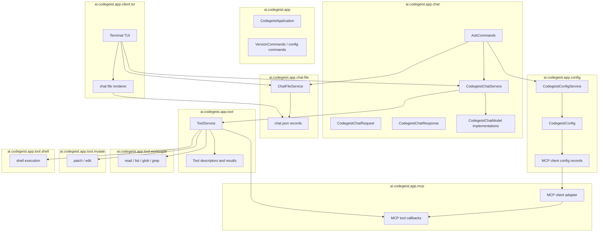

# T007_01 Define Chat File Tool Harness Scope

Parent: `T007_build-codegeist-runtime-harness`

Status: completed

## Goal

Record the current T007 scope and the underlying coding-agent harness design before
implementation continues.

T007 is the local chat-file tool harness: `ask --chat <chat.json>`, resumable
file-based chat state, Codegeist-owned MCP client config, tools, patch/edit, shell,
and terminal TUI over the same chat file.

This child also creates a deep design document that defines what a coding agent
harness is. The document should translate the general `agent = model + harness`
model into Codegeist terms before Java implementation starts.

## Decisions

- `docs/tasks/T007_build-codegeist-runtime-harness/coding-agent-harness.md`
  defines the coding-agent harness concept for Codegeist and T007.
- Treat the model as the language intelligence engine and the harness as the
  surrounding system that owns state, tools, execution, context, policy,
  verification, and user interfaces.
- Codegeist can define multiple named harness profiles under top-level
  `harness:` in direct `codegeist.yml`.
- A top-level `mcp:` map defines reusable MCP server configurations. A harness
  profile selects which of those MCP servers are active for that profile.
- Code annotations define available Codegeist-owned harness capabilities, such as
  local tools and tool metadata. Runtime activation, limits, and profile
  composition come from `codegeist.yml`.
- `chat.json` is the source of truth for resuming and saving a chat.
- `ask` gets optional `--chat <chat.json>`.
- TUI opens, renders, updates, and saves the same chat file.
- MCP clients are configured in direct `codegeist.yml` through a top-level `mcp:`
  map.
- Codegeist-owned tools are in scope, including read/write working-directory file
  tools, MCP tools, patch/edit, and shell.
- Store only chat-relevant information needed to resume and save the chat.
- Do not store provider config, selected provider, selected model, MCP client
  definitions, tool-definition catalogs, or status in `chat.json`.
- Do not add a database, server-side session service, remote sync, API/SDK, Vaadin,
  PF4J, JBang, LSP, skills, memory, or subagents in this T007 slice.

## Deferred Harness Profiles

Earlier planning considered named harness profiles as runtime compositions of
provider selection policy, MCP clients, Codegeist-owned tools, workspace policy,
output limits, and verification defaults. That profile layer is not implemented in
the current T007 runtime. The implemented runtime keeps tools available to the agent
loop and does not expose a global or per-tool disable switch.

If a later task adds harness profiles, keep the reusable MCP catalog separate from
profile-specific runtime limits and make any tool-selection behavior explicit in that
task's acceptance criteria. A future profile shape could use catalog references rather
than negative enablement switches:

```yaml
mcp:
  grep:
    type: stdio
    command: npx
    args:
      - -y
      - "@example/grep-mcp-server"

  filesystem:
    type: stdio
    command: npx
    args:
      - -y
      - "@modelcontextprotocol/server-filesystem"
      - .

harness:
  my-harness:
    mcp:
      - grep
      - filesystem
    tools:
      - read
      - write
      shell:
        timeout-seconds: 30
    context:
      max-tool-output-chars: 12000
    workspace:
      root: .

  coding-harness:
    mcp:
      - filesystem
    tools:
      - read
      - grep
      - patch
      - shell
```

Rules:

- Keep `mcp:` as the reusable catalog of MCP server definitions. This avoids
  duplicating the same server command under several harness profiles.
- If profiles are implemented later, use explicit catalog references to include MCP
  servers and Codegeist-owned local tools for that profile. Do not add a global
  disable switch only to stabilize tests.
- Use annotations in Java source to describe available local harness capabilities,
  for example tool id, model-visible description, side-effect posture, and default
  limits.
- Resolve annotation metadata through an explicit Java registry, not broad runtime
  classpath scanning, so the design stays GraalVM-friendly.
- Let `codegeist.yml` decide future profile composition and runtime limits. An
  annotation says what exists; a harness profile would say which catalog entries are
  included.
- Do not persist the active harness profile, MCP catalog, tool-definition catalogs,
  or runtime limits into `chat.json`. Persist only chat messages and bounded tool
  activity needed to resume and render the chat.
- Defer final active-profile selection until a focused implementation task. Likely
  choices are a default harness in `codegeist.yml`, a CLI option such as
  `ask --harness my-harness`, and matching TUI selection.

Illustrative Java annotation direction:

```java
@HarnessTool(
        id = "shell",
        description = "Run a bounded local shell command",
        sideEffect = true)
final class ShellTool {
}
```

The annotation is metadata, not activation. The current runtime does not implement a
profile selection layer; future tasks must define profile behavior before changing
which tool definitions are exposed.

## Rough Package Diagram

This is planned package direction for T007, not permission to create placeholder
packages. Add each package only when the focused child task introduces tested source
that belongs there.



## Required Parent Changes

- `docs/tasks/T007_build-codegeist-runtime-harness/coding-agent-harness.md`
  describes what a coding agent harness is and maps the concept to the T007
  chat-file tool harness.
- Parent `task.md` names the expanded chat-file tool harness feature set.
- `docs/developer/specification/runtime-harness-implementation.md` describes the
  chat-file implementation plan.
- Earlier minimal-MCP-only child tasks are replaced by chat-file, tools, patch/shell,
  TUI, and verification slices.

## Acceptance Criteria

- A deep coding-agent harness document exists at
  `docs/tasks/T007_build-codegeist-runtime-harness/coding-agent-harness.md`.
- The document defines the model/harness boundary and explains state, tools,
  filesystem/git, shell execution, MCP, context management, safety, UI, and
  verification as harness responsibilities.
- The document maps the harness concept to Codegeist T007 and clearly identifies
  what remains deferred beyond this slice.
- The task defines multiple named `codegeist.yml` harness profiles under
  top-level `harness:`.
- The task distinguishes the reusable top-level `mcp:` server catalog from
  per-harness MCP server selection under `harness.<id>.mcp`.
- The task defines the boundary between annotation-described Codegeist harness
  capabilities and runtime activation through `codegeist.yml`.
- The task keeps active harness profile, MCP definitions, enabled tool
  definitions, and harness limits out of `chat.json`.
- The parent task clearly states the T007 completion feature set.
- The parent task defines `ask --chat <chat.json>` as the resumable chat entrypoint.
- The parent task identifies TUI, tools, patch/edit, shell, and file-based chat
  storage as in scope.
- A rough package diagram captures the planned package ownership for chat file,
  tools, MCP, mutation, shell, and TUI code.
- Follow-up child tasks are small enough to implement with focused tests.

## Verification

```bash
git --no-pager diff --check
```
