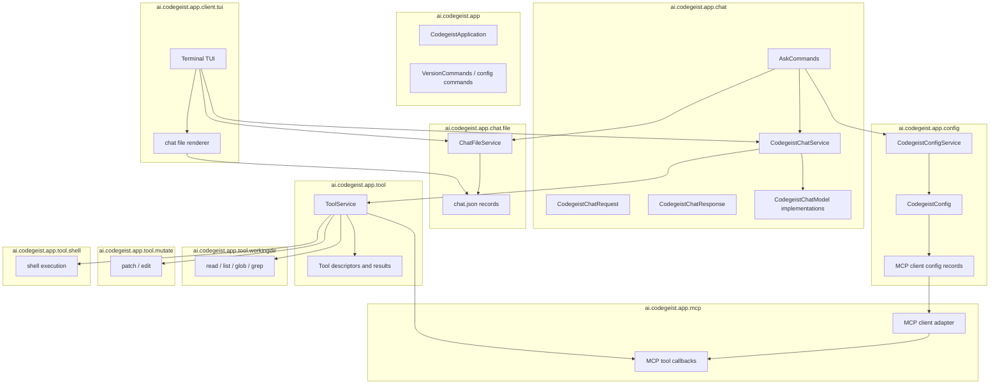

# T007_01 Define Chat File Tool Harness Scope

Parent: `T007_build-codegeist-runtime-harness`

Status: open

## Goal

Record the current T007 scope before implementation continues.

T007 is the local chat-file tool harness: `ask --chat <chat.json>`, resumable
file-based chat state, Codegeist-owned MCP client config, tools, patch/edit, shell,
and terminal TUI over the same chat file.

## Decisions

- `chat.json` is the source of truth for resuming and saving a chat.
- `ask` gets optional `--chat <chat.json>`.
- TUI opens, renders, updates, and saves the same chat file.
- MCP clients are configured in direct `codegeist.yml` through a top-level `mcp:`
  map.
- Codegeist-owned tools are in scope, including read/write working-directory file
  tools, MCP tools, patch/edit, and shell.
- Store only chat-relevant information needed to resume and save the chat.
- Do not store provider config, selected provider, selected model, MCP client
  definitions, enabled tool definitions, or status in `chat.json`.
- Do not add a database, server-side session service, remote sync, API/SDK, Vaadin,
  PF4J, JBang, LSP, skills, memory, or subagents in this T007 slice.

## Rough Package Diagram

This is planned package direction for T007, not permission to create placeholder
packages. Add each package only when the focused child task introduces tested source
that belongs there.



## Required Parent Changes

- Parent `task.md` names the expanded chat-file tool harness feature set.
- `docs/developer/specification/runtime-harness-implementation.md` describes the
  chat-file implementation plan.
- Earlier minimal-MCP-only child tasks are replaced by chat-file, tools, patch/shell,
  TUI, and verification slices.

## Acceptance Criteria

- The parent task clearly states the T007 completion feature set.
- The parent task defines `ask --chat <chat.json>` as the resumable chat entrypoint.
- The parent task identifies TUI, tools, patch/edit, shell, and file-based chat
  storage as in scope.
- A rough package diagram captures the planned package ownership for chat file,
  tools, MCP, mutation, shell, and TUI code.
- Follow-up child tasks are small enough to implement with focused tests.

## Verification

```bash
git --no-pager diff --check
```
