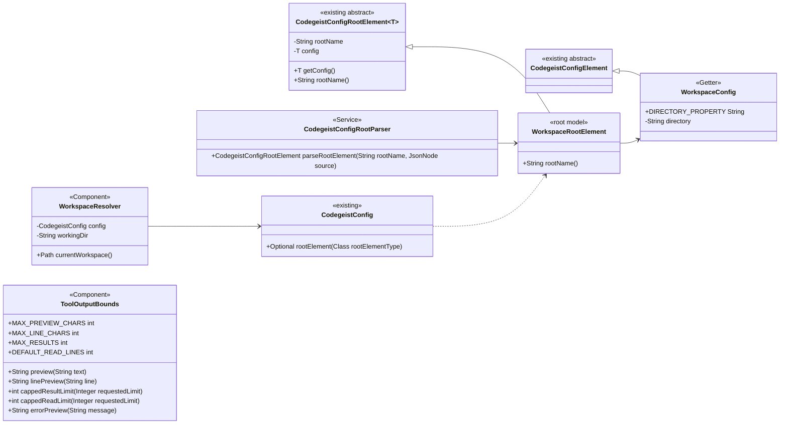
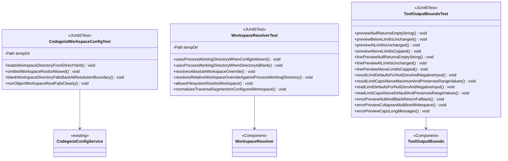

# T007_03_02 Add Workspace Resolution And Output Bounds

Parent: `T007_03_add-mcp-and-read-write-tools`

Status: completed

## Goal

Add reusable workspace-resolution and output-bound primitives for the later local
file tools and MCP recording wrappers.

This task intentionally does not add permission or safety rules. The active
workspace is the base directory tools use to interpret relative paths. By default
it is the current process working directory, and users can override it through
direct `codegeist.yml`.

## Dependencies

- Can be implemented independently from `T007_03_01`.
- Must be complete before `T007_03_03_add-local-file-tools.md`.

## Scope

- Add a direct `codegeist.yml` root for workspace settings.
- Add `WorkspaceRootElement` under `ai.codegeist.app.config`.
- Add `WorkspaceConfig` under `ai.codegeist.app.config`.
- Add `WorkspaceResolver` under `ai.codegeist.app.tool`.
- Add `ToolOutputBounds` under `ai.codegeist.app.tool`.
- Keep `WorkspaceResolver` and `ToolOutputBounds` as Spring beans because
  `CodegeistFileTools` and MCP recording wrappers will inject them later.
- Implement current-directory defaults, optional `workspace.directory` overrides,
  relative override resolution, root workspace support, preview truncation, line
  truncation, result-limit capping, and bounded error previews.

## Implementation Specification

This child is a helper-only slice. It must add the workspace and output-bound
primitives that later file tools and MCP wrappers can call, but it must not expose
any model-callable tool callbacks yet.

### Files To Add

- `app/codegeist/cli/src/main/java/ai/codegeist/app/config/WorkspaceRootElement.java`
- `app/codegeist/cli/src/main/java/ai/codegeist/app/config/WorkspaceConfig.java`
- `app/codegeist/cli/src/main/java/ai/codegeist/app/tool/WorkspaceResolver.java`
- `app/codegeist/cli/src/main/java/ai/codegeist/app/tool/ToolOutputBounds.java`
- `app/codegeist/cli/src/test/java/ai/codegeist/app/config/CodegeistWorkspaceConfigTest.java`
- `app/codegeist/cli/src/test/java/ai/codegeist/app/tool/WorkspaceResolverTest.java`
- `app/codegeist/cli/src/test/java/ai/codegeist/app/tool/ToolOutputBoundsTest.java`

### Files To Change

- `app/codegeist/cli/src/main/resources/META-INF/native-image/reflect-config.json`
  only if the new config POJOs need Jackson reflection metadata for native images.
- `docs/developer/architecture/architecture.md` to record the implemented config
  root, tool helper package, focused tests, and native metadata.

### Files Not To Change

- Do not change `AskCommands`, `CodegeistChatService`, provider classes, MCP runtime,
  session persistence, or `pom.xml` in this child.

### Direct `codegeist.yml` Contract

Use this shape for workspace overrides:

```yaml
workspace:
  directory: /some/path
```

Rules:

- `workspace:` is optional.
- `workspace.directory` is optional.
- When `workspace.directory` is absent or blank, the active workspace is the current
  process working directory.
- When `workspace.directory` is absolute, normalize it and use it as the active
  workspace.
- When `workspace.directory` is relative, resolve it against the current process
  working directory, then normalize it.
- A filesystem root or drive root is valid. For example, `/` can intentionally be the
  workspace when a system-level session needs broad filesystem access.
- This config root does not define permissions, deny lists, allow lists, ignored-file
  behavior, write protection, or symlink rules.

### `WorkspaceRootElement`

Purpose: hold the optional direct `workspace:` YAML root parsed by
`CodegeistConfigRootParser` through the same root model mechanism used by provider
and MCP config.

Shape:

```java
public class WorkspaceRootElement extends CodegeistConfigRootElement<WorkspaceConfig> {
}
```

Contract:

- `rootName()` returns `workspace`.
- `CodegeistConfigRootParser` maps the root object into the inherited
  `CodegeistConfigRootElement<T>` `config` field as `WorkspaceConfig`.
- `CodegeistConfigYamlMapper` renders the parsed `WorkspaceConfig` when direct YAML
  output is requested.
- The root accepts a YAML object.
- A present non-object `workspace:` value fails with a concise config validation
  message from `CodegeistConfigRootParser`.
- The root does not support typed map entries and does not use a `type` discriminator.
- Keep validation limited to the current `directory` field.
- `WorkspaceRootElement` is not a Spring component.

### `WorkspaceConfig`

Purpose: carry direct YAML workspace settings only.

Shape:

```java
@Getter
@Setter
public class WorkspaceConfig extends CodegeistConfigElement {
    public static final String DIRECTORY_PROPERTY = "directory";

    @JsonProperty(DIRECTORY_PROPERTY)
    private String directory;
}
```

Rules:

- Keep `directory` nullable so omission can mean default process working directory.
- Do not add enablement flags, path safety fields, ignored-file fields, write rules,
  or future workspace metadata in this child.
- Do not store provider, model, MCP, tool, session, or TUI state here.

### `WorkspaceResolver`

Purpose: resolve the active workspace directory for file tools.

Annotations:

```java
@Component
@RequiredArgsConstructor
public class WorkspaceResolver {
}
```

Constructor-injected collaborators:

- `CodegeistConfig config`

Field injection:

```java
@Value("${user.dir}")
String workingDir;
```

Public method:

```java
public Path currentWorkspace()
```

Resolution contract:

- Let `processWorkingDirectory = Path.of(workingDir).toAbsolutePath().normalize()`.
- If `CodegeistConfig.rootElement(WorkspaceRootElement.class)` is absent, return the
  process working directory.
- If the workspace config exists but `directory` is absent or blank, return the
  process working directory.
- If `directory` is absolute, return `Path.of(directory).toAbsolutePath().normalize()`.
- If `directory` is relative, return
  `processWorkingDirectory.resolve(directory).normalize()`.
- Do not require the resulting path to exist in this child unless a later local-tool
  test proves that the tool boundary needs an existence check.
- Do not reject `/`, drive roots, paths outside the repository, symlinks, or traversal
  segments after normalization. The configured workspace is intentional user input.

### `ToolOutputBounds`

Purpose: centralize deterministic truncation and limit capping before local and MCP
tool output can reach the model or `.codegeist/session.json`.

Annotations:

```java
@Component
public class ToolOutputBounds {
}
```

Constants:

```java
public static final int MAX_PREVIEW_CHARS = 8000;
public static final int MAX_LINE_CHARS = 500;
public static final int MAX_RESULTS = 200;
public static final int DEFAULT_READ_LINES = 200;
```

Public methods:

```java
public String preview(String text)

public String linePreview(String line)

public int cappedResultLimit(Integer requestedLimit)

public int cappedReadLimit(Integer requestedLimit)

public String errorPreview(String message)
```

Preview contract:

- Treat `null` preview input as an empty string.
- Measure limits with Java `String.length()` so behavior is deterministic and easy to
  test.
- If `text.length() <= MAX_PREVIEW_CHARS`, return the original text.
- If `text.length() > MAX_PREVIEW_CHARS`, return the prefix of length
  `MAX_PREVIEW_CHARS`.
- Do not add ellipses or extra marker text.

Line-preview contract:

- Treat `null` line input as an empty string.
- If `line.length() <= MAX_LINE_CHARS`, return the original line.
- If `line.length() > MAX_LINE_CHARS`, return the prefix of length `MAX_LINE_CHARS`.
- Do not append ellipses or extra marker text.

Limit-capping contract:

- `cappedResultLimit(null)` returns `MAX_RESULTS`.
- `cappedResultLimit(requestedLimit <= 0)` returns `MAX_RESULTS`.
- `cappedResultLimit(requestedLimit > MAX_RESULTS)` returns `MAX_RESULTS`.
- `cappedResultLimit(1..MAX_RESULTS)` returns the requested value.
- `cappedReadLimit(null)` returns `DEFAULT_READ_LINES`.
- `cappedReadLimit(requestedLimit <= 0)` returns `DEFAULT_READ_LINES`.
- `cappedReadLimit(requestedLimit > DEFAULT_READ_LINES)` returns
  `DEFAULT_READ_LINES`.
- `cappedReadLimit(1..DEFAULT_READ_LINES)` returns the requested value.

Error-preview contract:

- Treat `null` and blank messages as `Tool failed`.
- Collapse runs of whitespace, including newlines and tabs, to a single space.
- Trim leading and trailing whitespace.
- Return at most `MAX_LINE_CHARS` characters.
- Do not append ellipses or extra marker text.

## Class Diagrams

### Runtime Helper Classes



### Focused Test Classes



## Acceptance Criteria

- Direct `codegeist.yml` can load optional `workspace.directory`.
- Missing or blank `workspace.directory` resolves to the process working directory.
- Absolute `workspace.directory` values become the active workspace after
  normalization.
- Relative `workspace.directory` values resolve against the process working directory.
- A filesystem root or drive root can be the active workspace.
- Preview output, line previews, result limits, read limits, and error previews are
  bounded deterministically.
- Error messages remain concise and do not include secret-bearing config values.

## Test Specification

Add focused unit tests without starting provider calls or real tool callbacks.

### `CodegeistWorkspaceConfigTest`

Required cases:

- Direct YAML with `workspace.directory` loads into `WorkspaceConfig`.
- Omitted `workspace:` root is accepted.
- Blank `workspace.directory` is accepted so the resolver can fall back to the
  process working directory.
- A present non-object `workspace:` root fails with a clear config validation error.

### `WorkspaceResolverTest`

Required cases:

- Uses the process working directory when `workspace:` config is absent.
- Uses the process working directory when `workspace.directory` is blank.
- Resolves absolute workspace overrides.
- Resolves relative workspace overrides against the process working directory.
- Allows `/` or the platform filesystem root as the active workspace.
- Normalizes traversal segments in configured workspace values without treating them
  as errors.

### `ToolOutputBoundsTest`

Required cases:

- `preview(null)` returns an empty string.
- Preview text shorter than `MAX_PREVIEW_CHARS` is unchanged.
- Preview text exactly `MAX_PREVIEW_CHARS` is unchanged.
- Preview text longer than `MAX_PREVIEW_CHARS` is capped.
- `linePreview(null)` returns an empty string.
- Line text exactly `MAX_LINE_CHARS` is unchanged.
- Line text longer than `MAX_LINE_CHARS` is capped.
- Result limits default to `MAX_RESULTS` for `null`, zero, and negative input.
- Result limits cap values above `MAX_RESULTS` and preserve values inside the range.
- Read limits default to `DEFAULT_READ_LINES` for `null`, zero, and negative input.
- Read limits cap values above `DEFAULT_READ_LINES` and preserve values inside the
  range.
- `errorPreview(null)` and blank messages return `Tool failed`.
- `errorPreview(...)` collapses multiline whitespace to a single line.
- `errorPreview(...)` caps long messages at `MAX_LINE_CHARS`.

## Implementation Order

1. Add `CodegeistWorkspaceConfigTest`, `WorkspaceResolverTest`, and
   `ToolOutputBoundsTest` with the required cases.
2. Add the `workspace:` config root classes.
3. Add the `ai.codegeist.app.tool` package and the two helper classes.
4. Add native reflection metadata only if the config POJOs need it for native image
   Jackson binding.
5. Run the focused Taskfile selector from `app/codegeist/cli`.
6. Update this task file with implementation status and verification evidence only
   after the code exists.

## Implementation Result

- Added `WorkspaceRootElement` and `WorkspaceConfig` for optional direct
  `codegeist.yml` `workspace.directory` parsing.
- Added `WorkspaceResolver` as a Spring bean that resolves the active workspace from
  the configured directory or the process working directory.
- Moved the single-object workspace config storage into
  `CodegeistConfigRootElement<T>` as the inherited validated `T config` slot.
- Moved root parsing into the central generic `CodegeistConfigRootParser` and kept
  `CodegeistConfigRootElement` subclasses as non-Spring model objects.
- Added `ToolOutputBounds` as a Spring bean for deterministic preview, line, result,
  read-limit, and error-preview capping.
- Added native reflection metadata for `WorkspaceRootElement` and
  `WorkspaceConfig`.
- Added the focused tests named in this task and kept this child free of local file
  callbacks, MCP runtime behavior, session schema changes, and provider changes.

Verification from `app/codegeist/cli`:

```bash
task test TEST=CodegeistWorkspaceConfigTest,WorkspaceResolverTest,ToolOutputBoundsTest
```

Result: passed with 24 tests, 0 failures, 0 errors, and Maven total time 3.700s.

After moving workspace config storage into `CodegeistConfigRootElement<T>` and root
parsing into `CodegeistConfigRootParser`, `task build` passed from a clean `target/`
directory and the broader focused selector also passed:

```bash
task test TEST=CodegeistWorkspaceConfigTest,WorkspaceResolverTest,ToolOutputBoundsTest,CodegeistConfigServiceTest,CodegeistProviderConfigTest
```

Result: passed with 59 tests, 0 failures, 0 errors, and Maven total time 2.438s.

## Non-Goals

- Do not implement local file tool callbacks.
- Do not add permission rules, path escape rejection, symlink rejection,
  ignored-file filtering, generated-file filtering, session-store write protection,
  or filesystem allow/deny lists.
- Do not shell out to OS tools.
- Do not add MCP dependencies or MCP runtime behavior.
- Do not modify `.codegeist/session.json` schema in this child.
- Do not add compatibility wrappers or unused helper overloads.

## Suggested Tests

- `CodegeistWorkspaceConfigTest` for direct YAML `workspace.directory` parsing and
  invalid root shape.
- `WorkspaceResolverTest` for current-directory fallback, absolute override,
  relative override, root workspace support, and normalization.
- `ToolOutputBoundsTest` for preview truncation, line caps, result limits, read
  defaults, read caps, and bounded errors.

Candidate commands from `app/codegeist/cli`:

```bash
task test TEST=CodegeistWorkspaceConfigTest,WorkspaceResolverTest,ToolOutputBoundsTest
```
