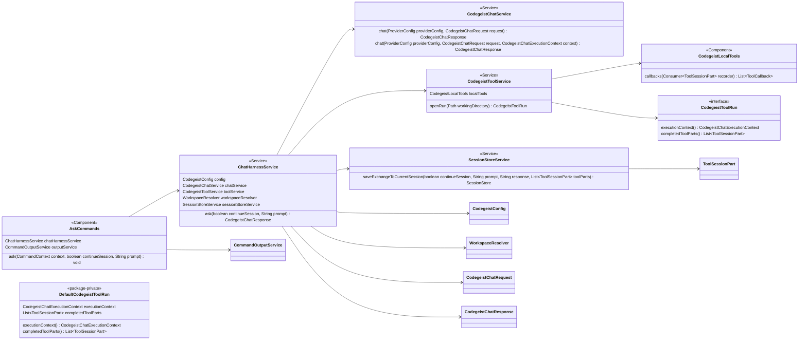
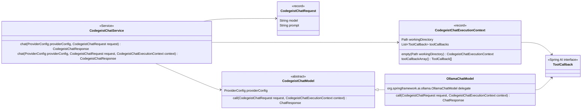
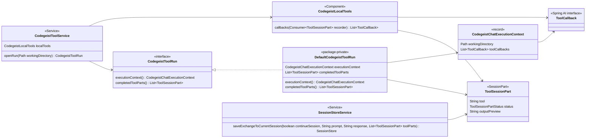

# T007_03_04 Add Tool-Aware Chat Harness

Parent: `T007_03_add-mcp-and-read-write-tools`

Status: completed

## Goal

Add the narrow one-turn chat harness that opens a scoped tool run, passes local tool
callbacks to the provider call path, saves recorded tool parts, and keeps
`AskCommands` as a thin shell adapter.

## Dependencies

- Depends on `T007_03_03_add-local-file-tools.md`.

## Scope

- Add `ChatHarnessService` under `ai.codegeist.app.chat`.
- Add `CodegeistChatExecutionContext` under `ai.codegeist.app.chat`.
- Add context-aware overloads to `CodegeistChatService` and `CodegeistChatModel`.
- Update `OllamaChatModel` to pass runtime `ToolCallback` values through Spring AI
  chat options for the current prompt.
- Add `CodegeistToolService` and `CodegeistToolRun` under `ai.codegeist.app.tool`.
- Add `DefaultCodegeistToolRun` as the package-private first implementation.
- Refactor `AskCommands` to delegate to `ChatHarnessService` and print only the
  returned response content.

## Acceptance Criteria

- `CodegeistChatRequest` still has exactly `model` and `prompt` components.
- `ChatHarnessService` selects the default provider and model, opens one tool run,
  calls the chat service with execution context, saves prompt/tool parts/assistant
  text, closes the run, and returns response content.
- Tool callbacks from local file tools reach the provider call path through
  `CodegeistChatExecutionContext`.
- `AskCommands` stdout remains response text only.
- Existing `ask -c` parser and command-boundary exception behavior remains intact.

## Non-Goals

- Do not add MCP runtime setup; `T007_03_05` owns that adapter.
- Do not reconstruct provider-facing context from stored session history.
- Do not add TUI, patch/edit, shell, permission prompts, or broad tool registry.
- Do not add an OpenCode-style coding-agent loop. This slice passes prompt-scoped
  tool callbacks into one provider call path; Codegeist does not yet own an
  iterative model/tool/model loop, streaming event loop, permission loop, or
  multi-step agent controller.

## Implementation Class Diagrams

This slice adds a narrow one-turn harness and a scoped tool-run boundary. The
diagrams include existing classes that must change because they connect the new
classes to the current command, provider, local-tool, and session-store paths.

### Command And Harness Boundary

This view keeps the Spring Shell command thin and moves provider selection, tool-run
setup, chat execution, and session persistence into `ChatHarnessService`.



### Provider Chat Context

This view keeps `CodegeistChatRequest` unchanged and passes runtime-only tool
callbacks beside the request through `CodegeistChatExecutionContext`.



### Tool Run And Persistence Boundary

This view shows the scoped tool run that records bounded local tool activity before
`ChatHarnessService` saves the exchange through the existing session-store overload.



## Class Responsibilities

- `ChatHarnessService` is the new orchestration service for one `ask` turn. It
  selects the default provider and provider-owned default model, opens a scoped tool
  run, calls the chat service with the tool-aware execution context, saves prompt,
  recorded tool parts, and assistant text, then returns the response for the command
  layer to print.
- `CodegeistChatExecutionContext` is the runtime-only context passed beside
  `CodegeistChatRequest`. It carries the active working directory and prompt-scoped
  Spring AI `ToolCallback` values without widening `CodegeistChatRequest` or storing
  provider, model, MCP, or session configuration.
- `CodegeistToolService` is the tool-run factory for this slice. It assembles local
  file tool callbacks from `CodegeistLocalTools`, gives them one ordered recorder for
  `ToolSessionPart` values, and returns a `CodegeistToolRun`. MCP callback assembly
  remains deferred to `T007_03_05`.
- `CodegeistToolRun` is the per-turn tool scope. It exposes the chat execution
  context and a defensive copy of the recorded tool parts. It is not closeable until
  a later MCP slice introduces real resources to clean up.
- `DefaultCodegeistToolRun` is the package-private first implementation. It stores
  the immutable execution context, the mutable internal recorded-part list, and
  returns immutable copies to callers.
- `AskCommands` remains the Spring Shell boundary. It should stop selecting providers,
  calling `CodegeistChatService`, or saving sessions directly; it delegates to
  `ChatHarnessService` and prints only `response.content()` through
  `CommandOutputService`.
- `CodegeistChatService` keeps the existing no-context overload for current tests and
  callers, then adds a context-aware overload that passes the context to the selected
  `CodegeistChatModel`.
- `CodegeistChatModel` treats the context-aware `call` method as the only provider
  implementation contract. No-tool callers go through the no-context
  `CodegeistChatService` overload, which supplies an empty `CodegeistChatExecutionContext`.
- `OllamaChatModel` is the first provider model that uses the new context. Its
  context-aware `call` method should build `OllamaChatOptions` with the runtime model
  and `toolCallbacks` from `CodegeistChatExecutionContext`, then call the existing
  Spring AI Ollama delegate.
- `CodegeistLocalTools` already exists and remains the local callback assembly seam.
  This task should use it rather than adding a new registry or reworking individual
  file tools.
- `SessionStoreService` already supports saving a text exchange with ordered
  `ToolSessionPart` values. `ChatHarnessService` should call that overload so tool
  activity is stored before the assistant text part.

## Suggested Tests

- `ChatHarnessServiceTest` with hand-written fakes for provider config, chat service,
  tool service, and session store behavior.
- Update `AskCommandsSessionStoreTest` to focus on command delegation, stdout, parser
  flags, and exception mapper annotation.
- Add or update a focused chat model/service test proving callbacks are passed to
  the model context without changing `CodegeistChatRequest`.

Candidate commands from `app/codegeist/cli`:

```bash
task test TEST=ChatHarnessServiceTest,CodegeistChatServiceTest,CodegeistToolServiceTest,AskCommandsSessionStoreTest,CodegeistLocalToolsTest,SessionStoreServiceTest
```

## Implementation Result

- Added `ChatHarnessService` under `ai.codegeist.app.chat` as the one-turn
  orchestration boundary for `ask` and future UI callers. It selects the default
  provider and model, resolves the active workspace, opens a scoped tool run, calls
  the chat service with runtime context, saves prompt/tool parts/assistant text, and
  returns response content without printing.
- Added `CodegeistChatExecutionContext` as the runtime-only context for active
  workspace plus prompt-scoped Spring AI `ToolCallback` values. `CodegeistChatRequest`
  still has exactly `model` and `prompt` components.
- Added `CodegeistToolService`, `CodegeistToolRun`, and package-private
  `DefaultCodegeistToolRun` under `ai.codegeist.app.tool`. The first tool run
  assembles local read/list/glob/grep/write callbacks, records bounded
  `ToolSessionPart` values in call order, and returns defensive completed-part
  copies. It is intentionally not closeable until MCP adds real resources in
  `T007_03_05`.
- Added context-aware overloads to `CodegeistChatService` and made the context-aware
  `CodegeistChatModel` call the provider implementation contract. The existing
  service-level no-context path remains available for current callers by supplying an
  empty context.
- Updated `OllamaChatModel` to attach runtime tool callbacks to
  `OllamaChatOptions` for the current prompt.
- Refactored `AskCommands` into a thin Spring Shell adapter over
  `ChatHarnessService`; stdout remains only the returned response content.
- This result is intentionally not a full coding-agent loop. Any tool-use
  continuation inside the single provider call is delegated to Spring AI's chat-model
  tool-calling behavior; Codegeist does not yet implement its own repeated
  model/tool/model control loop like OpenCode.
- Added focused tests for the harness, chat context handoff, tool-run recording, and
  command delegation.

## Verification

- 2026-06-20: `task test TEST=ChatHarnessServiceTest,CodegeistChatServiceTest,CodegeistToolServiceTest,AskCommandsSessionStoreTest,CodegeistLocalToolsTest,SessionStoreServiceTest`
  passed from `app/codegeist/cli` with 32 tests, 0 failures, 0 errors, and 0 skips.
- 2026-06-20: `task test` passed from `app/codegeist/cli` with 115 tests, 0
  failures, 0 errors, and 6 skips.
