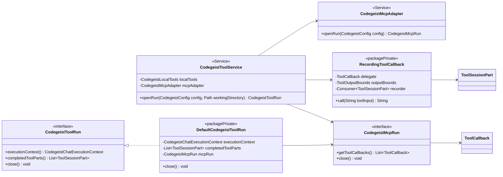
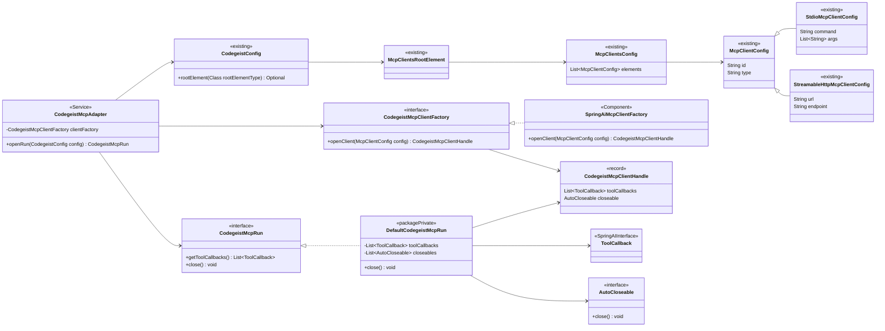
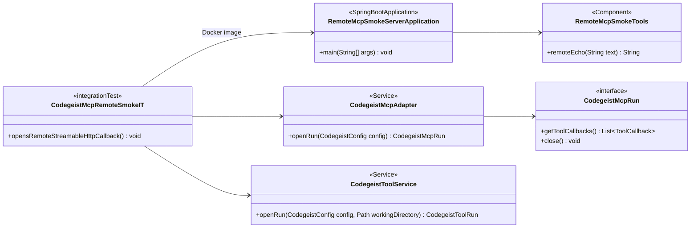
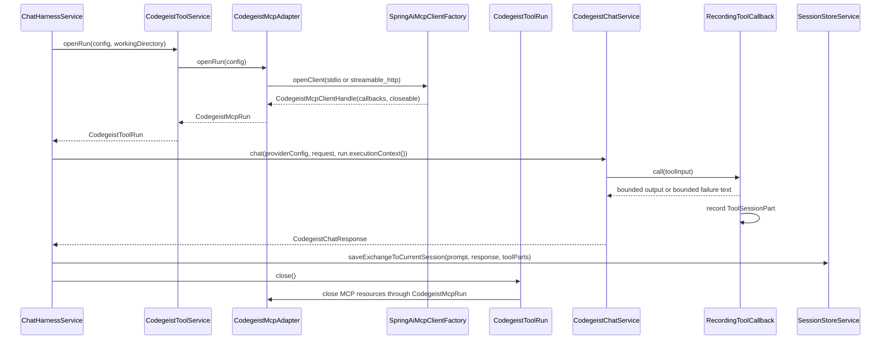
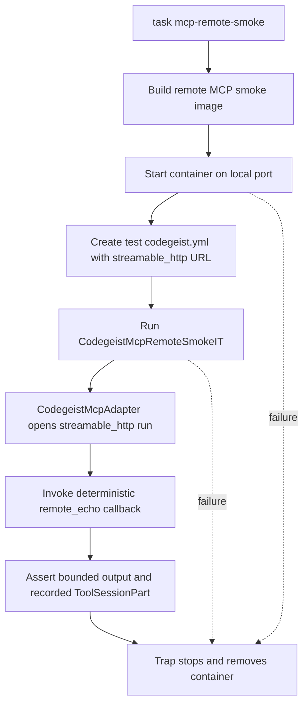

# T007_03_05 Add MCP Callback Adapter

Parent: `T007_03_add-mcp-and-read-write-tools`

Status: completed

## Goal

Add the Spring AI MCP client dependency and a lazy MCP adapter that maps
Codegeist `mcp:` config into MCP tool callbacks for the scoped chat tool run.
Support both local `stdio` clients and `streamable_http` clients, with an
explicit Docker-backed smoke test that simulates a remote MCP server.

## Dependencies

- Depends on `T007_03_04_add-tool-aware-chat-harness.md`.

## Scope

- Add `spring-ai-starter-mcp-client` to `app/codegeist/cli/pom.xml`.
- Add `CodegeistMcpAdapter` under `ai.codegeist.app.mcp`.
- Add `CodegeistMcpRun` under `ai.codegeist.app.mcp`.
- Add `DefaultCodegeistMcpRun` as the package-private first implementation.
- Extend the minimal `McpClientConfig` contract with concrete transport configs:
  `StdioMcpClientConfig` for `command`/`args` and
  `StreamableHttpMcpClientConfig` for `url` plus optional `endpoint`. When endpoint
  is absent, let the MCP Java SDK builder use its own default.
- Map `CodegeistConfig.rootElement(McpClientsRootElement.class)` into Spring AI MCP
  clients during `CodegeistMcpAdapter.openRun(...)` only.
- Convert MCP clients into Spring AI `ToolCallback` values and wrap them with
  recording behavior in `CodegeistToolService`.
- Close MCP resources through the tool run.
- Add a Docker-backed remote MCP smoke path that starts a deterministic MCP server
  in a container and verifies the real `streamable_http` callback path without
  involving an LLM provider.

## Acceptance Criteria

- Config parsing and `--show-config` do not start MCP processes.
- Absent or empty `mcp:` config opens an empty MCP run.
- Unsupported MCP `type` fails clearly before a provider call.
- One configured `stdio` MCP client can be mapped into the client creation/callback
  path without exposing `spring.ai.mcp.client.*` as public Codegeist config.
- One configured `streamable_http` MCP client can be mapped into the remote client
  creation/callback path without exposing `spring.ai.mcp.client.*` as public
  Codegeist config.
- MCP callbacks are included in the tool run and their bounded results are recorded.
- Closeable MCP resources are closed when the tool run closes.
- The Docker smoke test starts and cleans up a local container that simulates a
  remote MCP server, then calls a deterministic MCP callback directly through the
  adapter/tool-run path.

## Non-Goals

- Do not add SSE, OAuth, environment variables, public timeout fields, enablement
  flags, server discovery, server management commands, resources, or prompt support.
- Do not add external-network-dependent MCP tests. The remote smoke must use a
  local Docker container and remain outside the default `task test` path.
- Do not persist MCP command, args, status, resources, prompts, or tool definitions
  in `.codegeist/session.json`.

## Implementation Plan

Keep the adapter boundary small. The production path should create MCP clients only
inside `CodegeistMcpAdapter.openRun(...)`, expose their Spring AI callbacks to the
current `CodegeistToolRun`, and close every created client when that run closes. Unit
tests should exercise the adapter through hand-written fakes so they do not launch
processes or Docker containers. The remote `streamable_http` path gets one separate
Docker smoke that proves the real transport against a deterministic local MCP server.

### Classes To Create

| Class | Package or path | Visibility | Responsibility |
| --- | --- | --- | --- |
| `CodegeistMcpAdapter` | `ai.codegeist.app.mcp` | public Spring `@Service` | Reads the already parsed direct `mcp:` root lazily, asks the factory to open each client, and returns one `CodegeistMcpRun`. |
| `CodegeistMcpRun` | `ai.codegeist.app.mcp` | public interface | Prompt-scoped MCP resource handle with `getToolCallbacks()` and `close()`. |
| `DefaultCodegeistMcpRun` | `ai.codegeist.app.mcp` | package-private final class | Stores immutable MCP callbacks plus closeables and closes resources in reverse creation order. |
| `CodegeistMcpClientFactory` | `ai.codegeist.app.mcp` | package-private interface | Test seam for turning one `McpClientConfig` into callbacks and a closeable resource. |
| `SpringAiMcpClientFactory` | `ai.codegeist.app.mcp` | package-private Spring component | Real Spring AI/MCP implementation for `stdio` and `streamable_http` clients. |
| `CodegeistMcpClientHandle` | `ai.codegeist.app.mcp` | package-private record | Small value object containing MCP callbacks and the closeable created for one configured client. |
| `RecordingToolCallback` | `ai.codegeist.app.tool` | package-private final class | Wraps MCP callbacks, preserves delegate definition/metadata, bounds success/failure output, and records `ToolSessionPart` values. |
| `RemoteMcpSmokeServerApplication` | `scripts/tests/fixtures/mcp-remote-server/src/main/java/ai/codegeist/tests/mcp` | public fixture class | Minimal Docker-hosted Spring Boot MCP server used only by `task mcp-remote-smoke`. |
| `RemoteMcpSmokeTools` | `scripts/tests/fixtures/mcp-remote-server/src/main/java/ai/codegeist/tests/mcp` | package-private fixture component | Deterministic smoke tool such as `remote_echo`. |

### Test Classes To Create

| Class | Package or path | Responsibility |
| --- | --- | --- |
| `CodegeistMcpAdapterTest` | `app/codegeist/cli/src/test/java/ai/codegeist/app/mcp` | Tests absent/empty config, `stdio` mapping seam, `streamable_http` mapping seam, callback exposure, and close behavior. |
| `CodegeistMcpRemoteSmokeIT` | `app/codegeist/cli/src/test/java/ai/codegeist/app/mcp` | Runs only from `task mcp-remote-smoke`; calls a deterministic callback through the real remote transport without using an LLM provider. |
| `AskCommandsMcpRemoteSmokeIT` | `app/codegeist/cli/src/test/java/ai/codegeist/app/provider` | Runs only from `task mcp-remote-smoke`; starts Spring Boot `ask` with local Ollama plus remote MCP config and verifies a completed remote MCP tool part. |

### Existing Classes To Change

| Class or file | Change |
| --- | --- |
| `app/codegeist/cli/pom.xml` | Add Spring AI MCP client dependency and any smallest required streamable HTTP transport dependency if the starter does not provide it. |
| `McpClientConfig` | Make it the abstract MCP config base; add `StdioMcpClientConfig` and `StreamableHttpMcpClientConfig` so required fields are type-specific. |
| `CodegeistToolRun` | Extend `AutoCloseable` and expose `close()`. |
| `DefaultCodegeistToolRun` | Hold the `CodegeistMcpRun` and close it when the tool run closes. |
| `CodegeistToolService` | Inject `CodegeistMcpAdapter`, merge local and MCP callbacks, and wrap MCP callbacks with `RecordingToolCallback`. |
| `ChatHarnessService` | Use try-with-resources around `toolService.openRun(config, workingDirectory)`. |
| `CodegeistConfigServiceTest` | Add direct YAML coverage for `streamable_http` config. |
| `CodegeistToolServiceTest` | Add fake MCP callbacks and recording-wrapper coverage. |
| `ChatHarnessServiceTest` | Assert the tool run closes after the chat/session-save path. |
| `app/codegeist/cli/Taskfile.yml` | Add `mcp-remote-smoke` and keep it separate from `task test`. |

## Diagrams

### Tool-Run Integration Class View

This view shows the existing chat/tool boundary that must change for MCP callbacks.
It intentionally hides Spring AI transport details behind `CodegeistMcpAdapter`.



### MCP Adapter Class View

This view shows the new `ai.codegeist.app.mcp` internals. Unit tests can replace
`SpringAiMcpClientFactory` with hand-written fakes, while production code keeps the
Spring AI milestone API usage isolated in one component.



### Remote Smoke Fixture Class View

This view keeps the Docker smoke fixture separate from runtime code. The smoke test
starts the fixture container, points a temporary `streamable_http` config at it, and
then drives the normal adapter/tool-run path.



### Chat-Run Flow



### Docker Remote Smoke Flow



## Suggested Tests

- `CodegeistMcpAdapterTest` for empty config, `stdio` mapping seam,
  `streamable_http` mapping seam, callback exposure, and close behavior.
- `CodegeistToolServiceTest` for local plus fake MCP callback assembly and recording
  wrapper behavior.
- `CodegeistMcpRemoteSmokeIT` plus a `task mcp-remote-smoke` entrypoint for the
  Docker-backed `streamable_http` smoke.
- `AskCommandsMcpRemoteSmokeIT`, selected by the same smoke entrypoint, for the
  combined Spring Boot `ask`, local Ollama, and remote MCP tool-call path.
- Use hand-written fakes instead of Mockito.

Candidate commands from `app/codegeist/cli`:

```bash
task test TEST=CodegeistMcpAdapterTest,CodegeistToolServiceTest,ChatHarnessServiceTest,SessionStoreServiceTest
task mcp-remote-smoke
```

## Completion Notes

- Added the Spring AI MCP client dependency and the `ai.codegeist.app.mcp` lazy MCP
  adapter runtime.
- Extended direct `mcp:` config so `stdio` clients use `command`/`args` through
  `StdioMcpClientConfig`, while `streamable_http` clients use `url` plus optional
  `endpoint` through `StreamableHttpMcpClientConfig`. For `streamable_http`, `url`
  is the server base address and `endpoint` is the MCP path. Omitted endpoints now
  rely on the MCP Java SDK builder default instead of a Codegeist-owned default.
- Updated `CodegeistToolService` and `ChatHarnessService` so prompt-scoped tool runs
  include local and MCP callbacks, record bounded MCP results through
  `RecordingToolCallback`, and close MCP resources at the end of the chat turn.
- Added the Docker-backed `task mcp-remote-smoke` path and local fixture under
  `scripts/tests/fixtures/mcp-remote-server/`; it now proves both direct MCP callback
  invocation and Ollama-backed `ask` invocation of the remote MCP tool.

## Verification

- 2026-06-20: `git --no-pager diff --check` passed.
- 2026-06-20: `task test TEST=CodegeistConfigServiceTest,CodegeistMcpAdapterTest,CodegeistToolServiceTest`
  passed from `app/codegeist/cli` with 24 tests, 0 failures, 0 errors, and 0 skips.
- 2026-06-20: `task mcp-remote-smoke` passed from `app/codegeist/cli`; the smoke
  reported `MCP remote smoke status: passed` and `mcp remote smoke total: 6.557s`.
- 2026-06-20: `task test` passed from `app/codegeist/cli` with 125 tests, 0
  failures, 0 errors, and 6 skips.
