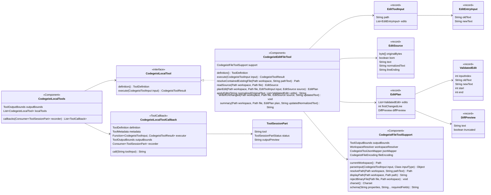
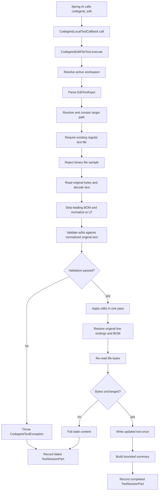
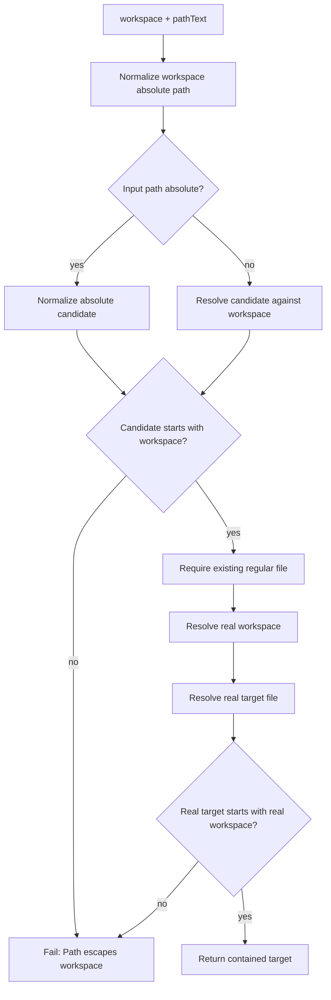
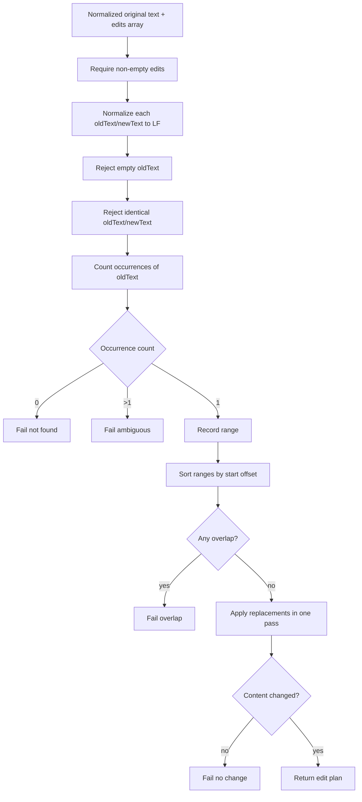
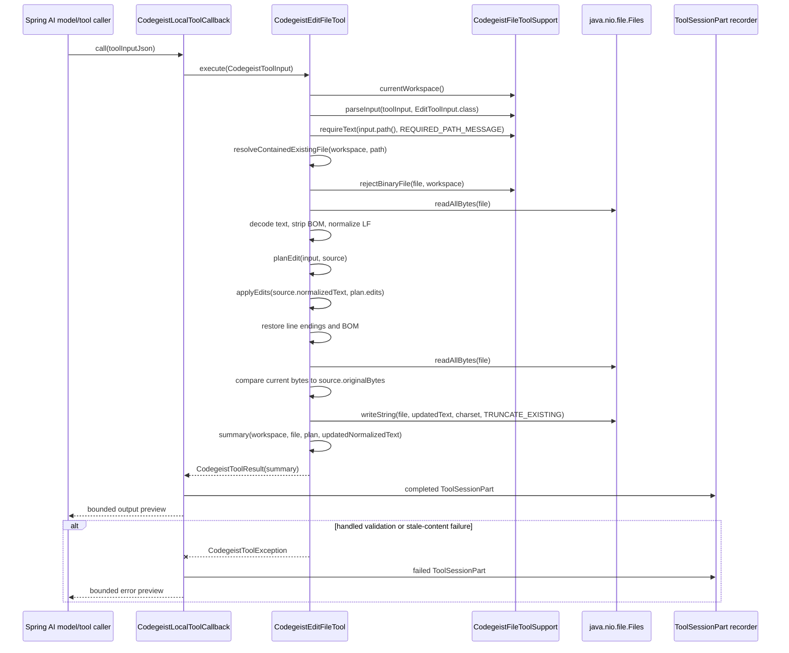
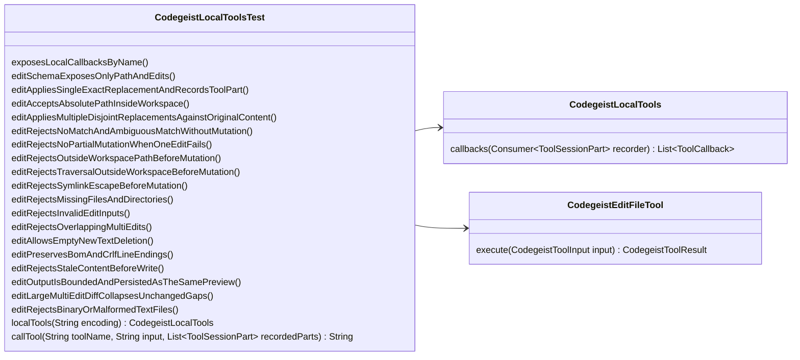

# T007_04_02 Exact Edit Tool Implementation Plan

Implementation handoff for
`tasks/T007_04_02_add-exact-edit-tool.md`.

This document defines the detailed design for `codegeist_edit`: a bounded,
Codegeist-owned exact edit tool for one file under the active workspace. The plan
uses OpenCode as the primary reference for exact replacement semantics, line-ending
and BOM preservation, clear edit failures, and stale-content protection. It uses Pi
as the reference for the child task's explicit multi-edit requirement: one tool call
can apply multiple non-overlapping exact replacements to the same original file.

The final Codegeist contract is intentionally narrower than both references:

- Keep OpenCode-style exact replacement, failure clarity, CRLF/BOM preservation,
  and conditional write checks.
- Keep Pi-style `edits[]` so the task can support one or more replacements and
  reject overlapping multi-edits.
- Drop OpenCode's permission loop because Codegeist has no permission runtime yet;
  outside-workspace edit paths fail before reading or writing.
- Drop Pi's fuzzy matching, path convenience aliases, extension hooks, TUI preview
  lifecycle, legacy top-level old/new compatibility, and broad absolute-path
  acceptance.

## Source References

- Child task:
  `docs/tasks/T007_build-codegeist-runtime-harness/tasks/T007_04_add-patch-edit-and-shell-tools/tasks/T007_04_02_add-exact-edit-tool.md`
- Parent task:
  `docs/tasks/T007_build-codegeist-runtime-harness/tasks/T007_04_add-patch-edit-and-shell-tools/task.md`
- Research handoff:
  `docs/tasks/T007_build-codegeist-runtime-harness/tasks/T007_04_add-patch-edit-and-shell-tools/ask-project-research.md`
- Current tool architecture:
  `docs/developer/architecture/local-file-tools.md`
- Test guidance:
  `docs/tests/README.md`
- OpenCode implementation evidence:
  `docs/third-party/opencode/source/packages/core/src/tool/edit.ts`
- OpenCode tests:
  `docs/third-party/opencode/source/packages/core/test/tool-edit.test.ts`
- OpenCode mutation path policy:
  `docs/third-party/opencode/source/packages/core/src/location-mutation.ts`
- OpenCode conditional file mutation:
  `docs/third-party/opencode/source/packages/core/src/file-mutation.ts`
- Pi edit implementation evidence:
  `docs/third-party/pi/source/packages/coding-agent/src/core/tools/edit.ts`
- Pi edit and diff utilities:
  `docs/third-party/pi/source/packages/coding-agent/src/core/tools/edit-diff.ts`
- Pi mutation queue:
  `docs/third-party/pi/source/packages/coding-agent/src/core/tools/file-mutation-queue.ts`
- Pi edit tests:
  `docs/third-party/pi/source/packages/coding-agent/test/edit-tool-legacy-input.test.ts`
  and
  `docs/third-party/pi/source/packages/coding-agent/test/edit-tool-no-full-redraw.test.ts`

## Reference Comparison

### OpenCode Edit Tool

OpenCode's V2 `edit` tool accepts this model-facing shape:

```json
{
  "path": "hello.txt",
  "oldString": "before",
  "newString": "after",
  "replaceAll": false
}
```

Relevant OpenCode behavior:

| Topic | OpenCode behavior | Codegeist decision |
| --- | --- | --- |
| Tool identity | Tool name is `edit`; permission action is shared `edit`. | Codegeist tool name stays namespaced as `codegeist_edit`. No permission action exists yet. |
| Replacement shape | One `oldString` and one `newString`, with optional `replaceAll`. | Do not use this exact input shape because the Codegeist child task explicitly asks for one or more replacements and overlapping multi-edit rejection. |
| Match semantics | Exact text replacement after converting old/new strings to the file's detected line ending. | Keep exact matching with deterministic line-ending normalization. |
| Empty old string | Fails with `oldString must not be empty. Use write to create or overwrite a file.` | Keep this failure class, adapted to `edits[i].oldText`. |
| No-op | Fails when old and new are identical. | Keep this per edit entry after normalization. |
| Missing match | Fails with a clear exact-match message. | Keep clear no-match failure. |
| Ambiguous match | Fails when multiple matches exist and `replaceAll` is not true. | Keep ambiguity failure, but do not add `replaceAll`; each edit must target a unique region. |
| `replaceAll` | Can replace all exact occurrences of one string. | Defer; multi-edit exact replacement is enough for this task and avoids mixing two multi-edit concepts. |
| BOM | Detects UTF-8 BOM and preserves it. | Preserve a leading decoded BOM marker when present. |
| CRLF | Detects `\r\n` and converts model strings to the file's ending. | Normalize matching to LF and restore original line endings. |
| Stale content | Uses `writeIfUnchanged` with expected bytes. | Re-read expected bytes before write and fail if they changed. Do not add a process-wide mutation queue in this child task. |
| External paths | External absolute paths can proceed after `external_directory` and `edit` permission approval. | Hard reject outside-workspace paths because Codegeist has no permission loop. |
| Model output | Returns `Edited file successfully`, replacement count, and a short diff code block. | Use stable Codegeist headings plus a bounded diff preview inspired by OpenCode. |

Important OpenCode tests to mirror conceptually:

- Relative exact text replacement succeeds and writes once.
- Absolute path inside the active location succeeds.
- External paths require permission in OpenCode; Codegeist must reject them.
- No-op, empty `oldString`, missing match, and ambiguous match fail.
- `replaceAll` replaces every exact occurrence in OpenCode; Codegeist defers this.
- BOM and CRLF line endings are preserved.
- Stale content between read and write fails instead of overwriting newer content.

### Pi Edit Tool

Pi's coding-agent edit tool accepts this public shape:

```json
{
  "path": "hello.txt",
  "edits": [
    {
      "oldText": "before",
      "newText": "after"
    }
  ]
}
```

Relevant Pi behavior:

| Topic | Pi behavior | Codegeist decision |
| --- | --- | --- |
| Replacement shape | Public schema uses `edits[]` with `oldText` and `newText`. | Keep this shape because it directly satisfies one or more exact replacements. |
| Top-level old/new | Legacy `oldText`/`newText` is folded into `edits[]`, but hidden from public schema. | Do not add legacy compatibility; Codegeist has no shipped edit tool yet. |
| Stringified edits | Some model output with `edits` as a JSON string is parsed leniently. | Do not accept stringified `edits` in this first Java task; keep parser strict and tests deterministic. |
| Multiple edits | Multiple disjoint replacements in one file are encouraged. | Keep multiple disjoint edits. |
| Match base | Every edit is matched against the original file, not incrementally. | Keep this exactly. |
| Ambiguity | Each oldText must be unique in the original matching content. | Keep uniqueness. |
| Overlap | Overlapping and nested edits are rejected. | Keep overlap rejection. |
| Fuzzy matching | Exact match first, then fuzzy matching over trailing whitespace, smart quotes, Unicode dashes, and Unicode spaces. | Drop fuzzy matching. Codegeist should be exact and deterministic for this first slice. |
| Line endings | Normalizes to LF and restores original ending. | Keep deterministic LF normalization and restoration. |
| BOM | Strips a leading BOM before matching and restores it before writing. | Keep leading BOM preservation. |
| Diff details | Returns display diff, unified patch, and first changed line for TUI rendering. | Return only bounded text in `ToolSessionPart.outputPreview`; no typed diff or patch fields. |
| Mutation queue | Serializes mutations per canonical file path. | Defer a queue unless later parallel tool execution makes it necessary. Use stale-content check now. |
| Path policy | Resolves relative paths against cwd and accepts absolute paths. Hard workspace containment was not proven in the inspected path. | Add Codegeist-owned workspace containment before read or write. |

Important Pi tests to mirror conceptually:

- The public schema exposes `edits[]`, not legacy top-level old/new fields.
- A top-level legacy input can execute in Pi; Codegeist should not implement this.
- Large multi-edit diffs can be computed and rendered without full redraw; Codegeist
  only needs bounded text output now.
- A missing edit target shows a preflight error and no diff.

## Source-Backed Test Inventory

This inventory records the concrete third-party tests that should shape Codegeist's
coverage. The goal is not to copy every upstream behavior. The goal is to preserve
the safety and user-visible contracts that fit Codegeist's first exact-edit slice.

### OpenCode Test Evidence

| Source test | Upstream behavior | Codegeist coverage to add or adapt |
| --- | --- | --- |
| `packages/core/test/tool-edit.test.ts` `registers and replaces relative exact text through FileMutation once` | Registers the tool, performs a relative-path edit, returns model output with replacement count and diff, writes once, and records structured output. | `exposesLocalCallbacksByName` plus `editAppliesSingleExactReplacementAndRecordsToolPart`; assert output headings, diff preview, final file content, and completed `ToolSessionPart`. |
| `tool-edit.test.ts` `accepts an absolute file path inside the active Location` | Absolute path under the active location is allowed. | `editAcceptsAbsolutePathInsideWorkspace`; Codegeist should allow absolute paths only when containment proves they are inside the workspace. |
| `tool-edit.test.ts` `approves an explicit external absolute path before edit` | External absolute paths can proceed only after `external_directory` and `edit` permissions. | `editRejectsAbsolutePathOutsideWorkspaceBeforeReadOrWrite`; Codegeist has no permission loop, so it must fail before reading target content or writing. |
| `tool-edit.test.ts` `does not write when external_directory or edit approval is denied` | Denial prevents reads and writes, and the target content remains unchanged. | Same outside-workspace test should assert outside file content is unchanged and no success part is recorded. |
| `tool-edit.test.ts` `denied edit reads no target content and does not disclose whether oldString matches` | Permission denial happens before reading, hiding whether text matches. | Outside-workspace rejection should happen before target read. Since Codegeist has no permission denial state, do not expose match-specific failures for outside paths. |
| `tool-edit.test.ts` `rejects no-op, empty, missing, and ambiguous exact replacements` | Empty old string, identical old/new, missing match, and ambiguous repeated matches all fail with clear messages. | `editRejectsInvalidEditInputs` and `editRejectsNoMatchAndAmbiguousMatchWithoutMutation`; adapt messages from `oldString` to `edits[i].oldText`. |
| `tool-edit.test.ts` `replaces every exact occurrence when replaceAll is true` | `replaceAll` changes every occurrence of one string. | Do not implement in T007_04_02. Add no test except a schema/contract assertion that `replaceAll` is not part of `codegeist_edit`. |
| `tool-edit.test.ts` `preserves BOM and CRLF line endings` | Removes BOM for matching, converts old/new to detected file ending, and writes with BOM/CRLF preserved. | `editPreservesBomAndCrlfLineEndings`; assert exact final file content with `\uFEFF` and `\r\n`. |
| `tool-edit.test.ts` `rejects an in-place content change after matching but before conditional commit` | Stale content between read and write fails without overwriting newer content. | `editRejectsStaleContentBeforeWrite`; use a small test seam only if necessary to alter the file after initial read and before write. |
| `packages/core/test/file-mutation.test.ts` `preserves exactly one BOM for text writes and normalizes created text` | Existing or newly supplied text never gains duplicate BOM markers. | In `editPreservesBomAndCrlfLineEndings`, assert exactly one leading BOM after edit. Do not add create-file behavior. |
| `file-mutation.test.ts` `rejects a conditional write when target content is already stale` | Expected bytes mismatch fails and target content remains current. | Stale-content test should assert the newer file contents survive. |
| `file-mutation.test.ts` conditional concurrent write test | Only one conditional write wins when two writes use the same expected bytes. | Defer concurrency and mutation queue tests. Codegeist has prompt-scoped local callbacks now, so stale-content compare is enough for this slice. |

OpenCode behaviors to explicitly defer:

- `external_directory` approvals and permission assertions.
- `replaceAll`.
- Rich structured tool output with target/resource/existed metadata.
- Managed output paths and output retention.

### Pi Test Evidence

| Source test | Upstream behavior | Codegeist coverage to add or adapt |
| --- | --- | --- |
| `packages/coding-agent/test/tools.test.ts` `should replace text in file` | Single edit succeeds, returns text output, diff details, patch details, and patch can reproduce the result. | `editAppliesSingleExactReplacementAndRecordsToolPart`; assert compact diff preview but do not add typed patch details. |
| `tools.test.ts` `should fail if text not found` | Missing `oldText` rejects. | `editRejectsNoMatchAndAmbiguousMatchWithoutMutation`; assert file unchanged. |
| `tools.test.ts` `should include ENOENT when the edit target does not exist` | Missing target reports a clear file access error. | `editRejectsMissingFilesAndDirectories`; Codegeist message can use existing `Path does not exist`. |
| `tools.test.ts` `should fail if text appears multiple times` | Repeated old text rejects as ambiguous. | `editRejectsNoMatchAndAmbiguousMatchWithoutMutation`; assert repeated match fails unless a later task adds `replaceAll`. |
| `tools.test.ts` `should replace multiple disjoint regions in one call` | Multiple edits in one file can succeed together. | `editAppliesMultipleDisjointReplacementsAgainstOriginalContent`; assert both replacements and one completed part. |
| `tools.test.ts` `should collapse large unchanged gaps in multi-edit diffs` | Large gaps between edit regions are summarized with ellipses and bounded line count. | `editOutputIsBoundedAndPersistedAsTheSamePreview`; assert distant edits appear and unneeded middle content is not fully emitted. |
| `tools.test.ts` `should match edits against the original file, not incrementally` | Later edits match original content even when earlier replacement changes nearby text. | `editAppliesMultipleDisjointReplacementsAgainstOriginalContent`; include one case where incremental matching would produce a different result. |
| `tools.test.ts` `should fail when edits is empty` | Empty edit array rejects. | `editRejectsInvalidEditInputs`. |
| `tools.test.ts` `should fail when multi-edit regions overlap` | Overlapping oldText ranges reject. | `editRejectsOverlappingMultiEdits`. |
| `tools.test.ts` `should not partially apply edits when one edit fails` | If any edit fails, no earlier edit is written. | `editRejectsNoPartialMutationWhenOneEditFails`; this should be a first-class Codegeist test. |
| `tools.test.ts` read-only and unknown access error tests | File access failures surface useful details. | Do not overfit POSIX permission behavior because devcontainers can run with different filesystem privileges. Cover missing file, directory, binary, malformed charset, and generic IO failure if a test seam is simple. |
| `tools.test.ts` diff preview errors for missing/unreadable files | Preview can fail before render without applying edits. | Codegeist has no separate preview lifecycle; failure output from the tool call is enough. |
| `packages/coding-agent/test/file-mutation-queue.test.ts` `serializes operations for the same file` | Per-canonical-file queue serializes mutations. | Defer a mutation queue. Mention as future work if Codegeist executes parallel local tool calls later. |
| `file-mutation-queue.test.ts` `allows different files to proceed in parallel` | Different files can mutate concurrently. | Defer; current task is one file per call and no explicit local parallelism. |
| `file-mutation-queue.test.ts` `uses the same queue for symlink aliases` | Queue key canonicalizes symlinks. | Codegeist rejects symlink escapes but does not need a queue yet. Add `editRejectsSymlinkEscapeBeforeMutation` for containment. |
| `file-mutation-queue.test.ts` `preserves both parallel edits on the same file` | Queue lets two concurrent edits both apply safely. | Defer; stale-content test covers the safer first-slice behavior. |
| `file-mutation-queue.test.ts` `shares the queue between edit and write` | Edit and write share file mutation ordering. | Defer until a shared file mutation service exists. |
| `packages/coding-agent/test/edit-tool-legacy-input.test.ts` `keeps legacy fields out of the public schema` | Top-level old/new is hidden from schema. | `editSchemaExposesOnlyPathAndEdits`; assert schema contains `path` and `edits`, and does not contain `oldText`, `newText`, `oldString`, `newString`, or `replaceAll`. |
| `edit-tool-legacy-input.test.ts` legacy folding tests | Legacy old/new inputs are accepted and folded into `edits[]`. | Do not implement. Codegeist has no backward compatibility need. |
| `edit-tool-legacy-input.test.ts` stringified edits tests | A JSON string in `edits` can be parsed leniently. | Do not implement. Keep strict JSON to avoid hidden parser behavior. |
| `packages/coding-agent/test/edit-tool-no-full-redraw.test.ts` large diff render tests | TUI renders large diffs incrementally and replays settled previews. | Codegeist should only persist bounded preview text now. Use the large diff idea, not the TUI redraw mechanics. |
| `edit-tool-no-full-redraw.test.ts` preflight error without diff | Missing old text shows an error instead of a misleading diff. | Error cases should not include a success diff preview. |

Pi behaviors to explicitly defer:

- Fuzzy matching over trailing whitespace, smart quotes, Unicode dashes, and Unicode
  spaces.
- Legacy top-level `oldText`/`newText` support.
- Stringified `edits` parsing.
- TUI preview render lifecycle and no-full-redraw mechanics.
- Unified patch details in typed tool output.
- File mutation queue shared between edit and write.

### Spring AI Agent Utils Test Evidence

Spring AI Agent Utils is not the architecture to copy, but its Java tests are useful
because they are close to the Java/JUnit style Codegeist uses.

| Source test | Upstream behavior | Codegeist coverage to add or adapt |
| --- | --- | --- |
| `AutoMemoryToolsTest` `MemoryStrReplace` `Replaces unique occurrence` | Unique string replacement succeeds. | Already covered by single-edit success. |
| `MemoryStrReplace` `Deletes text when newStr is empty` | Empty replacement string is allowed and can delete text. | `editAllowsEmptyNewTextDeletion`; add this explicitly so validation does not reject empty `newText`. |
| `MemoryStrReplace` `Returns error when oldStr not found` | Missing match returns handled error. | Covered by no-match failure. |
| `MemoryStrReplace` `Returns error when oldStr is ambiguous` | Duplicate matches return handled error. | Covered by ambiguous-match failure. |
| `MemoryStrReplace` `Returns error for non-existent file` | Missing target returns handled error. | Covered by missing file failure. |
| `AutoMemoryToolsTest` `Security` `Blocks path traversal via ..` | Relative traversal outside the configured root is blocked. | `editRejectsTraversalOutsideWorkspaceBeforeMutation`. |
| `Security` `Blocks absolute paths` | Agent Utils blocks all absolute paths for memory tools. | Codegeist should be less strict: allow absolute paths inside workspace, reject outside absolute paths. Test both. |

Spring AI Agent Utils behaviors to defer or reject:

- Its memory tools' insert/delete/move operations are separate tools, not part of
  exact edit.
- Its all-absolute-path rejection is too strict for Codegeist because existing local
  tools accept absolute paths, and OpenCode allows absolute internal paths.

### Aider Test Evidence

Aider has rich edit-block tests. They are useful as cautionary examples, not as the
first Codegeist contract.

| Source test | Upstream behavior | Codegeist decision |
| --- | --- | --- |
| `tests/basic/test_editblock.py` multiple edit block parsing | Parses multiple search/replace blocks from model-authored text. | Defer. `codegeist_edit` accepts structured JSON, not model-authored edit blocks. |
| `test_replace_part_with_missing_leading_whitespace` and related tests | Tolerates missing indentation and reconstructs indentation. | Defer. This is fuzzy behavior and can produce surprising mutations. |
| `test_replace_multiple_matches` | Replaces the first occurrence in a fuzzy editblock path. | Reject for Codegeist. Codegeist should fail ambiguous repeated matches to avoid silent wrong-location edits. |
| C# fenced edit parsing test | Extracts search/replace from fenced language blocks. | Defer. Structured patch/edit formats belong to later tasks. |

Aider behaviors to explicitly avoid in T007_04_02:

- Freeform edit block parsing.
- Implicit indentation repair.
- First-match replacement when the search text appears multiple times.
- Git/chat-file admission policy.

## Selected Codegeist Contract

The `codegeist_edit` input contract should be Pi-shaped and OpenCode-strict:

```json
{
  "path": "src/App.java",
  "edits": [
    {
      "oldText": "String name = \"old\";",
      "newText": "String name = \"new\";"
    }
  ]
}
```

The final first-slice contract is:

- Tool name: `codegeist_edit`.
- One file per call.
- One or more exact replacements through `edits[]`.
- Each `oldText` must be non-empty after line-ending normalization.
- Each `newText` must be present as a JSON string. Empty string is allowed because
  exact replacement can intentionally remove text.
- `oldText` and `newText` must differ after normalization.
- Each `oldText` must occur exactly once in the normalized original file content.
- All edit ranges are computed from the same original content.
- Overlapping ranges fail before any write.
- The target path must remain under the active workspace after lexical and real-path
  checks.
- The target must be an existing regular text file.
- The file is read and written using `CodegeistFileEncoding`'s configured charset.
- A leading decoded UTF BOM marker is preserved when present.
- File line endings are restored after LF-normalized matching.
- A final stale-content check re-reads the original bytes immediately before the
  write and fails if the file changed after the first read.
- The output is bounded text only; no new `ToolSessionPart` fields are added.

Do not expose these fields in this task:

| Deferred field | Reason |
| --- | --- |
| `oldString` / `newString` | OpenCode-compatible single-edit shape conflicts with the task's explicit multi-edit acceptance criteria. |
| `replaceAll` | Replacing every occurrence is a separate broad behavior and weakens uniqueness checks. |
| `filePath` | Existing Codegeist tools use `path`; keep local tool consistency. |
| `patch` | Structured patching belongs to `T007_04_03`. |
| `metadata`, `timing`, `title`, `diff`, `patch`, typed edit fields | `ToolSessionPart` stays `tool`, `status`, and `outputPreview` in T007_04. |

## Baseline Codegeist State

Implemented before this slice:

- Local tool runtime code lives under `ai.codegeist.app.tool`.
- `WorkspaceResolver` resolves the active workspace from direct `codegeist.yml`
  `workspace.directory` or `${user.dir}`.
- `WorkspaceResolver` is still workspace selection, not a complete permission
  policy.
- `CodegeistFileToolSupport.resolvePath(...)` accepts absolute paths and resolves
  relative paths against the active workspace. That helper remains permissive for
  read/list/glob/grep/write.
- `CodegeistLocalTools` discovers Spring-managed `CodegeistLocalTool` components
  through a `List<CodegeistLocalTool>` and wraps each with
  `CodegeistLocalToolCallback`.
- `CodegeistLocalToolCallback` catches `CodegeistToolException`, returns a bounded
  failed preview, and records a failed `ToolSessionPart`.
- `ToolSessionPart` stores only `tool`, `status`, and `outputPreview`.
- `ToolOutputBounds` caps successful previews at `MAX_PREVIEW_CHARS` and failed
  previews at `MAX_LINE_CHARS` after whitespace normalization.
- `CodegeistFileToolSupport` owns active workspace lookup, local tool JSON parsing,
  schema assembly, configured-charset text readers, binary/NUL checks, display
  paths, and common validation helpers.
- `codegeist_write` creates or overwrites whole files and must not gain partial edit
  semantics in this task.

## Target Result

After implementation:

- `CodegeistEditFileTool` is a package-private Spring component implementing
  `CodegeistLocalTool`.
- `CodegeistLocalTools` exposes `codegeist_edit` beside read/list/glob/grep/write.
- `codegeist_edit` accepts `path` and `edits[]` only.
- Missing files, directory targets, path escape, missing edits, empty `oldText`, null
  `newText`, identical old/new text, no match, ambiguous repeated matches,
  overlapping edits, binary files, malformed text for the configured charset, and
  stale content all fail as handled tool errors.
- A successful edit writes the updated file once with the configured workspace
  encoding and returns a bounded stable summary suitable for the model and
  `ToolSessionPart.outputPreview`.
- Existing read/list/glob/grep/write behavior remains unchanged.

## Non-Goals

- No structured patch tool.
- No shell tool.
- No permission prompts or approval persistence.
- No external-directory permission flow.
- No patch review UI or TUI-specific render state.
- No git add, commit, restore, undo, or snapshot behavior.
- No full-output side files or managed artifacts.
- No fuzzy matching, whitespace-tolerant matching, smart-quote matching,
  Unicode-dash matching, or Unicode-space matching.
- No top-level legacy `oldText`/`newText` compatibility.
- No stringified `edits` JSON compatibility.
- No `replaceAll`.
- No new `ToolSessionPart` fields.
- No broad rewrite of `WorkspaceResolver` or existing file-tool path semantics.
- No claim of sandboxing beyond the explicit edit target containment check.

## Package Map

| Package | Classes to add or change | Responsibility |
| --- | --- | --- |
| `ai.codegeist.app.tool` | Add `CodegeistEditFileTool` | Implement the `codegeist_edit` callback, exact multi-edit validation, workspace containment, text normalization, stale-content check, mutation, and bounded summary. |
| `ai.codegeist.app.tool` tests | Change `CodegeistLocalToolsTest` | Prove callback exposure, successful mutation, failure paths, unchanged file contents on failure, and completed/failed recording. |
| `docs/developer/architecture` | Change `local-file-tools.md` and `architecture.md` | Document current implemented edit behavior after code and tests pass. |
| `docs/memory-bank` | Change `chat.md` | Refresh lightweight project memory after implementation if future sessions need the new tool state. |
| Task docs | Change `T007_04_02_add-exact-edit-tool.md` | Mark the child task done only after focused verification succeeds. |

Use package-private classes and methods unless another package needs the contract.
`CodegeistEditFileTool` should remain package-private because callers interact
through `CodegeistLocalTool` and Spring AI `ToolCallback` values.

## Class Contract

Add:

`app/codegeist/cli/src/main/java/ai/codegeist/app/tool/CodegeistEditFileTool.java`

Recommended production shape:

```java
@Component
@RequiredArgsConstructor
final class CodegeistEditFileTool implements CodegeistLocalTool {

    static final String TOOL_NAME = "codegeist_edit";

    private static final String EDITS_FIELD = "edits";
    private static final String OLD_TEXT_FIELD = "oldText";
    private static final String NEW_TEXT_FIELD = "newText";
    private static final String OPERATION_EDIT = "edit";
    private static final String EMPTY_DIFF = "(empty)";
    private static final String LF = "\n";
    private static final String CRLF = "\r\n";
    private static final String CR = "\r";
    private static final String UTF_BOM = "\uFEFF";

    private final CodegeistFileToolSupport support;

    @Override
    public ToolDefinition definition();

    @Override
    public CodegeistToolResult execute(CodegeistToolInput toolInput);

    private Path resolveContainedExistingFile(Path workspace, String pathText);

    private EditSource readSource(Path workspace, Path file);

    private EditPlan planEdit(Path workspace, Path file, EditToolInput input, EditSource source);

    private String applyEdits(String normalizedOriginalText, List<ValidatedEdit> edits);

    private void writeIfUnchanged(Path workspace, Path file, EditSource source, String updatedText);

    private String summary(Path workspace, Path file, EditPlan plan, String updatedNormalizedText);

    private DiffPreview diffPreview(String originalNormalizedText, String updatedNormalizedText);

    private int firstChangedLine(String originalNormalizedText, String updatedNormalizedText);

    private static String normalizeToLf(String text);

    private static String restoreLineEndings(String text, String lineEnding);

    private static String detectLineEnding(String text);

    private record EditToolInput(String path, List<EditEntryInput> edits) {
    }

    private record EditEntryInput(String oldText, String newText) {
    }

    private record EditSource(byte[] originalBytes, boolean bom, String text, String normalizedText, String lineEnding) {
    }

    private record EditPlan(List<ValidatedEdit> edits, int firstChangedLine, DiffPreview diffPreview) {
    }

    private record ValidatedEdit(int inputIndex, String oldText, String newText, int start, int end) {
    }

    private record DiffPreview(String text, boolean truncated) {
    }
}
```

Notes:

- Use named constants for contract-bearing strings, especially schema field names,
  summary headings, and error messages.
- Keep helper methods close to `execute(...)`; do not add a separate utility class
  unless later tools reuse the same behavior.
- Keep stale-content checking inside `CodegeistEditFileTool` for now. A future patch
  tool or shell tool can justify a shared file mutation helper if duplication becomes
  real.

## Tool Schema

Use explicit schema text through `CodegeistFileToolSupport.schema(...)`, matching the
existing local file tool pattern:

```json
{
  "type": "object",
  "properties": {
    "path": {
      "type": "string",
      "description": "Workspace-relative file path"
    },
    "edits": {
      "type": "array",
      "description": "One or more exact replacements matched against the original file content",
      "items": {
        "type": "object",
        "properties": {
          "oldText": {
            "type": "string",
            "description": "Exact text that must appear exactly once in the original file"
          },
          "newText": {
            "type": "string",
            "description": "Replacement text"
          }
        },
        "required": ["oldText", "newText"],
        "additionalProperties": false
      }
    }
  },
  "required": ["path", "edits"],
  "additionalProperties": false
}
```

Do not expose top-level `oldText`, top-level `newText`, `oldString`, `newString`,
`replaceAll`, or `patchText` in this task.

## Input Contract

Input fields:

| Field | Required | Behavior |
| --- | --- | --- |
| `path` | yes | Existing file path. Relative values resolve against the active workspace. Absolute values are accepted only when they resolve inside the active workspace. |
| `edits` | yes | Non-empty array of exact replacement objects. Every object is validated against the original file content before mutation. |
| `oldText` | yes | Required non-empty exact text after LF normalization. It must appear exactly once in the normalized original file. |
| `newText` | yes | Required string value. Empty string is allowed because deletion-by-replacement is an exact edit. |

The tool should reject unknown fields through the schema and typed parser when Spring
AI enforces schema. `CodegeistToolJsonMapper` currently ignores unknown properties, so
runtime validation should focus on behavior-bearing fields and not add a second broad
schema validator in this task.

## Validation Contract

The tool must validate in this order before mutation where practical:

1. Resolve the active workspace through `support.currentWorkspace()`.
2. Parse JSON into `EditToolInput` through `support.parseInput(...)`.
3. Require `path` text with `CodegeistFileToolSupport.REQUIRED_PATH_MESSAGE`.
4. Resolve the candidate path against the active workspace.
5. Reject normalized path escape before reading or writing.
6. Require the target path to exist.
7. Reject directory targets and non-regular files without following symlinks.
8. Resolve real workspace and real target file paths.
9. Reject real-path escape, including symlink escape, before reading or writing.
10. Reject binary files through `support.rejectBinaryFile(...)`.
11. Read the original bytes and decode them with `support.charset()`.
12. Strip one leading decoded BOM marker from the matching text and remember whether
    it existed.
13. Detect original line ending preference from decoded content.
14. Normalize the source text to LF for matching.
15. Require `edits` to be non-null and non-empty.
16. For each edit, require non-null object fields from Jackson-bound values.
17. Normalize each `oldText` and `newText` to LF.
18. Reject empty normalized `oldText`.
19. Reject identical normalized `oldText` and `newText`.
20. Count non-overlapping exact occurrences of each normalized `oldText` in the
    normalized original file content.
21. Reject zero occurrences.
22. Reject more than one occurrence.
23. Store the validated range `[start, start + oldText.length())` for each edit.
24. Sort validated edit ranges by start offset.
25. Reject overlapping ranges.
26. Apply all edits to the normalized original content in one pass.
27. Reject the final result if it is identical to the normalized original content.
28. Restore original line endings.
29. Restore the leading BOM marker when it was present.
30. Re-read original bytes immediately before writing.
31. Reject stale content if current bytes differ from the first read.
32. Write updated text once with the configured charset.
33. Build the bounded stable summary from the normalized before/after text.

Suggested handled failure messages:

| Failure | Message |
| --- | --- |
| Path escape | `Path escapes workspace: <path>` |
| Missing target | `Path does not exist: <path>` |
| Directory target | `Path is not a file: <path>` |
| Binary file | Reuse `File is not text: <path>` from `support.rejectBinaryFile(...)`. |
| Missing edits | `Required field is missing: edits` |
| Empty edits | `At least one edit is required` |
| Null edit entry | `edits[<index>] is required` |
| Missing old text | `Required text field is missing: edits[<index>].oldText` |
| Missing new text | `Required field is missing: edits[<index>].newText` |
| Empty old text | `edits[<index>].oldText must not be empty. Use codegeist_write to create or overwrite a file.` |
| Identical old/new text | `edits[<index>].oldText and edits[<index>].newText must differ` |
| No match | `Could not find edits[<index>] in <path>. The oldText must match exactly, including whitespace and indentation.` |
| Ambiguous match | `Found multiple exact matches for edits[<index>] in <path>. Provide more surrounding context to make oldText unique.` |
| Overlap | `edits[<left>] and edits[<right>] overlap in <path>. Merge them into one edit or target disjoint regions.` |
| No final change | `No changes made to <path>. The replacements produced identical content.` |
| Stale content | `File changed while editing: <path>. Read it again before editing.` |
| Read failure | `Failed to read file: <path>` |
| Write failure | `Failed to edit file: <path>` |

Keep messages stable enough for focused tests, but do not over-specify full IO
exception details in assertions.

## Workspace Containment Details

`CodegeistFileToolSupport.resolvePath(...)` remains permissive for existing read,
list, glob, grep, and write tools. `CodegeistEditFileTool` must add its own
containment check before reading or writing.

Use two containment layers because they catch different risks:

| Layer | Example caught | Reason |
| --- | --- | --- |
| Normalized lexical check | `../outside.txt` | The normalized candidate no longer starts with the active workspace. |
| Real target check | `workspace/link-to-outside/file.txt` | The normalized path starts under the workspace, but the real existing file resolves outside through a symlink. |

Recommended method behavior:

```java
private Path resolveContainedExistingFile(Path workspace, String pathText) {
    Path normalizedWorkspace = workspace.toAbsolutePath().normalize();
    Path candidate = support.resolvePath(normalizedWorkspace, pathText);
    if (!candidate.startsWith(normalizedWorkspace)) {
        throw new CodegeistToolException("Path escapes workspace: "
                + support.displayPath(normalizedWorkspace, candidate));
    }

    support.requireExists(candidate, normalizedWorkspace);
    support.requireRegularFile(candidate, normalizedWorkspace);

    try {
        Path realWorkspace = normalizedWorkspace.toRealPath();
        Path realCandidate = candidate.toRealPath();
        if (!realCandidate.startsWith(realWorkspace)) {
            throw new CodegeistToolException("Path escapes workspace: "
                    + support.displayPath(normalizedWorkspace, candidate));
        }
    }
    catch (IOException exception) {
        throw new CodegeistToolException("Failed to resolve file path: "
                + support.displayPath(normalizedWorkspace, candidate), exception);
    }

    return candidate;
}
```

This method requires an existing file because exact edit does not create files. Missing
parents and missing files fail before any mutation. Future `codegeist_patch` can use a
different containment helper for create/delete/move semantics if needed.

## Text Normalization And Preservation

OpenCode and Pi both preserve user-visible file characteristics. Codegeist should keep
that useful behavior, but implement only deterministic transformations.

### BOM

Handle a leading decoded UTF BOM marker as a file characteristic:

1. Decode the original bytes with `support.charset()`.
2. If the decoded text starts with `\uFEFF`, remove that marker before matching and
   set `bom = true`.
3. Apply edits against the BOM-free text.
4. Re-add one leading `\uFEFF` before writing when `bom = true`.

Do not add broad byte-level BOM detection for many charsets in this task. The current
file tools already operate with one configured charset, defaulting to UTF-8.

### Line Endings

Use LF-normalized matching and restore the original file's preferred line ending:

```java
private static String detectLineEnding(String text) {
    return text.contains(CRLF) ? CRLF : LF;
}

private static String normalizeToLf(String text) {
    return text.replace(CRLF, LF).replace(CR, LF);
}

private static String restoreLineEndings(String text, String lineEnding) {
    return CRLF.equals(lineEnding) ? text.replace(LF, CRLF) : text;
}
```

This gives Codegeist OpenCode/Pi-style CRLF tolerance without adding fuzzy matching.

## Exact Multi-Edit Algorithm

All edit ranges must be computed from the normalized original text before applying any
mutation. This prevents later edits from depending on earlier replacement text.

Algorithm:

1. Convert original file text, each `oldText`, and each `newText` to LF.
2. Validate every edit entry.
3. For each `oldText`, count non-overlapping occurrences in the normalized original
   text.
4. Reject no match.
5. Reject more than one match.
6. Record `start` and `end` offsets for the unique match.
7. Sort all validated edits by `start`.
8. Reject overlap when `current.start < previous.end`.
9. Build updated normalized content with one `StringBuilder`:
   - append original content before the range;
   - append `newText`;
   - continue from the range end.
10. Reject no final content change.

Adjacent edits are allowed because they do not overlap. Nested or partially overlapping
edits fail. Duplicate edit entries that target the same region fail through overlap or
no-op validation.

## Stale Content Check

OpenCode's `FileMutation.writeIfUnchanged(...)` prevents an edit based on stale bytes
from overwriting a newer file. Codegeist should include the same user-visible safety
without introducing a separate mutation service in this child task.

Required behavior:

1. Read original bytes before matching and store them in `EditSource.originalBytes`.
2. After validation and before writing, read the current file bytes again.
3. Compare the current bytes with `Arrays.equals(currentBytes, source.originalBytes())`.
4. If they differ, throw `CodegeistToolException` with stale-content text.
5. If they match, write the updated text.

Limitations:

- This is not a cross-process lock.
- A file could still change after the compare and before the write.
- A future mutation queue or file-locking helper can improve this if Codegeist starts
  executing local mutations concurrently.

This is still useful for the current prompt-scoped tool path and mirrors the important
OpenCode failure mode without overbuilding.

## Summary Format

Return this stable shape from successful edits:

````text
File: <workspace-relative path>
Operation: edit
Replacements: <count>
First changed line: <line or n/a>
Diff truncated: <true|false>
Diff:
```diff
<bounded diff preview>
```
````

The summary intentionally combines:

- Codegeist's stable headings from the T007_04 research handoff;
- OpenCode's model-visible diff code fence style;
- Pi's first-changed-line concept.

`CodegeistLocalToolCallback` will apply the final `ToolOutputBounds.preview(...)` cap
before returning the string and persisting the same value in
`ToolSessionPart.outputPreview`.

## Diff Preview

Start with a minimal dependency-free line preview. Do not add a new Maven dependency
for this task.

Recommended first implementation:

- Generate the diff from LF-normalized before/after content.
- Find the first changed line by comparing line arrays from the start.
- Render a compact display diff with `-` removed lines and `+` added lines.
- Include a small amount of unchanged context only when it helps readability.
- Use `(empty)` when the preview body is empty.
- Cap the diff preview before putting it into the summary.
- Set `Diff truncated: true` when the raw generated diff preview exceeds the chosen
  preview budget.

Example diff body:

```diff
-before
+after
```

It is acceptable for this first task to return a compact preview instead of a full
unified diff. Full patch generation belongs to `codegeist_patch` or a later UI task.

## Production Class Diagram



## Execution Flow



## Containment Flow



## Multi-Edit Planning Flow



## Mutation Sequence



## Test Plan

Change:

`app/codegeist/cli/src/test/java/ai/codegeist/app/tool/CodegeistLocalToolsTest.java`

Update local tool assembly to include `new CodegeistEditFileTool(support)`.

Focused coverage:

| Test | Purpose |
| --- | --- |
| `exposesLocalCallbacksByName` | Proves `codegeist_edit` is exposed with the other local callbacks. |
| `editSchemaExposesOnlyPathAndEdits` | Uses the Pi schema-lock idea to prove the model-facing schema exposes `path` and `edits`, not top-level old/new fields, OpenCode `replaceAll`, or patch fields. |
| `editAppliesSingleExactReplacementAndRecordsToolPart` | Proves one allowed edit mutates the file, returns stable headings, and records a completed `ToolSessionPart`. |
| `editAcceptsAbsolutePathInsideWorkspace` | Mirrors OpenCode's absolute-in-location case while preserving Codegeist containment. |
| `editAppliesMultipleDisjointReplacementsAgainstOriginalContent` | Proves Pi-style multi-edit behavior and original-content matching. |
| `editRejectsNoMatchAndAmbiguousMatchWithoutMutation` | Proves no-match and repeated-match inputs fail and leave the file unchanged. |
| `editRejectsNoPartialMutationWhenOneEditFails` | Mirrors Pi's no-partial-apply test: if one edit in `edits[]` fails, no successful earlier edit is written. |
| `editRejectsOutsideWorkspacePathBeforeMutation` | Proves absolute or traversal path escape fails before reading or writing the outside file. |
| `editRejectsTraversalOutsideWorkspaceBeforeMutation` | Covers Agent Utils-style `..` traversal rejection separately from absolute outside-path rejection. |
| `editRejectsSymlinkEscapeBeforeMutation` | Proves a symlink target outside the workspace is rejected through the real-path check. |
| `editRejectsMissingFilesAndDirectories` | Proves missing file and directory targets fail as handled tool errors. |
| `editRejectsInvalidEditInputs` | Proves missing `edits`, empty `edits`, null edit entries, empty `oldText`, null `newText`, and identical old/new text fail. |
| `editRejectsOverlappingMultiEdits` | Proves overlapping ranges fail without mutation. |
| `editAllowsEmptyNewTextDeletion` | Mirrors Agent Utils delete-by-replacement behavior; empty `newText` is valid and deletes exact text. |
| `editPreservesBomAndCrlfLineEndings` | Mirrors OpenCode/Pi behavior for leading BOM and Windows line endings. |
| `editRejectsStaleContentBeforeWrite` | Proves stale-content failure through a small test seam or package-private hook if needed. |
| `editOutputIsBoundedAndPersistedAsTheSamePreview` | Proves large diff summaries are capped and persisted exactly as returned. |
| `editLargeMultiEditDiffCollapsesUnchangedGaps` | Mirrors Pi's large-gap test at Codegeist's bounded-summary level; assert distant changed lines are present and large unchanged middle sections are not fully emitted. |
| `editRejectsBinaryOrMalformedTextFiles` | Extends existing read-tool text safety to edit; assert binary or malformed configured-charset files fail before mutation. |

Avoid adding tests for Pi-only fuzzy matching, legacy top-level fields, stringified
`edits`, or OpenCode `replaceAll`.

### Coverage Priority

If implementation time needs a narrow first pass, keep this priority order:

| Priority | Tests |
| --- | --- |
| Must have for task acceptance | Callback exposure, single-edit success and completed part, no-match failure, ambiguous-match failure, outside-workspace failure, no partial mutation, and existing write/read/list/glob/grep tests unchanged. |
| Must have for selected contract | Multi-edit success, overlap failure, invalid edit input failures, absolute inside workspace, traversal rejection, empty `newText` deletion, CRLF/BOM preservation, and bounded persisted summary. |
| Safety hardening | Symlink escape, binary/malformed text rejection, stale-content failure, large multi-edit diff gap collapse. |
| Explicitly deferred | Mutation queue concurrency, fuzzy matching, stringified `edits`, legacy top-level fields, `replaceAll`, full unified patch details, TUI redraw/replay behavior. |

Example successful single-edit assertion:

```java
String output = callTool(CodegeistEditFileTool.TOOL_NAME,
        """
            {"path":"notes.txt","edits":[{"oldText":"beta","newText":"delta"}]}
            """,
        recordedParts);

assertThat(Files.readString(tempDir.resolve("notes.txt"))).isEqualTo("alpha\ndelta\ngamma\n");
assertThat(output).contains(
        "File: notes.txt",
        "Operation: edit",
        "Replacements: 1",
        "First changed line: 2",
        "Diff truncated: false",
        "Diff:");
assertCompletedPart(recordedParts, CodegeistEditFileTool.TOOL_NAME, output);
```

Example no-mutation failure assertion:

```java
String original = Files.readString(file);
String output = callTool(CodegeistEditFileTool.TOOL_NAME, input, recordedParts);

assertThat(output).contains("Could not find edits[0]");
assertThat(Files.readString(file)).isEqualTo(original);
assertThat(recordedParts).singleElement().satisfies(part -> {
    assertThat(part.getTool()).isEqualTo(CodegeistEditFileTool.TOOL_NAME);
    assertThat(part.getStatus()).isEqualTo(ToolSessionPartStatus.failed);
    assertThat(part.getOutputPreview()).isEqualTo(output);
});
```

Example multi-edit assertion:

```java
String output = callTool(CodegeistEditFileTool.TOOL_NAME,
        """
            {"path":"notes.txt","edits":[
              {"oldText":"alpha","newText":"one"},
              {"oldText":"gamma","newText":"three"}
            ]}
            """,
        recordedParts);

assertThat(Files.readString(tempDir.resolve("notes.txt"))).isEqualTo("one\nbeta\nthree\n");
assertThat(output).contains("Replacements: 2");
```

## Test Class Diagram



## Documentation Updates After Code

Update architecture docs only after the implementation and focused tests pass.
Architecture docs must describe current state, not planned behavior.

Required updates:

- Add `codegeist_edit` to the implemented callback table in
  `docs/developer/architecture/local-file-tools.md`.
- Add `CodegeistEditFileTool` to the source map and component model diagram.
- Update workspace/path semantics to say existing read/list/glob/grep/write path
  behavior remains unchanged, while `codegeist_edit` enforces workspace-contained
  mutation targets before reading or writing.
- Add a `codegeist_edit` tool contract section with input fields, validation
  behavior, bounded summary format, line-ending/BOM preservation, stale-content
  behavior, and deferred features.
- Add edit failure examples such as `Path escapes workspace`, `Could not find
  edits[0]`, `Found multiple exact matches`, `edits[0] and edits[1] overlap`, and
  `File changed while editing`.
- Update test coverage tables for the new exact edit cases.
- Update `docs/developer/architecture/architecture.md` package and tool summaries
  from read/list/glob/grep/write to read/list/glob/grep/write/edit.
- Update `docs/memory-bank/chat.md` after the implementation if future sessions need
  to know `codegeist_edit` exists.
- Mark `T007_04_02_add-exact-edit-tool.md` as `done` only after focused
  verification succeeds.

## Implementation Order

1. Update `CodegeistLocalToolsTest.exposesLocalCallbacksByName` to expect
   `CodegeistEditFileTool.TOOL_NAME`.
2. Add focused failing edit tests for schema exposure, single-edit success,
   absolute-inside-workspace success, multi-edit success, no-match,
   ambiguous-match, no-partial mutation, overlap, invalid inputs,
   outside-workspace rejection, traversal rejection, symlink escape, empty
   `newText` deletion, CRLF/BOM preservation, bounded large diffs, binary or
   malformed text rejection, and stale content.
3. Add `CodegeistEditFileTool` with schema and Spring component wiring.
4. Implement workspace-contained existing-file resolution.
5. Implement original byte read, configured-charset decode, BOM strip, and LF
   normalization.
6. Implement exact multi-edit validation against original normalized content.
7. Implement one-pass replacement application.
8. Implement line-ending and BOM restoration.
9. Implement stale-content compare before write.
10. Implement stable bounded summary and compact diff preview.
11. Run focused verification.
12. Update architecture docs, task status, and memory after behavior is proven.
13. Run the final focused verification command again if docs-only changes are not the
    last step.

## Verification

Run from `app/codegeist/cli`:

```bash
task test TEST=CodegeistLocalToolsTest
```

If the implementation touches shared callback assembly, session persistence, or chat
harness behavior, also run:

```bash
task test TEST=CodegeistLocalToolsTest,CodegeistToolServiceTest,ChatHarnessServiceTest,AskCommandsSessionStoreTest
```

Report the command result and any notable duration in the solve result.

## Sharp Edges

- The edit containment check is not a sandbox. It only rejects edit target paths
  outside the active workspace before this tool reads or writes.
- Existing read/list/glob/grep/write path semantics stay unchanged in this child
  task unless a focused test explicitly requires otherwise.
- Empty `newText` should remain allowed because exact replacement can delete text.
- Ambiguous repeated matches must fail until a focused task adds a tested
  `replaceAll` or equivalent operation.
- All edit ranges are based on original normalized content, not content after earlier
  replacements.
- Full unified patch generation is deferred; the first implementation needs stable
  bounded headings and a useful compact diff preview only.
- No fuzzy matching should be added silently. If later user feedback shows exact
  matching is too brittle, add a focused task with explicit tests for each tolerance.
- No new session schema fields should be added unless a focused test requires typed
  edit data.
- Stale-content checking is a best-effort safety check, not a process-wide or
  cross-process lock.
