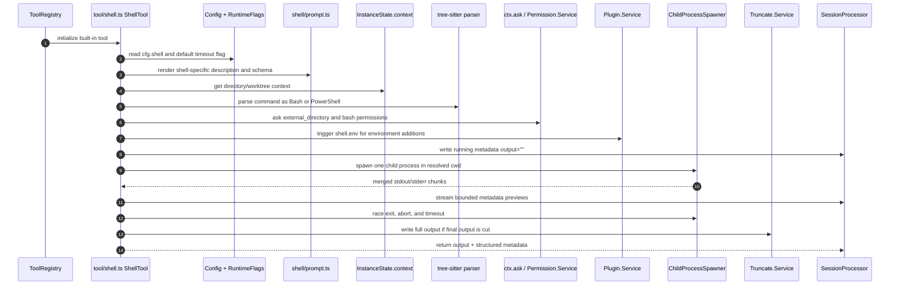

# OpenCode Shell Tool Comparison

Detailed source-backed comparison between OpenCode's shell tool and the proposed
Codegeist `CodegeistShellTool` for
`docs/tasks/T007_build-codegeist-runtime-harness/tasks/T007_04_add-patch-edit-and-shell-tools/task.md`.

## Purpose

This document answers the `ask-project opencode` follow-up for the T007 shell
tool slice. It records how OpenCode implements shell execution, where that source
lives, and which parts should be copied, simplified, deferred, or avoided in the
first Java-first Codegeist shell tool.

This is documentation only. It does not implement the tool and does not claim
runtime verification of OpenCode. The OpenCode analysis workspace is pinned in
`docs/third-party/opencode/analysis-manifest.json` to revision
`d46af9cf1e7168d519377044f2412dea08ead5f8` on branch `dev`.

## Source Evidence

The comparison follows the local `/ask-project` workflow and uses the existing
OpenCode analysis artifacts under `docs/third-party/opencode/`:

- `ANALYSIS_REPORT.md` confirms the source checkout, Repomix artifact, focused
  Graphify corpus, and missing runtime verification.
- `repomix-output.xml` was queried through the Repomix subagent for broad
  source-level shell behavior.
- `graphify-out/GRAPH_REPORT.md`, `graphify-out/graph.json`, and
  `graphify-out/graph.html` are present as the graph cache for project navigation.
- Direct source reads focused on shell, permission, tool, truncation, session, and
  test files.

Primary OpenCode source files:

| Source path | Relevant responsibility |
| --- | --- |
| `docs/third-party/opencode/source/packages/opencode/src/tool/shell.ts` | Main shell tool definition, command parsing, permission scanning, cwd resolution, environment assembly, process execution, timeout/abort handling, output truncation, and final metadata. |
| `docs/third-party/opencode/source/packages/opencode/src/tool/shell/prompt.ts` | Shell-specific tool descriptions and parameter schema for Bash, PowerShell, and cmd. |
| `docs/third-party/opencode/source/packages/opencode/src/tool/shell/id.ts` | Exposed tool id and permission key, currently still `bash` for compatibility. |
| `docs/third-party/opencode/source/packages/opencode/src/shell/shell.ts` | Shell discovery, configured-shell fallback, rejected terminal-only shells, Git Bash path handling, and a separate process-tree killer helper. |
| `docs/third-party/opencode/source/packages/opencode/src/project/instance-context.ts` | Instance directory/worktree containment check used to decide whether paths are inside the project boundary. |
| `docs/third-party/opencode/source/packages/opencode/src/session/tools.ts` | Runtime bridge from tool definitions to AI SDK tools, permission context, live metadata updates, and generic before/after plugin hooks. |
| `docs/third-party/opencode/source/packages/opencode/src/permission/index.ts` | Permission evaluation, pending request lifecycle, always approvals, denials, and disabled-tool mapping. |
| `docs/third-party/opencode/source/packages/opencode/src/tool/tool.ts` | Generic tool wrapper that validates parameters and applies truncation unless the tool already reports truncation metadata. |
| `docs/third-party/opencode/source/packages/opencode/src/tool/truncate.ts` | Global tool output limits, truncation-file storage, and retention cleanup. |
| `docs/third-party/opencode/source/packages/opencode/src/session/processor.ts` | Session tool-part state updates, completed output persistence, and tool success events. |
| `docs/third-party/opencode/source/packages/opencode/src/tool/registry.ts` | Built-in tool registration; `ShellTool` is one of the registry entries. |
| `docs/third-party/opencode/source/packages/opencode/test/tool/shell.test.ts` | Shell tool behavior tests for permissions, external directories, timeout/abort, stderr, exit code, metadata streaming, and truncation. |
| `docs/third-party/opencode/source/packages/opencode/test/shell/shell.test.ts` | Shell selection and fallback tests. |

Key source anchors for implementation work:

| Source anchor | What to inspect there |
| --- | --- |
| `src/tool/shell/id.ts:14-16` | Compatibility reason for keeping the exposed shell tool id and permission key as `bash`. |
| `src/tool/shell/prompt.ts:22-30` | Parameter schema: `command`, optional millisecond `timeout`, optional `workdir`, and required `description`. |
| `src/tool/shell/prompt.ts:86-128` | Bash-facing prompt guidance, including timeout text, output truncation guidance, and `workdir` instead of `cd`. |
| `src/tool/shell/prompt.ts:130-230` | PowerShell and cmd prompt variants with platform-specific quoting and truncation guidance. |
| `src/tool/shell/prompt.ts:287-304` | Dynamic prompt render path that combines the shell profile with the `bash` tool id. |
| `src/shell/shell.ts:10-20` | Shell metadata table for denied shells, login shells, POSIX shells, and PowerShell shells. |
| `src/shell/shell.ts:107-130` | Config/env shell selection and fallback behavior. |
| `src/shell/shell.ts:132-147` | Shell name, login, POSIX, and PowerShell helper methods. |
| `src/shell/shell.ts:159-193` | Older shell argument helper; useful context, but not the current `tool/shell.ts` spawn path. |
| `src/project/instance-context.ts:13-24` | `containsPath(...)`, which treats instance directory or git worktree as internal except worktree `/`. |
| `src/tool/shell.ts:28-29` | Shell metadata preview bound and cwd/file command sets. |
| `src/tool/shell.ts:223-257` | Preview and tail helpers that bound live and final output. |
| `src/tool/shell.ts:260-264` | Tree-sitter parse wrapper. |
| `src/tool/shell.ts:266-300` | Permission request helper for `external_directory` and `bash`. |
| `src/tool/shell.ts:302-319` | Child process command construction for PowerShell and other shells. |
| `src/tool/shell.ts:320-345` | Lazy tree-sitter Bash/PowerShell parser initialization. |
| `src/tool/shell.ts:347-357` | `ShellTool` definition, injected services, and default timeout selection. |
| `src/tool/shell.ts:358-385` | Windows/Git Bash path conversion and argument path resolution. |
| `src/tool/shell.ts:387-423` | Command scanning for external paths and `bash` permission patterns. |
| `src/tool/shell.ts:425-435` | Plugin `shell.env` hook and environment merge source. |
| `src/tool/shell.ts:437-609` | Main process run loop, metadata streaming, output retention, timeout/abort race, final output, and structured metadata. |
| `src/tool/shell.ts:611-656` | Tool execution orchestration: config, cwd resolution, timeout validation, parse/scan/ask, environment, and run handoff. |
| `src/session/tools.ts:45-76` | Tool context creation with `metadata(...)` and `ask(...)` callbacks. |
| `src/session/tools.ts:87-117` | Generic built-in tool execution bridge and plugin before/after hooks. |
| `src/permission/index.ts:41-51` | Permission rule evaluation. |
| `src/permission/index.ts:80-120` | Pending permission request creation and event publishing. |
| `src/permission/index.ts:122-180` | Permission reply handling and persistent `always` approval insertion. |
| `src/permission/index.ts:217-225` | Disabled-tool mapping where edit-like tools share the `edit` permission. |
| `src/tool/tool.ts:99-145` | Generic `Tool.define` wrapper, schema validation, and skip-retruncation rule when `metadata.truncated` already exists. |
| `src/tool/truncate.ts:16-18` | Global default output limits and truncation directory constant. |
| `src/tool/truncate.ts:69-83` | Full-output side-file creation and configured limit lookup. |
| `src/tool/truncate.ts:86-142` | Generic output truncation with head/tail direction and saved-output hints. |
| `src/session/processor.ts:191-230` | Running and completed tool-part state updates. |
| `src/session/processor.ts:634-648` | V2 tool success event with structured metadata and final completion. |
| `src/tool/registry.ts:118-133` | Built-in registry creation; `ShellTool` is registered beside read/write/edit/patch/grep/glob. |
| `test/tool/shell.test.ts:776-800` | External `workdir` permission behavior. |
| `test/tool/shell.test.ts:898-932` | External file-argument permission behavior. |
| `test/tool/shell.test.ts:1000-1035` | Raw command permission pattern and `always` prefix behavior. |
| `test/tool/shell.test.ts:1038-1167` | Abort, timeout, stderr, non-zero exit, and progressive metadata tests. |
| `test/tool/shell.test.ts:1169-1238` | Line/byte truncation and full-output side-file tests. |
| `test/shell/shell.test.ts:23-99` | Shell selection, fallback, denied shells, and Windows path tests. |

## OpenCode Implementation Summary

OpenCode's shell tool is broad and production-shaped. It is not just a small
`ProcessBuilder` wrapper. It integrates with:

- shell discovery and platform-specific shell selection;
- dynamic model-facing prompt text;
- tree-sitter command parsing;
- permission prompts for command execution and external directories;
- plugin-provided environment variables;
- live tool metadata updates;
- timeout and user abort handling;
- output truncation with full-output side files;
- session tool-part state transitions;
- generic tool hooks before and after execution.

The runtime is still a one-shot process execution per tool call. Despite prompt
text that says "persistent shell session" for the Bash profile, the implementation
spawns a new child process for the command in `tool/shell.ts` rather than keeping a
durable shell process alive across tool calls.

## OpenCode Shell Tool Flow



## Tool Identity And Parameter Contract

OpenCode exposes the shell tool under the id `bash`, even when the selected shell
is PowerShell or cmd. `tool/shell/id.ts` keeps this id for compatibility with
existing plugins, users, and saved permissions, and explicitly says it should be
renamed only with OpenCode 2.0.

OpenCode's shell parameter schema is defined in `tool/shell/prompt.ts`:

- `command`: required string, the command to execute.
- `timeout`: optional positive integer in milliseconds.
- `workdir`: optional string, the working directory; the prompt tells the model to
  use this instead of `cd`.
- `description`: required string, a concise human-readable description of the
  command.

The shell prompt is generated dynamically from the selected shell. Bash,
PowerShell, and cmd receive different command guidance, quoting guidance, examples,
and file-tool avoidance guidance. The prompt also tells the model not to manually
truncate command output with `head`, `tail`, `Select-Object`, or `more`; OpenCode
captures the output and truncates it itself.

### Codegeist Comparison

The proposed Codegeist tool used:

- tool name `codegeist_shell`;
- `command` string;
- `cwd` string;
- `timeoutSeconds` integer;
- no separate `description` field.

Recommended T007 decision:

- Keep the tool name `codegeist_shell` because Codegeist tools already use the
  `codegeist_*` namespace.
- Prefer the input name `cwd` if matching current T007 wording, or `workdir` if
  deliberately mirroring OpenCode. Use one name consistently in tests and docs.
- Consider `timeoutMillis` instead of `timeoutSeconds` if the goal is closer
  OpenCode parity and faster timeout tests. If `timeoutSeconds` stays, document the
  divergence clearly.
- A `description` field is useful for TUI display later, but it is not required by
  the current `ToolSessionPart` schema. The first Codegeist slice can omit it and
  derive a summary from the command, or add optional `description` without storing a
  new session field.

## Shell Selection

OpenCode shell selection is handled by `src/shell/shell.ts` and used by
`tool/shell.ts` when the tool initializes:

- Known shell metadata marks Bash, Dash, Ksh, Sh, and Zsh as POSIX-like login
  shells, PowerShell variants as PowerShell, and Fish/Nu as denied for tool use.
- On Windows, OpenCode prefers PowerShell, Windows PowerShell, Git Bash, or
  `COMSPEC`/`cmd.exe`, depending on availability.
- On Unix-like systems, it reads `/etc/shells` when possible and otherwise falls
  back to common shell paths.
- `Shell.acceptable(cfg.shell)` chooses a configured shell if it resolves and is
  acceptable; otherwise it falls back.
- `Shell.name`, `Shell.posix`, and `Shell.ps` provide normalized classification
  helpers.

OpenCode's current `tool/shell.ts` process construction does not use the older
`Shell.args(...)` helper from `src/shell/shell.ts`; it builds the process through
its own `cmd(...)` function.

### Codegeist Comparison

The proposed Codegeist implementation simply chooses:

- `cmd.exe /c <command>` on Windows;
- `sh -lc <command>` elsewhere.

Recommended T007 decision:

- This simplification is appropriate for the first Codegeist shell tool.
- Do not copy OpenCode's full configured-shell matrix until Codegeist has user
  shell configuration, TUI display requirements, and platform smoke tests that need
  it.
- Keep the first implementation honest in docs: it is a one-shot platform shell
  command, not a login-shell compatibility layer.

## Working Directory And Workspace Boundary

OpenCode gets the active instance directory from `InstanceState.context`. If the
tool input supplies `workdir`, `tool/shell.ts` resolves it relative to
`instanceCtx.directory`; otherwise it uses `instanceCtx.directory` as cwd.

Containment is not a hard rejection in OpenCode. `project/instance-context.ts`
defines `containsPath(filepath, ctx)` as true when the path is inside either:

- `ctx.directory`, or
- `ctx.worktree`, unless the worktree is `/`.

If the resolved cwd is outside that boundary, OpenCode adds an
`external_directory` permission request. With approval, the command can still run
outside the current directory/worktree. Tests assert this behavior for an external
`workdir` and for `cd ../`-style behavior that points outside the project.

### Codegeist Comparison

The proposed Codegeist implementation uses a `CodegeistWorkspaceGuard` that fails
outside-workspace cwd before starting the process.

This is stricter than OpenCode, and it matches the current T007_04 acceptance
criterion: "cwd escape fails before the side effect runs." Codegeist does not yet
have OpenCode's permission loop or TUI approval flow, so rejecting cwd escape is the
right first behavior.

Recommended T007 decision:

- Use a hard workspace containment check for `cwd` before `ProcessBuilder.start()`.
- Do not claim sandboxing beyond this path/cwd check.
- Decide whether to use lexical normalization only or `toRealPath()` symlink
  resolution. The earlier proposal used `toRealPath()` for existing cwd. That is
  stronger for existing directories, but it also means missing cwd fails before
  execution. That matches the shell requirement.
- Reuse the same guard for mutating file tools, but keep read/list/glob/grep path
  semantics unchanged unless the task explicitly tightens them.

## Command Scanning And Permissions

OpenCode parses shell commands before execution:

- `tool/shell.ts` lazily loads `web-tree-sitter`, `tree-sitter-bash`, and
  `tree-sitter-powershell`.
- It parses the command as PowerShell when the selected shell is PowerShell;
  otherwise it parses as Bash.
- It walks command nodes and extracts tokens.
- It recognizes file-oriented commands such as `rm`, `cp`, `mv`, `mkdir`, `touch`,
  `chmod`, `cat`, PowerShell file cmdlets, and cmd built-ins.
- Static file arguments are resolved against cwd. Dynamic arguments with variables,
  command substitution, wildcards, or provider forms that cannot be resolved are not
  converted into concrete external paths.
- Paths outside the instance boundary add `external_directory` permission patterns.
- Non-cwd commands add a `bash` permission pattern from the command source plus an
  "always" prefix pattern from `BashArity.prefix(...)`.

Permission requests are executed through `ctx.ask(...)`, which is provided by
`session/tools.ts`. That wraps the request with session id, tool call id, and the
merged agent/session permission ruleset before calling `Permission.Service.ask(...)`.
`permission/index.ts` evaluates denials/allows/asks, publishes a pending
permission event, and can store "always" approvals for future matching patterns.

OpenCode also maps edit-like tool names `edit`, `write`, and `apply_patch` to the
shared `edit` permission when deciding disabled tools. The shell tool keeps the
legacy `bash` permission key.

### Codegeist Comparison

The proposed Codegeist shell tool does not parse command text for external file
arguments and does not ask for permission. It only validates cwd and runs the
command.

Recommended T007 decision:

- Do not add tree-sitter parsing in T007_04. It is a large surface with platform
  nuance, false positives, and dynamic-path uncertainty.
- Reject cwd escape before execution.
- Defer file-argument scanning until Codegeist has a permission approval model or a
  stronger workspace policy task.
- If command scanning is added later, treat unresolved dynamic paths conservatively.
  Do not silently classify them as safe.

## Environment Handling And Plugins

OpenCode lets plugins augment the shell environment:

- `tool/shell.ts` calls `plugin.trigger("shell.env", { cwd, sessionID, callID },
  { env: {} })`.
- The final child process environment merges `process.env` with `extra.env` from
  plugins.
- `session/tools.ts` also triggers generic `tool.execute.before` and
  `tool.execute.after` hooks around every built-in and MCP tool execution.

### Codegeist Comparison

The proposed Codegeist implementation inherits the Java process environment from
`ProcessBuilder` and does not expose plugin hooks.

Recommended T007 decision:

- Do not add plugin or environment-extension hooks in T007_04.
- Do not log or persist environment variables.
- If a future Codegeist task adds environment control, keep it explicit and
  redactable; shell output can leak secrets even when Codegeist does not persist
  env maps directly.

## Process Execution

OpenCode constructs a process with `ChildProcess.make(...)`:

- PowerShell on Windows runs `shell -NoLogo -NoProfile -NonInteractive -Command
  <command>`.
- Other shells run the command through `ChildProcess.make(command, [], { shell,
  cwd, env, stdin: "ignore", detached: process.platform !== "win32" })`.
- The process is spawned through `ChildProcessSpawner`.
- Output is consumed from `handle.all`, meaning stdout and stderr are merged into
  one stream.
- `stdin` is ignored, so commands waiting for input can only finish by timeout,
  abort, or self-exit.

### Codegeist Comparison

The proposed Codegeist implementation uses Java `ProcessBuilder`, starts a
platform shell, separately captures `stdout` and `stderr`, waits for completion with
a timeout, and records exit code plus timeout status.

Recommended T007 decision:

- Keep separate stdout/stderr previews in Codegeist because the task explicitly asks
  for bounded stdout/stderr summaries.
- Keep stdin closed or ignored. Do not support interactive commands in T007_04.
- Start one process per tool call. Do not add persistent shell sessions or
  background process registries.

## Timeout, Abort, And Cancellation

OpenCode uses a race between three outcomes:

- process exit;
- `ctx.abort` signal;
- timeout plus 100 ms.

When abort or timeout wins, it kills the process with `forceKillAfter: "3
seconds"`. The returned exit value is `null`, and the final output appends a
`<shell_metadata>` block explaining either timeout or user abort. The default
timeout is `RuntimeFlags.bashDefaultTimeoutMs`, which is loaded from
`OPENCODE_EXPERIMENTAL_BASH_DEFAULT_TIMEOUT_MS`, or 120000 ms when unset.

Tests cover:

- output preservation when the tool is aborted after output begins;
- timeout behavior and the retry-with-larger-timeout message;
- runtime flag default timeout wiring.

### Codegeist Comparison

The proposed Codegeist implementation has timeout but no user abort signal yet. It
kills descendants and the process forcibly after timeout and records exit code `-1`
for timeout.

Recommended T007 decision:

- Implement timeout now.
- Defer user abort until Codegeist has an agent loop or TUI cancellation flow.
- Record timeout as text inside `outputPreview` for now, because `ToolSessionPart`
  does not yet have `timedOut` or `exitCode` fields.
- Use a deterministic timeout test with a very short timeout and a command that
  blocks longer than that timeout.

## Output Capture And Truncation

OpenCode has two output-bound layers for shell:

1. Live metadata preview: `MAX_METADATA_LENGTH = 30000` in `tool/shell.ts` keeps a
   bounded rolling preview during execution.
2. Final output: `tail(...)` bounds final output by the configured truncation
   `maxLines` and `maxBytes`.

OpenCode's global truncation defaults live in `tool/truncate.ts`:

- `MAX_LINES = 2000`;
- `MAX_BYTES = 50 * 1024`.

When output exceeds limits, OpenCode writes the full output to a file under the
tool truncation directory and returns a final output with a "Full output saved to"
hint. `Tool.define` normally truncates tool output, but it skips re-truncating
tools that already include `metadata.truncated`.

Shell output in OpenCode is merged stdout/stderr. Tests cover stderr appearing in
the combined output, non-zero exit code in metadata, progressive metadata updates,
line-limit truncation, byte-limit truncation, no truncation for small output, and
full-output file creation.

### Codegeist Comparison

The proposed Codegeist implementation bounds each captured stream with
`ToolOutputBounds.MAX_PREVIEW_CHARS` and then bounds the final summary again before
returning `CodegeistToolResult`.

Recommended T007 decision:

- Do not write full shell output to side files in T007_04. `.codegeist/session.json`
  should stay bounded and inspectable, and no output artifact lifecycle exists yet.
- Keep separate stdout/stderr previews in the bounded summary.
- Include explicit `stdoutTruncated` and `stderrTruncated` text in the summary so a
  future TUI can display truncation clearly even before typed fields exist.
- Consider a smaller shell-specific per-stream cap than `ToolOutputBounds.MAX_PREVIEW_CHARS`
  if the final summary risks spending the whole preview on stdout and hiding stderr.

## Session Persistence And Events

OpenCode's session runtime stores shell results through the generic tool-part
pipeline:

- `session/tools.ts` creates the `Tool.Context` with `metadata(...)` and `ask(...)`.
- During execution, `ctx.metadata(...)` calls
  `SessionProcessor.updateToolCall(...)` and sets the part state to `running`, with
  title, metadata, input, and start time.
- When the tool completes, `SessionProcessor.completeToolCall(...)` writes
  `status: "completed"`, input, output, structured metadata, title, start/end time,
  and attachments into the tool part.
- V2 tool success events include both text content and structured metadata.

The shell-specific final metadata includes:

- `output`: live/final preview;
- `exit`: numeric exit code or `null` when aborted/timed out;
- `description`;
- `truncated`;
- optional `outputPath`.

### Codegeist Comparison

Current Codegeist `ToolSessionPart` stores only:

- `tool`;
- `status` (`completed` or `failed`);
- `outputPreview`.

There is no running tool state, no typed metadata map, no title, no start/end time,
no attachments, and no separate exit-code field.

Recommended T007 decision:

- Keep the current `ToolSessionPart` schema for T007_04 unless tests force typed
  fields. The parent task explicitly says to add fields only when active tests need
  them.
- Encode shell details in a stable bounded text summary:
  - command;
  - cwd;
  - exit code;
  - timed out;
  - duration;
  - stdout truncated;
  - stderr truncated;
  - stdout preview;
  - stderr preview.
- Do not persist provider config, selected provider/model, enabled tools,
  permission rules, process ids, environment variables, or runtime status.

## Failure Behavior

OpenCode distinguishes tool execution errors through the wider session processor.
Shell command non-zero exit is not a tool failure; it returns completed tool output
with an exit code in metadata. Timeout and abort also return output plus metadata,
not a thrown tool exception, unless a lower-level runtime defect occurs.

### Codegeist Comparison

The proposed Codegeist callback wrapper records `CodegeistToolException` as a
failed `ToolSessionPart`. A shell command that exits non-zero should not throw
`CodegeistToolException`; it should return a completed result summary with the
non-zero exit code. Expected tool-input errors, invalid cwd, missing command, or
failed process startup should throw `CodegeistToolException` and record a failed
part.

Recommended T007 decision:

- Treat non-zero exit as completed shell execution.
- Treat timeout as completed shell execution with `Timed out: true`, unless the
  tests require `failed`. OpenCode treats timeout as a result, not a schema/runtime
  error.
- Treat invalid input, cwd escape, missing cwd, and startup failure as failed tool
  calls.

## Test Coverage To Mirror

OpenCode tests cover more than Codegeist needs in the first Java slice. Useful
source-backed cases from `packages/opencode/test/tool/shell.test.ts`:

- external `workdir` triggers `external_directory` permission;
- external file args trigger `external_directory` permission;
- `bash` permission patterns include the raw command;
- `always` patterns include a command prefix plus wildcard;
- abort preserves already emitted output;
- timeout terminates command and returns timeout metadata;
- default timeout can come from runtime flags;
- stderr appears in output;
- non-zero exit code is returned;
- metadata updates stream progressively;
- line-limit and byte-limit truncation happen;
- full output is saved to a file when truncated.

Useful cases from `packages/opencode/test/shell/shell.test.ts`:

- shell names are normalized;
- login shell and POSIX detection work;
- missing configured shells fall back;
- Fish and Nu are rejected for acceptable shell use;
- Windows Git Bash and PowerShell paths are normalized where available.

Recommended Codegeist T007_04 focused tests:

- `codegeist_shell` runs a simple cross-platform command in a temp workspace cwd.
- stdout and stderr are captured separately and bounded in `outputPreview`.
- non-zero exit code appears in `outputPreview` and records a completed tool part.
- timeout kills a long-running command and records `Timed out: true`.
- cwd escape fails before starting the process.
- missing/blank command fails as a failed tool part.
- session-store persistence saves the bounded shell `ToolSessionPart` before the
  assistant text.
- plain no-continue `ask` behavior remains stdout-response-only at the command
  boundary.

## Proposed Codegeist Implementation Compared To OpenCode

| Topic | OpenCode | Proposed Codegeist T007_04 | Recommendation |
| --- | --- | --- | --- |
| Tool name | Exposed as `bash` for compatibility even for PowerShell/cmd. | `codegeist_shell`. | Keep `codegeist_shell`; no compatibility burden exists. |
| Input cwd name | `workdir`. | `cwd`. | Pick one. `cwd` matches task wording; `workdir` mirrors OpenCode. |
| Timeout units | Milliseconds. | Seconds in the earlier sketch. | Prefer `timeoutMillis` for parity and fast tests, or document `timeoutSeconds`. |
| Description | Required, used as title and metadata. | Omitted. | Optional is enough now; useful later for TUI. |
| Shell selection | Config/env-aware Bash, Zsh, Sh, PowerShell, cmd, Git Bash fallback. | Platform default via `cmd.exe` or `sh`. | Keep simple in T007_04. |
| Process model | One child process per tool call. | One Java `Process` per tool call. | Copy this; do not add persistent/background shell. |
| Stdin | Ignored. | No stdin support. | Copy this. |
| stdout/stderr | Merged through `handle.all`. | Captured separately. | Keep separate because T007_04 asks for stdout/stderr summaries. |
| Cwd escape | Allowed only after external-directory permission. | Hard reject before execution. | Hard reject until Codegeist has permissions. |
| Command permission | Tree-sitter scan and `bash` permission request. | None. | Defer permission system; do cwd guard now. |
| File-arg scanning | Detects many static file command args and asks external-directory permission. | None. | Defer; too broad for first slice. |
| Environment | Merges `process.env` with plugin `shell.env`. | Inherit Java process env. | Do not add plugin/env hooks yet. |
| Live metadata | Streams running previews. | Only final summary through `ToolSessionPart`. | Defer live state until agent loop/TUI. |
| Output truncation | Final tail plus full-output side file. | Bounded summary only. | Keep bounded summary; no side file lifecycle yet. |
| Exit code | Structured metadata `exit`. | Text in `outputPreview`. | Text is enough until `ToolSessionPart` grows fields. |
| Timeout result | Output plus `<shell_metadata>`, `exit: null`. | Text summary, likely `Exit code: -1`. | Prefer explicit `Timed out: true`; exit code can be `-1` or omitted in text. |
| Tests | Extensive Effect/Bun live tests. | JUnit/AssertJ temp-dir focused tests. | Mirror contracts, not infrastructure. |

## Recommended Codegeist Shell Summary Shape

Until `ToolSessionPart` has typed shell fields, use a stable text summary like:

```text
Command: <bounded command>
Cwd: <workspace-relative cwd>
Exit code: <code or n/a>
Timed out: <true|false>
Duration: <milliseconds>ms
Stdout truncated: <true|false>
Stderr truncated: <true|false>
Stdout:
<bounded stdout preview>
Stderr:
<bounded stderr preview>
```

Rules:

- If stdout or stderr is empty, omit that section or render `(empty)` consistently.
- Do not persist raw unbounded output.
- Do not persist environment variables.
- Do not persist process ids.
- Do not report stronger sandboxing than cwd containment and process timeout.

## Implementation Guidance For `CodegeistShellTool`

Use these Java classes only if they are needed by the focused tests:

- `CodegeistShellTool` as a package-private `@Component` implementing
  `CodegeistLocalTool`.
- `CodegeistWorkspaceGuard` as a package-private `@Component` shared by shell cwd
  and mutating file tools.

Keep these details from the OpenCode comparison:

- Execute one command per tool call.
- Require an explicit or default cwd under the active Codegeist workspace.
- Reject cwd escape before `ProcessBuilder.start()`.
- Ignore stdin.
- Capture stdout/stderr concurrently so one full pipe does not deadlock the
  process.
- Wait with a bounded timeout.
- Kill the process and descendants on timeout.
- Return a completed `CodegeistToolResult` for non-zero process exit.
- Throw `CodegeistToolException` for invalid input, cwd escape, missing cwd, and
  process startup/capture failures.

Deliberately do not include these OpenCode behaviors in T007_04:

- tree-sitter Bash/PowerShell parsing;
- external-directory permission prompts;
- reusable "always allow" command patterns;
- plugin hooks;
- live tool metadata streaming;
- full-output side files;
- configured shell discovery;
- background processes;
- persistent shell sessions;
- PTY integration.

## Open Questions For The Implementation Pass

- Should the public input use `cwd` or `workdir`?
- Should timeout be `timeoutMillis` for OpenCode parity or `timeoutSeconds` for a
  simpler human-facing shape?
- Should timeout be recorded as completed shell execution or failed tool execution?
  OpenCode treats timeout as output metadata; this document recommends completed
  shell execution with `Timed out: true` in the preview.
- Should `description` be optional in the first Codegeist schema so a future TUI can
  display it without parsing the command?
- Should stdout/stderr each get their own cap lower than `MAX_PREVIEW_CHARS` to
  ensure both streams fit in the final `outputPreview`?
