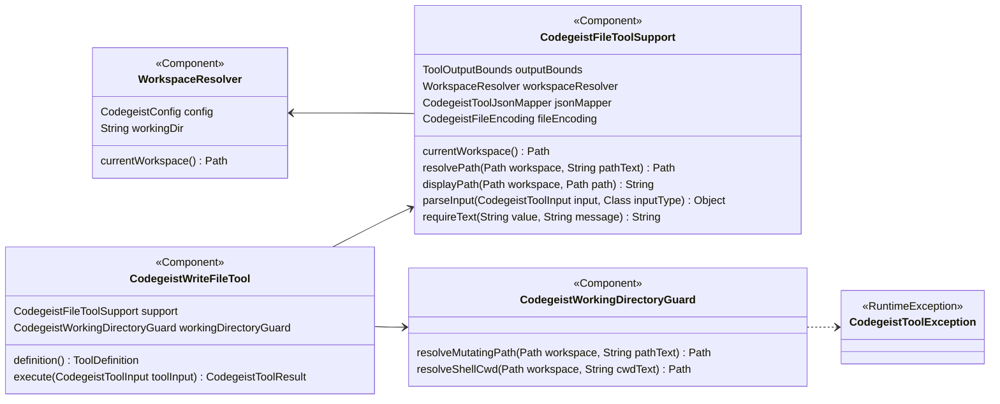
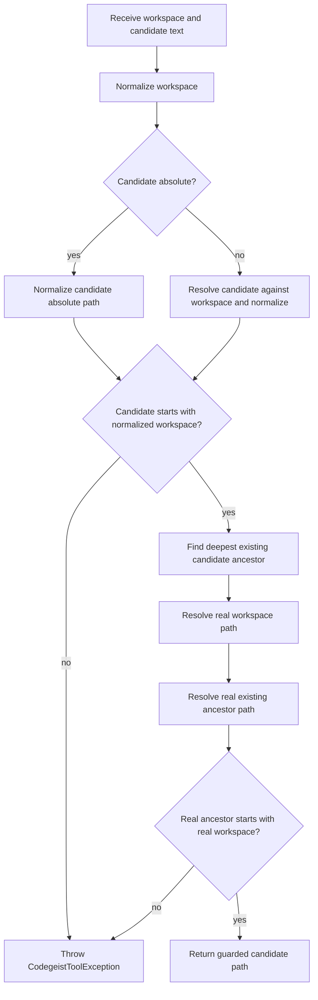
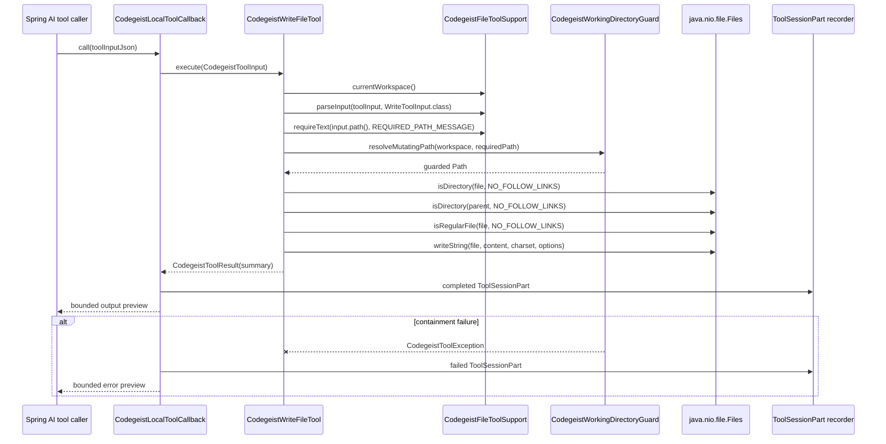
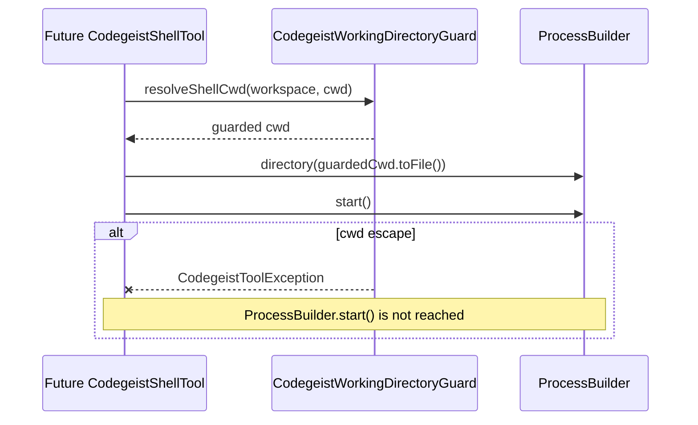
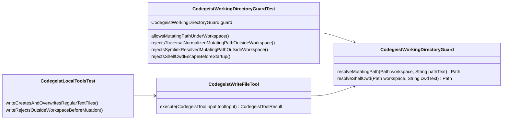

# T007_04_01 Working Directory Guard Implementation Plan

Implementation handoff for
`tasks/T007_04_01_add-working-directory-guard.md`.

This document defines the concrete Java classes, method contracts, diagrams,
tests, documentation updates, and verification order for the focused working
directory guard slice. It is intentionally limited to the shared guard and the
smallest production integration needed to prove the guard before later edit,
patch, and shell tools use it.

## Source References

- Child task:
  `docs/tasks/T007_build-codegeist-runtime-harness/tasks/T007_04_add-patch-edit-and-shell-tools/tasks/T007_04_01_add-working-directory-guard.md`
- Parent task:
  `docs/tasks/T007_build-codegeist-runtime-harness/tasks/T007_04_add-patch-edit-and-shell-tools/task.md`
- Research handoff:
  `docs/tasks/T007_build-codegeist-runtime-harness/tasks/T007_04_add-patch-edit-and-shell-tools/ask-project-research.md`
- Current tool architecture:
  `docs/developer/architecture/local-file-tools.md`
- Test guidance:
  `docs/tests/README.md`

## Baseline

Implemented before this slice:

- Local tool runtime code lives under `ai.codegeist.app.tool`.
- `WorkspaceResolver` resolves the active workspace from direct `codegeist.yml`
  `workspace.directory` or `${user.dir}`.
- `WorkspaceResolver` is intentionally permissive: roots, traversal-normalized
  paths, symlinks, and missing paths are accepted as workspace selection inputs.
- `CodegeistFileToolSupport.resolvePath(...)` accepts absolute paths and resolves
  relative paths against the active workspace.
- `codegeist_read`, `codegeist_list`, `codegeist_glob`, and `codegeist_grep`
  depend on the permissive path helper and must remain unaffected by this task.
- `codegeist_write` is the only currently implemented local file mutation tool.
- `CodegeistLocalToolCallback` catches `CodegeistToolException`, returns a bounded
  failed preview, and records a failed `ToolSessionPart`.
- `ToolSessionPart` currently stores only `tool`, `status`, and `outputPreview`.

## Target Result

After implementation:

- `CodegeistWorkingDirectoryGuard` is the shared package-private Spring component
  for side-effect containment checks in local tools.
- `codegeist_write` calls the guard before any file mutation.
- Later `codegeist_edit`, `codegeist_patch`, and `codegeist_shell` tasks can reuse
  the same guard before file writes or `ProcessBuilder.start()`.
- Traversal-normalized paths outside the active workspace are rejected before side
  effects.
- Existing symlink targets or existing parent directories that resolve outside the
  active workspace are rejected before side effects.
- The guard returns handled `CodegeistToolException` failures so the existing
  callback and `ToolSessionPart(tool,status,outputPreview)` shape remains enough.
- Read, list, glob, and grep behavior stays unchanged.

## Non-Goals

- No shell tool implementation.
- No edit tool implementation.
- No patch tool implementation.
- No permission prompts, user approval loop, sandbox runtime, container isolation,
  seccomp, chroot, or command scanning.
- No new `ToolSessionPart` fields.
- No broad rewrite of `WorkspaceResolver` or `CodegeistFileToolSupport` path
  semantics.
- No protection for special files such as `.codegeist/session.json` beyond the
  explicit workspace containment checks.

## Package Map

| Package | Classes to add or change | Responsibility |
| --- | --- | --- |
| `ai.codegeist.app.tool` | Add `CodegeistWorkingDirectoryGuard` | Shared side-effect containment checks for mutating file paths and future shell cwd values. |
| `ai.codegeist.app.tool` | Change `CodegeistWriteFileTool` | Use the guard before `Files.writeString(...)`. |
| `ai.codegeist.app.tool` tests | Add `CodegeistWorkingDirectoryGuardTest` | Prove allowed paths, traversal escapes, symlink escapes, and shell cwd pre-start rejection. |
| `ai.codegeist.app.tool` tests | Change `CodegeistLocalToolsTest` | Wire the new guard into the test tool graph and prove `codegeist_write` rejects outside mutations before mutation. |
| `docs/developer/architecture` | Change `local-file-tools.md` | Document the guard as current architecture after code is implemented. |

Use package-private classes and methods unless another package needs the contract.
`CodegeistWorkingDirectoryGuard` can remain package-private because all planned
side-effecting tools live in `ai.codegeist.app.tool`.

## Class Contracts

### `CodegeistWorkingDirectoryGuard`

Add:

`app/codegeist/cli/src/main/java/ai/codegeist/app/tool/CodegeistWorkingDirectoryGuard.java`

Contract:

- Spring `@Component`.
- Package-private `final class`.
- No mutable state.
- Throws `CodegeistToolException` for handled containment failures.
- Does not read Codegeist config directly; callers pass the active workspace.
- Does not decide whether a tool may create parents, overwrite files, run shell,
  or follow symlinks for business behavior. It only proves containment.

Recommended methods:

```java
@Component
final class CodegeistWorkingDirectoryGuard {

    Path resolveMutatingPath(Path workspace, String pathText) {
        // Resolve and validate file mutation targets.
    }

    Path resolveShellCwd(Path workspace, String cwdText) {
        // Resolve and validate future shell working directories.
    }
}
```

Internal helper responsibilities:

- Normalize the active workspace with `toAbsolutePath().normalize()`.
- Resolve absolute candidate paths directly.
- Resolve relative candidate paths against the normalized workspace.
- Reject normalized candidates that do not start with the normalized workspace.
- Find the deepest existing candidate ancestor.
- Resolve the real workspace path with `toRealPath()`.
- Resolve the deepest existing ancestor with `toRealPath()`.
- Reject when the real ancestor does not start with the real workspace.
- Render user-facing path fragments with normalized `/` separators.

The shell cwd method should support the later shell task without starting any
process. A blank `cwd` policy can default to workspace here, because the planned
shell tool should be able to omit cwd and run in the active workspace.

Suggested failure text:

| Case | Message prefix |
| --- | --- |
| Mutating path escapes after normalization | `Path escapes workspace: ` |
| Mutating path uses existing symlink or ancestor outside workspace | `Path escapes workspace: ` |
| Shell cwd escapes after normalization | `Shell cwd escapes workspace: ` |
| Shell cwd uses existing symlink or ancestor outside workspace | `Shell cwd escapes workspace: ` |
| Workspace real path cannot be resolved | `Workspace does not exist: ` |

### `CodegeistWriteFileTool`

Change:

`app/codegeist/cli/src/main/java/ai/codegeist/app/tool/CodegeistWriteFileTool.java`

Contract changes:

- Add `private final CodegeistWorkingDirectoryGuard workingDirectoryGuard`.
- Resolve the required `path` through `workingDirectoryGuard.resolveMutatingPath(...)`.
- Keep existing content validation, directory rejection, parent-exists rule,
  existing non-regular-file rejection, and write summary unchanged.
- Do not create parents.
- Do not change read/list/glob/grep path behavior.

Expected execution shape:

```java
Path workspace = support.currentWorkspace();
WriteToolInput input = support.parseInput(toolInput, WriteToolInput.class);
Path file = workingDirectoryGuard.resolveMutatingPath(
        workspace,
        support.requireText(input.path(), CodegeistFileToolSupport.REQUIRED_PATH_MESSAGE));
```

## Production Class Diagram



## Guard Decision Flow



## Write Tool Sequence



## Future Shell Pre-Start Sequence

This task should not implement `codegeist_shell`, but the guard must be shaped so
`T007_04_04` can prove cwd rejection before process startup.



## Path Containment Details

Use two containment layers because they catch different risks.

| Layer | Example caught | Reason |
| --- | --- | --- |
| Normalized lexical check | `../outside.txt` | The normalized candidate no longer starts with the active workspace. |
| Real existing ancestor check | `workspace/link-to-outside/file.txt` | The normalized path starts under the workspace, but an existing symlink ancestor resolves outside. |

Recommended behavior for missing final targets:

- A new file under an existing workspace parent is allowed.
- A new file under a non-existing workspace child path is allowed by the guard if
  the deepest existing ancestor remains under the real workspace.
- `codegeist_write` still rejects missing parent directories after the guard.
- Future patch/edit tools can decide their own parent and file-existence policies
  after the guard returns a contained candidate.

Recommended behavior for workspace existence:

- If the active workspace cannot be resolved with `toRealPath()`, fail as a
  handled tool error.
- The current application normally uses an existing process directory or explicit
  workspace, so this is a sharp-edge error path rather than a normal branch.

## Test Plan

### New `CodegeistWorkingDirectoryGuardTest`

Add:

`app/codegeist/cli/src/test/java/ai/codegeist/app/tool/CodegeistWorkingDirectoryGuardTest.java`

Coverage:

| Test | Purpose |
| --- | --- |
| `allowsMutatingPathUnderWorkspace` | Proves a normal contained path resolves under the workspace. |
| `rejectsTraversalNormalizedMutatingPathOutsideWorkspace` | Proves `../outside.txt` is rejected. |
| `rejectsSymlinkResolvedMutatingPathOutsideWorkspace` | Proves an existing symlink ancestor pointing outside is rejected. |
| `rejectsShellCwdEscapeBeforeStartup` | Proves shell cwd escape throws before a startup marker can run. |

The shell pre-start test should not launch a real process. Use a small test seam:

```java
private void startAfterGuard(Path workspace, String cwd, AtomicBoolean started) {
    guard.resolveShellCwd(workspace, cwd);
    started.set(true);
}
```

Expected assertion shape:

```java
assertThatThrownBy(() -> startAfterGuard(workspace, "../outside", started))
        .isInstanceOf(CodegeistToolException.class)
        .hasMessageContaining("Shell cwd escapes workspace");
assertThat(started).isFalse();
```

### Changed `CodegeistLocalToolsTest`

Change the local tool test assembly:

- Construct one `CodegeistWorkingDirectoryGuard`.
- Pass it to `new CodegeistWriteFileTool(support, workingDirectoryGuard)`.
- Leave read/list/glob/grep construction unchanged.

Add focused write integration coverage:

| Test | Purpose |
| --- | --- |
| `writeRejectsOutsideWorkspaceBeforeMutation` | Proves `codegeist_write` rejects an absolute outside path, records a failed tool part, and leaves the outside file unchanged. |

Fixture shape:

```text
tempDir/
  workspace/
  outside/
    escape.txt
```

The test should configure `workspace/` as the active workspace, call
`codegeist_write` with the absolute outside file path, and assert:

- Output contains `Path escapes workspace`.
- `outside/escape.txt` retains its original content.
- One `ToolSessionPart` is recorded with `status = failed`.
- The failed preview equals the callback output.

## Test Class Diagram



## Documentation Updates After Code

Update `docs/developer/architecture/local-file-tools.md` in the implementation
task after the code and tests pass.

Required updates:

- Add `CodegeistWorkingDirectoryGuard` to the source map.
- Add the guard to the component model diagram.
- Update `Workspace And Path Semantics` to state that `WorkspaceResolver` and
  read/search helpers remain permissive while side-effecting tools use the guard.
- Update `codegeist_write` behavior to include outside-workspace rejection before
  writing.
- Add `Path escapes workspace: ...` to handled error examples.
- Update the extension guide so future edit, patch, and shell tools must use the
  guard before mutation or process startup.

Do not update architecture docs before the code is implemented; architecture docs
must describe current state.

## Implementation Order

1. Add `CodegeistWorkingDirectoryGuardTest` with the four focused guard tests.
2. Add `CodegeistWorkingDirectoryGuard` and make the new tests pass.
3. Update `CodegeistWriteFileTool` constructor dependencies and route its target
   path through `resolveMutatingPath(...)`.
4. Update `CodegeistLocalToolsTest` construction for the new dependency.
5. Add the outside-write integration test in `CodegeistLocalToolsTest`.
6. Run focused verification.
7. Update `docs/developer/architecture/local-file-tools.md` after code behavior is
   proven.
8. If task status is maintained in the same implementation pass, change
   `tasks/T007_04_01_add-working-directory-guard.md` from `open` to `done` only
   after verification succeeds.

## Verification

Run from `app/codegeist/cli`:

```bash
task test TEST=CodegeistWorkingDirectoryGuardTest,CodegeistLocalToolsTest
```

If the implementation touches shared callback assembly or tool service wiring,
also run:

```bash
task test TEST=CodegeistWorkingDirectoryGuardTest,CodegeistLocalToolsTest,CodegeistToolServiceTest
```

Report the command result and any notable duration in the solve result.

## Sharp Edges

- This guard is not a full sandbox. It only checks path and cwd containment before
  the side effect that the caller is about to run.
- A contained command can still perform its own filesystem operations after shell
  implementation; `T007_04_04` must not claim broader sandboxing.
- `CodegeistFileToolSupport.resolvePath(...)` remains permissive because read,
  list, glob, and grep behavior is out of scope for this guard task.
- Symlink policy is checked only through existing candidate paths or existing
  ancestors. Missing future path segments cannot have real symlink targets yet.
- The guard should not silently create directories, files, or symlinks while
  validating containment.
