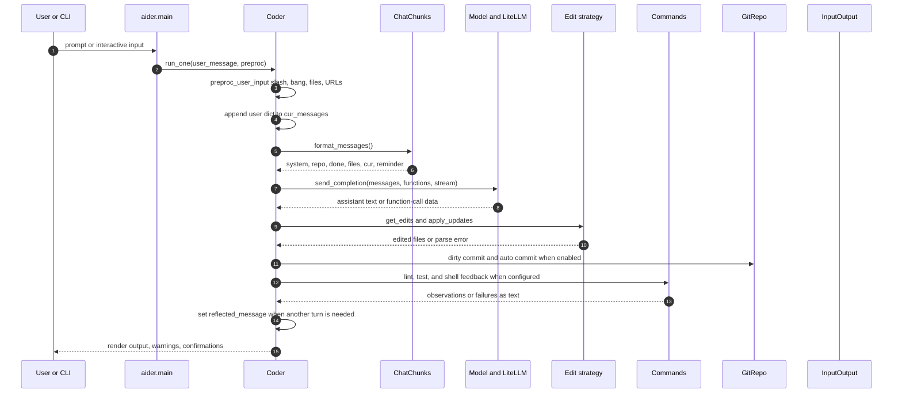
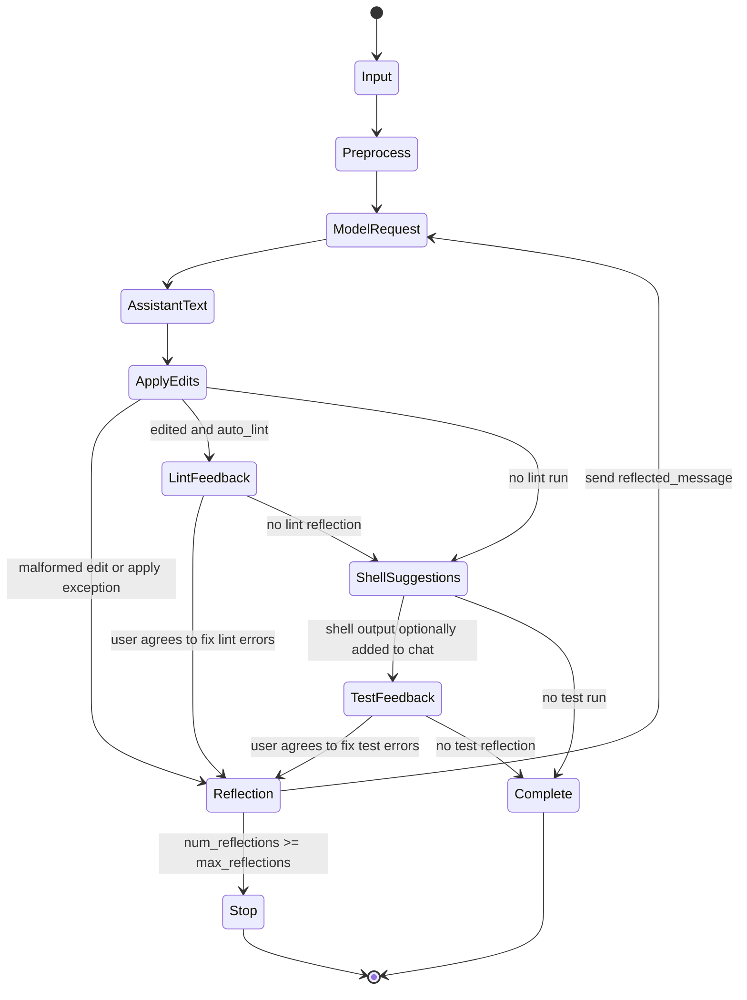
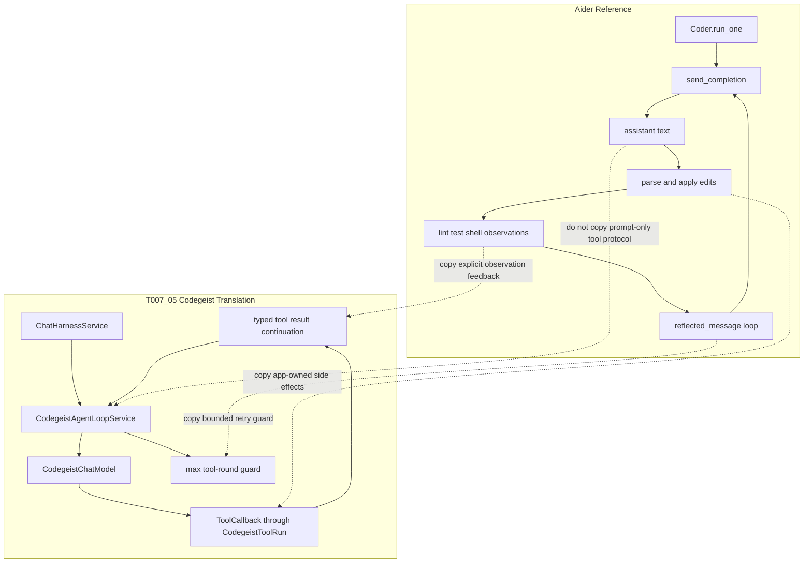

# Aider Agent Loop Notes For T007_05

Focused source-backed notes for interpreting Aider's prompt/edit/reflection loop
as cautionary evidence for Codegeist's first typed model/tool/model control loop.

## Scope And Evidence

- Task: `task.md`.
- Broader third-party comparison: `ask-project-research.md`.
- Source workspace: `docs/third-party/aider/`.
- Primary local source-evidence doc:
  `docs/third-party/aider/developer/prompt-flow.md`.
- Evidence type: static source analysis from the local Aider analysis workspace
  and checkout. No Aider runtime session, provider call, shell command, git
  mutation, Streamlit UI, or upstream test suite was run for this pass.

## Diagrams

The diagrams are embedded directly in this markdown file so the task handoff stays
self-contained.

### Runtime Sequence



### Reflection State



### Codegeist Translation



## Key Aider Files

| File | Role |
| --- | --- |
| `aider/main.py` | CLI/config startup, git setup, model selection, coder creation, one-shot command paths, and interactive loop. |
| `aider/coders/base_coder.py` | Central stateful runtime: user input preprocessing, message assembly, provider call, edit application, shell/lint/test feedback, reflection, and in-memory state movement. |
| `aider/coders/chat_chunks.py` | Assembles the exact provider message order from system, examples, repo context, done history, file content, current turn, and reminders. |
| `aider/models.py` | LiteLLM request construction, model settings, optional deprecated function/tool metadata, temperature, context, and retry behavior. |
| `aider/coders/*.py` | Concrete edit formats, including edit blocks, unified diffs, whole-file, patch, architect/editor, and deprecated function-call variants. |
| `aider/commands.py` | Slash/bang command dispatch, `/run`, `/test`, web scraping, file-scope commands, and state-mutating helpers. |
| `aider/repo.py` | Git wrapper for dirty commits, generated commits, attribution, and diff state. |
| `aider/prompts.py` | Prompt fragments used to turn command output into model-visible user messages. |

Useful tests from the third-party source analysis:

- `tests/basic/test_coder.py` - shell suggestion extraction, architect/editor
  behavior, and coder flow pieces.
- `tests/basic/test_commands.py` - `/run` and `/test` command-output feedback.
- `tests/basic/test_models.py` - LiteLLM function-schema/tool parameter passing.
- `benchmark/benchmark.py` and `benchmark/test_benchmark.py` - edit/test feedback
  loop evidence and helper tests, not a full typed tool-loop proof.

## Runtime Flow

Aider's active loop is not a modern provider-native tool-call loop. It is a
stateful prompt/edit/reflection loop centered on `Coder.run_one(...)` and
`Coder.send_message(...)`:

1. `run_one(...)` preprocesses input, then repeatedly calls `send_message(...)`
   while `reflected_message` asks for another model turn.
2. `send_message(...)` appends a user message dictionary to `cur_messages`, builds
   a `ChatChunks` object, checks token limits, and calls `send(...)`.
3. `send(...)` delegates to `Model.send_completion(...)`, which sends OpenAI-style
   messages through LiteLLM.
4. The assistant response is collected as text or deprecated function-call data.
5. `apply_updates(...)` parses assistant text according to the active edit format,
   dry-runs/prepares edits, checks permissions, and mutates files.
6. Malformed edits or unexpected edit exceptions set `reflected_message`, which
   causes `run_one(...)` to call the model again up to `max_reflections`.
7. Successful edits can trigger dirty commits, auto commits, lint runs, shell
   command suggestions, and test runs. Their outputs can be added to chat or used
   as another `reflected_message`.

The core shape is:

```text
user prompt
-> OpenAI-style message list
-> assistant text
-> Aider parses text into edits or shell suggestions
-> Aider executes side effects
-> failures or observations become user-style text
-> next model turn receives that text
```

## Message And Continuation Shape

Aider uses normal chat messages instead of a typed assistant tool-call plus tool
result pair. `ChatChunks.all_messages()` builds provider context from:

```text
system + examples + readonly files + repo map + done history + chat files + cur messages + reminders
```

When command output is added to chat, it is ordinary user text. For example,
`aider/prompts.py` contains the shape:

```text
I ran this command:

<command>

And got this output:

<output>
```

Model-suggested shell output can similarly be appended as:

```text
Output from <command>
<output>
```

This differs from Codegeist's desired T007_05 path. Codegeist should feed tool
results into continuation as typed tool-result messages, not as generic user
messages.

## Tool And Side-Effect Ownership

Aider is still valuable evidence because it keeps side effects application-owned:

- File edits are requested in model text formats and then parsed by Aider.
- `prepare_to_edit(...)` and related checks mediate file mutation.
- Shell commands are suggested as text, confirmed by the user, and executed by
  Aider through `run_cmd(...)`.
- `/test` and lint flows run locally and can reflect failures back to the model.
- Git commits are produced by Aider's repository wrapper, not by the provider.

The provider never receives authority to mutate files or run commands directly.
For Codegeist, this supports keeping `ToolCallback` dispatch inside
`CodegeistAgentLoopService` instead of relying on hidden provider execution.

## Continue And Stop Rules

Aider continues when `reflected_message` is set after a model turn. Important
sources of reflection are:

- malformed edit format or edit-application exceptions,
- user-approved lint failure repair,
- user-approved test failure repair,
- mode-specific retry text such as context-coder retry prompts.

Aider stops when no `reflected_message` remains or when
`num_reflections >= max_reflections`. In `base_coder.py`, `max_reflections` is
currently `3`.

This is the strongest Aider lesson for T007_05: even small loops need an explicit
guard. Codegeist should add a max tool-round guard for repeated tool-call cycles.

## Persistence And State

Aider is primarily in-memory during a run:

- `cur_messages` holds the active turn.
- `done_messages` holds completed prior conversation state and can be summarized.
- Active file scopes, model choices, shell suggestions, reflected message, costs,
  and repo state live on the `Coder` instance.
- Optional chat history and LLM history logs can persist human-readable
  conversation traces.
- Workspace files and git commits are the durable side effects.

Codegeist should not copy this persistence model. T007_05 should keep using
`.codegeist/session.json` and the existing `ToolSessionPart` exchange path.

## Output Bounds

Aider has useful token-budget controls but weaker generic command-output bounds
than Codegeist should accept:

- `check_tokens(...)` validates provider request size.
- `ChatSummary` can summarize old `done_messages`.
- `/run` and model-suggested shell commands ask whether output should be added to
  chat.
- Lint/test outputs can be reflected mostly as raw strings after confirmation.

Codegeist should keep bounded tool output at the callback boundary and avoid
feeding unbounded shell/test output into the next model request.

## Codegeist Translation

Use Aider as cautionary evidence, not as the primary implementation blueprint.

Copy:

- App-owned side effects.
- Explicit observation feedback after local side effects.
- Confirmation/policy mindset for future file, shell, git, and URL behavior.
- A hard loop cap similar to `max_reflections`.

Adapt:

- Reflection output becomes typed tool-result continuation in Codegeist.
- App-owned edit/shell/test behavior maps to named `codegeist_*` callbacks.
- The max reflection count maps to a Codegeist max tool-round guard.

Reject for T007_05:

- Prompt-only edit blocks as the primary tool protocol.
- Generic user-message observations instead of provider tool-result messages.
- Deprecated function-call coders as an implementation target.
- Git commits, lint/test repair loops, architect/editor two-model flows, web
  scraping, clipboard behavior, Streamlit UI, and broad command workflows.

## Test Implications

Aider lacks a focused typed model/tool/model loop test, so Codegeist should add
the tests Aider does not provide:

- A fake model emits one tool call, Codegeist dispatches it, and a second model
  request receives a typed tool result before final assistant text.
- Tool output is bounded before continuation.
- Failed tool output can be fed back as a typed failure result.
- A repeated tool-call cycle stops at the max tool-round guard.
- `AskCommands` stdout still prints final assistant response text only.

## Caveats

- Aider's active loop predates or avoids a fully typed provider tool-call model.
- Aider has deprecated function-call coders, but the broadly useful source path is
  text parsing plus reflection.
- Aider's stateful `Coder` object combines many responsibilities that should be
  separate Spring services in Codegeist.
- This document uses static source evidence only; it does not verify provider,
  terminal, git, shell, or file-mutation behavior with a live Aider run.
