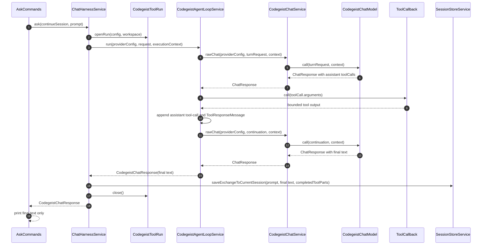

# T007_05 Agent Control Loop Implementation Plan

Detailed implementation handoff for adding the first Codegeist-owned
model/tool/model loop. This plan documents the next coding pass; it is not a
record of implemented behavior until the matching source, tests, and
architecture docs are updated.

## Goal

Implement the smallest synchronous Codegeist-owned coding-agent control loop:

```text
user prompt -> model request -> assistant tool call -> Codegeist tool dispatch -> tool result -> model continuation -> final assistant text
```

The key behavior is that tool output must become provider-visible continuation
input. Persisting `ToolSessionPart` values is still required, but persistence is
not enough. The second model turn must receive the matching tool-result message
before it returns the final assistant response.

## Non-Negotiable Constraints

- Keep `CodegeistChatRequest` limited to exactly `model` and `prompt`.
- Keep `AskCommands` stdout as final assistant response text only.
- Keep `.codegeist/session.json` persistence through the existing
  `SessionStoreService.saveExchangeToCurrentSession(...)` exchange path.
- Dispatch tools through the existing `CodegeistToolRun` callbacks so local and
  MCP callbacks share the same recording path.
- Keep the first loop synchronous and blocking.
- Do not add streaming, cancellation, permissions, TUI events, subagents, memory,
  skills, git automation, API/server runtime, parallel tool execution, or new
  session-store schemas in this slice.
- Do not call hosted providers or require a live local Ollama model for loop
  contract tests.

## Current Source Baseline

At plan time, the relevant implemented source is:

| File | Current role |
| --- | --- |
| `app/codegeist/cli/src/main/java/ai/codegeist/app/chat/ChatHarnessService.java` | Selects the default provider and model, opens one `CodegeistToolRun`, calls `CodegeistChatService.chat(...)`, then saves prompt, recorded tool parts, and final text. |
| `app/codegeist/cli/src/main/java/ai/codegeist/app/chat/CodegeistChatService.java` | Creates a provider `CodegeistChatModel`, calls it once, and converts the raw Spring AI `ChatResponse` to `CodegeistChatResponse`. |
| `app/codegeist/cli/src/main/java/ai/codegeist/app/chat/CodegeistChatModel.java` | Provider model base with one context-aware `call(CodegeistChatRequest, CodegeistChatExecutionContext)` method. |
| `app/codegeist/cli/src/main/java/ai/codegeist/app/chat/OllamaChatModel.java` | Builds a Spring AI Ollama model and calls it with `new Prompt(request.prompt(), options)`. |
| `app/codegeist/cli/src/main/java/ai/codegeist/app/chat/CodegeistChatExecutionContext.java` | Runtime-only working directory plus prompt-scoped `ToolCallback` list. |
| `app/codegeist/cli/src/main/java/ai/codegeist/app/tool/CodegeistToolRun.java` | Per-turn tool scope with execution context and recorded `ToolSessionPart` snapshot. |
| `app/codegeist/cli/src/main/java/ai/codegeist/app/tool/CodegeistLocalToolCallback.java` | Executes local tools, bounds output, records `ToolSessionPart`, and returns bounded model-visible text. |
| `app/codegeist/cli/src/main/java/ai/codegeist/app/tool/RecordingToolCallback.java` | Applies the same bounded recording behavior to externally supplied callbacks such as MCP tools. |

The current runtime exposes prompt-scoped callbacks to one Spring AI provider
call. It does not inspect assistant tool calls, invoke callbacks itself, append
tool-response messages, or continue the provider request.

## Spring AI API Surface Confirmed Locally

The local Maven cache for Spring AI `2.0.0-M6` exposes the required message and
option types:

| Type | Needed members |
| --- | --- |
| `ChatResponse` | `getResult()`, `hasToolCalls()` |
| `Generation` | `getOutput()` |
| `AssistantMessage` | `getText()`, `getToolCalls()`, `hasToolCalls()`, `builder()` |
| `AssistantMessage.ToolCall` | record constructor `(id, type, name, arguments)` and accessors `id()`, `type()`, `name()`, `arguments()` |
| `ToolResponseMessage` | `builder()`, `getResponses()` |
| `ToolResponseMessage.ToolResponse` | record constructor `(id, name, responseData)` |
| `Prompt` | constructor `Prompt(List<Message>, ChatOptions)` |
| `ToolCallback` | `getToolDefinition()`, `call(String)`, `call(String, ToolContext)` |
| `ToolContext` | constructor `ToolContext(Map<String, Object>)` |
| `OllamaChatOptions` | builder inherits `toolCallbacks(...)` and `internalToolExecutionEnabled(Boolean)` |

The implementation should still compile against source, but these signatures
remove the need to guess the first design.

## Target Runtime Flow



## Proposed Source Changes

### 1. Add `CodegeistChatTurnRequest`

Create a small internal record under `ai.codegeist.app.chat`:

```java
public record CodegeistChatTurnRequest(
        @NonNull String model,
        @NonNull List<Message> messages) {
}
```

Purpose:

- Carry provider-facing message history without growing `CodegeistChatRequest`.
- Make the loop able to submit `UserMessage`, `AssistantMessage`, and
  `ToolResponseMessage` values in order.
- Keep selected provider config, runtime context, session state, and tools outside
  the request record.

### 2. Extend `CodegeistChatModel`

Change the provider implementation contract to support message-history turns.
Keep a request-to-turn adapter for older call sites if it is still useful inside
`CodegeistChatService`, but do not add compatibility overloads that have no
production call site.

Target shape:

```java
public abstract ChatResponse call(
        @NonNull CodegeistChatTurnRequest request,
        @NonNull CodegeistChatExecutionContext context);
```

If a convenience adapter is needed, it should live in `CodegeistChatService`, not
as an extra public API on every provider model.

### 3. Update `OllamaChatModel`

Use the turn request message history when building the Spring AI `Prompt`:

```java
OllamaChatOptions options = OllamaChatOptions.builder()
        .model(request.model())
        .toolCallbacks(context.toolCallbacks())
        .internalToolExecutionEnabled(false)
        .build();
return delegate.call(new Prompt(request.messages(), options));
```

Important details:

- `internalToolExecutionEnabled(false)` prevents Spring AI from hiding recursive
  tool execution inside the provider call.
- Provider-specific imports remain isolated in `OllamaChatModel`.
- Tool callback definitions still travel to the provider through the prompt
  options so the model can request tools.

### 4. Add Raw Response Seam To `CodegeistChatService`

Keep the public `chat(...)` method returning `CodegeistChatResponse`, but add a
small raw call used by the loop:

```java
ChatResponse rawChat(
        ProviderConfig providerConfig,
        CodegeistChatTurnRequest request,
        CodegeistChatExecutionContext context)
```

Expected behavior:

- Create the provider model through `CodegeistChatService` adapter dispatch.
- Log provider type and callback count as before.
- Return the raw `ChatResponse` without converting it to text.
- Let `chat(...)` adapt `CodegeistChatRequest` to a one-message
  `CodegeistChatTurnRequest` and convert the final raw response to
  `CodegeistChatResponse`.

This keeps non-loop callers working while giving the loop access to
`AssistantMessage.getToolCalls()`.

### 5. Add `CodegeistAgentLoopService`

Create a Spring `@Service` under `ai.codegeist.app.chat`.

Primary method:

```java
public CodegeistChatResponse run(
        ProviderConfig providerConfig,
        CodegeistChatRequest request,
        CodegeistChatExecutionContext context)
```

Core constants:

```java
static final int MAX_TOOL_ROUNDS = 8;
static final String MAX_TOOL_ROUNDS_MESSAGE = "Agent tool loop exceeded 8 rounds";
static final String UNKNOWN_TOOL_MESSAGE_PREFIX = "Unknown tool requested: ";
```

Keep constants class-owned so tests do not duplicate contract strings.

Loop algorithm:

```text
messages = [UserMessage(request.prompt)]
callbacksByName = context.toolCallbacks grouped by getToolDefinition().name()

repeat up to MAX_TOOL_ROUNDS + 1 model calls:
  chatResponse = chatService.rawChat(providerConfig, turnRequest(request.model, messages), context)
  assistant = chatResponse.getResult().getOutput()

  if assistant has no tool calls:
    return CodegeistChatResponse(assistant.getText())

  if max tool rounds already consumed:
    throw MAX_TOOL_ROUNDS_MESSAGE

  messages.add(assistant)
  responses = []
  for toolCall in assistant.getToolCalls() in source order:
    callback = callbacksByName[toolCall.name]
    if callback missing:
      output = UNKNOWN_TOOL_MESSAGE_PREFIX + toolCall.name
    else:
      output = callback.call(toolCall.arguments)
    responses.add(new ToolResponse(toolCall.id, toolCall.name, output))
  messages.add(ToolResponseMessage.builder().responses(responses).build())
```

Failure handling for T007_05:

- Known local and MCP tool failures are already converted by callback wrappers into
  bounded text and failed `ToolSessionPart` values.
- Missing tool names should return a model-visible tool result instead of crashing
  the loop, because the model can recover on the next turn. No `ToolSessionPart` is
  recorded for a missing callback unless a focused test requires that later.
- Unexpected callback programming errors may still escape, matching the existing
  `CodegeistLocalToolCallback` behavior for unexpected runtime errors.
- The max-round guard should throw a normal runtime exception with the class-owned
  message constant. Do not add a new exception hierarchy unless tests or command
  UX require one.

### 6. Rewire `ChatHarnessService`

Inject `CodegeistAgentLoopService` instead of calling `CodegeistChatService`
directly.

Expected method body shape:

```text
providerConfig = config.defaultProvider or fail
model = providerConfig.defaultModel()
workingDirectory = workspaceResolver.currentWorkspace()
try (toolRun = toolService.openRun(config, workingDirectory)) {
  response = agentLoopService.run(providerConfig, new CodegeistChatRequest(model, prompt), toolRun.executionContext())
  sessionStoreService.saveExchangeToCurrentSession(continueSession, prompt, response.content(), toolRun.completedToolParts())
  return response
}
```

This preserves command-facing behavior, session persistence, and tool-run closing.

## Test-First Implementation Sequence

### Step 1: Add Failing `CodegeistAgentLoopServiceTest`

Use hand-written stubs, matching existing tests and the no-Mockito project setup.

Test: `runsSecondModelTurnAfterToolCall`

- Fake model first returns `AssistantMessage` with one `ToolCall`.
- Fake tool callback records the input and returns bounded output text.
- Fake model second turn asserts the message order:
  `UserMessage`, assistant `ToolCall`, `ToolResponseMessage`.
- Fake model second turn asserts the `ToolResponse` id, name, and response data
  match the requested tool call.
- Final response is `CodegeistChatResponse("final answer")`.

Test: `passesToolResultsBackToContinuation`

- Same fixture can explicitly inspect second-turn messages.
- Assert the tool output is not only recorded in a side list.
- Assert it appears in the `ToolResponseMessage` that reaches the fake model.

Test: `stopsAtMaxToolRounds`

- Fake model always returns one tool call.
- Fake callback returns a simple bounded result.
- Assert the loop throws with `MAX_TOOL_ROUNDS_MESSAGE` after the configured cap.
- Assert the fake model call count proves the guard is active and deterministic.

Optional test if missing-tool behavior is implemented in this slice:

- Fake model requests a non-existent tool.
- Assert continuation receives a `ToolResponseMessage` with
  `UNKNOWN_TOOL_MESSAGE_PREFIX + name`.

### Step 2: Update `CodegeistChatServiceTest`

Required coverage:

- Existing `chatRequestKeepsOnlyModelAndPromptComponents` remains unchanged.
- `chat(...)` adapts a `CodegeistChatRequest` to a `CodegeistChatTurnRequest`
  containing one `UserMessage`.
- Raw turn call passes `CodegeistChatTurnRequest` and context to the provider model.

Use a stub `CodegeistChatModel` that captures the turn request and context.

### Step 3: Update `ChatHarnessServiceTest`

Replace the current `StubChatService` with `StubCodegeistAgentLoopService`.

Assertions:

- Harness selects the same provider config and default model.
- Harness passes the `CodegeistChatRequest(model, prompt)` to the loop service.
- Harness passes the `CodegeistChatExecutionContext` from the opened tool run.
- Harness saves recorded `ToolSessionPart` values before the final assistant text.
- Harness closes the tool run.

The stub loop can call the fake callback once so the existing session persistence
assertions still prove recorded tool parts are saved before assistant text.

### Step 4: Keep `AskCommandsSessionStoreTest` Focused

The command test should not know about loop internals. Only update constructor
stubs if `ChatHarnessService` dependencies change. Keep assertions limited to:

- printed stdout equals final assistant text
- prompt delegation
- `-c` and `--continue` flag handling
- command exception mapper annotation

### Step 5: Keep `SessionStoreServiceTest` Mostly Unchanged

The loop should not change session-store schema or exchange append behavior.
`SessionStoreServiceTest` should continue proving:

- tool parts are persisted before assistant text
- missing ids are assigned
- runtime config and secrets are excluded from JSON

Only update this class if an implementation change affects the existing exchange
method signature, which should be avoided.

## Acceptance Criteria Traceability

| Acceptance criterion | Planned proof |
| --- | --- |
| At least two model turns with one tool call between them | `CodegeistAgentLoopServiceTest.runsSecondModelTurnAfterToolCall` |
| Tool results feed model continuation | `CodegeistAgentLoopServiceTest.passesToolResultsBackToContinuation` or same test with explicit message assertions |
| Recorded `ToolSessionPart` values persist before final text | `ChatHarnessServiceTest` plus existing `SessionStoreServiceTest` |
| `CodegeistChatRequest` remains `model`, `prompt` only | Existing `CodegeistChatServiceTest.chatRequestKeepsOnlyModelAndPromptComponents` |
| `AskCommands` stdout remains final text only | Existing `AskCommandsSessionStoreTest` |
| Architecture docs distinguish Codegeist loop from Spring AI internal tool calling | New or updated architecture doc after source implementation |

## Expected Architecture Documentation Updates

After code is implemented, update docs in the same task:

| File | Update |
| --- | --- |
| `docs/developer/architecture/architecture.md` | Change current-state references from one-call prompt-scoped callback behavior to the implemented Codegeist-owned loop. Add `CodegeistAgentLoopService`, `CodegeistChatTurnRequest`, and updated provider-model contract to package and runtime sections. |
| `docs/developer/architecture/agent-control-loop.md` | Add a focused source-code guide for loop ownership, message history shape, tool dispatch, session persistence boundary, max-round guard, tests, and non-goals. |
| `docs/memory-bank/chat.md` | Refresh the compact current-state summary after implementation and verification. |
| `docs/tasks/T007_build-codegeist-runtime-harness/tasks/T007_05_add-agent-control-loop/task.md` | Mark status or implementation notes only after the implementation pass is complete. |

Architecture docs must describe implemented state only. Until the code lands, this
`implementation-plan.md` remains the detailed handoff for planned work.

## Risks And Guardrails

| Risk | Guardrail |
| --- | --- |
| Spring AI internal tool execution still runs | Set `internalToolExecutionEnabled(false)` in `OllamaChatModel` options. |
| Tool output is recorded but not fed back to the model | Assert `ToolResponseMessage` content in `CodegeistAgentLoopServiceTest`. |
| `CodegeistChatRequest` grows into a runtime-state bag | Put message history in `CodegeistChatTurnRequest`; keep the existing record-component test. |
| Loop becomes a TUI or streaming event design | Keep loop synchronous and return only final `CodegeistChatResponse`. |
| Session schema grows prematurely | Persist through existing exchange path and recorded `ToolSessionPart` values only. |
| Multiple callbacks share a name | Fail early or choose a deterministic map-building rule in the loop service. Prefer fail-fast because duplicate tool names make model dispatch ambiguous. |
| Repeated tool calls never stop | Enforce `MAX_TOOL_ROUNDS = 8` and cover it with a focused test. |
| Missing callback crashes user workflow | Return a model-visible missing-tool result for recovery unless tests show this should fail fast. |
| Provider-specific message details leak into command or session layers | Keep Spring AI message construction inside `ai.codegeist.app.chat`. |

## Verification Commands

Run focused verification from `app/codegeist/cli` after the implementation pass:

```bash
task test TEST=CodegeistAgentLoopServiceTest,ChatHarnessServiceTest,CodegeistChatServiceTest,AskCommandsSessionStoreTest,SessionStoreServiceTest
```

Run broad JVM verification from `app/codegeist/cli` before final handoff:

```bash
task test
```

Run repository diff hygiene from the repository root for documentation and source
changes:

```bash
git --no-pager diff --check
```

## Implementation Order Summary

1. Add failing loop tests with fake model and fake callback.
2. Add `CodegeistChatTurnRequest` and update `CodegeistChatModel` contract.
3. Update `OllamaChatModel` to use message history and disable Spring AI internal
   tool execution.
4. Add the raw `ChatResponse` seam in `CodegeistChatService`.
5. Implement `CodegeistAgentLoopService` with sequential tool dispatch and max-round
   guard.
6. Rewire `ChatHarnessService` through the loop service.
7. Update focused tests and keep command/session tests at their current boundaries.
8. Update architecture docs and project memory to describe implemented behavior.
9. Run focused and broad verification.
