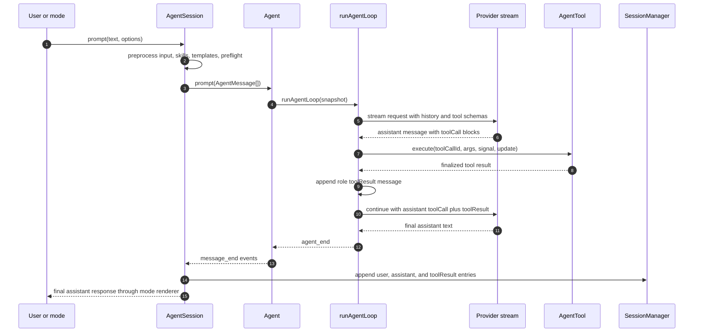
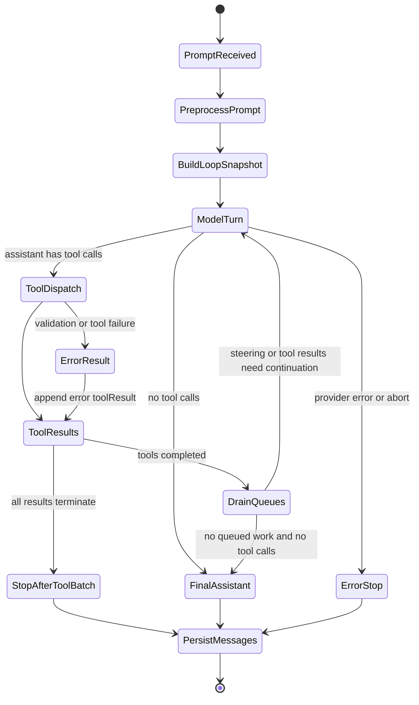
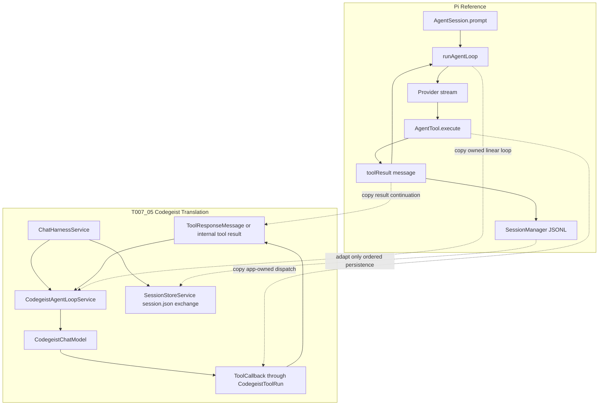

# Pi Agent Loop Notes For T007_05

Focused source-backed notes for translating Pi's small stateful agent loop into
Codegeist's first synchronous Java/Spring model/tool/model control loop.

## Scope And Evidence

- Task: `task.md`.
- Broader third-party comparison: `ask-project-research.md`.
- Source workspace: `docs/third-party/pi/`.
- Primary local source-evidence doc: `docs/third-party/pi/developer/prompt-flow.md`.
- Evidence type: static source analysis from the local Pi analysis workspace and
  packed source. No Pi install, runtime TUI session, provider call, or upstream
  test suite was run for this pass.

## Diagrams

The diagrams are embedded directly in this markdown file so the task handoff stays
self-contained.

### Runtime Sequence



### Loop State



### Codegeist Translation



## Key Pi Files

| File | Role |
| --- | --- |
| `packages/coding-agent/src/main.ts` | CLI mode resolution, session manager setup, runtime service creation, and prompt mode dispatch. |
| `packages/coding-agent/src/core/sdk.ts` | Creates `AgentSession`, restores context, constructs `Agent`, and wires provider callbacks. |
| `packages/coding-agent/src/core/agent-session.ts` | Prompt preprocessing, extension hooks, tool registry, tool hook installation, queue/retry/compaction handling, and session persistence coordination. |
| `packages/agent/src/agent.ts` | Mutable agent state, context snapshots, run lifecycle, event reduction, steering/follow-up queues, and loop config creation. |
| `packages/agent/src/agent-loop.ts` | Core model/tool/model loop: provider streaming, tool-call extraction, tool dispatch, tool-result messages, queue draining, and stop decisions. |
| `packages/agent/src/types.ts` and `packages/ai/src/types.ts` | Agent message, tool call, tool result, and provider-facing type contracts. |
| `packages/coding-agent/src/core/session-manager.ts` | Append-only JSONL session files, message entries, branch traversal, and context reconstruction on resume. |
| `packages/coding-agent/src/core/tools/index.ts` | Built-in tool definitions and default tool families. |

Useful tests from the third-party source analysis:

- `packages/agent/test/agent-loop.test.ts` - tool calls and results, ordered
  result persistence, queued message injection, next-turn snapshots,
  stop-after-turn behavior, and terminate-after-tool-batch behavior.
- `packages/agent/test/e2e.test.ts` - tool execution and pending tool-call
  tracking.

## Runtime Flow

Pi's shipped coding-agent path starts above the core loop:

1. `main.ts` selects CLI mode, cwd, resources, extensions, model settings, and
   session services.
2. `createAgentSession(...)` restores session context and constructs `Agent`.
3. `AgentSession.prompt(...)` handles extension commands, input handlers, skill
   and prompt-template expansion, model/auth preflight, optional compaction, and
   user-message construction.
4. `Agent.prompt(...)` creates a snapshot of current system prompt, messages, and
   active tools.
5. `runAgentLoop(...)` streams a provider response, finalizes an assistant
   message, dispatches tool calls through app-owned tool definitions, appends
   `toolResult` messages, drains queues, and continues until no more work remains.
6. `AgentSession._handleAgentEvent(...)` forwards events to extensions and
   persists `message_end` entries through `SessionManager`.

The T007_05-relevant core is smaller:

```text
AgentMessage history
-> provider request with tool schemas
-> assistant message with toolCall content blocks
-> Pi dispatches active AgentTool.execute(...)
-> toolResult message appended to history
-> next provider request sees the tool result
-> final assistant text stops the loop
```

## Tool Ownership Boundary

Pi keeps tool schemas and execution separate:

- Active tools expose `name`, `description`, and `parameters` to the provider.
- The provider returns assistant `toolCall` content blocks.
- `runAgentLoop(...)` looks up each active `AgentTool` by name.
- The loop validates arguments, runs optional pre-tool hooks, calls
  `tool.execute(toolCallId, args, signal, update)`, finalizes the result, and runs
  optional post-tool hooks.
- Tool execution updates are runtime events. The final result becomes a normal
  `role: "toolResult"` message.

For Codegeist this maps cleanly to existing `ToolCallback` wrappers: expose Spring
AI callback definitions to the model, but make the Codegeist loop call the selected
callback and record through `CodegeistToolRun`.

## Message And Continuation Shape

Pi's internal continuation history is linear. A tool turn has this conceptual
shape:

```text
user message
assistant message:
  content: toolCall(id, name, arguments)
toolResult message:
  toolCallId: id
  toolName: name
  content: bounded result text or structured blocks
  isError: true or false
assistant message:
  content: final text
```

Provider adapters lower this shape only at the provider boundary. For example,
Google-specific code maps tool calls to `functionCall` parts and tool results to
`functionResponse` parts. Codegeist should keep the same architectural split:
session/tool concepts remain Codegeist-owned, while provider-specific message
translation stays in chat/provider adapters.

## Continue And Stop Rules

Pi continues when:

- the assistant message contains tool calls,
- steering messages are queued before the next assistant response,
- follow-up messages are queued after the loop would otherwise stop.

Pi stops when:

- the assistant stop reason is `error` or `aborted`,
- no tool calls or queued messages remain,
- `shouldStopAfterTurn(...)` returns true,
- every finalized result in a tool batch has `terminate: true`.

Pi can execute multiple tool calls sequentially or in parallel, but preserves
source order for persisted result messages. The static source analysis did not
find a hard global max-turn counter in the core loop, so Codegeist should add a
small max tool-round guard for T007_05 instead of copying that gap.

## Persistence Model

Pi's coding-agent app persists normal messages through `SessionManager` as
append-only JSONL entries. User, assistant, and `toolResult` messages participate
in context reconstruction on resume. Extension-only `custom` entries do not
participate in provider context, while `custom_message` entries can.

Codegeist does not need Pi's branchable JSONL tree for T007_05. The current
`.codegeist/session.json` exchange persistence is enough as long as the loop
saves prompt, ordered bounded `ToolSessionPart` values, and final assistant text.
Provider-facing continuation can be runtime-only until a later task requires
resuming model context from stored history.

## Output And Rendering

Pi leaves output bounding to individual tools:

- `read` truncates long file output.
- `bash` keeps bounded tail output and can store full output separately.
- Tools can provide renderers for call and result display.
- Runtime `tool_execution_update` events are separate from final persisted
  `toolResult` messages.

Codegeist already bounds output in `CodegeistLocalToolCallback` and
`RecordingToolCallback`. T007_05 should pass the bounded callback return value
back into the next model turn and rely on the existing recorded `ToolSessionPart`
for session persistence.

## Codegeist Translation

Pi is the best reference for a small, readable owned loop. The T007_05 translation
should be:

```text
ChatHarnessService opens CodegeistToolRun
-> CodegeistAgentLoopService builds runtime history from CodegeistChatRequest
-> model call receives history and tool definitions
-> response has no tools: return final CodegeistChatResponse
-> response has tool calls: call matching ToolCallback values in source order
-> append tool-result messages to runtime history
-> continue until final text or max tool rounds
-> ChatHarnessService persists prompt, recorded ToolSessionPart values, final text
```

## What To Copy

- Linear model history for the first loop.
- App-owned tool dispatch after provider tool-call requests.
- Tool-result messages that are fed into the next provider request.
- Stable call ids between assistant tool-call and tool-result messages.
- Deterministic tests that inspect the second provider request.
- Ordered result persistence even if future execution becomes parallel.

## What To Defer

- Pi's TypeScript extension runtime.
- Dynamic custom tools from plugins/extensions.
- Parallel tool execution.
- Streaming event projection into a UI.
- Steering and follow-up queues.
- Branchable JSONL session trees.
- Compaction, retry orchestration, labels, thinking-level state, and provider
  payload hooks.

## Test Implications

The Pi-inspired Codegeist tests should prove:

- A fake model returns an assistant tool call, the loop dispatches one callback,
  and a second model request receives a matching tool result before final text.
- The continuation history order is user message, assistant tool-call message,
  tool-result message.
- Multiple tool calls, when added, preserve source order in model-visible results
  and in recorded `ToolSessionPart` values.
- A failed callback produces a bounded model-visible result and a recorded failed
  tool part through the existing callback boundary.
- A repeated tool-call cycle fails at the Codegeist max tool-round guard.

## Caveats

- Pi's primary prompt path has extension hooks, queues, retry, compaction, and
  session branching around the loop. Those are intentionally out of scope for
  T007_05.
- Pi does not appear to enforce a hard global max-turn counter in the core loop.
  Codegeist should add one for the first implementation.
- This document uses static source evidence only; it does not verify provider- or
  terminal-specific runtime behavior in a live Pi checkout.
