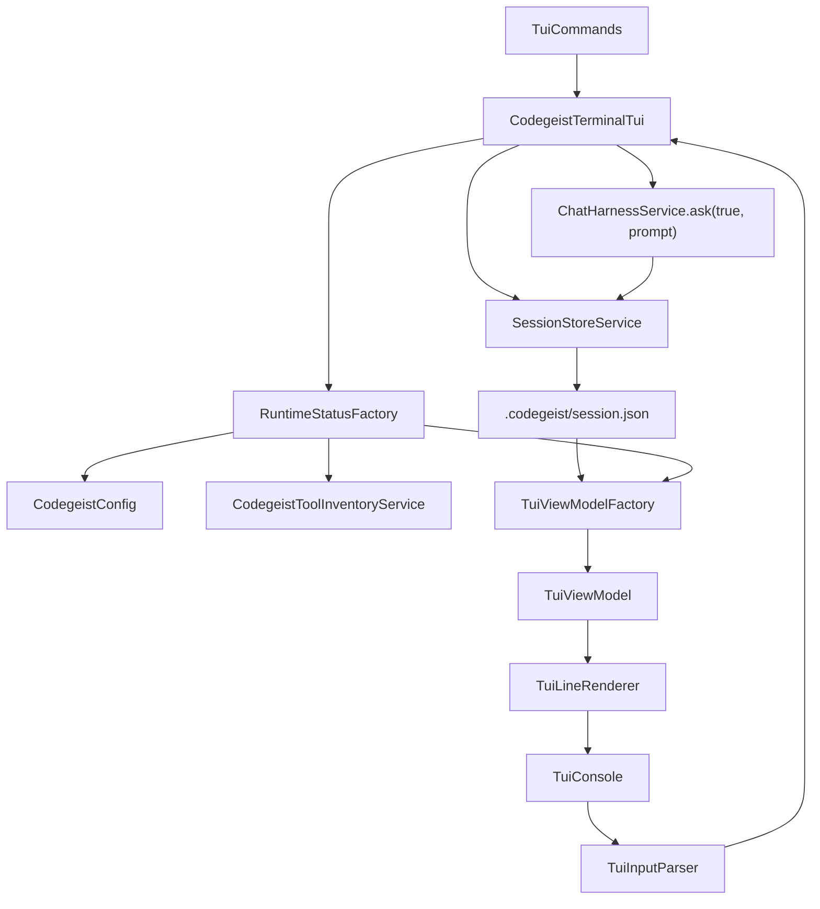
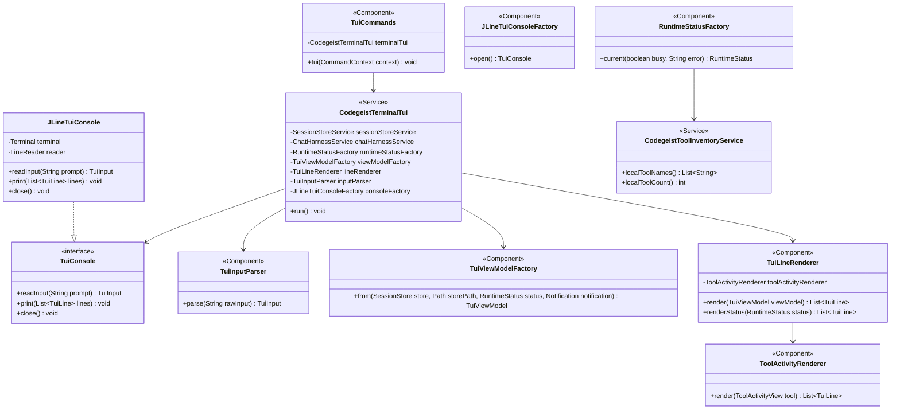

# T007_06 Terminal TUI Implementation Plan

Detailed implementation plan for the first Codegeist terminal TUI over
`.codegeist/session.json`.

## Purpose

Implement the smallest useful local coding-agent terminal interface that fits the
current Java/Spring/Spring Shell/JLine runtime. The TUI must render the existing
session store, submit prompts through the current chat harness, show persisted tool
activity, and keep every UI-only or runtime-only value out of
`.codegeist/session.json`.

This plan translates the source-backed third-party TUI analysis into concrete
Codegeist classes. It is intentionally conservative: build a line-first JLine TUI
with a deterministic view model before considering richer full-screen rendering.

## Required Source Context

Read these files before implementation:

- `task.md` in this directory for scope, acceptance criteria, and non-goals.
- `third-party-tui-deep-analysis.md` in this directory for the OpenCode, Pi, Tau,
  Aider, mini-SWE-agent, and Spring AI Agent Utils comparison.
- `docs/tasks/T007_build-codegeist-runtime-harness/tui-opencode-jline-mapping.md`
  for the JLine mapping and minimum view-model shape.
- `app/codegeist/cli/src/main/java/ai/codegeist/app/chat/ChatHarnessService.java`
  for the prompt submission boundary.
- `app/codegeist/cli/src/main/java/ai/codegeist/app/session/SessionStoreService.java`
  and session model classes for persisted data shape.
- `app/codegeist/cli/src/main/java/ai/codegeist/app/tool/CodegeistToolService.java`
  and `CodegeistLocalTools.java` for tool callback and inventory behavior.
- `docs/developer/architecture/architecture.md`,
  `docs/developer/architecture/agent-control-loop.md`, and
  `docs/developer/architecture/local-file-tools.md` for current architecture docs.

## Current Code Constraints

- `ChatHarnessService.ask(boolean continueSession, String prompt)` is the current
  prompt boundary for command and future UI callers.
- `ChatHarnessService.ask(true, prompt)` appends the new turn to the newest current
  session through `SessionStoreService`.
- `SessionStoreService.loadCurrentStoreForContinue()` opens or creates the current
  `.codegeist/session.json` and ensures at least one session exists.
- `SessionStoreService.currentStorePath()` and `currentWorkingDirectory()` are the
  current source of store path and working directory facts.
- `ToolSessionPart` persists only `tool`, final `status`, and bounded
  `outputPreview`. Current statuses are `completed` and `failed`.
- Running, cancelled, timed-out, provider/model, MCP, tool definitions, approval
  state, prompt draft, scroll state, and layout state are not persisted today.
- `CodegeistLocalTool` is package-private in `ai.codegeist.app.tool`, so any public
  local-tool inventory API must live in that package.
- Spring Shell 4 command classes use `@Command` from
  `org.springframework.shell.core.command.annotation.Command`.
- JLine primitives to use are `TerminalBuilder`, `Terminal`, `LineReaderBuilder`,
  `LineReader`, `UserInterruptException`, `EndOfFileException`, `Status`,
  `AttributedString`, and `AttributedStyle` when available from the current Spring
  Shell dependency graph.

## Third-Party Lessons Applied

| Project | Lesson to keep | What not to copy |
| --- | --- | --- |
| OpenCode | Transcript, prompt, footer/status, permission prompt, and per-tool renderer inventory. | OpenTUI/Solid, SDK sync, worker/server transport, plugin slots, persisted prompt stash/history. |
| Pi | Renderer boundaries, tool-specific fallback rendering, footer status projection, editor capability lessons. | Custom terminal protocol negotiation, component runtime, overlays, image rendering, mutable live component graph. |
| Tau | Provider-neutral event projection into frontend state and durable session boundary discipline. | Python Textual runtime and append-only JSONL tree model. |
| Aider | Reliable line-oriented prompt loop and transcript output are enough for first usability. | Aider edit formats, repo-map workflow, markdown chat-history persistence. |
| mini-SWE-agent | Keep live line UI separate from offline transcript inspection. | Textual inspector as live UI and benchmark trajectory model. |
| Spring AI Agent Utils | Keep question/approval presentation behind a small terminal-facing seam. | Direct `System.in` or `System.out` in Codegeist command services. |

## User-Facing Contract

Initial command shape:

```text
codegeist tui
```

The command starts an interactive line-oriented chat view in the current working
directory. It opens or creates the current `.codegeist/session.json`, prints the
current session transcript, shows a compact status header, then reads prompts.

Minimum supported input commands:

| Input | Behavior |
| --- | --- |
| Plain non-blank text | Submit through `ChatHarnessService.ask(true, prompt)`, reload store, render new rows. |
| Blank input | No-op plus short hint. |
| `/help` | Render fixed help and keybinding guidance. |
| `/status` | Render transient provider/model/tool/MCP/store status. |
| `/history` | Re-render the active session transcript. |
| `/quit` | Exit cleanly. |
| Unknown `/command` | Render warning; do not send to provider. |
| Ctrl-D / EOF | Exit cleanly. |
| Ctrl-C while reading input | Interrupt current input and keep the TUI alive. |

Provider or tool cancellation during an active `ChatHarnessService.ask(...)` call is
not part of the first slice because the current chat harness exposes no cancellation
token. This can be added later through a focused chat-runtime seam.

## Persistence Contract

Only persisted facts read from `.codegeist/session.json` may appear in
`SessionStoreView` and transcript rows. These include:

- Store schema and working directory.
- Sessions and their messages.
- Message roles and timestamps.
- `TextSessionPart` text.
- `CompactionSessionPart` flags and tail reference.
- `ToolSessionPart` final tool name, final status, and bounded output preview.

The TUI must not persist:

- Provider config or selected provider/model.
- MCP client definitions or enabled tool definitions.
- Runtime status, busy state, errors, approvals, or notifications.
- Prompt draft, prompt history, prompt stash, scroll offset, focused pane, selected
  row, layout, theme, sidebar state, or keybinding state.

## Package Plan

Production package:

```text
app/codegeist/cli/src/main/java/ai/codegeist/app/tui/
```

Supporting production package change:

```text
app/codegeist/cli/src/main/java/ai/codegeist/app/tool/
```

Test package:

```text
app/codegeist/cli/src/test/java/ai/codegeist/app/tui/
```

## Proposed Runtime Flow



## Proposed Class Diagram



## Production Classes To Create

### `TuiCommands`

Path:

```text
app/codegeist/cli/src/main/java/ai/codegeist/app/tui/TuiCommands.java
```

Role:

- Spring Shell entrypoint for `tui`.
- Thin adapter only. It should not contain terminal setup, rendering, parsing, or
  session-store logic.
- Use `@Component`, Lombok `@RequiredArgsConstructor`, and `@Command`.
- Use `CodegeistCommandExceptionMapper.BEAN_NAME` like `AskCommands` for command
  boundary mapping.

Expected shape:

```java
@Component
@RequiredArgsConstructor
class TuiCommands {

    static final String TUI_COMMAND = "tui";

    private final CodegeistTerminalTui terminalTui;

    @Command(
            name = TUI_COMMAND,
            description = "Open the Codegeist terminal chat UI",
            exitStatusExceptionMapper = CodegeistCommandExceptionMapper.BEAN_NAME)
    void tui(CommandContext context) {
        terminalTui.run();
    }
}
```

Notes:

- `CommandContext` may be accepted for consistency but does not need to be passed
  into the TUI in the first slice.
- Do not print through direct `System.out` here.

### `CodegeistTerminalTui`

Path:

```text
app/codegeist/cli/src/main/java/ai/codegeist/app/tui/CodegeistTerminalTui.java
```

Role:

- Main line-first TUI controller.
- Owns the interactive loop, but delegates every domain behavior.
- Opens or creates the session store through `SessionStoreService`.
- Builds a view model and renders it.
- Reads input through `TuiConsole`.
- Delegates prompts to `ChatHarnessService.ask(true, prompt)`.
- Reloads the store after every successful prompt turn.

Dependencies:

- `SessionStoreService`
- `ChatHarnessService`
- `RuntimeStatusFactory`
- `TuiViewModelFactory`
- `TuiLineRenderer`
- `TuiInputParser`
- `JLineTuiConsoleFactory`

Loop contract:

1. Open a `TuiConsole` in a try-with-resources or equivalent close path.
2. Call `sessionStoreService.loadCurrentStoreForContinue()`.
3. Render the initial model.
4. Read input until `QUIT` or `EOF`.
5. For `PROMPT`, render busy status, call `chatHarnessService.ask(true, text)`,
   reload the store, and render the updated model.
6. For command inputs, render the matching help/status/history/notification output.
7. For exceptions, render an error notification and keep the TUI alive only when the
   error is recoverable. Corrupt session-store errors should surface through the
   command exception mapper instead of silently overwriting user data.

Important constraints:

- Do not call provider APIs directly.
- Do not open a `CodegeistToolRun` directly.
- Do not save runtime status or UI state.
- Do not implement an async event stream in this slice.

### `TuiConsole`

Path:

```text
app/codegeist/cli/src/main/java/ai/codegeist/app/tui/TuiConsole.java
```

Role:

- Small test seam for terminal input and output.
- Lets unit tests script inputs and capture rendered lines without constructing a
  real terminal.

Expected methods:

```java
interface TuiConsole extends AutoCloseable {

    TuiInput readInput(String prompt);

    void print(List<TuiLine> lines);

    @Override
    void close();
}
```

Notes:

- Keep it package-private unless a test or later package boundary needs public
  visibility.
- `close()` should be no-op for test fakes.

### `JLineTuiConsole`

Path:

```text
app/codegeist/cli/src/main/java/ai/codegeist/app/tui/JLineTuiConsole.java
```

Role:

- Production terminal adapter.
- Converts JLine exceptions into `TuiInput` values.
- Maps `TuiLineStyle` to JLine `AttributedStyle`.

JLine behavior:

- Create a `Terminal` with `TerminalBuilder.builder().system(true).build()`.
- Create a `LineReader` with `LineReaderBuilder.builder().terminal(terminal).build()`.
- Use `LineReader.readLine(prompt)` for prompt input.
- Convert `UserInterruptException` to `TuiInputKind.INTERRUPT`.
- Convert `EndOfFileException` to `TuiInputKind.EOF`.
- Use `AttributedString` or `AttributedStringBuilder` for styled output.

Notes:

- If JLine's `Status` works cleanly with the current Spring Shell runtime, use it
  only for a simple status line. The tested contract must remain line output.
- Do not add mouse, raw-key modal controls, or custom widgets in the first slice.

### `JLineTuiConsoleFactory`

Path:

```text
app/codegeist/cli/src/main/java/ai/codegeist/app/tui/JLineTuiConsoleFactory.java
```

Role:

- Opens a `TuiConsole` for production.
- Keeps JLine construction out of `CodegeistTerminalTui`.
- Can centralize any future JLine compatibility settings.

Expected methods:

```java
@Component
class JLineTuiConsoleFactory {

    TuiConsole open() {
        // build Terminal and LineReader, then return JLineTuiConsole
    }
}
```

### `TuiInput`

Path:

```text
app/codegeist/cli/src/main/java/ai/codegeist/app/tui/TuiInput.java
```

Role:

- Immutable parsed input record.
- Separates raw terminal input from command behavior.

Expected shape:

```java
record TuiInput(TuiInputKind kind, String text) {
}
```

Notes:

- `text` should be empty for non-text inputs such as `EOF` or `INTERRUPT`.
- Use static factories only if they simplify tests; do not add convenience methods
  that are not used.

### `TuiInputKind`

Path:

```text
app/codegeist/cli/src/main/java/ai/codegeist/app/tui/TuiInputKind.java
```

Role:

- Enumerates input categories understood by the TUI controller.

Values:

```text
PROMPT
HELP
STATUS
HISTORY
QUIT
EMPTY
INTERRUPT
EOF
UNKNOWN_COMMAND
```

Constraints:

- Do not add many command kinds before real behavior exists.
- Keep slash-command expansion minimal in T007_06.

### `TuiInputParser`

Path:

```text
app/codegeist/cli/src/main/java/ai/codegeist/app/tui/TuiInputParser.java
```

Role:

- Converts a raw line into `TuiInput`.
- Prevents UI slash commands from being sent to the model.

Parsing rules:

| Raw input | Result |
| --- | --- |
| `null` | `EOF` if ever passed by test fake. |
| blank or whitespace | `EMPTY` |
| `/help`, `?` | `HELP` |
| `/status` | `STATUS` |
| `/history` | `HISTORY` |
| `/quit`, `/exit` | `QUIT` |
| starts with `/` | `UNKNOWN_COMMAND` with raw command text |
| anything else | `PROMPT` with original trimmed or original text, decided by test contract |

Recommendation:

- Trim only the command discriminator. For prompts, keep meaningful leading/trailing
  whitespace out of scope unless multiline/paste support later requires exact text.

### `TuiViewModelFactory`

Path:

```text
app/codegeist/cli/src/main/java/ai/codegeist/app/tui/TuiViewModelFactory.java
```

Role:

- Pure projection from `SessionStore` to `TuiViewModel`.
- Chooses the active session using the current session-store latest-session rule.
- Converts session messages and session parts into ordered transcript rows.

Inputs:

- `SessionStore store`
- `Path storePath`
- `RuntimeStatus runtimeStatus`
- optional `Notification notification`

Projection rules:

- `SessionStoreView.workingDir` comes from `store.getWorkingDir()`.
- `SessionStoreView.storePath` comes from `SessionStoreService.currentStorePath()`.
- If there are no sessions, render a system notice and no active session id.
- For each `SessionMessage`, create rows for each part in source order.
- `TextSessionPart` becomes `USER_TEXT` or `ASSISTANT_TEXT` based on message role.
- `CompactionSessionPart` becomes `COMPACTION` with auto/overflow/tail details.
- `ToolSessionPart` becomes `TOOL_ACTIVITY` with a `ToolActivityView`.
- Unknown future session part subclasses should become a safe generic system notice
  only if the sealed hierarchy changes later.

Do not:

- Mutate `SessionStore`.
- Load files.
- Call providers or tools.
- Write to the store.

### `TuiViewModel`

Path:

```text
app/codegeist/cli/src/main/java/ai/codegeist/app/tui/TuiViewModel.java
```

Role:

- Complete immutable view state needed by line renderers.

Expected fields:

```text
SessionStoreView sessionStore
RuntimeStatus runtimeStatus
List<TranscriptRow> rows
Notification notification
```

Notes:

- Use a record.
- Let constructor or factory copy the row list if the view model can escape mutable
  lists. If copying only happens in factory, avoid duplicate record allocation logic.

### `SessionStoreView`

Path:

```text
app/codegeist/cli/src/main/java/ai/codegeist/app/tui/SessionStoreView.java
```

Role:

- Compact persisted store summary for display.

Expected fields:

```text
Path storePath
String workingDir
int sessionCount
UUID activeSessionId
String activeSessionTitle
int messageCount
boolean empty
```

Notes:

- No provider, model, MCP, tool definition, prompt draft, or layout fields.
- `activeSessionId` can be nullable if no session exists.

### `TranscriptRow`

Path:

```text
app/codegeist/cli/src/main/java/ai/codegeist/app/tui/TranscriptRow.java
```

Role:

- A renderable transcript unit derived from one session message part.

Expected fields:

```text
TranscriptRowKind kind
SessionMessageRole role
Instant createdAt
String text
ToolActivityView tool
boolean truncated
boolean error
```

Notes:

- `tool` is set only for `TOOL_ACTIVITY` rows.
- `text` is the renderable text for text, compaction, system, and error rows.
- Do not encode ANSI styling in this model.

### `TranscriptRowKind`

Path:

```text
app/codegeist/cli/src/main/java/ai/codegeist/app/tui/TranscriptRowKind.java
```

Values:

```text
USER_TEXT
ASSISTANT_TEXT
TOOL_ACTIVITY
COMPACTION
SYSTEM_NOTICE
ERROR
```

### `ToolActivityView`

Path:

```text
app/codegeist/cli/src/main/java/ai/codegeist/app/tui/ToolActivityView.java
```

Role:

- UI projection of persisted `ToolSessionPart`.

Expected fields:

```text
String tool
ToolSessionPartStatus status
ToolActivityKind kind
String outputPreview
boolean failed
boolean truncated
```

Classification rules:

- `codegeist_read`, `codegeist_list`, `codegeist_glob`, and `codegeist_grep` are
  `FILE`.
- `codegeist_write` and `codegeist_edit` are `CHANGE`.
- `codegeist_shell` is `SHELL`.
- Known MCP callback names are not persisted with a source flag today, so use `MCP`
  only when future metadata exists. In the first slice, non-Codegeist tools can be
  `GENERIC` with the tool name shown.
- Anything else is `GENERIC`.

Truncation rule:

- Infer `truncated=true` from stable preview markers such as `truncated`,
  `Showing`, or other existing `ToolOutputBounds` markers only when tests can make
  this robust. Otherwise render the preview as-is and defer marker parsing.

### `ToolActivityKind`

Path:

```text
app/codegeist/cli/src/main/java/ai/codegeist/app/tui/ToolActivityKind.java
```

Values:

```text
FILE
CHANGE
SHELL
MCP
GENERIC
```

### `RuntimeStatus`

Path:

```text
app/codegeist/cli/src/main/java/ai/codegeist/app/tui/RuntimeStatus.java
```

Role:

- Transient status displayed in header/status output.

Expected fields:

```text
String providerType
String model
int codegeistToolCount
int mcpClientCount
boolean busy
String error
```

Notes:

- `providerType` and `model` are display-only.
- `mcpClientCount` is count of configured clients, not open/healthy MCP runtime
  clients.
- `busy` is true only while the TUI controller is waiting for `ChatHarnessService`.
- `error` is a transient display string.

### `RuntimeStatusFactory`

Path:

```text
app/codegeist/cli/src/main/java/ai/codegeist/app/tui/RuntimeStatusFactory.java
```

Role:

- Builds current transient runtime status without side effects.

Dependencies:

- `CodegeistConfig`
- `CodegeistToolInventoryService`

Behavior:

- Provider type: `config.defaultProvider().map(ProviderConfig::getType)`.
- Model: `config.defaultProvider().map(ProviderConfig::defaultModel)`.
- Codegeist tool count: `CodegeistToolInventoryService.localToolCount()`.
- MCP client count: inspect `McpClientsRootElement` from `CodegeistConfig`, then
  count configured elements.
- Do not call `CodegeistToolService.openRun(...)` just to count tools.
- Do not open MCP clients.

### `Notification`

Path:

```text
app/codegeist/cli/src/main/java/ai/codegeist/app/tui/Notification.java
```

Role:

- Transient user-visible feedback.

Expected fields:

```text
NotificationLevel level
String message
```

Examples:

- Blank input hint.
- Unknown slash-command warning.
- Prompt failure error.
- Saved/reloaded info.

### `NotificationLevel`

Path:

```text
app/codegeist/cli/src/main/java/ai/codegeist/app/tui/NotificationLevel.java
```

Values:

```text
INFO
WARNING
ERROR
```

### `TuiLineRenderer`

Path:

```text
app/codegeist/cli/src/main/java/ai/codegeist/app/tui/TuiLineRenderer.java
```

Role:

- Deterministic line renderer for automation and terminal output.

Dependencies:

- `ToolActivityRenderer`
- `HelpRenderer` if help is composed here, or keep help separate in controller.

Render output sections:

1. Header line with `Codegeist TUI`, store path, working dir, provider/model if
   available, local tool count, MCP client count, and busy/error marker.
2. Optional notification line.
3. Empty-session hint or transcript rows.
4. Prompt hint line such as `/help /status /history /quit`.

Formatting rules:

- User text prefix: `user>`.
- Assistant text prefix: `assistant>`.
- Tool row prefix: `tool>`.
- Compaction prefix: `compaction>`.
- Error prefix: `error>`.
- Keep multi-line text readable by indenting continuation lines.
- Do not apply ANSI escapes here; return `TuiLine` plus `TuiLineStyle`.

### `TuiLine`

Path:

```text
app/codegeist/cli/src/main/java/ai/codegeist/app/tui/TuiLine.java
```

Role:

- Rendered line before terminal styling.

Expected fields:

```text
String text
TuiLineStyle style
```

Notes:

- Keep line text deterministic and newline-free.
- Renderer returns one record per physical terminal line.

### `TuiLineStyle`

Path:

```text
app/codegeist/cli/src/main/java/ai/codegeist/app/tui/TuiLineStyle.java
```

Values:

```text
PLAIN
HEADER
USER
ASSISTANT
TOOL
SUCCESS
WARNING
ERROR
DIM
```

### `ToolActivityRenderer`

Path:

```text
app/codegeist/cli/src/main/java/ai/codegeist/app/tui/ToolActivityRenderer.java
```

Role:

- Renders `ToolActivityView` with kind-specific summaries.

Output examples:

```text
tool> codegeist_read completed
      1: hello

tool> codegeist_edit completed
      Updated src/App.java
      @@ -1 +1 @@

tool> codegeist_shell failed
      command: mvn test
      exit code: 1
      ...bounded output...

tool> fake_mcp_tool completed
      fake mcp output
```

Important limitation:

- Structured shell fields such as command, cwd, exit code, and timeout are not stored
  as typed fields today. Render them from `outputPreview` text when present, but do
  not invent a parser that becomes a hidden persistence contract.

### `HelpRenderer`

Path:

```text
app/codegeist/cli/src/main/java/ai/codegeist/app/tui/HelpRenderer.java
```

Role:

- Returns fixed help lines.

Help content:

- Submit a prompt by typing text and pressing Enter.
- `/status` shows runtime status.
- `/history` reprints current session history.
- `/help` shows help.
- `/quit` exits.
- Ctrl-D exits.
- Ctrl-C cancels the current input line in the first slice.
- Tool and provider cancellation during an active provider call is deferred.

### `CodegeistToolInventoryService`

Path:

```text
app/codegeist/cli/src/main/java/ai/codegeist/app/tool/CodegeistToolInventoryService.java
```

Role:

- Public tool-package service that exposes local Codegeist tool names/counts without
  opening a prompt-scoped tool run.

Dependencies:

- `List<CodegeistLocalTool>`

Expected methods:

```java
@Service
@RequiredArgsConstructor
public class CodegeistToolInventoryService {

    private final List<CodegeistLocalTool> localTools;

    public List<String> localToolNames() {
        return localTools.stream()
                .map(tool -> tool.definition().name())
                .sorted()
                .toList();
    }

    public int localToolCount() {
        return localTools.size();
    }
}
```

Notes:

- This service belongs in `ai.codegeist.app.tool` because `CodegeistLocalTool` is
  package-private.
- It must not create `ToolCallback` values or run tools.
- It must not inspect MCP runtime callbacks.

## Classes Not To Create In This Slice

| Class or concept | Reason |
| --- | --- |
| `TuiSessionRepository` | `SessionStoreService` is the only session-store service. |
| `TuiPersistenceService` | No second persistence layer. |
| `TuiPermissionStore` | Approval state is not an implemented Codegeist service contract yet. |
| `FullScreenRenderer` | Line renderer is the tested contract for T007_06. |
| `PromptHistoryStore` | Prompt history or stash must not be persisted outside `.codegeist/session.json`. |
| `TuiProviderSelector` | Provider selection is outside this slice. |
| `TuiMcpClientManager` | MCP lifecycle stays in `CodegeistMcpAdapter` and prompt-scoped tool runs. |
| `TuiThemeService` | The first slice uses fixed styles only. |
| `TuiSidebarModel` | Sidebar panels are deferred. |
| `TuiTranscriptExporter` | `.codegeist/session.json` is the inspectable transcript for now. |

## Implementation Phases

The parent task is split into sequential child task files under `tasks/`. Treat
those files as the executable handoff and keep this implementation plan as the
long-form class and architecture reference.

| Order | Child task | Purpose |
| --- | --- | --- |
| 1 | `tasks/T007_06_01_build-tui-view-model-projection.md` | Build pure session-store and runtime-status projection. |
| 2 | `tasks/T007_06_02_add-deterministic-line-renderers.md` | Render the view model into deterministic line output. |
| 3 | `tasks/T007_06_03_add-tui-input-parser-and-console-seam.md` | Add parsed input and testable terminal abstraction. |
| 4 | `tasks/T007_06_04_implement-terminal-tui-controller-loop.md` | Implement the prompt loop over session store and chat harness. |
| 5 | `tasks/T007_06_05_add-jline-console-and-spring-command.md` | Add production JLine console and Spring Shell `tui` command. |
| 6 | `tasks/T007_06_06_document-terminal-tui-architecture.md` | Document implemented architecture and run final verification. |

Do not implement later child responsibilities early unless the current child cannot
be tested without a tiny seam. In that case, add only the seam and leave production
behavior for the owning child.

### Phase 1: Pure View Model

Create:

- `TuiViewModelFactory`
- `TuiViewModel`
- `SessionStoreView`
- `TranscriptRow`
- `TranscriptRowKind`
- `ToolActivityView`
- `ToolActivityKind`
- `RuntimeStatus`
- `RuntimeStatusFactory`
- `Notification`
- `NotificationLevel`
- `CodegeistToolInventoryService`

Tests first:

- `TuiViewModelFactoryTest`
- `RuntimeStatusFactoryTest`

Acceptance for this phase:

- Representative `SessionStore` content projects to stable transcript rows.
- `ToolSessionPart` projects to `ToolActivityView` without adding lifecycle state.
- Runtime provider/model/tool/MCP status is separate from persisted store view.
- Runtime status projection does not open tools or MCP clients.

### Phase 2: Deterministic Line Rendering

Create:

- `TuiLineRenderer`
- `TuiLine`
- `TuiLineStyle`
- `ToolActivityRenderer`
- `HelpRenderer`

Tests first:

- `TuiLineRendererTest`
- `ToolActivityRendererTest`
- `HelpRendererTest` only if help is not covered through renderer tests.

Acceptance for this phase:

- Same view model renders identical lines.
- User, assistant, tool, compaction, notification, and status lines are readable.
- File, change, shell, MCP/generic tool previews are distinguishable.
- No ANSI escapes are in `TuiLine.text`.

### Phase 3: Testable TUI Controller

Create:

- `CodegeistTerminalTui`
- `TuiConsole`
- `TuiInput`
- `TuiInputKind`
- `TuiInputParser`

Tests first:

- `TuiInputParserTest`
- `CodegeistTerminalTuiTest`

Acceptance for this phase:

- Initial run opens or creates store and renders history.
- Plain prompt calls `ChatHarnessService.ask(true, prompt)`.
- After prompt completion, the controller reloads and renders the updated store.
- `/help`, `/status`, `/history`, `/quit`, blank input, unknown slash commands,
  Ctrl-C, and EOF have deterministic behavior.

### Phase 4: JLine Adapter

Create:

- `JLineTuiConsole`
- `JLineTuiConsoleFactory`

Tests:

- Prefer unit tests for style mapping if it stays simple.
- Avoid brittle tests that require a real terminal.
- Use a narrow smoke only if a deterministic noninteractive terminal path is added.

Acceptance for this phase:

- Production console can read a line with `LineReader.readLine(...)`.
- Ctrl-C and Ctrl-D map to `INTERRUPT` and `EOF`.
- Styled lines render through JLine utilities.
- Closing the console closes terminal resources when needed.

### Phase 5: Spring Shell Command

Create:

- `TuiCommands`

Tests:

- Add Spring context or command test only if registration/wiring is not already
  covered by existing app context tests.
- Existing noninteractive `--version`, `--show-config`, and `ask` tests must still
  pass.

Acceptance for this phase:

- `tui` command delegates to `CodegeistTerminalTui`.
- No unrelated command behavior changes.

### Phase 6: Architecture Documentation

Create or update:

- `docs/developer/architecture/terminal-tui.md`
- `docs/developer/architecture/architecture.md`
- `task.md` in this directory
- `docs/memory-bank/chat.md`

Acceptance for this phase:

- Architecture docs describe actual classes, flow, persistence boundary, tests, and
  deferred full-screen behavior.
- Task file records implementation status and verification commands after code is
  done.

## Test Plan

### `TuiViewModelFactoryTest`

Prove:

- Empty store produces an empty-session notice.
- Store with multiple sessions selects the latest session consistently.
- User text renders as `USER_TEXT`.
- Assistant text renders as `ASSISTANT_TEXT`.
- `CompactionSessionPart` renders as `COMPACTION` with auto/overflow/tail facts.
- `ToolSessionPart` renders as `TOOL_ACTIVITY` preserving tool, status, and preview.
- View model contains store facts only in `SessionStoreView` and runtime facts only
  in `RuntimeStatus`.

### `RuntimeStatusFactoryTest`

Prove:

- Provider type and default model come from `CodegeistConfig.defaultProvider()`.
- Missing provider renders a safe empty or warning status without throwing unless
  the controller is about to submit a prompt.
- Local tool count comes from `CodegeistToolInventoryService`.
- MCP client count comes from direct `mcp:` config shape.
- No session JSON write occurs while building runtime status.

### `TuiLineRendererTest`

Prove:

- Header includes store path, working directory, provider/model when present, local
  tool count, and MCP client count.
- User and assistant rows have stable prefixes.
- Multi-line text is indented deterministically.
- Notifications render with level-specific styles.
- Line fallback includes the same essential information as the view model.

### `ToolActivityRendererTest`

Prove:

- `codegeist_read`, `codegeist_list`, `codegeist_glob`, and `codegeist_grep` render
  as file tools.
- `codegeist_write` and `codegeist_edit` render as change tools.
- `codegeist_shell` renders as a shell tool.
- Unknown tools render generically and preserve the tool name.
- Failed tool parts render an error style.
- Output previews are not silently dropped.

### `TuiInputParserTest`

Prove:

- Blank input maps to `EMPTY`.
- `/help` and `?` map to `HELP`.
- `/status` maps to `STATUS`.
- `/history` maps to `HISTORY`.
- `/quit` and `/exit` map to `QUIT`.
- Unknown slash commands map to `UNKNOWN_COMMAND`.
- Normal text maps to `PROMPT`.

### `CodegeistTerminalTuiTest`

Use a fake `TuiConsole`, fake or stub `ChatHarnessService`, and real or temporary
`SessionStoreService` depending on test size.

Prove:

- Startup calls `loadCurrentStoreForContinue()` and renders initial rows.
- Prompt input calls `ChatHarnessService.ask(true, prompt)`.
- Controller reloads and re-renders store after prompt completion.
- `/help` prints help without calling the model.
- `/status` prints runtime status without calling the model.
- `/history` reprints transcript without calling the model.
- `/quit` exits.
- EOF exits.
- Interrupt during input does not exit the loop unless followed by quit/EOF.
- Unknown slash command renders warning and does not call the model.

### Optional `TuiCommandsTest`

Only add this when command registration or Spring wiring needs explicit proof.
Otherwise the focused controller tests plus existing app context tests should be
enough.

## Verification Commands

Run from `app/codegeist/cli`:

```bash
task test TEST=TuiViewModelFactoryTest,RuntimeStatusFactoryTest,TuiLineRendererTest,ToolActivityRendererTest,TuiInputParserTest,CodegeistTerminalTuiTest
task test
```

Run from the repository root:

```bash
git --no-pager diff --check
```

If implementation touches native metadata, also run:

```bash
```

Native metadata changes should not be necessary for a line-first TUI unless new
Jackson-bound runtime types or reflection-heavy libraries are introduced.

## Documentation Plan

Create:

```text
docs/developer/architecture/terminal-tui.md
```

It should describe:

- TUI entrypoint and command path.
- The line-first JLine contract.
- `CodegeistTerminalTui` controller behavior.
- `TuiViewModelFactory` and `TuiLineRenderer` boundaries.
- Runtime status versus persisted store facts.
- Tool activity rendering from final-only `ToolSessionPart` values.
- Test coverage and known limitations.
- Deferred full-screen, approval, cancellation, prompt history, autocomplete, and
  sidebar behavior.

Update:

- `docs/developer/architecture/architecture.md`: add `ai.codegeist.app.tui` to the
  package table and link `terminal-tui.md`.
- `task.md`: update implementation status and verification after code is complete.
- `docs/memory-bank/chat.md`: record the durable result after implementation.

## Deferred Work

Keep these out of T007_06 unless the task is explicitly rescoped:

- Full-screen renderer.
- Mouse support.
- Sidebars.
- Prompt file autocomplete.
- Prompt history or prompt stash persistence.
- Model/provider selector.
- Approval prompts unless the service layer exposes approval state.
- Active provider/tool cancellation unless the chat harness exposes cancellation.
- Live streaming token updates.
- Running/timed-out/cancelled persisted tool lifecycle states.
- Transcript export.
- Session browser, fork, share, revert, or timeline.
- Plugins, skills, memory, LSP, subagents, API/SDK, server runtime, remote sync,
  desktop UI, or Vaadin.

## Open Implementation Questions

Resolve these during implementation, with the smallest working answer:

- Should the command be named `tui`, `chat`, or `ui`? This plan assumes `tui`.
- Should plain prompts preserve leading/trailing whitespace? This plan assumes
  trimmed single-line prompts until multiline support exists.
- Does the current Maven classpath expose the needed JLine classes through Spring
  Shell? Try first without adding a dependency. Add an explicit JLine dependency
  only if compile fails and keep it narrowly scoped.
- Should `/history` render all rows or only the latest N rows? This plan starts with
  all rows and relies on terminal scrollback.
- Should `RuntimeStatusFactory` show configured MCP client count or available MCP
  callback count? This plan shows configured client count to avoid opening clients
  only for passive status.

## Final Acceptance Checklist

- `tui` command opens or creates `.codegeist/session.json`.
- The TUI renders persisted chat, compaction, and final tool activity rows.
- Prompt submission uses `ChatHarnessService.ask(true, prompt)`.
- The session store is reloaded and rendered after a prompt turn.
- Runtime provider/model/tool/MCP status is visible but not persisted.
- Line-oriented fallback is the primary tested renderer.
- Unknown slash commands are not sent to the provider.
- Existing `--version`, `--show-config`, and `ask` paths still pass.
- Focused TUI tests and broad `task test` pass.
- Architecture docs are updated in the same task.
