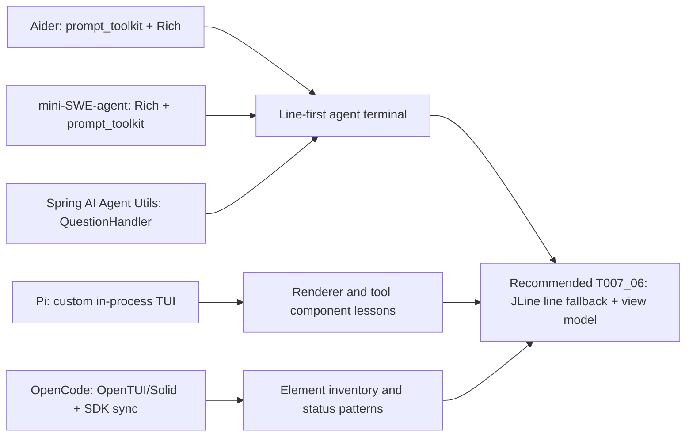
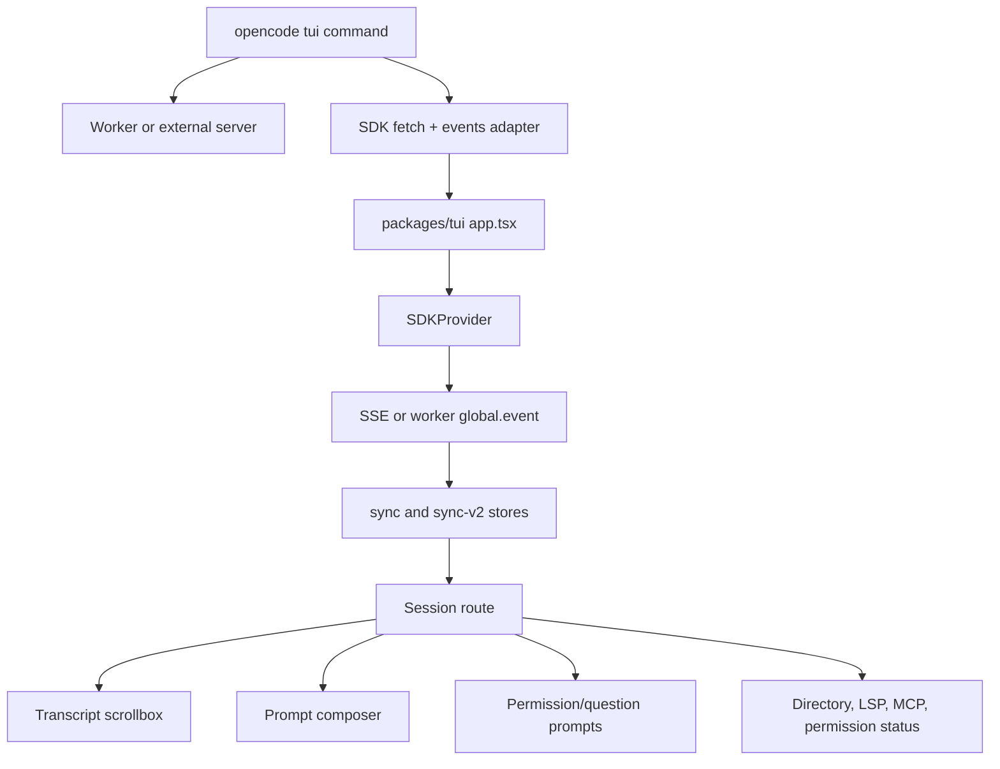
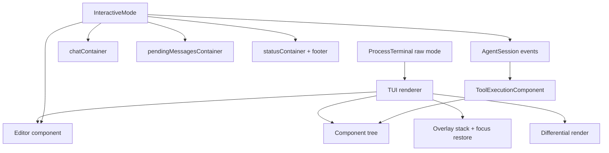
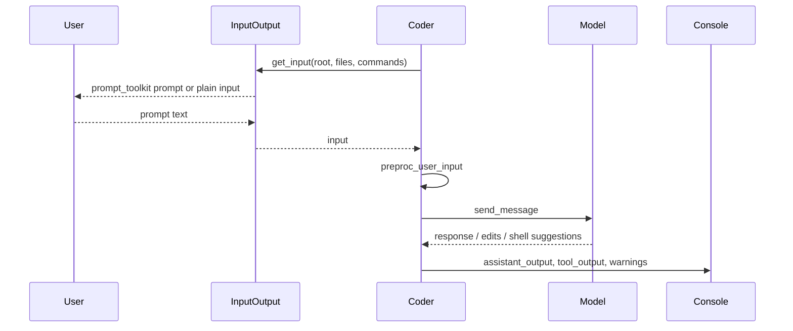
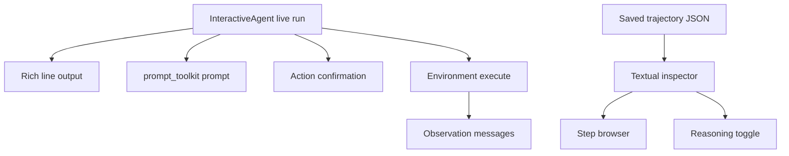
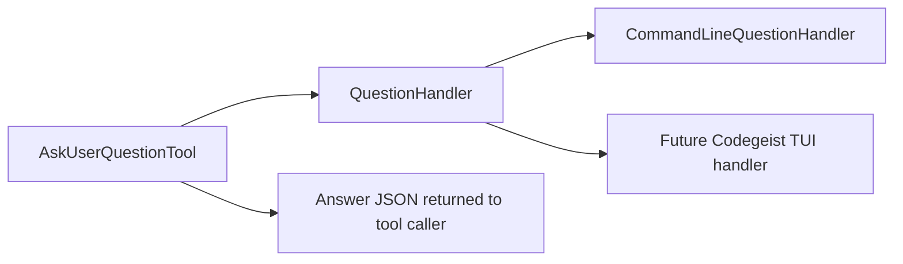
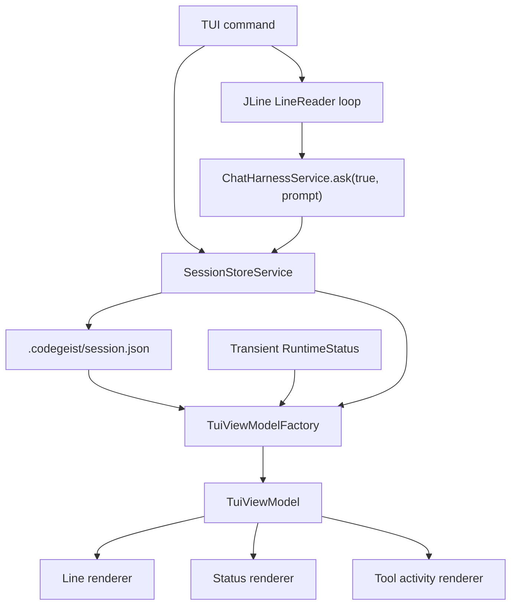
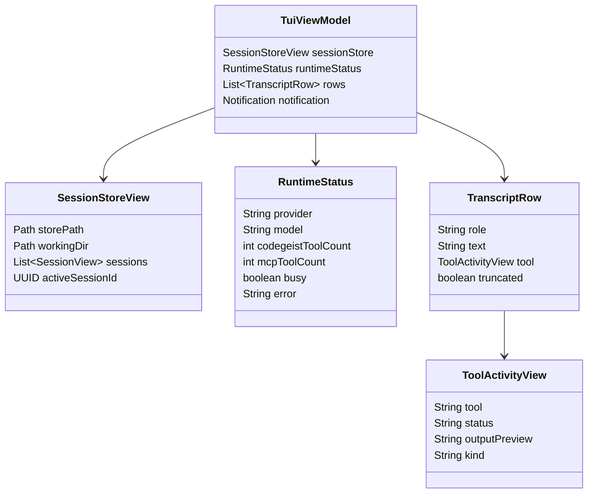

# T007_06 Third-Party Terminal UI Deep Analysis

Source-backed comparison of terminal UI approaches in the analyzed third-party
workspaces, with implementation consequences for Codegeist's first terminal TUI
over `.codegeist/session.json`.

## Purpose

Use this document with `task.md` and
`../../tui-opencode-jline-mapping.md` before implementing T007_06. It compares
the local third-party projects that have terminal interaction, separates reusable
patterns from framework-specific architecture, and maps the result onto the
current Codegeist Spring Shell/JLine and session-store boundaries.

The conclusion is conservative: implement a line-first, JLine-close TUI
projection over `SessionStoreService`, not a copied OpenTUI, Pi TUI, Textual, or
prompt_toolkit framework.

## Codegeist Constraints

Current Codegeist source shape:

- `app/codegeist/cli/src/main/java/ai/codegeist/app/chat/ChatHarnessService.java`
  owns one non-streaming prompt turn, provider default-model selection,
  prompt-scoped tool setup, agent-loop execution, and session-store persistence.
- `app/codegeist/cli/src/main/java/ai/codegeist/app/session/SessionStoreService.java`
  owns the current working directory, `.codegeist/session.json` path, JSON load,
  create, append, and save behavior.
- `app/codegeist/cli/src/main/java/ai/codegeist/app/session/ToolSessionPart.java`
  persists only `tool`, final `status`, and `outputPreview` today. Current status
  values are `completed` and `failed`.
- `app/codegeist/cli/src/main/java/ai/codegeist/app/tool/CodegeistToolService.java`
  opens one prompt-scoped runtime tool run, records bounded tool parts, and keeps
  enabled tool definitions and MCP config out of the session store.
- `app/codegeist/cli/src/main/java/ai/codegeist/app/tool/CodegeistShellTool.java`
  records one bounded shell summary with command, cwd, timeout marker, exit code,
  and merged output.

T007_06 may project richer UI states such as busy, running, cancelled, timed-out,
duration, provider/model, MCP, and enabled-tool counts, but those values are not
all persisted today. Runtime-only status must remain transient unless a focused
future task changes the session-store schema.

## Evidence Sources

OpenCode current TUI:

- `docs/third-party/opencode/source/packages/opencode/src/cli/cmd/tui.ts`
- `docs/third-party/opencode/source/packages/tui/src/app.tsx`
- `docs/third-party/opencode/source/packages/tui/src/context/sdk.tsx`
- `docs/third-party/opencode/source/packages/tui/src/context/sync-v2.tsx`
- `docs/third-party/opencode/source/packages/tui/src/routes/session/index.tsx`
- `docs/third-party/opencode/source/packages/tui/src/routes/session/footer.tsx`
- `docs/third-party/opencode/source/packages/tui/src/routes/session/permission.tsx`
- `docs/third-party/opencode/source/packages/tui/src/component/prompt/index.tsx`

Pi current TUI and coding-agent interactive mode:

- `docs/third-party/pi/source/packages/tui/README.md`
- `docs/third-party/pi/source/packages/tui/src/tui.ts`
- `docs/third-party/pi/source/packages/tui/src/terminal.ts`
- `docs/third-party/pi/source/packages/tui/src/components/editor.ts`
- `docs/third-party/pi/source/packages/coding-agent/src/modes/interactive/interactive-mode.ts`
- `docs/third-party/pi/source/packages/coding-agent/src/modes/interactive/components/tool-execution.ts`

Aider terminal loop:

- `docs/third-party/aider/source/aider/io.py`
- `docs/third-party/aider/source/aider/coders/base_coder.py`

mini-SWE-agent terminal loop and inspector:

- `docs/third-party/mini-swe-agent/source/src/minisweagent/agents/interactive.py`
- `docs/third-party/mini-swe-agent/source/src/minisweagent/agents/utils/prompt_user.py`
- `docs/third-party/mini-swe-agent/source/src/minisweagent/run/utilities/inspector.py`

Spring AI Agent Utils CLI question path:

- `docs/third-party/spring-ai-agent-utils/source/spring-ai-agent-utils/src/main/java/org/springaicommunity/agent/tools/AskUserQuestionTool.java`
- `docs/third-party/spring-ai-agent-utils/source/spring-ai-agent-utils/src/main/java/org/springaicommunity/agent/utils/CommandLineQuestionHandler.java`

## Comparison Matrix

| Project | Terminal UI shape | Runtime coupling | Persistence shape | Reusable T007_06 pattern | Do not copy |
| --- | --- | --- | --- | --- | --- |
| OpenCode | Full-screen OpenTUI/Solid app with routes, dialogs, plugin slots, keymap, prompt composer, scrollbox, sidebar, and footer. | TUI talks to an OpenCode worker or server through SDK fetch and event streams. | Server-side session state is hydrated and updated through SDK sync stores, not a local portable JSON file. | Element inventory: transcript, prompt, permission prompt, runtime footer, per-tool renderers, status projection, collapse/expand. | OpenTUI/Solid, worker/server/SDK sync architecture, plugin runtime, sidebar system, persisted prompt stash/history. |
| Pi | Custom in-process TypeScript TUI framework with raw terminal control, differential rendering, overlays, editor, autocomplete, footer, and coding-agent components. | Interactive mode directly owns UI containers and subscribes to `AgentSession` events. | Pi has its own session/runtime model; the TUI mutates live components rather than rebuilding from a single portable JSON file. | In-process controller, componentized tool rendering, fallback rendering, editor capability lessons, footer status provider. | Whole framework, terminal protocol negotiation, extension/widget surface, image rendering, custom renderer stack. |
| Aider | Line-oriented prompt_toolkit input plus Rich/Markdown output. No full-screen terminal app. | `Coder.run()` loops over `InputOutput.get_input(...)` and `send_message(...)`. | Chat history is appended as markdown-like history output, not a structured multi-session file for UI projection. | Prompt history, multiline input, confirmation prompts, graceful dumb-terminal fallback, line-oriented transcript. | Aider edit formats, repo-map workflow, markdown chat-history format, full command set. |
| mini-SWE-agent | Rich line-oriented interactive agent with prompt_toolkit. Separate Textual trajectory inspector for offline browsing. | `InteractiveAgent` extends the default agent with human/confirm/yolo modes and confirmation hooks. | Runtime trajectories are model/environment messages; inspector reads trajectory files as a separate viewer. | Simple mode/status prompts, command confirmation, keyboard interrupt handling, offline viewer separation. | Textual inspector as live UI, SWE-benchmark trajectory model, yolo/human/confirm modes as Codegeist TUI modes. |
| Spring AI Agent Utils | Java CLI question handler using `Scanner` and a Spring AI tool abstraction. No TUI framework. | `AskUserQuestionTool` delegates to a `QuestionHandler`. | Answers are returned to the tool call; no UI persistence. | Keep question/approval UI behind a small handler interface so terminal details stay replaceable. | Direct `System.in`/`System.out` in Codegeist command services, broad Agent Utils tool surface as the UI contract. |

## Architecture Spectrum

OpenCode and Pi prove what a polished full-screen coding-agent TUI can show.
Aider, mini-SWE-agent, and Spring AI Agent Utils prove that the first usable
agent control surface can remain line-oriented and still handle prompts,
confirmation, output, history, and interruptions.

## OpenCode Deep Dive

OpenCode's current terminal UI is an independent `packages/tui` package. The CLI
entrypoint in `packages/opencode/src/cli/cmd/tui.ts` starts or connects to an
OpenCode worker/server, builds SDK fetch and event-source adapters, validates the
target session, and runs the TUI layer. The TUI itself is a Solid/OpenTUI app in
`packages/tui/src/app.tsx` with providers for SDK, sync, project, route, dialogs,
theme, local state, plugins, prompt history, stash, keymap, and runtime paths.

OpenCode's reusable lesson is UI decomposition, not persistence. Its sync layer
hydrates session messages and applies event deltas for user messages, assistant
steps, shell starts/ends, text deltas, tool input/call/progress/success/failure,
reasoning, and compaction. Codegeist currently has no equivalent event stream and
no server-backed state store; its initial TUI should rebuild a deterministic view
model from `.codegeist/session.json` after each prompt turn.

OpenCode session rendering in `routes/session/index.tsx` is still useful as an
element checklist:

| Element | OpenCode behavior | T007_06 translation |
| --- | --- | --- |
| Transcript | Scrollbox of user and assistant messages, text parts, reasoning parts, tool parts, and assistant metadata. | Deterministic rows from `SessionStore`: user text, assistant text, compaction text, and final tool previews. |
| Tool dispatcher | `ToolPart` routes known tools to specialized renderers and falls back to `GenericTool`. | A simple `ToolActivityRenderer` should map Codegeist tool names to file, change, shell, MCP, and generic rows. |
| Tool state | Pending, running, completed, and error state appear in live event data. | Persisted state is final-only today. Running/busy belongs to transient `RuntimeStatus` unless the schema changes. |
| Permission prompt | `permission.tsx` renders read/list/glob/grep/bash/edit/web/task requests and replies through SDK. | Do not invent a persistence model. Add a small modal or line prompt only when Codegeist services expose approval state. |
| Footer | `footer.tsx` shows directory, permission count, LSP count, MCP count, and `/status`. | Keep path, workingDir, provider/model, MCP/tool counts, dirty/error state in transient status. |
| Prompt composer | `component/prompt/index.tsx` handles text area, shell mode, prompt history, stash, autocomplete, editor context, and submit guards. | Start with `LineReader.readLine(...)`, empty-input no-op, EOF quit, interrupt/cancel, help/status commands, and no new persisted prompt history. |

OpenCode-specific behavior to defer:

- Worker/server transport and SDK event sync.
- OpenTUI/Solid provider tree.
- Plugin runtime and slots.
- Session browser, fork/share/revert/timeline, sidebar panels, and transcript export.
- Persisted prompt stash/history outside the session store.
- File/resource/agent autocomplete and command palette.

## Pi Deep Dive

Pi has the richest custom terminal implementation among the inspected projects.
`packages/tui/README.md` describes a component interface with `render(width)`,
optional `handleInput(data)`, differential rendering, synchronized output,
bracketed paste support, overlays, focus management, built-in components,
autocomplete, and image support. `src/tui.ts` implements focus, overlays,
input listeners, render scheduling, cursor restoration, terminal color-scheme
handling, and incremental redraw. `src/terminal.ts` controls raw mode,
bracketed paste, resize handling, Kitty keyboard negotiation, modifyOtherKeys
fallback, cursor, progress, and terminal cleanup.

Pi's reusable lessons are mostly internal boundaries:

| Pi boundary | Source-backed behavior | T007_06 consequence |
| --- | --- | --- |
| Terminal adapter | `ProcessTerminal` owns raw mode, paste, keyboard protocol, resize, cursor, title, progress, and cleanup. | Let JLine own terminal abstraction first. Avoid custom raw-mode protocol work in T007_06. |
| Component contract | Components render to width-bounded string arrays and may handle input. | Codegeist can use renderer classes that produce rows from a view model without introducing a component framework. |
| Editor | Pi editor handles grapheme/CJK wrap, paste markers, history, undo, kill ring, autocomplete, and cursor state. | Start with JLine's `LineReader`; add custom multiline/paste behavior only after focused tests require it. |
| Tool rendering | `ToolExecutionComponent` prefers tool-specific `renderCall` and `renderResult`, catches renderer failures, and falls back to generic text. | Implement a small per-tool renderer registry with a generic fallback, but keep renderers pure and deterministic. |
| Footer provider | Interactive mode uses `FooterDataProvider` and `FooterComponent` for runtime status. | Use a transient `RuntimeStatus` projection, separate from `SessionStore`. |

Pi-specific behavior to defer:

- Custom terminal protocol negotiation and differential renderer.
- Extension widgets, custom editor factories, selectors, themes, image support, OAuth/login dialogs, and full model selectors.
- Mutable live component graph as the source of truth.

## Aider Deep Dive

Aider demonstrates a productive terminal agent without a full-screen TUI.
`InputOutput` in `aider/io.py` creates a prompt_toolkit `PromptSession` when the
terminal is capable, disables fancy input for dumb terminals, prints output with
Rich, and appends chat history. `get_input(...)` builds file and command
completion, prompt history, Ctrl-Z suspend, Ctrl-X/Ctrl-E external editor, normal
Enter submit, Alt-Enter newline, multiline brace mode, file watcher interruption,
and fallback `input(...)`. `confirm_ask(...)` and `prompt_ask(...)` reuse the same
prompt session for line prompts. `Coder.run()` in `aider/coders/base_coder.py`
is the simple loop: get input, run one turn, show undo hints, and handle Ctrl-C.

Aider's main Codegeist lesson is the line fallback contract. It is not a weak
mode; it is the reliable contract that keeps automation and less capable
terminals working. T007_06 should make the line renderer deterministic first and
only add richer redraw behavior over the same view model.

## mini-SWE-agent Deep Dive

mini-SWE-agent also keeps live interaction line-oriented. `InteractiveAgent` adds
three modes over the default agent: `human`, `confirm`, and `yolo`. It prints
messages with Rich, prompts through prompt_toolkit, handles `/h`, `/m`, `/u`,
`/c`, and `/y`, asks before executing model-proposed shell actions, and converts
rejections or interruptions into user messages. The multiline helper in
`prompt_user.py` uses prompt_toolkit's multiline `PromptSession` and bottom
toolbar. The Textual inspector in `run/utilities/inspector.py` is separate from
the live agent. It loads trajectory JSON files, groups messages into steps, and
offers navigation and reasoning toggles.

The reusable split is important: live agent control and offline transcript
inspection do not have to be the same UI. Codegeist should not adopt Textual for
the live T007_06 path. If a richer transcript browser is later needed, it can
remain a separate tool over `.codegeist/session.json`.

## Spring AI Agent Utils Deep Dive

Spring AI Agent Utils has no terminal TUI, but it has a useful UI boundary.
`AskUserQuestionTool` exposes a Spring AI tool that delegates presentation to a
`QuestionHandler`. `CommandLineQuestionHandler` is one concrete implementation
using `Scanner`, option numbering, multi-select parsing, and free-text fallback.

For Codegeist, this supports a small indirection for future approval or question
prompts. The chat runtime should not depend on direct terminal I/O. A TUI handler
can be one implementation when the underlying Codegeist service exposes the state.

## Recommended Codegeist T007_06 Shape

Only `SessionStoreView` is derived from persisted `.codegeist/session.json`.
`RuntimeStatus`, notifications, prompt draft, selected pane, scroll offset, help
mode, modal state, and dirty/error indicators are UI or runtime projections and
must not be written into the session store.

## Tool Activity Mapping

| Codegeist source today | TUI projection | Persistence note |
| --- | --- | --- |
| `ToolSessionPart.tool` | Tool label and renderer selection. | Persisted. |
| `ToolSessionPart.status` | Final status badge: completed or failed. | Persisted final-only status. |
| `ToolSessionPart.outputPreview` | Bounded summary, command output, file result, diff preview, or MCP result preview. | Persisted bounded string only. |
| `CodegeistShellTool` summary | Parse or display command, cwd, timeout, exit code, output. | Stored as bounded preview text, not structured shell fields. |
| `CodegeistToolService.openRun(...)` callbacks | Runtime enabled tool count and MCP count if available from safe projections. | Do not open MCP clients only to show passive status. |
| Future approval state | Modal or line prompt. | Do not persist UI-only approval prompt state unless a focused service/schema change requires it. |

OpenCode and Pi both render live running tool state, partial output, and richer
durations. Codegeist cannot faithfully render that from persisted history yet.
For T007_06, mark completed/failed persisted tool parts accurately and use
transient busy state only while the current prompt turn is executing.

## Implementation Priorities

1. Build a pure `TuiViewModel` projection from `SessionStore` plus transient
   `RuntimeStatus`.
2. Unit-test deterministic line rendering for user messages, assistant text,
   compaction text, final tool previews, file-tool summaries, edit/write/change
   previews, shell summaries, errors, and truncation markers.
3. Add a small JLine `LineReader` loop that opens or creates the current session
   store, renders the latest rows, accepts a prompt, delegates to
   `ChatHarnessService.ask(true, prompt)`, reloads the store, and renders again.
4. Keep `/help`, `/status`, `/quit`, empty-input handling, EOF, and Ctrl-C
   behavior deterministic.
5. Add full-screen redraw, scrollback panes, or modal prompts only after the same
   view model and line renderer are tested.

## Deferrals

- Do not add OpenTUI, Textual, prompt_toolkit, or a custom terminal renderer to
  Codegeist in T007_06.
- Do not add a second chat store, server state store, SDK sync layer, or database.
- Do not persist provider/model, MCP definitions, enabled tool definitions,
  runtime status, prompt history, prompt stash, scroll offset, focus, modal state,
  or selected pane.
- Do not implement sidebars, plugin slots, transcript export, fork/share/revert,
  prompt file autocomplete, model selectors, image rendering, mouse support, or
  extension widgets in this slice.
- Do not represent running/cancelled/timed-out persisted tool lifecycle states
  until a focused session-store schema task requires them.
