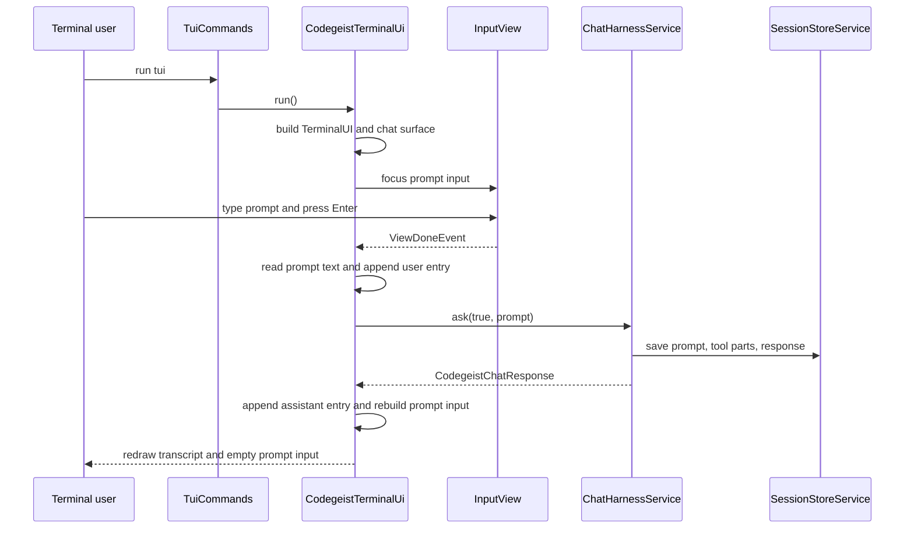
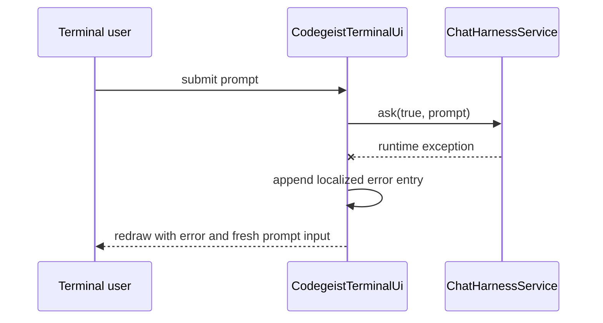

# T007_06 TerminalUI Chat Harness Implementation Plan

Detailed implementation handoff for turning the current minimal Spring Shell
`TerminalUI` launcher into the first usable Codegeist TUI chat loop.

## Purpose

This plan documents the next implementation pass for
`T007_06_add-terminalui-chat-harness/task.md`. The target is a small, tested TUI
interaction that lets a terminal user enter a prompt, submit it through
`ChatHarnessService.ask(true, prompt)`, see the returned response text, and repeat
the interaction without restarting the TUI.

The plan is intentionally implementation-focused, not a replacement architecture.
It must stay inside the existing Spring Shell `TerminalUI` approach and must not
restore the removed custom JLine console, presenter tree, line-renderer pipeline,
or broad TerminalUI presentation architecture.

## Current Baseline

Implemented source today:

- `ai.codegeist.app.tui.TuiCommands` exposes the Spring Shell `tui` command.
- `TuiCommands.tui()` delegates directly to `CodegeistTerminalUi.run()`.
- `CodegeistTerminalUi` injects `TerminalUIBuilder` and `CodegeistMessages`.
- `CodegeistTerminalUi.run()` builds a `TerminalUI`, configures one bordered
  `BoxView`, sets that root, binds `Ctrl-Q` to an interrupt message, and enters
  `TerminalUI.run()`.
- `CodegeistMessages` resolves `tui.title` and `tui.quit.hint` from
  `messages.properties` through `CodegeistLocaleService`.
- `ChatHarnessService.ask(boolean continueSession, String prompt)` already owns
  provider selection, default model selection, prompt-scoped local/MCP tools,
  `CodegeistAgentLoopService`, and `.codegeist/session.json` persistence.

Current tests:

- `CodegeistTerminalUiTest` only proves the minimal root view has a border and draw
  function.
- `TuiCommandsTest` only proves command delegation.
- `CodegeistMessagesTest` and `CodegeistLocaleServiceTest` cover i18n lookup and
  locale selection.

Not implemented yet:

- Prompt input.
- Prompt submission.
- Response rendering.
- Repeated prompt/response turns in one TUI session.
- Handled harness failure display.
- Any provider-backed TUI smoke or virtual-terminal smoke.

## Target Behavior

The implementation should satisfy these user-visible contracts:

- The `tui` command still opens a Spring Shell `TerminalUI` through
  `CodegeistTerminalUi`.
- The visible surface includes a transcript/readout area and a prompt input area.
- The prompt input starts focused when the TUI opens.
- Pressing Enter with a non-blank prompt submits exactly one prompt turn through
  `ChatHarnessService.ask(true, prompt)`.
- The `continueSession` argument is always `true`, so TUI turns append to the same
  newest session behavior already owned by `ChatHarnessService` and
  `SessionStoreService`.
- On success, the returned `CodegeistChatResponse.content()` is appended to the
  visible transcript.
- On a handled harness failure, the TUI appends a concise terminal-facing error
  line instead of letting the TUI die from an uncaught exception.
- The user can submit another prompt after a success or failure without restarting
  the TUI.
- `Ctrl-Q` keeps interrupting the TUI loop.
- Existing noninteractive command behavior for `--version`, `--show-config`, and
  `ask` remains unchanged.

## Non-Goals

- Do not add streaming output.
- Do not add cancellation beyond the existing `Ctrl-Q` TUI interrupt.
- Do not add permission prompts, patch review UI, shell review panes, or tool
  transcript projection.
- Do not add a session browser, transcript replay from `.codegeist/session.json`,
  model context reconstruction, or scrollback storage.
- Do not persist prompt drafts, focus, layout, scroll position, runtime status, or
  other UI-only state to `.codegeist/session.json`.
- Do not add a `task tui-smoke` entrypoint.
- Do not create `docs/developer/architecture/terminal-ui.md` for this slice unless
  implementation grows beyond the compact architecture-map update.
- Do not add hosted provider calls or new provider integrations.
- Do not introduce a second agent runtime or bypass `ChatHarnessService`.

## Spring Shell TerminalUI API Facts

These are the relevant Spring Shell 4.0.2 APIs already available through
`spring-shell-jline`:

- `TerminalUIBuilder.build()` creates the `TerminalUI` used by the current code.
- `TerminalUI.configure(View)` initializes a view and injects the event loop,
  theme resolver, theme name, and view service.
- `TerminalUI.setRoot(View, boolean)` sets focus to the root and installs it.
- `TerminalUI.setFocus(View)` can focus a child view after it has been configured.
- `TerminalUI.redraw()` dispatches a redraw event.
- `GridView` can compose child views with row and column sizing.
- `BoxView` remains useful for bordered transcript or status areas.
- `InputView` is a Spring Shell TUI input control with `getInputText()` and an
  Enter-driven `ViewDoneEvent`.
- `InputView` does not expose a public clear or set method. Production code should
  not reflect into its private `text` or `cursorIndex` fields. If prompt clearing is
  needed, rebuild the input view or replace the root surface after submission.

## Proposed Source Changes

### `CodegeistTerminalUi`

Add `ChatHarnessService` as a final collaborator. Keep `TerminalUIBuilder` and
`CodegeistMessages` as final collaborators.

Replace the single static root view with a small chat surface:

- A root `GridView` with the Codegeist title and border.
- A transcript `BoxView` whose draw function renders the current in-memory
  transcript text.
- A prompt `InputView` titled with a localized prompt label.
- Optional status text inside the transcript area, not a new runtime status model.

Keep the state local to the running TUI:

- Store transcript entries in memory while `TerminalUI.run()` is active.
- Store the currently active `InputView` in memory so global `ViewDoneEvent`
  handling can ignore stale replaced inputs.
- Rebuild the root surface after a submission to get a fresh empty `InputView`
  without using reflection or a custom console.
- Reconfigure every newly built view through `TerminalUI.configure(...)` before it
  receives focus or events.

Recommended method shape:

```text
run()
  build TerminalUI
  create initial TuiChatState
  installChatSurface(terminalUI, state)
  subscribe Ctrl-Q key handling
  subscribe ViewDoneEvent handling for the active prompt input
  terminalUI.run()

installChatSurface(terminalUI, state)
  create GridView root, transcript BoxView, prompt InputView
  configure each child and root view
  set root and focus prompt input
  update state.activePromptInput

submitPrompt(terminalUI, state, promptText)
  ignore blank prompt
  append user transcript entry
  call chatHarnessService.ask(true, prompt)
  append assistant transcript entry on success
  append localized error entry on failure
  installChatSurface(terminalUI, state)
  redraw
```

Keep helper methods package-private only when tests need them. Do not add public
production APIs only for tests.

### `TuiCommands`

Keep the command thin:

- Continue delegating to `CodegeistTerminalUi.run()`.
- Do not inject `ChatHarnessService` into the command.
- Keep Spring Shell command parsing unchanged.

### `CodegeistMessages` And `messages.properties`

Add only message keys needed by the current TUI surface and tests. Candidate keys:

- `tui.prompt.title` for the input view title.
- `tui.transcript.title` for the transcript box title.
- `tui.empty.transcript` for the initial readout.
- `tui.user.label` for submitted user text.
- `tui.assistant.label` for response text.
- `tui.error.label` for handled harness failures.
- `tui.blank.prompt.hint` only if blank submissions should visibly explain why
  nothing happened.

Keep the existing keys:

- `tui.title`
- `tui.quit.hint`

Avoid adding a parallel Java defaults catalog. `messages.properties` remains the
English source of user-facing text.

## Proposed Runtime Flow



Failure branch:



## Proposed Layout

Use one root grid. The exact row sizes can be tuned by test-visible behavior, but a
small starting point is enough:

- Row 0: transcript/readout area, proportional height.
- Row 1: prompt input, fixed small height.
- Optional footer or quit hint can stay in the transcript empty-state text to avoid a
  third control until a test needs it.

If the prompt title and transcript title already make usage clear, do not add a
separate footer view. Keep `Ctrl-Q` documented in the empty transcript text or prompt
title through existing localized text.

## Transcript Rendering Rules

Keep rendering minimal and bounded:

- Render only current in-memory entries produced during the active TUI process.
- Include user and assistant labels so a terminal user can distinguish turns.
- Include handled error labels for exceptions.
- Cap rendered text to the visible rectangle instead of storing an unbounded UI
  projection. A simple line limit based on the rectangle height is enough.
- Preserve the complete provider response in `.codegeist/session.json` through the
  existing harness. Do not invent a separate TUI persistence format.

Do not add Markdown rendering, ANSI styling, syntax highlighting, diff panes, or
tool result expansion in this slice.

## Error Handling Plan

The TUI should catch exceptions thrown by `ChatHarnessService.ask(...)` around a
single submitted prompt. The displayed text should be clear and stable enough for
tests, for example:

```text
Error: Command failed: <message>
```

Implementation options:

- Prefer a small local formatter in `CodegeistTerminalUi` if only this TUI display
  needs it.
- Reuse `CodegeistCommandExceptionMapper` only if the code can do so directly
  without broadening the command-boundary mapper API.

Do not change `CodegeistCommandExceptionMapper` unless tests require exact parity
with Spring Shell command-boundary messages.

## Test Plan

Write focused tests before production changes where practical.

### `CodegeistTerminalUiTest`

Add tests for:

- The root chat surface has a transcript view and prompt input view.
- The prompt input is the focused view after the surface is installed.
- Submitting a non-blank prompt calls `ChatHarnessService.ask(true, prompt)`.
- A successful response appears in the transcript text.
- Two submissions call the harness twice and both responses remain visible.
- A harness exception appears as a handled error entry.
- A blank prompt does not call the harness and leaves the TUI usable.
- `Ctrl-Q` interrupt binding remains registered or covered by the existing behavior
  seam.

Avoid entering the blocking `TerminalUI.run()` loop in unit tests.

Test seams should stay package-private and behavior-shaped. Good seams include:

- Creating a chat surface.
- Submitting prompt text into the active TUI state.
- Rendering transcript text for a rectangle height.

Avoid reflection into Spring Shell private fields in production. Test-only helper
code may use Spring Shell public `InputView.getInputText()` and key handlers, or a
direct package-private submit method when that is simpler and behavior-focused.

### `TuiCommandsTest`

Keep the existing command delegation test. Update only constructor setup affected by
new `CodegeistTerminalUi` collaborators.

### `CodegeistMessagesTest`

Assert every new message key resolves from `messages.properties`.

### `CodegeistLocaleServiceTest`

No behavior change expected. Keep the existing tests in the focused selector.

### Existing Regression Tests

Run these to prove non-TUI commands still use the same command path:

```bash
task test TEST=VersionCommandsTests,CodegeistConfigCommandTest,AskCommandsSessionStoreTest
```

## Verification Commands

Run from `app/codegeist/cli`:

```bash
task test TEST=CodegeistTerminalUiTest,TuiCommandsTest,CodegeistLocaleServiceTest,CodegeistMessagesTest
task test TEST=VersionCommandsTests,CodegeistConfigCommandTest,AskCommandsSessionStoreTest
```

Then run from the repository root:

```bash
git --no-pager diff --check
```

Run broader `task test` only if the implementation touches shared chat, command,
config, session-store, or test infrastructure beyond the TUI package and message
keys.

Do not add or document `task tui-smoke` for this slice.

## Documentation Updates After Implementation

Update these files when code is implemented:

- `docs/tasks/T007_build-codegeist-runtime-harness/tasks/T007_06_add-terminalui-chat-harness/task.md`
  should move the completed behavior into `Current Outcome` and leave only true
  follow-up gaps in scope/non-goals.
- `docs/developer/architecture/architecture.md` should describe the implemented TUI
  prompt submission, response/error display, `ChatHarnessService.ask(true, prompt)`
  boundary, and focused tests.
- `docs/memory-bank/chat.md` should record the durable current state after T007_06
  changes behavior.
- `docs/tasks/T007_build-codegeist-runtime-harness/tasks/T007_07_verify-chat-file-tool-harness.md`
  should become ready only after T007_06 is implemented, or should explicitly say if
  any TUI chat-loop behavior was split into a later task.

Do not update architecture docs as if this plan were implemented. Architecture docs
must describe current source state only.

## Acceptance Checklist

The implementation is complete when all of these are true:

- `tui` still opens through `TuiCommands -> CodegeistTerminalUi`.
- The TUI includes prompt input and response display.
- Enter on a non-blank prompt calls `ChatHarnessService.ask(true, prompt)`.
- Returned `CodegeistChatResponse.content()` is visible in the TerminalUI surface.
- Repeated prompt/response turns work without restarting the TUI.
- Harness failures are visible as handled errors.
- TUI-only state is not persisted in `.codegeist/session.json`.
- Provider, tool/MCP, agent-loop, and session-store behavior remain harness-owned.
- Existing `--version`, `--show-config`, and `ask` stdout contracts remain covered by
  focused regression tests.
- No custom JLine console, line-renderer pipeline, TUI smoke task, provider
  broadening, server runtime, Vaadin surface, or second persistence model was added.

## Risks And Mitigations

| Risk | Mitigation |
| --- | --- |
| `InputView` cannot be cleared through public API. | Rebuild the input view/root surface after submission; do not use reflection in production. |
| Blocking provider calls freeze the TUI while waiting. | Accept this for the first non-streaming slice; streaming, cancellation, and background execution remain future tasks. |
| Tests accidentally enter `TerminalUI.run()`. | Keep unit tests on package-private surface/submission seams and command delegation. |
| Error messages drift from command-boundary output. | Test only the TUI contract: clear handled failure display. Reuse the command mapper only if exact parity becomes a requirement. |
| The implementation grows a presenter/layout framework. | Keep state and helpers inside `CodegeistTerminalUi` unless tests prove extraction is necessary. |
| TUI state leaks into `.codegeist/session.json`. | Route all persistence through `ChatHarnessService` and do not add session model fields for prompt drafts, focus, layout, or scroll. |

## Suggested Commit Scope

When implementing this plan, keep one focused commit for the TUI chat loop:

- TUI source and tests.
- Message keys.
- Current-state architecture/task/memory doc updates that reflect the implemented
  behavior.

Do not mix final T007_07 verification changes into the same implementation commit
unless the user explicitly asks to close the parent task in one pass.
