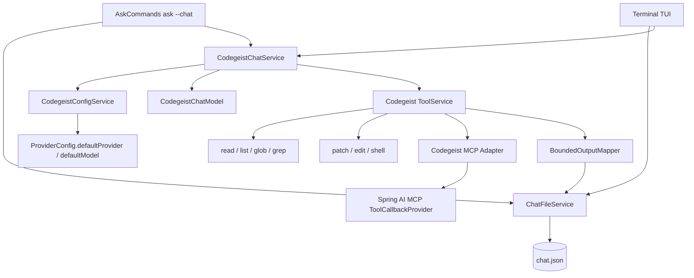
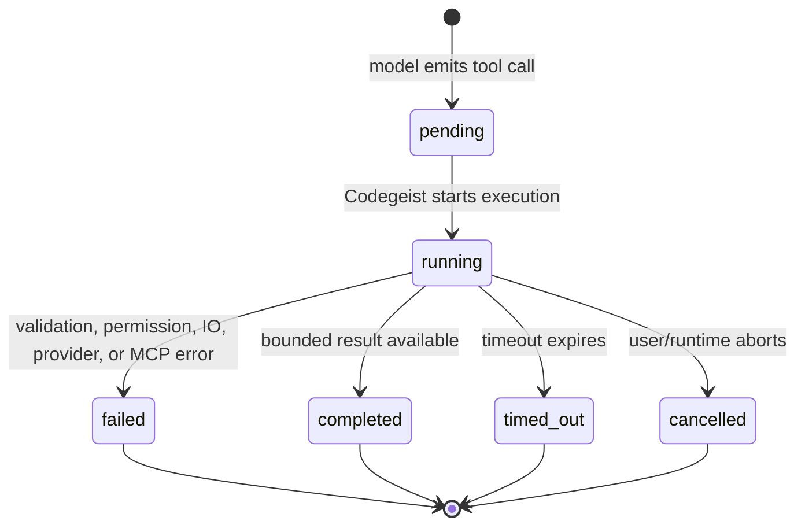
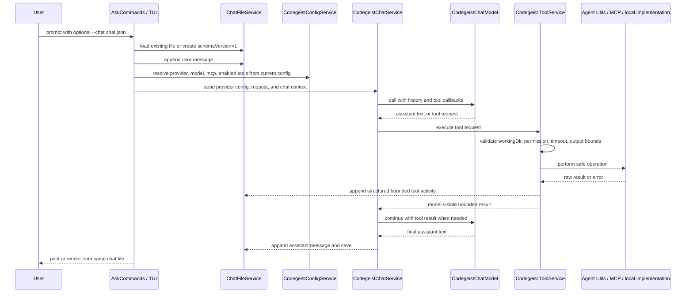
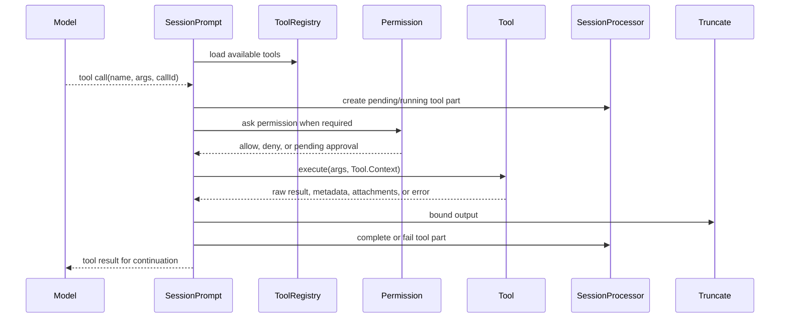
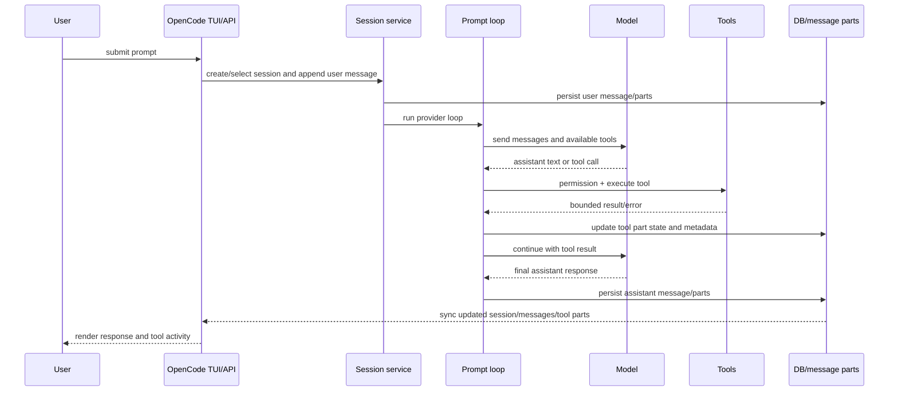
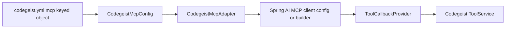
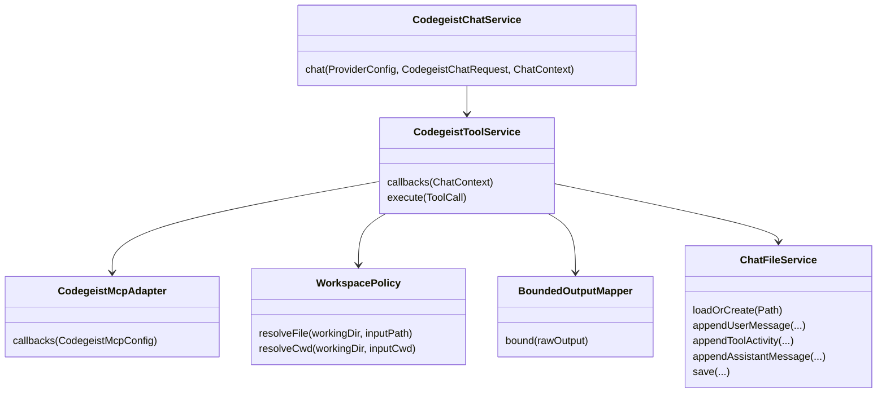
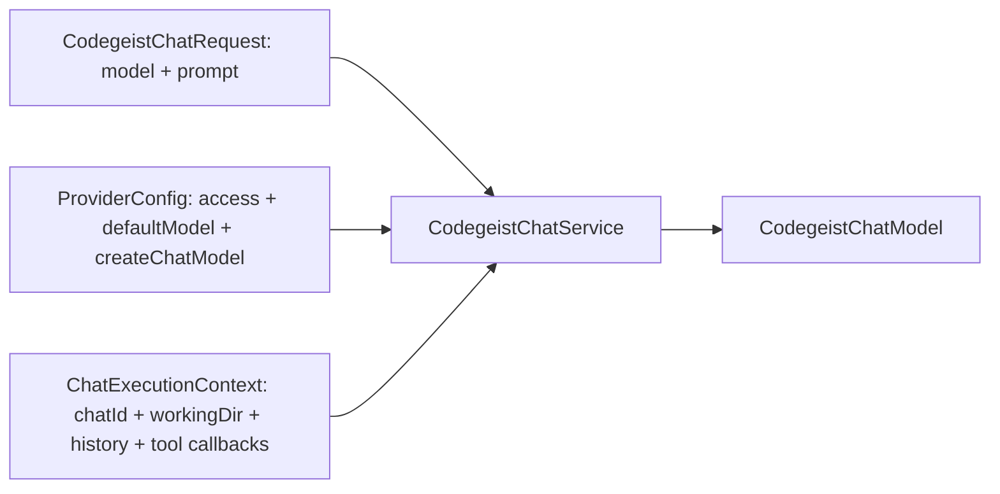
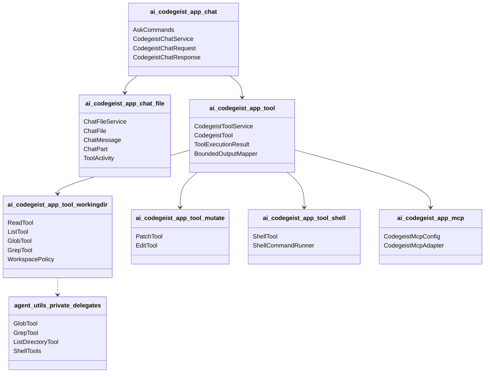
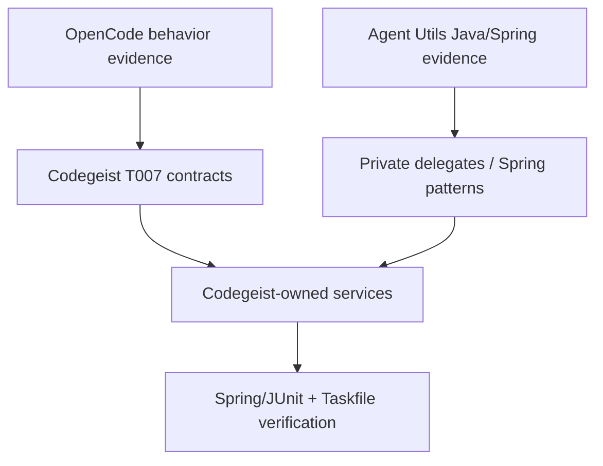

# T007 Third-Party Question Answers

Source-backed answers for the T007 chat-file tool harness question catalog.

Related TUI mapping: `tui-opencode-jline-mapping.md`.

## Scope And Evidence Notes

This document answers every question from
`docs/tasks/T007_build-codegeist-runtime-harness/third-party-question-catalog.md`.
It translates OpenCode behavior and Spring AI Agent Utils implementation patterns
into Codegeist's Java/Spring, file-only T007 scope.

Evidence came from the local third-party workspaces:

- OpenCode source: `docs/third-party/opencode/source/`.
- Spring AI Agent Utils source and Repomix output:
  `docs/third-party/spring-ai-agent-utils/source/` and
  `docs/third-party/spring-ai-agent-utils/repomix-output.xml`.

OpenCode artifact note: `docs/third-party/opencode/repomix-output.xml` was not
present when this document was written, so OpenCode answers are based on the
local source checkout, existing analysis docs, and graph artifacts. Refresh the
OpenCode analysis before treating line numbers as immutable.

## Executive Findings

- OpenCode proves the behavior shape, not the architecture shape. It stores
  sessions, messages, and parts in SQLite and drives a server/SDK/TUI sync flow;
  Codegeist T007 should keep one portable `chat.json` instead.
- `chat.json` should persist chat history and tool activity only. It should not
  persist provider config, selected provider/model, MCP client definitions,
  enabled tool definitions, credentials, runtime status, permission tables, or
  UI preferences.
- OpenCode's tool lifecycle is the strongest source of behavior evidence:
  pending, running, completed, and error tool states, bounded output, permission
  checks, and UI-visible metadata.
- Spring AI Agent Utils provides useful Java tools and Spring AI registration
  examples, but it does not provide a Codegeist-ready chat-file harness, MCP
  config contract, permission policy, or persisted tool-activity model.
- Codegeist should wrap or translate Agent Utils tools behind Codegeist-owned
  services that enforce `workingDir`, approval, bounded output, structured
  `chat.json` persistence, and no-secret behavior.
- T007 should implement the smallest tested path first: `ask --chat`, chat file
  load/save/append, current provider resolution from config, then MCP/read/write
  tools, then patch/edit/shell, then TUI over the same file.

## Recommended T007 Shape

### Chat File Shape

```json
{
  "schemaVersion": 1,
  "id": "chat_20260607_abc123",
  "createdAt": "2026-06-07T12:00:00Z",
  "updatedAt": "2026-06-07T12:01:00Z",
  "workingDir": "/home/test/Projects/codegeist-ai/codegeist",
  "messages": [
    {
      "id": "msg_001",
      "role": "user",
      "createdAt": "2026-06-07T12:00:00Z",
      "parts": [
        {
          "type": "text",
          "text": "show me the config command"
        }
      ]
    },
    {
      "id": "msg_002",
      "role": "assistant",
      "createdAt": "2026-06-07T12:00:03Z",
      "completedAt": "2026-06-07T12:00:09Z",
      "parts": [
        {
          "type": "tool",
          "callId": "call_001",
          "name": "grep",
          "state": "completed",
          "input": {
            "pattern": "show-config",
            "path": "app/codegeist/cli/src/main/java"
          },
          "output": {
            "contentPreview": "...",
            "truncated": false,
            "resultCount": 2
          },
          "createdAt": "2026-06-07T12:00:04Z",
          "completedAt": "2026-06-07T12:00:05Z"
        },
        {
          "type": "text",
          "text": "The command is implemented in ..."
        }
      ]
    }
  ],
  "toolResults": []
}
```

Do not add these fields to `chat.json` for T007:

- `provider`, `providerKey`, `providerType`, `model`, or generation options.
- `mcp`, MCP server/client definitions, OAuth state, or connection status.
- `tools`, enabled tool definitions, tool registry snapshots, or permission rules.
- `status`, runtime lock state, active process state, TUI layout, or user settings.

### Codegeist Component Direction



### Tool State Model



### Tool Call Sequence



## OpenCode Answers

### O1. Resumable Chat And Session State

OpenCode represents resumable work as database-backed session, message, and part
records rather than a portable JSON file. The relevant schema stores sessions,
messages, parts, permission JSON, and timestamps in SQLite. Runtime state such as
provider selection, MCP connection state, tool registry, and TUI sync state is
resolved through services and config, not embedded as one portable chat document.

Evidence:

- `packages/opencode/src/session/session.sql.ts` defines session/message/part
  persistence and session permission JSON.
- `packages/opencode/src/storage/db.ts` resolves the OpenCode DB path and supports
  `OPENCODE_DB`.
- `packages/opencode/src/session/message-v2.ts` models messages, parts, and tool
  state conversion.
- `packages/opencode/src/session/prompt.ts` builds the provider/tool prompt loop.
- `packages/opencode/src/cli/cmd/tui/context/sync.tsx` syncs TUI state from the
  server/SDK runtime.

Codegeist translation: keep the observable resumability but replace SQLite plus
server sync with `ChatFileService`. Persist only the replay/render data needed to
continue a chat: messages, assistant parts, tool calls/results, bounded outputs,
timestamps, and `workingDir`.

### O2. Equivalent Of `ask --chat <chat.json>`

OpenCode has no direct portable-file equivalent of `ask --chat <chat.json>`.
The closest behavior is session creation plus prompt submission into a persisted
session. The flow creates or selects a session, appends user input as message
parts, runs the provider/tool loop, persists assistant/tool parts, and lets the
TUI or API read the updated session.

Evidence:

- `packages/opencode/src/session/session.ts` exposes session creation and message
  listing behavior.
- `packages/opencode/src/session/prompt.ts` owns prompt submission, tool
  resolution, provider calls, and continuation after tool results.
- `packages/opencode/src/session/processor.ts` updates tool call lifecycle state.
- `packages/opencode/src/server/routes/session*` and TUI sync files consume the
  server/session model rather than a direct chat file.

Codegeist translation: implement a simpler command flow: load or create the file,
append the user message, run the current provider/model from config, execute tools
through `ToolService`, append tool/assistant results, then save the same file.

### O3. Message Model Essentials

OpenCode's message model separates user and assistant content and gives assistant
tool calls their own states. The useful part for Codegeist is the content-part
approach: text parts, tool parts, tool call ids, tool names, inputs, output content,
structured metadata, and lifecycle state. OpenCode also tracks richer provider,
cost, token, and event details that are not required for T007.

Evidence:

- `packages/opencode/src/session/message-v2.ts` defines message/part projections
  and tool state conversion.
- `packages/opencode/src/v2/session-message.ts` defines assistant text, reasoning,
  tool states, and assistant tool content in the v2 model.
- `packages/opencode/src/v2/session-event.ts` contains event shapes for tool
  started, delta, ended, success, and failed transitions.

Codegeist should persist:

- message id, role, timestamps, and content parts;
- assistant text and optional reasoning if a later task needs it;
- tool call id, tool name, state, input summary, bounded output, structured
  metadata, start/end timestamps, and error message.

Codegeist should avoid copying:

- OpenCode provider-specific metadata, token/cost accounting, server event ids,
  SDK shape compatibility fields, and storage-specific normalized tables.

### O4. Provider Configuration Versus Session Data

OpenCode keeps providers, models, credentials, and provider-specific options in
provider/config/account code paths rather than as message persistence. Session
messages record what happened, while runtime chooses the provider/model when a
prompt runs.

Evidence:

- `packages/opencode/src/provider/provider.ts`, `provider/models.ts`, and
  `provider/auth.ts` own provider discovery, auth, and model metadata.
- `packages/opencode/src/config/provider.ts` and config loading own provider
  configuration.
- `packages/opencode/src/account/*` stores account/auth data separately.
- `packages/opencode/src/session/prompt.ts` resolves model/provider for the run.

Codegeist translation: continue using `CodegeistConfig.defaultProvider()` and
`ProviderConfig.defaultModel()` from current config at runtime. Do not store
provider id, model id, endpoint, API keys, or evaluated credentials in
`chat.json`.

### O5. Tool Call Lifecycle

OpenCode resolves tools, exposes them to the model, receives tool requests,
checks permission, executes the tool, truncates output, persists lifecycle state,
and continues the model call with results. The lifecycle is explicit enough to
translate directly into Codegeist records.

Evidence:

- `packages/opencode/src/tool/tool.ts` defines the common tool context including
  session id, message id, call id, abort signal, metadata update, permission ask,
  and messages.
- `packages/opencode/src/tool/registry.ts` merges built-in, plugin, local, and MCP
  tools.
- `packages/opencode/src/session/prompt.ts` resolves tools and wraps execution.
- `packages/opencode/src/session/processor.ts` creates, updates, completes, and
  fails tool call parts.
- `packages/opencode/src/tool/truncate.ts` and `tool/truncation-dir.ts` bound
  model-visible output.



Codegeist translation: implement `ToolService` with the same state machine and a
single `BoundedOutputMapper` before anything is written to `chat.json`.

### O6. MCP Client Support

OpenCode supports richer MCP than T007 needs: local stdio and remote transports,
optional headers/OAuth, cached tool definitions, prompt/resource listing, sanitized
tool names, timeouts, connection/disconnection handling, and notifications that
refresh cached tools.

Evidence:

- `packages/opencode/src/config/mcp.ts` defines MCP config shapes.
- `packages/opencode/src/mcp/index.ts` owns connect/disconnect, client maps,
  tool listing/caching, prompt/resource access, sanitized tool ids, and tool calls.
- `packages/opencode/test/mcp/lifecycle.test.ts` covers cache refresh,
  disconnect behavior, and prompt/resource listing against connected servers.

Codegeist translation: start with direct `codegeist.yml`:

```yaml
mcp:
  filesystem:
    type: stdio
    command: npx
    args:
      - -y
      - "@modelcontextprotocol/server-filesystem"
      - .
```

Map this config privately into Spring AI MCP client support. Do not expose
`spring.ai.mcp.client.*`, OAuth, remote transports, dynamic discovery, prompt
listing, or resource listing until a focused task requires them.

### O7. Read/List/Glob/Grep

OpenCode's read/write tool evidence is split across `read`, `write`, `glob`, and `grep`.
Directory listing is handled by `read` when the target is a directory; there is
no separate user-visible list tool implementation in the inspected source.
`glob` and `grep` bound result counts, sort by modified time, and use permission
checks. `read` handles file paging, binary/media handling, line limits, and
directory output.

Evidence:

- `packages/opencode/src/tool/read.ts` implements file and directory reads,
  offsets, limits, binary/media handling, and truncation.
- `packages/opencode/src/tool/glob.ts` implements pattern search, default limits,
  modified-time ordering, and bounded results.
- `packages/opencode/src/tool/grep.ts` implements text search, output modes, and
  result limits.
- Tests live under `packages/opencode/test/tool/read.test.ts`, `glob.test.ts`,
  and `grep.test.ts`.

Codegeist translation: expose five Codegeist-owned tools for T007 because the
task names read/list/glob/grep/write. The `list` implementation can internally
share the read-directory path. `write` should stay limited to create/overwrite
semantics; targeted patch/edit remains in `T007_04`. All five must reject path
escape outside `workingDir` and persist bounded result metadata.

### O8. Patch/Edit Mutation

OpenCode supports multiple mutation paths: `write` for full overwrite, `edit` for
old/new string replacement with validation and fallback matching, and
`apply_patch` for patch-style add/update/delete/move changes. All side-effecting
tools ask edit permission and surface diff metadata before mutation.

Evidence:

- `packages/opencode/src/tool/write.ts` handles full-file writes.
- `packages/opencode/src/tool/edit.ts` validates replacements, handles old/new
  string matching, and applies edits.
- `packages/opencode/src/tool/apply_patch.ts` parses and validates patches.
- `packages/opencode/src/patch/index.ts` applies patch operations.

Codegeist translation: implement a minimal patch/edit service rather than copying
all OpenCode edit strategies. Start with exact replacement or patch application
only if tests require both. Persist changed file path, operation, diff/preview,
status, and bounded error details in `chat.json`.

### O9. Shell Execution

OpenCode exposes the shell tool under the compatibility id `bash`, parses commands
for permission patterns and external paths, executes through a shell abstraction,
streams output into metadata, enforces abort/timeout behavior, and kills process
trees on cancellation.

Evidence:

- `packages/opencode/src/tool/shell/id.ts` keeps tool id and permission key as
  `bash` for compatibility.
- `packages/opencode/src/tool/shell.ts` handles permission metadata, command
  execution, output streaming, timeout, abort, and result mapping.
- `packages/opencode/src/shell/shell.ts` provides lower-level shell behavior.
- `packages/opencode/test/tool/shell.test.ts` covers timeout, abort, stdout,
  stderr, exit code, and process behavior.

Codegeist translation: implement `CodegeistShellTool` with explicit cwd derived
from `chat.json.workingDir`, timeout, exit code, duration, stdout/stderr previews,
truncation metadata, and no background persistence in T007.

### O10. Permissions And Side-Effect Gates

OpenCode uses rule-based permission evaluation. Tools call `ctx.ask(...)`; the
permission service checks configured rules and can allow, deny, or ask. Last
matching wildcard rules can decide behavior. Read-only posture is expressed by
permission/tool configuration rather than a single `readOnly` mode.

Evidence:

- `packages/opencode/src/config/permission.ts` defines permission config.
- `packages/opencode/src/permission/evaluate.ts` evaluates permission rules.
- `packages/opencode/src/permission/index.ts` asks, replies, stores pending
  requests, and handles decisions.
- `packages/opencode/src/session/prompt.ts` routes permission requests during tool
  execution.

Codegeist translation: T007 only needs minimal real guards: no file mutation
outside `workingDir`, no shell cwd escape, explicit side-effect record, and bounded
output. A full permission UI/ruleset can be deferred unless the active child task
requires approval prompts.

### O11. Terminal UI Rendering

OpenCode's TUI renders from a server/SDK sync store rather than from a portable
file. It receives session, message, part, tool, status, and event data from the
runtime and maintains UI-only state separately.

Evidence:

- `packages/opencode/src/cli/cmd/tui/context/sync.tsx` maintains synced state from
  the backend runtime.
- `packages/opencode/src/cli/cmd/tui/component/prompt/index.tsx` handles prompt
  submission and UI behavior.
- OpenCode's TUI packages rely on OpenTUI/Solid-specific concepts that T007 should
  not copy.

Codegeist translation: make the TUI a projection over `chat.json` plus current
runtime services. UI state such as selected pane, scroll position, input draft,
and layout should stay out of `chat.json` unless a later focused task needs a UI
preferences file.

### O12. Bounded Output Strategy

OpenCode has common truncation support and tool-specific bounds. Defaults include
line and byte caps, and full truncated output can be written to a data directory
for later inspection.

Evidence:

- `packages/opencode/src/config/config.ts` defines configurable tool-output caps.
- `packages/opencode/src/tool/truncate.ts` applies model-visible truncation.
- `packages/opencode/src/tool/truncation-dir.ts` defines the output storage
  location.
- `read`, `glob`, `grep`, and `shell` tools also apply local limits.

Codegeist translation: add a shared `BoundedOutputMapper` with consistent fields:
`contentPreview`, `stdoutPreview`, `stderrPreview`, `truncated`, `omittedLines`,
`omittedCharacters`, `resultCount`, `limit`, and optional `fullOutputPath` only
if T007 explicitly adds a local artifact policy.

### O13. Corrupt, Missing, Or Old Persisted Data

OpenCode has JSON migration code and schema-backed persistence, but it does not
provide a direct `chat.json` migration contract for Codegeist. The useful behavior
is schema validation before use and clear failure on incompatible records.

Evidence:

- `packages/opencode/src/storage/json-migration.ts` contains migration behavior for
  OpenCode JSON storage.
- `packages/opencode/src/storage/schema.sql.ts` and `session.sql.ts` define durable
  DB schema boundaries.
- Session/message models use Effect schemas in v2 source files.

Codegeist translation: for schema version `1`, implement strict parse and fail
fast on unsupported future versions. Missing file creates a new chat; corrupt JSON
returns a clear command error before provider calls or side effects.

### O14. Working Directory Boundary

OpenCode tools are designed around project/session context and permission checks.
The shell and file tools inspect paths and command context; mutation tools surface
diff metadata. OpenCode's full workspace policy is broader than T007 and mixed
with server/runtime behavior.

Evidence:

- `packages/opencode/src/tool/read.ts`, `glob.ts`, `grep.ts`, `edit.ts`, `write.ts`,
  and `apply_patch.ts` resolve paths and tool permissions.
- `packages/opencode/src/tool/shell.ts` parses shell commands and external paths
  for permission decisions.
- `packages/opencode/src/project/*` and `worktree/index.ts` contain broader project
  and worktree context.

Codegeist translation: use a simpler tested rule: canonicalize the requested path
or cwd, ensure it stays under `chat.json.workingDir`, reject escape before side
effects, and persist the failure as tool activity when it occurs during a chat.

### O15. Full Prompt-To-Tool-To-UI Sequence



Codegeist should collapse TUI/API/server/DB into CLI/TUI plus `ChatFileService`.

### O16. Session Persistence Deep Dive For `chat.json`

OpenCode persistence is normalized and service-oriented. Codegeist should take
only the projection needed for a single file:

- Session id becomes `chat.json.id`.
- Session timestamps become `createdAt` and `updatedAt`.
- Project/session root becomes `workingDir`.
- Messages and parts become ordered arrays.
- Tool parts become structured `tool` parts with state and bounded output.
- Permission, provider, MCP, UI, server, and database state stay outside.

Recommended Codegeist fields:

```text
schemaVersion, id, createdAt, updatedAt, workingDir,
messages[].id, messages[].role, messages[].createdAt, messages[].completedAt,
messages[].parts[].type, text, callId, name, state, input, output, error
```

### O17. OpenCode Tests To Mirror

OpenCode has useful behavior tests for tools and v2 message updates. The exact
test framework should not be copied, but the cases are valuable.

Evidence:

- `packages/opencode/test/tool/read.test.ts` covers reads, directory behavior,
  binary/media behavior, offsets, and limits.
- `packages/opencode/test/tool/glob.test.ts` covers glob matching and ordering.
- `packages/opencode/test/tool/grep.test.ts` covers search modes and results.
- `packages/opencode/test/tool/shell.test.ts` covers shell output, timeout, abort,
  stderr, and exit behavior.
- `packages/opencode/test/v2/session-message-updater.test.ts` covers message and
  tool state updates.
- `packages/opencode/test/mcp/lifecycle.test.ts` covers MCP connection and tool
  cache lifecycle.

Codegeist tests should be Spring/JUnit/Taskfile tests that prove the same public
contracts with `task test TEST=<selector>`.

### O18. What Codegeist Should Not Copy

Do not copy these OpenCode mechanisms into T007:

- SQLite storage and normalized session/message/part tables.
- Server routes, generated SDK, event-source sync, or remote runtime.
- Plugin surfaces and local TypeScript tool discovery.
- Subagents, memory, skills, LSP, full permission UI, provider catalog, OAuth MCP,
  or OpenTUI/Solid architecture.
- Bun, Effect, Hono, AI SDK-specific abstractions, or OpenCode package layout.

T007 should preserve behavior only: resumable chat, tool lifecycle, bounded
results, safe local operations, and TUI rendering over one state source.

### O19. OpenCode Migration Assessment

Cleanly maps to Codegeist:

- message/part projection;
- tool state lifecycle;
- bounded output contract;
- read/glob/grep/edit/shell behavior cases;
- MCP tool callbacks as model-visible tools;
- UI rendering of chat/tool activity.

Requires Java translation:

- provider/model resolution through `CodegeistConfig`;
- MCP config mapping from direct `codegeist.yml` into Spring AI;
- tool registration through Spring AI callbacks or a Codegeist model wrapper;
- path/cwd checks with Java `Path` canonicalization;
- JUnit/Spring tests instead of Bun/TS tests.

Deferred:

- server sync, DB migrations, plugin system, OAuth MCP, LSP, subagents, memory,
  remote sessions, and SDK/API surfaces.

## Spring AI Agent Utils Answers

### A1. Java/Spring Equivalents For A Chat-File Harness

Agent Utils does not provide a chat-file harness. It provides Java tool classes,
Spring AI `@Tool` examples, `FunctionToolCallback` examples, `ChatClient` wiring,
and prompt environment helpers. Codegeist must own `ChatFileService`, chat records,
tool activity persistence, and provider/config boundaries.

Evidence:

- `spring-ai-agent-utils/src/main/java/org/springaicommunity/agent/tools/*` contains
  tools such as `FileSystemTools`, `ListDirectoryTool`, `GlobTool`, `GrepTool`, and
  `ShellTools`.
- `spring-ai-agent-utils/README.md` shows `ChatClient.defaultTools(...)` and
  `defaultToolCallbacks(...)` patterns.
- `examples/code-agent-demo/src/main/java/.../Application.java` wires tools, MCP
  callback providers, and advisors into a `ChatClient`.

Codegeist translation: create Codegeist-owned services and use Agent Utils only as
private delegates or behavior references.

### A2. Message, Assistant, Tool Call, And Tool Result Models

Agent Utils does not define a persisted chat-message model for T007. Spring AI
itself provides chat messages and tool callbacks at call time, but Agent Utils
tool methods mostly return strings. Codegeist must define typed `chat.json` records
for messages, assistant parts, tool calls, and tool results.

Evidence:

- Agent Utils tools return `String` from methods like `read`, `grep`, `glob`, and
  `bash`.
- `TaskTool`, `SkillsTool`, and `TaskOutputTool` build `ToolCallback` wrappers but
  do not define Codegeist-style chat persistence.

Recommendation: preserve model-visible strings for Spring AI, but persist typed
Codegeist records with status, previews, truncation metadata, and error metadata.

### A3. Tool Registration And Invocation

Agent Utils exposes tools in two ways:

- Annotated Java objects using `@Tool` and `@ToolParam`, registered through
  `ChatClient.defaultTools(...)` or `MethodToolCallbackProvider`.
- Function-style `ToolCallback` builders such as `FunctionToolCallback` in
  `TaskTool` and `SkillsTool`.

Evidence:

- `FileSystemTools.java`, `GlobTool.java`, `GrepTool.java`, and `ShellTools.java`
  define `@Tool` methods.
- `TaskTool.java` and `SkillsTool.java` return explicit `ToolCallback` instances.
- `examples/code-agent-demo/.../Application.java` registers tool callbacks and
  annotated tool objects with `ChatClient`.

Codegeist translation: wrap tool registration behind `CodegeistToolService`, so
the model only sees callbacks after Codegeist policy and persistence are attached.

### A4. MCP And Tool Callback Support

Agent Utils core does not provide a Codegeist-style MCP adapter. The code-agent
demo relies on Spring AI MCP auto-configuration: add the MCP starter, configure
Spring properties, inject `ToolCallbackProvider`, and pass it to `ChatClient`.

Evidence:

- `examples/code-agent-demo/pom.xml` uses a Spring AI MCP starter dependency.
- `examples/code-agent-demo/src/main/resources/application.properties` points at
  a Spring AI MCP stdio servers configuration.
- `examples/code-agent-demo/src/main/java/.../Application.java` injects
  `ToolCallbackProvider` and registers it with `defaultToolCallbacks(...)`.

Codegeist translation: keep direct `codegeist.yml mcp:` as public config and build
a private mapper to Spring AI MCP callback support.

### A5. Mapping Codegeist `mcp:` Without Exposing Spring Properties

The right mapping is an adapter boundary:



Agent Utils only shows the Spring AI side of this shape; Codegeist must implement
the config model and adapter. This preserves a stable Codegeist config contract
and avoids leaking Spring's property tree into user docs.

### A6. Recommended Spring Bean Boundaries

Use these bean boundaries for T007:



Agent Utils classes can sit behind wrappers, not at the public boundary.

### A7. Read/List/Glob/Grep Tool Availability

Agent Utils has relevant read/write tools:

- `FileSystemTools.Read` reads files with offset/limit and line formatting.
- `FileSystemTools.Write` writes file content, but needs Codegeist workingDir policy
  and chat-result mapping before use.
- `ListDirectoryTool` lists directories with depth/limit and common ignored dirs.
- `GlobTool` searches files using Java NIO glob, max depth, max results, and
  modified-time ordering.
- `GrepTool` searches files with regex, output modes, context, limits, and
  truncation.

Evidence:

- `FileSystemTools.java`, `ListDirectoryTool.java`, `GlobTool.java`, and
  `GrepTool.java`.
- Tests: `FileSystemToolsTest.java`, `GlobToolTest.java`, `GrepToolTest.java`,
  and `GrepToolCompatibilityTest.java`.

Codegeist translation: use these as private delegates only after adding
`workingDir` enforcement, symlink policy, ignored/generated-file policy,
structured result mapping, and consistent bounds.

### A8. Patch/Edit Abstractions

Agent Utils has exact string edit through `FileSystemTools.Edit`, but no inspected
general unified patch/apply-patch abstraction. `AutoMemoryTools` has edit-like
operations with a safer root resolver, but it is memory-specific.

Evidence:

- `FileSystemTools.java` implements `write` and `edit` against arbitrary file
  paths.
- `AutoMemoryTools.java` contains memory operations and safe relative-path
  resolution.
- `FileSystemToolsTest.java` covers edit success, ambiguous replacement, not-found,
  replace-all, multiline, and snippet formatting.

Codegeist translation: implement Codegeist-owned patch/edit. Reuse exact
replacement semantics and safe-root ideas, but do not expose raw `FileSystemTools`
because it lacks Codegeist policy and persistence.

### A9. Shell Execution Abstractions

Agent Utils has `ShellTools` with `Bash`, `BashOutput`, and `KillShell`. It
supports timeout, stderr, non-zero exit reporting, output truncation, background
processes, output polling, filtering, and process killing. It does not implement
an active cwd parameter in the inspected source; process directory configuration
is commented out.

Evidence:

- `ShellTools.java` implements command execution and background process tracking.
- `ShellToolsTest.java` covers success, stderr, invalid command, timeout,
  background output, kill behavior, OS shell selection, and output truncation.

Codegeist translation: implement a focused `CodegeistShellTool` with explicit cwd,
timeout, stdout/stderr previews, exit code, duration, and no background persistence
unless a later task needs it.

### A10. Bounded Output Handling

Agent Utils bounds output per tool rather than through one shared service:

- `FileSystemTools.Read`: line count and line length limits.
- `ListDirectoryTool`: entry limit.
- `GlobTool`: max result count and max depth.
- `GrepTool`: max output length, max line length, depth, head limit, and offset.
- `ShellTools`: synchronous output truncation around 30000 characters.

Codegeist translation: centralize this into `BoundedOutputMapper`, because
`chat.json` needs a uniform shape independent of which delegate produced output.

### A11. Error Handling Patterns

Agent Utils tools often return model-visible strings such as `Error: ...` instead
of typed failures. Shell non-zero exit is represented as output with an exit code.
This is acceptable for model-visible text but weak for durable chat records.

Evidence:

- `FileSystemTools` returns string errors for missing files, directories, and edit
  ambiguity.
- `GlobTool` and `GrepTool` return string errors for invalid input or execution
  failure.
- `ShellTools` includes stderr and exit code in returned text.

Codegeist translation: convert raw strings and exceptions into typed tool activity
records before persisting: `status`, `errorCode`, `errorMessage`, `exitCode`,
`timedOut`, `truncated`, and preview fields.

### A12. Test Patterns For T007

Agent Utils test style maps well to Codegeist:

- JUnit 5 with `@TempDir`, `@Nested`, and `@DisplayName`.
- Direct tool instance tests for deterministic behavior.
- AssertJ fluent assertions.
- OS-gated shell tests for platform differences.
- External-tool availability gating for compatibility tests.

Evidence:

- `FileSystemToolsTest.java` covers read/write/edit.
- `GlobToolTest.java` and `GrepToolTest.java` cover read-only discovery/search.
- `ShellToolsTest.java` covers command execution.
- `AutoMemoryToolsTest.java` covers path traversal rejection for memory files.

Recommended Codegeist tests:

- `T007_02`: create/load/append/save `chat.json`; no provider/MCP/status fields.
- `T007_03`: MCP config binding; fake `ToolCallbackProvider`; read/list/glob/grep/write
  boundaries and bounds.
- `T007_04`: patch/edit path escape, exact edit errors, shell timeout, exit code,
  stderr/stdout bounds.
- `T007_05`: deterministic TUI rendering from representative `chat.json`.

### A13. Integrating While Keeping `CodegeistChatRequest` Focused

Keep `CodegeistChatRequest` focused on runtime model and prompt. Add a separate
chat context for chat-file state, history, and tool callbacks. Provider config is
passed separately as it is today.



This preserves the current Codegeist provider rule and prevents `chat.json` state
from leaking into provider request data.

### A14. Proposed Java Package And Bean Dependency Diagram



### A15. Direct Use Versus Wrapper Use

Safe private delegate candidates:

- `GlobTool` and `GrepTool` concepts or instances, after path policy and output
  mapping.
- `ListDirectoryTool` concept, after boundary checks.
- `FileSystemTools.Edit` semantics, not raw exposure.
- `ShellTools` timeout/exit/truncation ideas, not raw exposure.

Use Codegeist wrappers for:

- workspace/cwd policy;
- permission and side-effect gates;
- `chat.json` persistence;
- structured error and truncation metadata;
- no-secret behavior;
- MCP config mapping.

Avoid direct use for T007:

- `AutoMemoryTools`, `SkillsTool`, `TaskTool`, Claude subagents, A2A, and memory
  advisors, because those are explicit T007 non-goals.

### A16. Assumptions That Conflict With File-Only T007

Agent Utils includes features that assume broader agent behavior: memory tools,
skills, subagents, task repositories, A2A subagents, and system prompts that
define broader Claude-like agent behavior. These conflict with T007's file-only
chat harness and should not be included.

Evidence:

- `AutoMemoryTools` and memory docs implement cross-session memory operations.
- `SkillsTool` loads skill definitions.
- `TaskTool` launches subagents and background tasks.
- A2A modules implement remote/subagent-style orchestration.

Codegeist translation: keep T007 limited to chat file, local tools, MCP/read/write,
patch/edit, shell, and TUI.

### A17. Migration From OpenCode Behavior To Agent Utils And Codegeist

Use OpenCode for behavior and Agent Utils for Java implementation hints:

- OpenCode defines the target UX behavior: resumable session, tool lifecycle,
  bounded output, permission posture, TUI rendering, and MCP tool availability.
- Agent Utils provides Java examples for tool methods, Spring AI callbacks, shell
  behavior, glob/grep implementations, and tests.
- Codegeist owns the glue: chat file, config, provider seam, MCP adapter, tool
  wrappers, policy, persistence, and TUI.



## Comparison Answers

### C1. OpenCode Behavior To Preserve Per T007 Feature

| T007 feature | OpenCode behavior to preserve | Source areas |
| --- | --- | --- |
| `ask --chat` | Create/load/append/continue/save session behavior, but not DB/server architecture. | `session/session.ts`, `session/prompt.ts`, `session/processor.ts` |
| Chat-only state | Persist messages and tool parts; resolve provider/config/runtime separately. | `session.sql.ts`, `message-v2.ts`, provider/config files |
| MCP config | Expose MCP tools to model with sanitized names and bounded calls. | `config/mcp.ts`, `mcp/index.ts` |
| Read-only tools | Read/list directory, glob, grep with bounds and errors. | `tool/read.ts`, `tool/glob.ts`, `tool/grep.ts` |
| Patch/edit | Validate change, ask permission, apply mutation, persist summary. | `tool/edit.ts`, `tool/write.ts`, `tool/apply_patch.ts` |
| Shell | Execute with cwd/permission concept, timeout, exit code, stdout/stderr bounds. | `tool/shell.ts`, `shell/shell.ts` |
| TUI | Render messages and tool state from one runtime state projection. | `cli/cmd/tui/context/sync.tsx` |
| Bounded output | Common truncation plus tool-specific caps. | `tool/truncate.ts`, tool files |
| Tests | Behavior-focused read/glob/grep/shell/MCP/message updater tests. | `packages/opencode/test/**` |

### C2. Agent Utils Building Blocks Per T007 Feature

| T007 feature | Agent Utils building block | Recommendation |
| --- | --- | --- |
| Chat file | None found. | Codegeist-owned `ChatFileService`. |
| Chat calls | Spring AI `ChatClient` examples and callbacks. | Use inside provider/tool path when needed. |
| Tool callbacks | `@Tool`, `MethodToolCallbackProvider`, `FunctionToolCallback`. | Wrap with Codegeist policy. |
| MCP | Spring AI MCP demo via `ToolCallbackProvider`. | Private adapter from Codegeist `mcp:`. |
| Read/list | `FileSystemTools.Read`, `ListDirectoryTool`. | Wrap or reimplement with `workingDir` policy. |
| Glob/grep | `GlobTool`, `GrepTool`. | Strong private delegate candidates. |
| Patch/edit | `FileSystemTools.Edit`; no broad patch tool found. | Codegeist-owned patch/edit. |
| Shell | `ShellTools`. | Concept reference; implement Codegeist cwd/persistence. |
| TUI | None found. | Codegeist-owned renderer. |
| Tests | JUnit/AssertJ/temp-dir tool tests. | Reuse style and cases. |

### C3. OpenCode Evidence Table

| Feature | OpenCode source files | Persisted fields | Runtime-only fields | Risks | Codegeist translation |
| --- | --- | --- | --- | --- | --- |
| Session/chat | `session.sql.ts`, `message-v2.ts`, `session.ts` | session/message/part ids, timestamps, JSON parts | provider, status, server sync | DB shape too broad | Flatten into `chat.json`. |
| Tool lifecycle | `session/processor.ts`, `tool/tool.ts`, `session/prompt.ts` | tool part state, input/output metadata | abort signal, permission pending | Event model too broad | Persist structured tool activity. |
| MCP | `config/mcp.ts`, `mcp/index.ts` | none in session except tool results | connections, OAuth, cached tools | Too many transports | Start with `stdio` config map. |
| Read/glob/grep | `tool/read.ts`, `glob.ts`, `grep.ts` | tool results | permissions, scan internals | Ignore/symlink policy | Codegeist wrappers and tests. |
| Edit/patch | `edit.ts`, `write.ts`, `apply_patch.ts` | tool results/diff metadata | approval state, LSP events | Broad mutation surface | Minimal tested patch/edit. |
| Shell | `tool/shell.ts`, `shell/shell.ts` | tool result/output metadata | process tree, abort, streaming | Unsafe without policy | Explicit cwd, timeout, bounds. |
| TUI | `cli/cmd/tui/**` | none directly; reads runtime state | layout/input/sync | UI framework mismatch | Render `chat.json` only. |

### C4. Agent Utils Evidence Table

| Feature | Agent Utils source files | Reusable types | Missing pieces | Risks | Codegeist wrapper recommendation |
| --- | --- | --- | --- | --- | --- |
| Chat file | no direct equivalent | none | persistence schema | N/A | Codegeist-owned records/service. |
| Tool registration | `Application.java`, `TaskTool.java`, `SkillsTool.java` | `@Tool`, `ToolCallback`, `ToolCallbackProvider` | policy/persistence | Raw tool exposure | Register callbacks through ToolService. |
| MCP | demo `pom.xml`, `application.properties`, `Application.java` | Spring AI MCP provider | Codegeist config map | Leaking Spring config | Private MCP adapter. |
| Read/list | `FileSystemTools.java`, `ListDirectoryTool.java` | tool methods | workingDir enforcement | path escape | Wrapper or reimplementation. |
| Glob/grep | `GlobTool.java`, `GrepTool.java` | Java search logic | Codegeist bounds/metadata | symlink/type-filter gaps | Private delegates plus tests. |
| Edit | `FileSystemTools.java`, `AutoMemoryTools.java` | exact replace, safe-root idea | patch support | unsafe raw paths | Codegeist-owned mutator. |
| Shell | `ShellTools.java` | timeout/output/exit concepts | explicit cwd/persistence | background static state | Codegeist shell service. |
| Tests | `*Test.java` files | JUnit/AssertJ patterns | Spring command tests | overfitting upstream | Focused Codegeist tests. |

## Implementation Checklist For T007

- Build `ChatFileService` and schema version `1` before tool work.
- Add parser tests for missing file, existing file, corrupt JSON, unsupported future
  schema, append ordering, and no provider/MCP/status persistence.
- Add `WorkspacePolicy` before exposing any file or shell tool.
- Add `BoundedOutputMapper` before persisting any tool result.
- Add `CodegeistToolService` with a typed lifecycle state machine.
- Map direct `codegeist.yml mcp:` to Spring AI MCP privately.
- Use Agent Utils `GlobTool`/`GrepTool` only behind wrappers, or copy the behavior
  into Codegeist if wrapper friction becomes larger than implementation.
- Implement shell with explicit cwd and no background process persistence in T007.
- Render TUI from `chat.json`; keep draft input/layout out of the file.
- Verify with `task test TEST=<selector>` and final `task test` from
  `app/codegeist/cli`.
