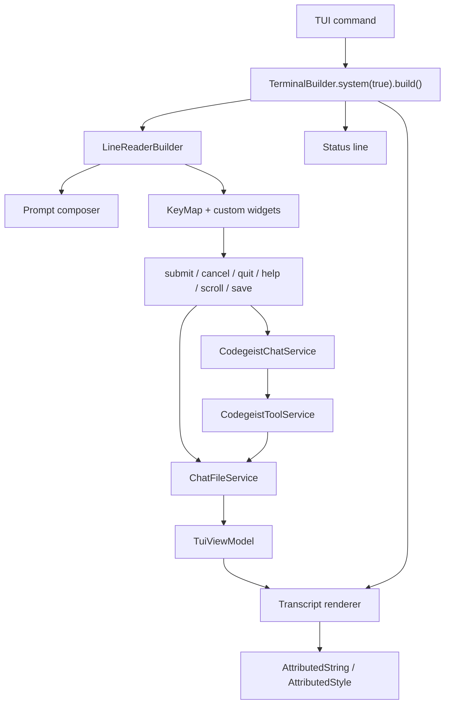
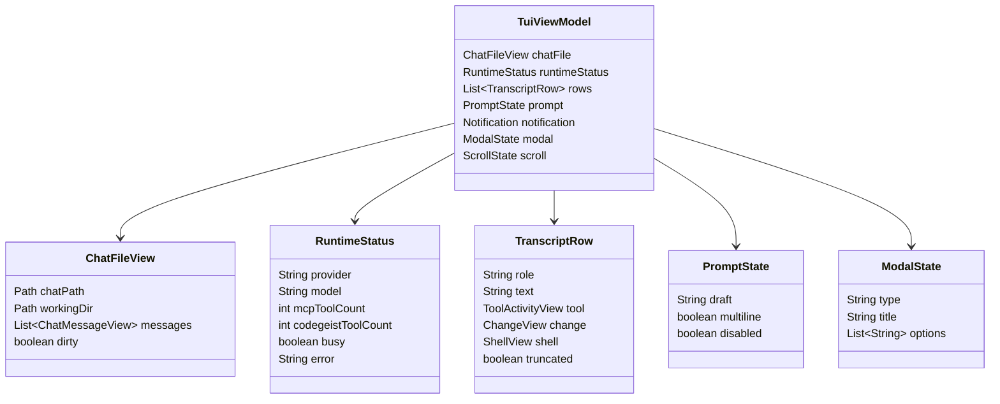

# T007 OpenCode TUI To JLine Mapping

Source-backed inventory of OpenCode chat TUI elements and their recommended JLine
or Spring Shell/JLine equivalents for Codegeist T007.

## Purpose

Use this document when implementing
`tasks/T007_05_add-terminal-tui-over-chat-file.md`. It identifies the OpenCode TUI
elements that matter for a minimum usable local coding-agent TUI and maps each one
to Java/JLine primitives that fit Codegeist's current Spring Shell CLI.

The goal is not OpenTUI/Solid parity. The goal is a practical terminal interface
that can read and update the same `chat.json` used by `ask --chat`, render enough
tool activity for daily coding-agent use, and keep runtime-only data out of the
chat file.

## Evidence Sources

OpenCode source areas inspected:

- `docs/third-party/opencode/source/packages/opencode/src/cli/cmd/tui/app.tsx`
- `docs/third-party/opencode/source/packages/opencode/src/cli/cmd/tui/thread.ts`
- `docs/third-party/opencode/source/packages/opencode/src/cli/cmd/tui/routes/home.tsx`
- `docs/third-party/opencode/source/packages/opencode/src/cli/cmd/tui/routes/session/index.tsx`
- `docs/third-party/opencode/source/packages/opencode/src/cli/cmd/tui/routes/session/permission.tsx`
- `docs/third-party/opencode/source/packages/opencode/src/cli/cmd/tui/routes/session/question.tsx`
- `docs/third-party/opencode/source/packages/opencode/src/cli/cmd/tui/routes/session/footer.tsx`
- `docs/third-party/opencode/source/packages/opencode/src/cli/cmd/tui/routes/session/sidebar.tsx`
- `docs/third-party/opencode/source/packages/opencode/src/cli/cmd/tui/component/prompt/index.tsx`
- `docs/third-party/opencode/source/packages/opencode/src/cli/cmd/tui/component/prompt/autocomplete.tsx`
- `docs/third-party/opencode/source/packages/opencode/src/cli/cmd/tui/component/prompt/history.tsx`
- `docs/third-party/opencode/source/packages/opencode/src/cli/cmd/tui/component/prompt/stash.tsx`
- `docs/third-party/opencode/source/packages/opencode/src/cli/cmd/tui/component/dialog-status.tsx`
- `docs/third-party/opencode/source/packages/opencode/src/cli/cmd/tui/component/startup-loading.tsx`
- `docs/third-party/opencode/source/packages/opencode/src/cli/cmd/tui/component/error-component.tsx`
- `docs/third-party/opencode/source/packages/opencode/src/cli/cmd/tui/ui/dialog*.tsx`
- `docs/third-party/opencode/source/packages/opencode/src/cli/cmd/tui/ui/toast.tsx`
- `docs/third-party/opencode/source/packages/opencode/src/cli/cmd/tui/keymap.tsx`
- `docs/third-party/opencode/source/packages/opencode/src/cli/cmd/tui/config/tui-schema.ts`
- `docs/third-party/opencode/source/packages/opencode/src/cli/cmd/tui/context/sync.tsx`
- `docs/third-party/opencode/source/packages/opencode/src/cli/cmd/tui/context/sdk.tsx`
- `docs/third-party/opencode/source/packages/opencode/src/cli/cmd/tui/feature-plugins/sidebar/*.tsx`

JLine evidence came from Context7 library `/jline/jline3`, especially examples for:

- `TerminalBuilder` and `Terminal`.
- `LineReaderBuilder`, `LineReader`, `DefaultParser`, history, completers, and
  highlighters.
- `KeyMap`, `BindingReader`, built-in widgets, and custom widgets.
- `Status` for persistent terminal status lines.
- `AttributedString` and `AttributedStyle` for styled output.
- `jline-prompt` for input, list, checkbox, and confirm prompts.
- Mouse support and raw-mode handling as optional deferred capabilities.

## Codegeist T007 Constraints

- `chat.json` is the only persisted chat state.
- `chat.json` stores chat history and tool activity only.
- Provider config, selected provider/model, MCP client definitions, enabled tool
  definitions, runtime status, UI layout, scroll position, focused pane, and draft
  prompt text stay out of `chat.json`.
- The TUI uses the same chat services and chat file service as `ask --chat`.
- The TUI must not add server runtime, remote sync, Vaadin, desktop UI, API/SDK,
  OpenTUI/Solid, plugins, skills, memory, LSP, or subagents in T007.

## Recommended JLine Foundation

T007 should start with a line-oriented renderer plus a single interactive prompt
loop. If JLine can safely redraw a screen in the current Spring Shell environment,
the same view model can later back a richer full-screen layout.

## JLine Primitive Catalog

| Need | JLine primitive | T007 use |
| --- | --- | --- |
| Terminal access | `TerminalBuilder`, `Terminal` | Create terminal, write output, read keys, detect width/height. |
| Prompt input | `LineReaderBuilder`, `LineReader.readLine(...)` | Prompt composer and command input. |
| Multiline/editing | `LineReader`, parser options, built-in widgets | Start with normal line editing; add multiline widget only when tests require it. |
| Interrupt/EOF | `UserInterruptException`, `EndOfFileException` | Map Ctrl-C to cancel/interrupt and Ctrl-D to quit. |
| Keybindings | `KeyMap`, `Reference`, custom widgets | Bind help, status, save, cancel, scroll, clear, submit behavior. |
| Menu/dialog keys | `BindingReader` plus a standalone `KeyMap` | Simple modal choices for approval, confirm, help, and status. |
| Status bar | `Status` | Persistent chat path, workingDir, provider/model, MCP/tool state, save/error state. |
| Styled transcript | `AttributedString`, `AttributedStyle` | Role labels, tool states, diff colors, errors, warnings, truncation markers. |
| Completions | `Completer`, `StringsCompleter` | Optional `/help`, `/status`, `/quit`; defer full file/autocomplete. |
| Highlighter | `Highlighter` | Optional prompt highlighting for slash commands or shell-like input. |
| Prompt dialogs | `jline-prompt` `Prompter`, input/list/checkbox/confirm prompts | Optional simple confirmations and selections if it fits dependencies. |
| Mouse | mouse support and `Terminal.MouseEvent` | Defer; keyboard-first T007 is enough. |
| Redraw/fullscreen | raw terminal writing, status, screen clear, custom renderer | Optional; keep line fallback deterministic. |

## OpenCode Element Mapping

| OpenCode TUI element | Source paths | Behavior | T007 priority | JLine mapping |
| --- | --- | --- | --- | --- |
| TUI host and render loop | `app.tsx`, `thread.ts` | Starts OpenTUI renderer, providers, plugins, routes, title, exit. | Must have minimal host. | `TerminalBuilder`, one `TuiController`, line fallback renderer. Do not copy plugin/runtime architecture. |
| Home/new-session screen | `routes/home.tsx` | Logo, centered prompt, auto-submit from CLI args. | Defer. | Start directly in chat view; show a welcome line for empty files. |
| Session/chat layout | `routes/session/index.tsx` | Main transcript, prompt/permission footer, optional sidebar. | Must have. | Transcript renderer plus bottom `LineReader` composer and `Status`. Sidebar deferred. |
| Message transcript | `routes/session/index.tsx` | User messages, assistant text, reasoning, tool parts, errors, model metadata. | Must have. | `AttributedString` rows from `chat.json` messages and parts. Keep markdown simple. |
| Generic tool dispatcher | `routes/session/index.tsx` | Routes tool parts to specialized renderers; hides/shows details. | Must have. | `ToolActivityRenderer` with per-tool renderers and common state row. |
| Read/list/glob/grep/write rendering | `routes/session/index.tsx`, `permission.tsx` | Shows file paths, patterns, counts, line previews, write content. | Must have. | File tool renderer with paths, counts, previews, and truncation markers. |
| Diff/change rendering | `routes/session/index.tsx`, `permission.tsx` | Unified/split diff, added/removed/context colors, diagnostics. | Must have simplified. | Unified diff text with `AttributedStyle` colors and bounded preview. Split diff deferred. |
| Shell rendering | `routes/session/index.tsx` | Command block, `$ command`, stripped ANSI output, spinner/expand behavior. | Must have. | Shell row with command, cwd, status, exit code, duration, stdout/stderr previews. |
| Prompt composer | `component/prompt/index.tsx` | Input, submit, clear, paste, editor, shell mode, busy/interrupt hints. | Must have minimal. | `LineReader.readLine`, custom widgets for cancel/help/save/clear. Defer editor/paste attachments. |
| Autocomplete and slash commands | `component/prompt/autocomplete.tsx` | Fuzzy files/resources/agents/commands. | Defer mostly. | `Completer` for minimal `/help`, `/status`, `/quit`; file autocomplete later. |
| Prompt history/stash | `history.tsx`, `stash.tsx` | Global persisted prompt history/stash. | Defer. | Avoid new persistence; if useful, use in-memory `LineReader` history only. |
| Permission/approval prompt | `routes/session/permission.tsx` | Allow once/always/reject, summaries, diffs, command details. | Must have if services expose approval. | `BindingReader` or `jline-prompt` confirm prompt. Persist only resulting tool activity, not UI state. |
| Question prompt | `routes/session/question.tsx` | Single/multi-select structured user questions. | Defer. | Plain assistant text first; later `jline-prompt` list/checkbox. |
| Footer/status runtime info | `routes/session/footer.tsx`, `dialog-status.tsx`, `prompt/index.tsx` | Cwd, LSP/MCP counts, provider/model, busy/retry/interrupt, cost/context. | Must have reduced. | `Status` line with chat path, workingDir, provider/model, MCP/tool counts, dirty/error state. |
| Dialog framework | `ui/dialog*.tsx` | Alert, confirm, prompt, select, help, modal stack. | Must have minimal. | Simple enum-based modal state rendered through `BindingReader` or `jline-prompt`. |
| Help/keybindings | `dialog-help.tsx`, `tui-schema.ts`, `keymap.tsx` | Configurable keymap and help dialog. | Must have fixed subset. | Fixed keymap via `KeyMap`; help text rendered as a modal/status view. |
| Side panels | `routes/session/sidebar.tsx`, `feature-plugins/sidebar/*.tsx` | Context/MCP/LSP/todo/files sidebar. | Defer full panel. | Fold required runtime status into `Status` and `/status` view. |
| Notifications/toasts | `ui/toast.tsx`, `app.tsx` | Transient success/error/warning messages. | Must have minimal. | One notification/status line; styled error/warn/saved messages. |
| Scroll and transcript navigation | `routes/session/index.tsx`, `dialog-timeline.tsx`, `dialog-message.tsx`, `util/scroll.ts` | Sticky scroll, page/home/end, message jumps, timeline, copy/fork/revert actions. | Must have scroll only. | In-memory scroll offset and follow-bottom mode; defer timeline/fork/revert/export. |
| Transcript copy/export | `routes/session/index.tsx`, `util/transcript.ts` | Copy/export transcript as markdown with options. | Defer. | `chat.json` is inspectable; later add export command if needed. |
| Startup/loading and fatal errors | `startup-loading.tsx`, `error-component.tsx` | Loading spinner and crash/error recovery UI. | Partial. | Deterministic load/save/render error screen/line; no plugin spinner. |
| Server-backed sync model | `context/sync.tsx`, `context/sdk.tsx` | Syncs provider, model, config, session, status, parts, permissions, MCP, LSP. | Concept only. | Replace with `ChatFileState` plus transient `RuntimeStatus`; no server or DB. |

## Minimum T007 View Model

Only `ChatFileView` data comes from persisted `chat.json`. `RuntimeStatus`,
`PromptState`, `Notification`, `ModalState`, and `ScrollState` are transient TUI
state.

## Minimum Keymap

| Action | Suggested key | JLine support | Notes |
| --- | --- | --- | --- |
| Submit prompt | Enter | `LineReader.readLine` | Keep blank input as no-op. |
| Insert newline | Alt-Enter or escaped sequence if supported | custom widget | Defer if difficult; line fallback can accept one-line prompt first. |
| Interrupt/cancel run | Ctrl-C | `UserInterruptException`, custom widget | Cancels running provider/tool call when supported. |
| Quit | Ctrl-D or `/quit` | `EndOfFileException`, completer | Save before exit if dirty. |
| Help | F1 or `?` in modal mode | `KeyMap`, `BindingReader` | Render fixed help view. |
| Status | `/status` or F2 | custom widget or command | Runtime-only provider/MCP/tool info. |
| Save | Ctrl-S if terminal allows, otherwise `/save` | custom widget or command | Saves current chat file. |
| Scroll up/down | PageUp/PageDown or Alt-Up/Alt-Down | `BindingReader` in view mode | For full-screen mode; line fallback can print latest rows. |
| Clear prompt | Ctrl-U | built-in `KILL_LINE` | Use JLine built-in widget. |
| Redraw | Ctrl-L | built-in `clear-screen` | Useful for terminal glitches. |

## Implementation Priority

1. Build `TuiViewModel` from `chat.json` plus transient `RuntimeStatus`.
2. Render deterministic transcript rows with `AttributedString` and line fallback.
3. Add common tool renderer with status, duration, error, and truncation markers.
4. Add specific file, change, and shell renderers.
5. Add `LineReader` prompt loop with submit, interrupt, quit, help, and status.
6. Add minimal approval/error modal only when the tool service exposes approval state.
7. Add scroll/history navigation if the first renderer is full-screen; otherwise keep
   line fallback as the tested contract.

## Deferred From OpenCode

- OpenTUI/Solid component architecture.
- TUI plugins, slots, theme package loading, and plugin runtime.
- Home screen/session browser, fork, share, revert, and timeline actions.
- Autocomplete for files, agents, MCP resources, and command palette.
- Prompt stash/history persisted outside `chat.json`.
- Question tool multi-select UI.
- Sidebar panels for LSP, todos, modified files, context cost, and plugins.
- Transcript export/copy features.
- Mouse support.
- LSP, subagents, skills, memory, workspace management, and remote sync.

## Test Targets

- `TuiViewModel` excludes provider/model/MCP/tool definitions from persisted chat
  writes.
- Renderer projects user messages, assistant messages, file tools, write results,
  patch/edit summaries, shell output, errors, and truncation markers.
- Status line projection can show provider/model/MCP/tool availability from runtime
  state without changing `chat.json`.
- Prompt loop handles submit, empty input, interrupt, EOF/quit, help, and status in a
  deterministic noninteractive test path.
- Line-oriented fallback renders the same essential rows as the richer renderer.
