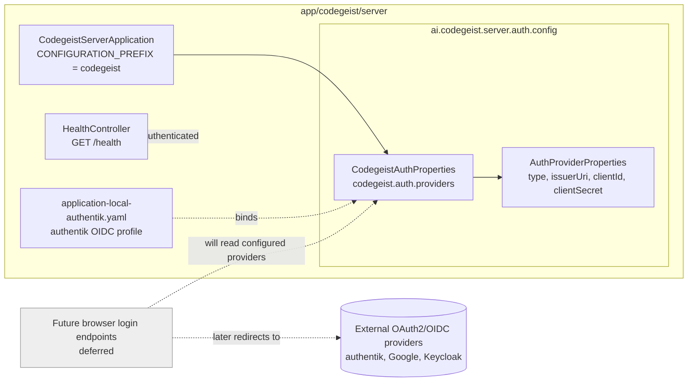

# T008_03 Implement OAuth Provider Configuration

Status: solved

Parent: `../task.md`

## Goal

Implement only the first static external OAuth2/OIDC provider configuration slice
in `app/codegeist/server`. This task prepares the server to know which external
identity providers it can later offer during browser login.

This task intentionally does not implement users, accounts, tenants, Codegeist API
tokens, Spring Security route protection, browser login endpoints, CLI login,
artifact storage, hosted LLM calls, or the first authenticated product API.

## Current Implemented State

`app/codegeist/server` exposes the unauthenticated bootstrap `GET /health`
endpoint and now has a server-local configuration model for multiple static
generic OIDC providers under `codegeist.auth.providers`. The local test profile
`local-authentik` configures `authentik` as one generic provider target without a
client secret. The server still has no live external identity-provider calls,
browser login flow, users, accounts, API tokens, metadata database, Spring
Security route protection, organization support, artifact authorization,
Codegeist server-url configuration, or CLI cloud-login behavior.

## Settled OAuth Decision

Codegeist Cloud must not host its own OAuth2/OIDC authorization server in the
first auth model. Codegeist acts as an OAuth2/OIDC client, also called a relying
party, against externally operated identity providers. Users need an external
account before they can sign in to Codegeist.

Use generic external OIDC as the first server-side OAuth strategy. The first
configuration implementation supports multiple statically configured OIDC
providers per Codegeist server deployment, for example a self-hosted Keycloak
realm, an authentik application, or Google. GitHub can be added later as an OAuth2
provider adapter, but it should not be the core path because GitHub login is not
the same as a normal generic OIDC issuer for end-user authentication.

Use authentik as the first local test OIDC provider. authentik stands in for later
production providers such as Google, GitHub, Keycloak, authentik, or other
OIDC/OAuth providers. Codegeist treats authentik as one configured external
provider, not as a product-specific identity dependency hard-coded into the server
model.

The CLI-facing login command remains `codegeist login`, not a provider login in
the same sense as OpenAI, Ollama, or Anthropic configuration. With no local server
configuration, `codegeist login` targets `https://codegeist.cloud`. A later CLI
task may support `codegeist login <server-id>` for a configured Codegeist server
URL. The server, not the CLI config entry, decides which external OAuth2/OIDC
providers are available for browser authentication.

## Implemented Scope

- Added `CodegeistServerApplication.CONFIGURATION_PREFIX` as the server-owned
  `codegeist` Spring configuration prefix root.
- Added `ai.codegeist.server.auth.config.CodegeistAuthProperties` with a
  `Map<String, AuthProviderProperties>` bound from `codegeist.auth.providers`.
- Added `AuthProviderProperties` with Bean Validation for `type=oidc`, non-blank
  `issuer-uri`, non-blank `client-id`, and optional `client-secret`.
- Validated provider ids with `[a-z][a-z0-9-]*` so ids are URL/log/metadata ready.
- Added `application-local-authentik.yaml` with a non-secret local authentik OIDC
  provider profile.
- Added focused tests for property binding, invalid provider definitions, and the
  local authentik profile.

## Component Diagram



## Illustrative Configuration Shape

```yaml
codegeist:
  auth:
    providers:
      keycloak:
        type: oidc
        issuer-uri: https://sso.example.com/realms/codegeist
        client-id: codegeist
      authentik:
        type: oidc
        issuer-uri: https://auth.example.net/application/o/codegeist/
        client-id: codegeist
      google:
        type: oidc
        issuer-uri: https://accounts.google.com
        client-id: codegeist
```

## Deferred Boundaries

| Deferred area | Future owner |
| --- | --- |
| Browser OAuth authorization-code flow, callback, state, and PKCE | Later auth/login task |
| Validated external identity claims and user/account linking | Later auth/tenant task |
| Codegeist-issued opaque API tokens and token validation | Later auth/token task |
| Spring Security route protection and authenticated principal contract | Later authenticated API task |
| CLI command `codegeist login`, default `https://codegeist.cloud`, server selection, and local token storage | `T008_07` |
| Organizations, invitations, shared artifacts, quotas, usage, billing, and S3 artifact metadata | Later focused T008 tasks |

## Non-Goals

- Do not make live external identity-provider calls in tests.
- Do not hard-code authentik-only behavior into Codegeist auth source.
- Do not host a Codegeist OAuth2/OIDC authorization server.
- Do not add username/password login, password reset, magic-link email delivery,
  passkeys, SAML, SCIM, or dynamic tenant-managed IdP registration.
- Do not implement users, accounts, account memberships, API tokens, token
  revocation, token expiry, token hashing, or authenticated principals in this
  slice.
- Do not implement the first authenticated product API endpoint; that remains a
  later task.
- Do not select or add a durable database schema.
- Do not implement S3 artifact storage, object metadata persistence, model proxy
  calls, entitlements, quotas, usage accounting, billing, or CLI sync.
- Do not implement `codegeist login`, browser callback or polling, local Codegeist
  server-url configuration, or local token storage; that remains T008_07.
- Do not model Codegeist server login as a normal LLM provider configuration such
  as `provider: codegeist`.

## Acceptance Criteria

- Server configuration supports multiple statically configured external OIDC
  providers and rejects invalid provider definitions.
- The local OIDC test posture names authentik as the first real external issuer
  used by opt-in smoke or integration tests while keeping unit tests deterministic.
- `GET /health` remains unauthenticated and unaffected by this configuration slice.
- No user/account/token/security-route behavior is introduced in this slice.

## Verification

Run the focused server suite from `app/codegeist/server`:

```bash
task test
```

Run a repository diff whitespace check before finishing:

```bash
git --no-pager diff --check
```
