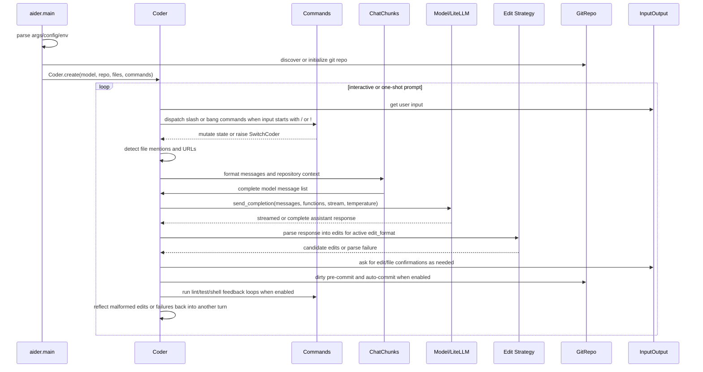

# Aider Prompt Flow

Focused static-analysis documentation for how Aider turns a user prompt into a
model request, applies the response, and runs follow-up feedback loops.

## Scope And Evidence

This document summarizes source evidence from the Aider checkout at
`docs/third-party/aider/source` revision
`5dc9490bb35f9729ef2c95d00a19ccd30c26339c`.

Primary files:

- `aider/main.py` - startup, config, git setup, coder creation, one-shot paths, and
  main loop.
- `aider/coders/base_coder.py` - prompt loop, message assembly, provider call,
  response handling, edit application, reflection, git/lint/test loops, and shell
  suggestions.
- `aider/commands.py` - slash and bang command dispatch, model/mode switching,
  shell runs, web scraping, file-scope commands, and helper flows.
- `aider/models.py` - model settings, model metadata, LiteLLM request behavior, and
  provider/model options.
- `aider/repo.py` - git repository wrapper, dirty commits, generated commit
  messages, attribution, and diff state.
- `aider/repomap.py` - repository map construction and tag caching.
- `aider/coders/*.py` - concrete edit parsers and prompt contracts.

No Aider runtime session, provider call, shell command, git mutation, Streamlit UI,
or upstream test run was executed for this document.

## Compact Flow



## Startup And Coder Creation

`aider.main` is the console-script target. It resolves configuration, input/output,
git state, model settings, command helpers, and chat-history summarization before
constructing a `Coder`.

Key responsibilities:

- Parse command-line, YAML, dotenv, and environment inputs through `aider.args` and
  related helpers.
- Initialize `InputOutput` for terminal rendering, confirmation prompts, history,
  and logging.
- Discover the working git repository through `GitRepo`; optionally create a new
  repository and update `.gitignore` for `.aider*` and `.env`.
- Resolve main, weak, and editor model choices through `Model` and `ModelSettings`.
- Build `Commands` and inject it into `Coder.create()`.
- Start one-shot paths such as `--message`, `--message-file`, `--lint`, `--test`,
  `--commit`, `--apply`, and `--show-repo-map`, or enter the interactive loop.

When a command changes chat mode or model state, it raises `SwitchCoder`. The main
loop catches it, copies state from the previous coder into a new coder, and then
continues.

## Input Preprocessing

`Coder.run()` either sends a provided one-shot message or repeatedly asks
`InputOutput` for terminal input.

Before model submission, `Coder.preproc_user_input()` handles three major cases:

- Slash or bang commands are delegated to `Commands.run()`.
- File mentions are checked and can trigger user confirmation to add files to the
  active chat scope.
- URLs can be offered for scraping through `Commands.cmd_web()`, which appends
  scraped markdown content to the prompt when accepted.

Command dispatch is string-based: `Commands.run()` maps `/some-command` to a
`cmd_some_command` method and `!cmd` to `/run` behavior. Many commands mutate the
active coder, append messages, or raise `SwitchCoder` for mode transitions.

## Context Assembly

`Coder.send_message()` appends the user prompt to `cur_messages`, builds a
`ChatChunks` object, and checks token limits before sending anything to the model.

Context sources include:

- Current prompt and in-progress `cur_messages`.
- Completed `done_messages`, optionally summarized when too large.
- Editable files in `abs_fnames`.
- Read-only files in `abs_read_only_fnames`.
- Repo-map context from `RepoMap` when enabled and useful.
- Prompt contracts from the active coder strategy.
- Model-specific cache, reasoning, system prompt, and edit-format settings.

`RepoMap` builds context from tree-sitter tags and ranking, with a disk cache under
`.aider.tags.cache.v*`. It is token-budgeted and can expand when no files are in
the chat.

## Model Call

`Coder.send()` is the central provider boundary. It delegates to
`Model.send_completion()` with the complete message list, optional function/tool
metadata, streaming flag, and temperature.

Runtime behavior around the call includes:

- Log model input and model output through `InputOutput` history helpers.
- Stream output when supported and requested.
- Collect assistant content, reasoning content, or function-call arguments.
- Calculate token and cost usage after successful responses and selected error
  paths.
- Retry selected LiteLLM/provider exceptions with exponential delay up to the
  configured retry timeout.
- Detect context-window and output-length exhaustion and show token guidance.

The analysis did not execute provider calls, so exact provider-side behavior and
current LiteLLM compatibility are static-source findings only.

## Response Handling And Edits

After a response is rendered, `Coder.send_message()` routes the result through the
active edit strategy:

- `reply_completed()` gives specialized coders a chance to handle the response
  before generic edit application. `ArchitectCoder` uses this hook to create an
  editor coder and pass the architect response to it.
- `apply_updates()` calls `get_edits()`, dry-runs or normalizes edits, checks
  permissions with `prepare_to_edit()`, applies changes with the strategy-specific
  `apply_edits()`, and reports changed files.
- `allowed_to_edit()` enforces the active file scope and confirmation behavior. It
  can create new files after confirmation, reject gitignored files, and ask before
  editing files not already in chat.
- Parse failures or unexpected edit errors become `reflected_message`, which can
  trigger another model turn up to `max_reflections`.

Concrete edit strategies live under `aider/coders/` and include search/replace,
edit-block, unified diff, patch, whole-file, function-call, architect, editor, ask,
help, and context variants.

## Git, Lint, Test, And Shell Feedback

When edits succeed, Aider can continue the local coding loop with side effects:

- `dirty_commit()` can commit dirty files before applying edits so undo has a safe
  baseline.
- `auto_commit()` asks `GitRepo.commit()` to commit model-edited files, optionally
  using the conversation context to generate a commit message.
- `lint_edited()` runs configured lint behavior and can reflect lint errors back to
  the model after confirmation.
- `Commands.cmd_test()` can run the configured test command and reflect failures
  back to the model after confirmation.
- `run_shell_commands()` handles model-suggested shell commands when enabled.
- `Commands.cmd_run()` runs user-requested shell commands under the repository root
  and asks whether to add command output to chat unless a non-zero failure path
  needs that output.

These are the highest-risk operational areas for follow-up review because they
touch files, git state, subprocesses, and user terminal history.

## State Movement

Aider keeps session state mostly in memory during the running process:

- `cur_messages` is the active local turn state.
- `done_messages` stores completed turns.
- `move_back_cur_messages()` moves completed active messages into history and can
  append synthetic user/assistant acknowledgements such as commit summaries.
- `ChatSummary` can summarize old `done_messages` when history exceeds the model
  budget.
- Mode switching uses `Coder.create(from_coder=...)` to copy file scope, message
  state, command state, cost, ignore mentions, watcher state, and related runtime
  data into a new coder.

This differs from Codegeist's planned structured `.codegeist/session.json` event
store: Aider's primary flow is stateful in-process objects plus optional chat
history files.

## Follow-Up Questions

Useful `/ask-project aider ...` questions after this document:

```text
/ask-project aider "Which Coder responsibilities would need separate services in a Java/Spring runtime?"
/ask-project aider "How do Aider's edit strategies parse and validate model output before mutating files?"
/ask-project aider "Where does Aider require user confirmation before file, git, shell, URL, or command-output side effects?"
```
