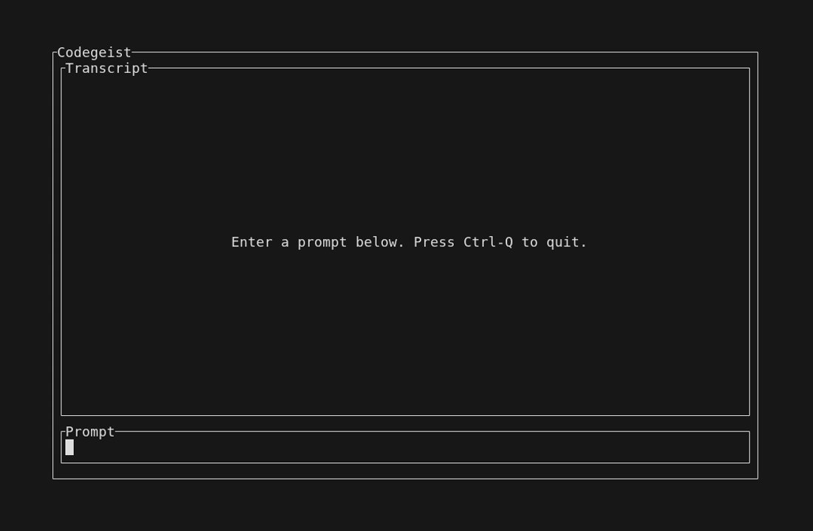
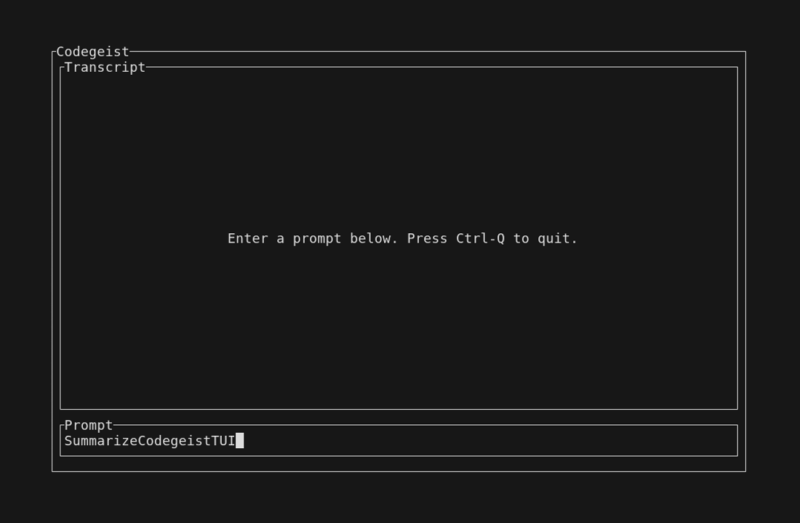
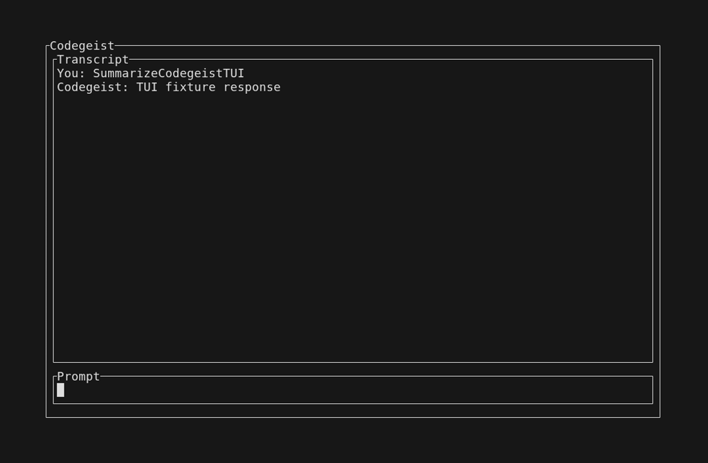

# Codegeist TUI User Guide

Use the Codegeist terminal UI when you want repeated chat turns in one terminal
session instead of separate one-shot `codegeist ask` commands.

The current TUI is intentionally small: it opens a transcript panel, keeps focus
in a prompt field, submits prompts through the same chat harness as `codegeist
ask`, and writes successful turns to the normal local session store.

## Prerequisites

The TUI needs a configured chat provider. It reads the same direct
`codegeist.yml` file and command-line Spring properties as the rest of the CLI.

Minimal local Ollama example:

```yaml
provider:
  ollama:
    type: ollama
    base-url: http://localhost:11434
```

The current Ollama fallback model is `llama3.2:1b`. Make sure the local Ollama
server is already running and the model exists before opening the TUI.

If the config file is not in the working directory, pass it with a Spring
application property:

```bash
codegeist -Dcodegeist.config=/path/to/codegeist.yml tui
```

## Start The TUI

After installing Codegeist from a release asset, start the native TUI from the
directory where you want Codegeist to read config and store sessions:

```bash
codegeist tui
```

For local development from this repository root, use:

```bash
task cli:tui
```

The development task currently runs the JVM jar. Release installs run the native
`codegeist` command.

## Read The Screen

When the TUI opens, the transcript is empty and the cursor is already in the
prompt field.



The screen has two main regions:

| Region | Purpose |
| --- | --- |
| `Transcript` | Shows the prompts and responses from the current TUI process. |
| `Prompt` | Accepts the next prompt. Focus starts here and returns here after each turn. |

## Send A Prompt

Type your prompt into the `Prompt` field. The text stays editable until you press
`Enter`.



Press `Enter` to submit a non-blank prompt. Blank prompts keep the TUI open and
do not call the provider.

## Read The Response

After Codegeist receives the provider response, the transcript shows the user
prompt followed by the assistant response. The prompt field is reset for the next
turn.



Successful turns are also persisted through the normal session store path,
defaulting to:

```text
.codegeist/session.json
```

The session store contains chat history and tool activity. It must not contain
provider configuration, selected provider/model, API keys, MCP definitions,
enabled tool definitions, permission rules, runtime status, or TUI layout state.

## Controls

| Control | Behavior |
| --- | --- |
| Type text | Compose the next prompt in the focused prompt field. |
| `Enter` | Submit a non-blank prompt. |
| `Ctrl-Q` | Quit the TUI. |

## Current Limits

The current TUI does not yet stream responses, render tool activity, show stored
session history on startup, ask permission questions, or persist TUI-only layout
state. It only shows the in-memory transcript for the currently running TUI
process.

## Troubleshooting

If the TUI starts but provider calls fail, check that `codegeist.yml` is in the
working directory or that `-Dcodegeist.config=<path>` points at the intended
file.

If local Ollama calls fail, verify that Ollama is reachable at the configured
`base-url` and that the fallback model exists:

```bash
ollama show llama3.2:1b
```

If a response is slow, wait for the provider call to complete. The current TUI
does not stream partial output while the provider is still working.

## Documentation Preview Captures

Maintainers can regenerate the local TUI documentation preview captures with:

```bash
task cli:tui-capture-smoke
```

This path requires `vhs`, `ffmpeg`, and `ttyd` on `PATH`. The shared
`.devcontainer` release kit provides those tools after the devcontainer is
rebuilt.

The capture smoke writes ignored build artifacts under:

```text
app/codegeist/cli/target/smoke-test/tui-capture/
```

The committed screenshots in `docs/user/assets/tui/` are selected documentation
assets copied from a passing capture run.
